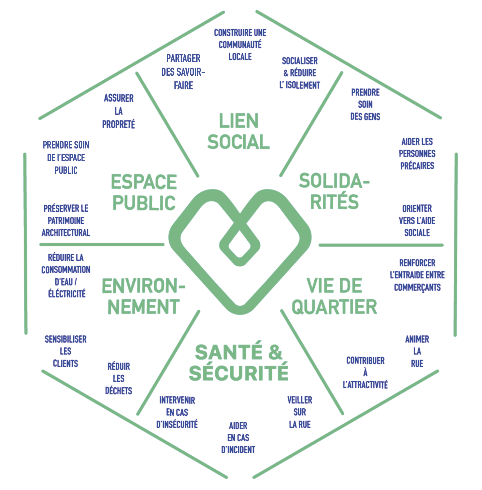

```{r setup, include=FALSE}
# Paramètres généraux
knitr::opts_chunk$set(eval = TRUE,
                      echo = FALSE,
                      fig.align = "center",
                      fig.show = "hold",
                      message = FALSE,
                      warning = FALSE,
                      collapse = TRUE,
                      results = 'asis',  # pour un dfSummary propre
                      out.width = "70%")
```

```{r logo}
# Logo Datactivist haut de page
htmltools::img(src = "images/logos_partenaires.png", 
               alt = 'logo', 
               style = 'position:absolute; top:0; left:0.5; padding-top:10px;') #padding=taille des espaces autour
```

Les commerces ne sont pas de stricts acteurs économiques, dont la valeur sociale serait équivalente à la valeur marchande. Cette intuition est largement partagée dans les espaces politiques, académiques ou encore économiques.

Ce postulat central à notre projet commence à s’intégrer dans les politiques publiques. Le soutien
aux commerçants est en effet perçu comme un levier de l’action publique pour redynamiser les
centres urbains. La vitalité commerciale est ainsi un axe central du plan national Action cœur de
ville, qui réaffirme l’importance des centres-villes, notamment ceux des villes moyennes, dans le
paysage territorial.

Pourtant, les effets du commerce sont encore mal identifiés, et les quelques travaux
académiques ou produits par des experts se concentrent quasi exclusivement sur leur
rôle d’entretien du vivre ensemble, ou sur leurs externalités négatives (par exemple leur
rôle dans les processus de gentrification).
En conséquence, les effets dans leur globalité sont peu, voire pas visibilisés ni quantifiés.

Le **projet de recherche-action EXCOM** a pour objectif de combler ce manque en nommant
et en mesurant ces effets, étape essentielle pour repenser la valeur globale du commerce.

Il s’inscrit au croisement des questionnements de cinq partenaires : la SEM Paris
Commerce, la Métropole Rouen Normandie, la fondation Urbanis, Altavia Foundation,
Datactivist.

<p align="center">
 
</p>


# Import des données


```{r imports}
# Librairies
library(tidyverse)
library(jsonlite)
library(readxl)
library(esquisse)
library(gt)
library(gtExtras)
library(janitor)
library(reactable)
library(DT)
library(plotly)
library(ggVennDiagram) #devtools::install_github("gaospecial/ggVennDiagram")
library(ggwordcloud)
library(tm)
library(treemap)
library(treemapify)
#library(emojifont) #pas runné car conflit avec le custom_theme() pour tous les autres graphiques sinon

# Données
raw_data <- read_csv("data/in/[Fillout] EXCOM _ Enquête sur les effets du commerce de proximité results.csv")
deleted_questions_fillout <- fromJSON(txt = "data/in/export_fillout_deleted_questions.json", flatten = TRUE)
repartition_theorique <- read_excel("data/in/Repartition_theorique_repondants.xlsx")
  # identifiant des départements
departements_dg <- read_csv("https://www.data.gouv.fr/fr/datasets/r/67432189-8426-42e6-9ddb-8d21631df9c5")
  # OFGL - données de population
communes_pop <- read_delim("https://data.ofgl.fr/api/explore/v2.1/catalog/datasets/ofgl-base-communes-consolidee/exports/csv?lang=fr&refine=exer%3A%222023%22&refine=agregat%3A%22Achats%20et%20charges%20externes%22&facet=facet(name%3D%22agregat%22%2C%20disjunctive%3Dtrue)&timezone=Europe%2FBerlin&use_labels=true&delimiter=%3B", ";") |> 
  rename(cog_commune = `Code Insee 2023 Commune`,
         nom_commune = `Nom 2023 Commune`,
         population = `Population totale`) |> 
  select(cog_commune, nom_commune, population)
  # Datagouv - codes postaux : https://www.data.gouv.fr/fr/datasets/base-officielle-des-codes-postaux/
codes_postaux_dg <- read_csv("data/in/codes_postaux_datagouv.csv") |>
  select(-Ligne_5) |> distinct() |> 
  mutate(Code_commune_INSEE = ifelse(nchar(Code_commune_INSEE) == 4, paste0("0", Code_commune_INSEE), Code_commune_INSEE),
         Code_postal = ifelse(nchar(Code_postal) == 4, paste0("0", Code_postal), Code_postal)) |> 
    #jointure sur le COG
  left_join(communes_pop |> select(-nom_commune), by = c("Code_commune_INSEE" = "cog_commune")) |> 
    #jointure sur le nom de commune pour les ligne snon matchées
  left_join(communes_pop |> 
              select(-cog_commune) |> 
              mutate(nom_commune = stringi::stri_trans_general(str = gsub("-", " ", toupper(nom_commune)), id = "Latin-ASCII")),
            by = c("Libelle_acheminement" = "nom_commune")) |> 
  filter(population.x == population.y | is.na(population.x) | is.na(population.y)) |> 
  mutate(population = coalesce(population.x, population.y)) |> 
  select(-c(population.x, population.y))
```

Diffusée à partir du 4 avril 2024, l'enquête sur les effets du commerce de proximité vise à rendre visible l'impact de l'activité commerciale sur le quartier, la ville et ses habitants.

Composée de près de 40 questions, l'enquête se divise en 6 sections reprenant les grandes catégories d'externalités identifiées dans la première phase du [projet de recherche-action EXCOM](https://projet-excom.fr/) :

- Lien Social ;
- Solidarités ;
- Vie de quartier ;
- Santé et Sécurité ;
- Environnement ;
- Espace public.


```{r data preparation}
# Traitement des réponses apparaissant dans les "deleted question" avant remaniement du questionnaire
deleted_questions_fillout <- deleted_questions_fillout |> 
    # filtre sur les réponses avant remaniement
    filter(row_number() >= 29) |> 
    # merge des colonnes "Deleted question" liées au remaniement questionnaire
    mutate(`Quel est le nom de votre commerce ?` = coalesce(`Quel est le nom de votre commerce ?`,
                                                            `Deleted question 16`),
           `Êtes-vous indépendant ?` = coalesce(`Êtes-vous indépendant ?`,
                                                `Deleted question 18`),
           `Où vendez-vous vos produits / services ?` = coalesce(`Où vendez-vous vos produits / services ?`,
                                                                 `Deleted question 12`),
           `Pouvez-vous préciser, dans quel(s) lieu(x) intervenez-vous ?(Plusieurs réponses sont possibles)` = coalesce(`Pouvez-vous préciser, dans quel(s) lieu(x) intervenez-vous ?(Plusieurs réponses sont possibles)`,
                                                                                                                        `Deleted question 29`),
           `Quelle est l'adresse de votre commerce ?` = paste(`Deleted question 21.address`, `Deleted question 21.city`, `Deleted question 21.state`, `Deleted question 21.zipCode`, `Deleted question 21.country`),
           `Dans quelle ville intervenez-vous le plus régulièrement ? (Renseigner le code postal)` = coalesce(`Dans quelle ville intervenez-vous le plus régulièrement ? (Renseigner le code postal)`, `Deleted question 32`),
           `Dans quelle ville travaillez-vous le plus régulièrement ? (Renseigner le code postal)` = coalesce(`Dans quelle ville travaillez-vous le plus régulièrement ? (Renseigner le code postal)`, `Deleted question 25`),
           `Quelle est la catégorie de votre commerce ?` = coalesce(`Quelle est la catégorie de votre commerce ? `,
                                                                    `Deleted question 31`),
           `Pouvez vous préciser ? (5)` = `Deleted question 11`, #alimentaire
           `Pouvez vous préciser ? (6)` = `Deleted question 20`, #equipement de la personne
           `Pouvez vous préciser ? (7)` = `Deleted question 23`, #equipement de la maison
           `Pouvez vous préciser ? (9)` = `Deleted question 24`, #culture, loisirs
           `Pouvez vous préciser ? (4)` = `Deleted question 28`, #hygiene, santé, beauté
           `Pouvez vous préciser ? (1)` = `Deleted question 17`, #divers
           `Pouvez vous préciser ?` = `Deleted question 26`, #services aux particuliers
           #`Pouvez vous préciser ? (8)` = coalesce(`Pouvez vous préciser ? (8)`,
                                                   #`Deleted question ()`), #commerces et services de véhicules automobiles
           `Pouvez vous préciser ? (3)` = `Deleted question 22`, #autres services
           `Pouvez vous préciser ? (2)` = `Deleted question 19`, #cafés, hotels, resto
           `Que propose votre commerce ? (Plusieurs réponses sont possibles)` = coalesce(`Que propose votre commerce ? (Plusieurs réponses sont possibles)`,
                                                                                         `Deleted question 13`),
           `Travaillez-vous seul ?` = coalesce(`Travaillez-vous seul ?`,
                                               `Deleted question 14`),
           `Êtes-vous en contact direct avec des clients ?` = coalesce(`Êtes-vous en contact direct avec des clients ?`,
                                                                       `Deleted question 15`),
           `Hors période de fêtes, quelle est la fréquentation moyenne de votre commerce par jour ? (en nombre de personnes)` = coalesce(`Hors période de fêtes, quelle est la fréquentation moyenne de votre commerce par jour ? (en nombre de personnes)`,
                                                                                                                                         `Deleted question 30`)) |> 
    # On renomme les colonnes qui ont un nom différent de lui des données brutes pour que le bind_rows() fonctionne
    rename("A quelle fréquence intervenez-vous dans des situations d'insécurité (vols, bagarres, agressions) ?" = "A quelle fréquence intervenez-vous dans des situations d'insécurité (vols, bagarres, agressions) ? ",
           "Dans certains cas, vous pouvez être susceptible d'organiser, à l'intérieur de votre magasin, des séances d'information, démonstrations ou ateliers (explications approfondies d'utilisation de vos produits, transmission de connaissances, etc.).Combien en organisez-vous par an ? (Si vous n'en organisez aucune, mettre '0')" = "Dans certains cas, vous pouvez être susceptible d'organiser, à l'intérieur de votre magasin, des séances d'information, démonstrations ou ateliers (explications approfondies d'utilisation de vos produits, transmission de connaissances, etc.). Combien en organisez-vous par an ? (Si vous n'en organisez aucune, mettre '0')",
           "Etes-vous sollicité par des personnes en situation de précarité dans le cadre de votre activité commerciale ?Cela peut être pour un café, de l'eau ou pour utiliser des toilettes." = "Etes-vous sollicité par des personnes en situation de précarité dans le cadre de votre activité commerciale ?Cela peut être pour un café, de l'eau ou pour utiliser des toilettes.  ",
           "De même, il peut exister une entraide avec les habitants de l'immeuble dans lequel se situe votre commerce. Quels services avez-vous l'habitude de rendre aux habitants de votre immeuble ?" = "De même, il peut exister une entraide avec les habitants de l'immeuble dans lequel se situe votre commerce. Quels services avez-vous l'habitude de rendre aux habitants de votre immeuble ? ",
           "Vous arrive-t-il d'interpeller les services techniques de la mairie suite à du matériel défectueux ou une dégradation de l'espace public environnant (exemples : lampadaire défectueux ou tags) ?" = "Vous arrive-t-il d'interpeller les services techniques de la mairie suite à du matériel défectueux ou une dégradation de l'espace public environnant (exemples : lampadaire défectueux ou tags) ? ",
           "Pouvez-vous préciser ? (6)" = "Pouvez-vous préciser ?", #entraide entre commerçants
           "Pouvez-vous préciser ? (1)" = "Pouvez-vous préciser ? " #solutions pour réduire les déchets du commerce
           ) |> 
    # Sélection des colonnes comme dans les données brutes
    select(any_of(names(raw_data))) |> 
    # Transformation des listes en chaînes de caractères
    mutate(across(where(is.list), ~ sapply(.x, function(y) paste(unlist(y), collapse = ", ")))) |> 
    # Valeur manquante comme NA
    mutate_all(as.character) |> 
    mutate_all(na_if, "")

# Nom des colonnes des données brutes
noms_cols <- names(raw_data) |> as.data.frame()

# Nettoyage / mise en qualité / création de nouvelles variables sur les données brutes
data <- raw_data |> 
    # on garde les réponses après remaniement du questionnaire
  filter(row_number() < nrow(raw_data) - 155,
         `Submission ID` != "a9ad2701-7f5d-419b-98d7-37c414c87a94") |> # rep quasi toute vide liée au bug des questions avec le remaniement du questionnaire
    # on merge avec les réponses avant remaniement du questionnaire
  mutate_all(as.character) |> 
  bind_rows(deleted_questions_fillout) |> 
    # Extraction code postal de l'adresse
  rowwise() |> 
  mutate(`Quelle est l'adresse de votre commerce ?` = ifelse(`Quelle est l'adresse de votre commerce ?` == "\n  \n", NA, `Quelle est l'adresse de votre commerce ?`),
         adresses = coalesce(`Quelle est l'adresse de votre commerce ?`, 
                             as.character(`Dans quelle ville intervenez-vous le plus régulièrement ? (Renseigner le code postal)`),
                             as.character(`Dans quelle ville travaillez-vous le plus régulièrement ? (Renseigner le code postal)`)),
         adresses = str_replace_all(adresses, "\\b(\\d{2}) (\\d{3})\\b", "\\1\\2"), #formattage zip code mal renseigné
         zip_code = str_extract(adresses, "\\d{5}"),
         code_departement = substr(zip_code, 1, 2)) |> 
  left_join(departements_dg |> select(nom, COG, code_region), by = c("code_departement" = "COG")) |> 
  rename(nom_departement = nom) |> 
  mutate(nom_departement_partenaires = case_when(!code_departement %in% c("75", "76", "13", "93") ~ "Autres",
                                                 .default = nom_departement),
         code_departement_partenaires = case_when(!code_departement %in% c("75", "76", "13", "93") ~ "Autres",
                                                 .default = code_departement)) |> 
  ungroup() |> 
    # Nettoyage des variables 
  mutate_all(~str_squish(.)) |> #remove non necessary spaces
  mutate(`Avez-vous l'habitude de discuter avec vos clients en dehors du cadre strict de la vente ? (exemple : prendre des nouvelles personnelles)` = ifelse(`Avez-vous l'habitude de discuter avec vos clients en dehors du cadre strict de la vente ? (exemple : prendre des nouvelles personnelles)` == "Très rarement (moins d'une fois par semaine)", "Très rarement (moins d'une fois par mois)", `Avez-vous l'habitude de discuter avec vos clients en dehors du cadre strict de la vente ? (exemple : prendre des nouvelles personnelles)`)) |> #correction erreur dans la catégorie 'Très rarement'
    # Création de variables catégorielles à partir des variables existantes
      ## Ce que propose le commerce
  mutate(is_services = case_when(grepl("Des services", `Que propose votre commerce ? (Plusieurs réponses sont possibles)`) == TRUE ~ "1",
                                 .default = "0"),
         is_biens_propres = case_when(grepl("Des produits fabriqués ou élaborés par moi(nous)-même(s)", `Que propose votre commerce ? (Plusieurs réponses sont possibles)`) == TRUE ~ "1",
                                 .default = "0"),
         is_biens_dautres = case_when(grepl("Des produits fabriqués ou élaborés par d'autres", `Que propose votre commerce ? (Plusieurs réponses sont possibles)`) == TRUE ~ "1",
                                 .default = "0")) |>
      ## Fréquentation du commerce
  mutate(frequentation_commerce = case_match(`Hors période de fêtes, quelle est la fréquentation moyenne de votre commerce par jour ? (en nombre de personnes)`,
                                             "50 à 100" ~ "Plus de 50",
                                             "100 et 200" ~ "Plus de 50",
                                             "Plus de 200" ~ "Plus de 50",
                                             .default = `Hors période de fêtes, quelle est la fréquentation moyenne de votre commerce par jour ? (en nombre de personnes)`)) |> 
      ## Collaboration avec des associations
  mutate(collab_asso = case_when(grepl("Oui", `Collaborez-vous avec des associations locales ? Par exemple des associations de quartier ou d'aide humanitaire.(Plusieurs réponses sont possibles)`) == TRUE ~ "Oui",
                                 `Collaborez-vous avec des associations locales ? Par exemple des associations de quartier ou d'aide humanitaire.(Plusieurs réponses sont possibles)` == "Je n'ai pas l'habitude de collaborer avec des associations" ~ "Non",
                                 .default = NA_character_)) |> 
      ## Aide aux autres commerçants
  mutate(aide_commercants = case_when(grepl("Je connais les autres commerçants mais je n'ai pas l'occasion de rendre ces services", `L'entraide entre commerçants permet de faire face à des difficultés et constitue un réseau d'échange de services. Quels services avez-vous l'habitude de rendre à vos collègues commerçants ? (Plusieurs réponses sont possibles)`) == TRUE ~ "Non",
                                      .default = "Oui")) |> 
    # Enrichissement de la population
  mutate(zip_code_general = case_when(zip_code == "13000" ~ "13001",
                                       zip_code == "75000" ~ "75001",
                                       .default = zip_code)) |> 
  left_join(codes_postaux_dg, by = c("zip_code_general" = "Code_postal")) |> 
  arrange(desc(population), .by = `Quel est le nom de votre commerce ?`) |> 
  mutate(adresse_lower = tolower(`Quelle est l'adresse de votre commerce ?`)) |> 
  slice(1, .by = c(`Quel est le nom de votre commerce ?`, adresse_lower)) |> #qd match avec plusieurs codes postaux, on garde seulement la ville avec la population la plus élevée
  mutate(categorie_population = case_when(population < 10000 ~ "population moyenne",
                                          population >= 10000 & population < 100000 ~ "population élevée",
                                          population >= 100000 ~ "population très élevée",
                                          .default = NA_character_)) |> 
    # Retrait des réponses doublons
  filter(`Submission ID` %in% c("01469ecf-0ff8-4973-8a21-5da18677cc07", # Culinariob, doublon avec Culinarion
                                "88dba71d-21c4-4e5b-be95-1b474fb98769", # Well nest
                                "782e8920-1a3f-4ea2-88d4-2dfd8c9083b2" # Iokko
                                ) == FALSE | is.na(`Submission ID`)) |>  
  filter(`Quel est le nom de votre commerce ?` != "La Trésoerie" | is.na(`Quel est le nom de votre commerce ?`),
         `Quel est le nom de votre commerce ?` != "Betjeman & Barton" | `Quelle est l'adresse de votre commerce ?` != "53 rue aux Juifs Rouen Normandie 76000 France",
         `Quel est le nom de votre commerce ?` != "INSTINC ´ TIF" | !is.na(`Êtes-vous indépendant ?`),
         `Quel est le nom de votre commerce ?` != "Atelier Brune" | !is.na(`Submission ID`))

# Export des réponses anonymisées
data_anonymes <- data |> 
    arrange(`Quel est le nom de votre commerce ?`) |> 
    select(-c(`Submission ID`:`Quel est le nom de votre commerce ?`, `Quelle est l'adresse de votre commerce ?`,
              `Partagez-nous votre mail si vous souhaitez être informé des avancées du projet :`:`zip_code`,
              `Pour finir, avez-vous une anecdote à nous raconter pour illustrer l'impact de votre commerce sur le quartier / lieux d'activité ?`,
              `nom_departement_partenaires`:`aide_commercants`, `Libelle_acheminement`:`categorie_population`)) |> 
    relocate(Nom_de_la_commune, zip_code_general, Code_commune_INSEE, nom_departement, code_departement, code_region, 
             .before = `Êtes-vous indépendant ?`) |> 
    rename(Commune = Nom_de_la_commune,
           `Code postal` = zip_code_general,
           `Code INSEE` = Code_commune_INSEE,
           Departement = nom_departement,
           `Code departement` = code_departement,
           `Code region` = code_region)
rio::export(data_anonymes, "data/out/reponses_enquete_anonymisees.csv")


# Filtre sur l'Ile de France
idf <- data |> 
  filter(code_region == "11") # ile de france
rio::export(idf, "data/out/export_reponses_idf.csv")

# Filtre sur Paris
paris <- data |> 
  filter(Libelle_acheminement == "PARIS")
rio::export(paris |> select(`Quel est le nom de votre commerce ?`, adresses, zip_code, Nom_de_la_commune), "data/out/export_commerces_paris.csv")


# Nom des colonnes
noms_cols_data <- names(data) |> as.data.frame()

# Nombre de réponses
a <- n_distinct(data$`Quel est le nom de votre commerce ?`)
aa <- nrow(data)
```

Au `r format(Sys.time(), '%d %B %Y')`, `r aa` réponses uniques ont été récoltées.


## Répartition de l'échantillon{.tabset}


```{r répartition échantillon}
# Calcul de la répartition de notre échantillon
repartition_reelle <- data |> 
  summarise(`Échantillon réel de l'enquête` = n(), .by = code_departement_partenaires) |> 
  right_join(repartition_theorique |> mutate(`Code département` = as.character(`Code département`)), 
             by = c("code_departement_partenaires" = "Code département")) |> 
  relocate(code_departement_partenaires, .after = Ville) |> 
  relocate(`Échantillon réel de l'enquête`, .after = `Échantillon théorique de l’enquête`) |> 
  arrange(code_departement_partenaires) |> 
  mutate(`Répartition des commerces français` = round(`Répartition des commerces français`, 1),
         `Échantillon théorique de l’enquête` = round(`Échantillon théorique de l’enquête`, 0),
         `Échantillon réel de l'enquête` = replace_na(`Échantillon réel de l'enquête`, 0),
         `Répartition de l'échantillon réel` = round(`Échantillon réel de l'enquête` / sum(`Échantillon réel de l'enquête`) * 100, 1)) |> 
  adorn_totals() |> 
  mutate(`% de l'objectif de réponses atteint` = round(`Échantillon réel de l'enquête` / `Échantillon théorique de l’enquête` * 100, 0),
         `% de l'objectif de réponses atteint` = replace_na(`% de l'objectif de réponses atteint`, 0)) |> 
  mutate(across(-c(Ville, code_departement_partenaires), ~ if_else(Ville == "Total", round(., 0), .))) |> 
  mutate(`Répartition des commerces français` = paste0(`Répartition des commerces français`, "%"),
         `Répartition de l'échantillon réel` = paste0(`Répartition de l'échantillon réel`, "%")) |> 
  mutate_at(vars(-`% de l'objectif de réponses atteint`), as.character) |> 
  mutate_at(vars(-`% de l'objectif de réponses atteint`), ~replace_na(., "")) |> 
  rename(`Code département` = code_departement_partenaires)

# Affichage de la table
repartition_reelle |> 
  gt() |>
  gt_theme_nytimes() |> 
  tab_header(title = "Répartition des réponses à l'enquête par département") |>
  tab_style(style = list(cell_text(weight = "bold")), #en gras
    locations = cells_body(columns = `Échantillon théorique de l’enquête`)) |> 
  cols_align(align = "center", columns = everything()) |> 
  cols_align(align = "left", columns = Ville) |> 
  gt_plt_bar_pct(`% de l'objectif de réponses atteint`, scaled = TRUE, labels=TRUE, decimals = 0, #attention à remplacer les NA par 0 sinon erreur
           font_size = "14px", fill = "#00F193", height = 20)
```

<br>

### Détail Métropole de Rouen

**Au sein de la métropole de Rouen, les réponses se répartissent de la manière suivante :**

```{r}
table <- data |> 
    filter(code_departement_partenaires == 76 & Nom_de_la_commune != "EU") |> 
    summarise(`Nombre de réponses` = n(), .by = Nom_de_la_commune) |> 
    arrange(desc(`Nombre de réponses`)) |> 
    rename(Commune = Nom_de_la_commune)
datatable(table)
```

### Détail Paris

**Au sein des arrondissements de Paris, les réponses se répartissent de la manière suivante :**

```{r}
table <- data |> 
    filter(code_departement_partenaires == 75) |> 
    summarise(`Nombre de réponses` = n(), .by = Nom_de_la_commune) |> 
    arrange(Nom_de_la_commune) |> 
    rename(Commune = Nom_de_la_commune)
datatable(table)

table <- data |> 
    filter(code_departement_partenaires == 75) |> 
    select(`Quel est le nom de votre commerce ?`, Nom_de_la_commune) |> 
    summarise(Commerces = paste(`Quel est le nom de votre commerce ?`, collapse = ", "), .by = Nom_de_la_commune) |> 
    arrange(Nom_de_la_commune)
rio::export(table, "data/out/nom_commerces_repondants_paris.csv")
```


### Départements "Autres"

**Les départements "Autres" sont les suivants :**

```{r}
# Départements "Autres"
table <- data |> 
  filter(code_departement_partenaires == "Autres") |> 
  summarise(`Nombre de réponses` = n(), .by = nom_departement) |> 
  arrange(desc(`Nombre de réponses`)) |> 
  rename(Département = nom_departement) |> 
  na.omit()
# Affichage des données
datatable(table, options = list(pageLength = 10))
```

## Traitement des données

Quelques manipulations ont été faites sur les données en amont de leur analyse, pour les enrichir ou corriger leur qualité. Ces changements sont documentés ci-dessous : 

- **Extraction du code postal depuis l'adresse** :
  - rassemblement des questions *Quelle est l'adresse de votre commerce ?* et *Dans quelle ville intervenez-vous le plus régulièrement ? (Renseigner le code postal)* en une variable
  - extraction du code postal (5 chiffres) depuis cette nouvelle variable
  - extraction du code du département ; 2 premiers chiffres du code postal
  - récupération du nom du département et de la région à partir des données externes datagouv [*Identifiants des collectivités territoriales et leurs établissements*](https://www.data.gouv.fr/fr/datasets/identifiants-des-collectivites-territoriales-et-leurs-etablissements/)
- **Création ou regroupement de catégories à partir des variables existantes** : 
  - *Que propose votre commerce ? (Plusieurs réponses sont possibles)*
  - *Hors période de fêtes, quelle est la fréquentation moyenne de votre commerce par jour ? (en nombre de personnes)*
  - *Collaborez-vous avec des associations locales ? Par exemple des associations de quartier ou d'aide humanitaire.(Plusieurs réponses sont possibles)*
  - *L'entraide entre commerçants permet de faire face à des difficultés et constitue un réseau d'échange de services. Quels services avez-vous l'habitude de rendre à vos collègues commerçants ? (Plusieurs réponses sont possibles)*
- **Enrichissement de la population** :
  - jointure de codes postaux extraits des adresses avec les données externes datagouv [*Base officielle des codes postaux*](https://www.data.gouv.fr/fr/datasets/base-officielle-des-codes-postaux/) dans lesquelles apparaissent les données de population
  - gestion des communes multiples avec un même code postal : il a été décidé de garder la commune avec la population la plus élevée
  - création d'une nouvelle variable de la catégorie de population avec 3 niveaux : moyenne, élevée, très élevée.
  
Les tranches de population sont les suivantes :

- '***population moyenne***' correspond aux villes dont la population est inférieure à 10.000 habitants, soit `r data |> filter(categorie_population == "population moyenne") |> nrow()` communes;
- '***population élevée***' correspond aux villes dont la population est comprise entre 10.000 et 99.999 habitants, soit `r data |> filter(categorie_population == "population élevée") |> nrow()` communes;
- '***population très élevée***' correspond aux villes dont la population est supérieure ou égale à 100.000 habitants, soit `r data |> filter(categorie_population == "population très élevée") |> nrow()` communes.


# Aperçu des données

<br>

```{r custom_theme}
# Thème pour les graphs
font <- "Open Sans"
custom_theme <- function(){
    font <- "Open Sans"
    ggplot2::theme(plot.title = ggplot2::element_text(family = font,size = 21, face = "bold", color = "#222222"), 
        plot.subtitle = ggplot2::element_text(family = font,size = 18, face = "italic", margin = ggplot2::margin(0, 0, 9, 0)), 
        plot.caption = ggplot2::element_text(family = font,size = 18, margin = ggplot2::margin(9, 0, 9, 0)), 
        plot.title.position = "plot",
        plot.caption.position = "plot",
        legend.title = ggplot2::element_text(family = font, size = 18, color = "#222222"), 
        legend.position = "top", 
        legend.text.align = 0, 
        legend.background = ggplot2::element_blank(),
        legend.key = ggplot2::element_blank(),
        legend.text = ggplot2::element_text(family = font, size = 15,color = "#222222"), 
        axis.text = ggplot2::element_text(family = font, size = 15,color = "#222222"), 
        axis.text.x = ggplot2::element_text(margin = ggplot2::margin(5,b = 10)), 
        axis.title = ggplot2::element_text(family = font, size = 17,color = "#222222"),
        axis.ticks = ggplot2::element_blank(),
        axis.line = ggplot2::element_blank(), 
        panel.grid.minor = ggplot2::element_blank(),
        panel.grid.major.y = ggplot2::element_line(color = "#cbcbcb"),
        panel.grid.major.x = ggplot2::element_blank(), 
        panel.background = ggplot2::element_blank(),
        strip.background = ggplot2::element_rect(fill = "white"),
        strip.text = ggplot2::element_text(size = 22, hjust = 0, face = "bold"))
}
```

```{r carto générale, include=FALSE}
# Affichage de la carte
library(sf)
library(geojsonR)
library(httr)

# Import des contours des communes
    # Rouen
temp_file <- tempfile(fileext = ".geojson")
GET("https://public.opendatasoft.com/api/explore/v2.1/catalog/datasets/georef-france-commune/exports/geojson?lang=fr&refine=epci_name%3A%22M%C3%A9tropole%20Rouen%20Normandie%22&facet=facet(name%3D%22epci_name%22%2C%20disjunctive%3Dtrue)&timezone=Europe%2FBerlin", write_disk(temp_file, overwrite = TRUE))
contour_rouen <- st_read(temp_file, quiet = TRUE)
    # Paris
temp_file <- tempfile(fileext = ".geojson")
GET("https://public.opendatasoft.com/api/explore/v2.1/catalog/datasets/georef-france-commune/exports/geojson?lang=fr&refine=dep_name%3A%22Paris%22&facet=facet(name%3D%22dep_name%22%2C%20disjunctive%3Dtrue)&qv1=(com_name%3D%22Paris%22)&timezone=Europe%2FBerlin", write_disk(temp_file, overwrite = TRUE))
contour_paris <- st_read(temp_file, quiet = TRUE)
    # St Ouen
temp_file <- tempfile(fileext = ".geojson")
GET("https://public.opendatasoft.com/api/explore/v2.1/catalog/datasets/georef-france-commune/exports/geojson?lang=fr&refine=com_name%3A%22Saint-Ouen-sur-Seine%22&facet=facet(name%3D%22com_name%22%2C%20disjunctive%3Dtrue)&qv1=(com_name%3D%22Saint%20Ouen%22)&timezone=Europe%2FBerlin", write_disk(temp_file, overwrite = TRUE))
contour_stouen <- st_read(temp_file, quiet = TRUE)

# Compilation en 1 fichier
contours_3territoires <- rbind(contour_rouen |> 
                                       filter(com_name %in% c("Rouen", "Duclair", "Elbeuf", "Le Trait")) |> 
                                       select(com_name, geometry),
                                   contour_paris |> select(com_name, geometry),
                                   contour_stouen |> select(com_name, geometry))

# Carto des réponses
library(tidygeocoder)
data_geoloc <- data |> 
    select(zip_code) |> 
    mutate(pays = "France") |> 
    na.omit() |> 
    geocode(postalcode = zip_code, country = pays, method = 'osm', lat = latitude , long = longitude)
data_geoloc2 <- data_geoloc |> 
    summarise(n = n(), .by = c(longitude, latitude)) |> 
    mutate(nb_commerces = ifelse(n==1, paste(n, "répondant"), paste(n, "répondants"))) |> 
    na.omit()

# Carto de ça
library(mapview)
library(leafpop)
library(leaflet)
map <- mapview(contours_3territoires$geometry, 
        alpha.regions = .5, 
        col.regions = "#CC0000", 
        lwd = 2,
        layer.name = "Territoires d'étude",
        label = contours_3territoires$com_name, 
        popup = popupTable(contours_3territoires, zcol = c("com_name")),
        legend = TRUE) +
mapview(st_as_sf(data_geoloc2, coords = c("longitude", "latitude"), crs = 4326),
        layer.name = "Commerces répondants",
        col.regions = "#3182BD", 
        alpha.regions = .5,
        cex = "n", 
        popup = data_geoloc2$nb_commerces, 
        label = data_geoloc2$nb_commerces, 
        legend = FALSE)
```

```{r affichage carto}
# Conversion en objet leaflet pour ajouter un titre
leaflet_map <- map@map %>% 
  addControl(
    html = "<h6 style='text-align:center; color: darkblue;'>Répartition géographique des commerces répondants</h6>",
    position = "topright"
  )
leaflet_map
```


```{r carto geoloc, eval=FALSE, cache=TRUE, include=FALSE}
# Carto des réponses
library(tidygeocoder)
data_geoloc <- data |> 
    select(zip_code) |> 
    mutate(pays = "France") |> 
    na.omit() |> 
    geocode(postalcode = zip_code, country = pays, method = 'osm', lat = latitude , long = longitude)

# Cartographie des répondants
library(leaflet)
library(htmltools)
    # titre
tag.map.title <- tags$style(HTML("
  .leaflet-control.map-title { 
    transform: translate(0%,-170%);
    left: 7%;
    text-align: center;
    padding-left: 10px; 
    padding-right: 10px; 
    font-weight: bold;
    font-size: 15px;
    color: black;
  }
"))
title <- tags$div(tag.map.title, HTML("Répartition géographique des commerces répondants"))
    # carte
leaflet(data_geoloc) |> 
  addTiles() |> 
  addControl(title, position = "topleft", className = "map-title") |> 
  setView(lng = 3, lat = 47, zoom = 4.8) |> 
  addMarkers(lng = data_geoloc$longitude, lat = data_geoloc$latitude, 
             label = data_geoloc$n) |> #, clusterOptions = markerClusterOptions()
  addProviderTiles(provider = "Esri.WorldGrayCanvas")
```

<br>

```{r}
ggplot(data) +
  aes(x = reorder(`Quelle est la catégorie de votre commerce ?`,`Quelle est la catégorie de votre commerce ?`,
                     function(x)+length(x))) +
  geom_bar(fill = "#3182BD") +
  labs(
    y = "Nombre de commerces",
    title = "Catégorie des commerces répondants"
  ) +
  coord_flip() +
  theme_minimal() +
  custom_theme() +
  theme(panel.grid.major.x = ggplot2::element_line(color = "#cbcbcb"),
        panel.grid.major.y = ggplot2::element_blank(),
        axis.title.y = element_blank())
```

<br>

```{r}
# Table
table <- data |> 
  summarise(nb= n(), .by = `Êtes-vous indépendant ?`) |> na.omit() |> 
  mutate(Pourcentage = round(nb / sum(nb) * 100, 0)) |> 
  arrange(desc(nb)) |> 
  mutate(ypos = cumsum(nb) - .5 * nb)

# Dataviz
table |> 
    ggplot(aes(x="", y=nb, fill=`Êtes-vous indépendant ?`)) +  
      geom_bar(stat="identity", width=1, color="white", size = 2) +
      coord_polar("y") +
      scale_fill_manual(values = c("Oui" = "#3182bd", "Non" = "#9ecae1")) +
      labs(title = str_wrap("Répartition des commerces répondants selon s'ils sont indépendants ou non", width = 35)) +
      theme_classic() + 
      theme(legend.position = "top",
            strip.text.x = element_text(size = 12, face = "bold"),
            strip.background = element_blank(),
            axis.title = element_blank(),
            axis.ticks = element_blank(),
            axis.line = element_blank(),
            axis.text = element_blank(),
            legend.text = ggplot2::element_text(size = 18,color = "#222222"),
            text = element_text(family = "Montserrat", size = 12),
            plot.title = ggplot2::element_text(size = 19, face = "bold", color = "#222222"),
            plot.caption = ggplot2::element_text(face = "italic", size = 18,
                                                 color = "#666666", margin = ggplot2::margin(9, 0, 9, 0)),
            plot.title.position = "plot",
            plot.caption.position = "plot") +
      guides(fill = guide_legend(reverse = T, title = " ")) +
      geom_text(aes(y = ypos, x = 2, label = paste(round(Pourcentage,0), "%", sep="")), color = "#333333", size=5, check_overlap = T)
```


<br>

```{r}
# Table
table <- data |> 
  summarise(nb= n(), .by = `Êtes-vous en contact direct avec des clients ?`) |> na.omit() |> 
  mutate(Pourcentage = round(nb / sum(nb) * 100, 1)) |> 
  arrange(desc(nb)) |> 
  mutate(ypos = cumsum(nb) - .9 * nb)

# Dataviz
table |> 
    ggplot(aes(x="", y=nb, fill=`Êtes-vous en contact direct avec des clients ?`)) +  
      geom_bar(stat="identity", width=1, color="white", size = .5) +
      coord_polar("y") +
      scale_fill_manual(values = c("Oui" = "#3182bd", "Non" = "#9ecae1")) +
      labs(title = str_wrap("Répartition des commerces répondants selon s'ils sont en contact direct avec des clients", width = 35)) +
      theme_classic() + 
      theme(legend.position = "top",
            strip.text.x = element_text(size = 12, face = "bold"),
            strip.background = element_blank(),
            axis.title = element_blank(),
            axis.ticks = element_blank(),
            axis.line = element_blank(),
            axis.text = element_blank(),
            legend.text = ggplot2::element_text(size = 18,color = "#222222"), 
            text = element_text(family = "Montserrat", size = 12),
            plot.title = ggplot2::element_text(size = 19, face = "bold", color = "#222222"), 
            plot.caption = ggplot2::element_text(face = "italic", size = 18, 
                                                 color = "#666666", margin = ggplot2::margin(9, 0, 9, 0)), 
            plot.title.position = "plot", 
            plot.caption.position = "plot") +
      guides(fill = guide_legend(reverse = T, title = " ")) +
      geom_text(aes(y = ypos, x = 2, label = paste(round(Pourcentage,1), "%", sep="")), color = "#333333", size=5, check_overlap = T)
```


<br>

```{r fig.width=9}
# Transformation des données pour le graph
table <- data |> 
  select(`Que propose votre commerce ? (Plusieurs réponses sont possibles)`) |> 
  mutate(id = row_number(),
         Services = case_when(grepl("Des services", `Que propose votre commerce ? (Plusieurs réponses sont possibles)`) == TRUE ~ id,
                                 .default = NA_real_),
         `Biens \npropres` = case_when(grepl("par moi", `Que propose votre commerce ? (Plusieurs réponses sont possibles)`) == TRUE ~ id,
                                 .default = NA_real_),
         `Biens d'autres` = case_when(grepl("Des produits fabriqués ou élaborés par d'autres", `Que propose votre commerce ? (Plusieurs réponses sont possibles)`) == TRUE ~ id,
                                 .default = NA_real_)) |> 
  select(Services, `Biens \npropres`, `Biens d'autres`) |> 
  as.list()

# Graph
ggVennDiagram(table, label_alpha = 0) + 
  labs(title = "Ce que vendent les commerces répondants", subtitle = " ") +
  scale_fill_gradient(low = "#F4FAFE", high = "#4981BF") +
  guides(fill = guide_legend(title = "Nombre de \ncommerces")) + 
  theme(legend.position = "top",
        strip.text.x = element_text(size = 12, face = "bold"),
        strip.background = element_blank(),
        axis.title = element_blank(),
        axis.ticks = element_blank(),
        axis.line = element_blank(),
        axis.text = element_blank(),
        legend.text = ggplot2::element_text(size = 18,color = "#222222"), 
        text = element_text(family = "Montserrat", size = 12),
        plot.title = ggplot2::element_text(size = 17, face = "bold", color = "#222222"), 
        plot.caption = ggplot2::element_text(face = "italic", size = 18, 
                                             color = "#666666", margin = ggplot2::margin(9, 0, 9, 0)), 
        plot.title.position = "plot", 
        plot.caption.position = "plot")
```

<br>

```{r}
data |> 
  mutate(`Où vendez-vous vos produits / services ?` = str_replace_all(`Où vendez-vous vos produits / services ?`, 
                                                                      c("Dans un lieu de vente à durée limitée / non fixe" = "Lieu de vente non fixe",
                                                                        "Dans un lieu de vente permanent / fixe" = "Lieu de vente fixe",
                                                                        "Je n'ai pas d'espace dédié \\(déplacements à domicile ou présence en ligne uniquement\\)" = "Pas d'espace dédié"))) |> 
    ggplot() +
      aes(x = reorder(`Où vendez-vous vos produits / services ?`,`Où vendez-vous vos produits / services ?`,
                         function(x)+length(x))) +
      geom_bar(fill = "#3182BD") +
      labs(
        y = "Nombre de commerces",
        title = "Lieu de vente des commerces répondants"
      ) +
      coord_flip() +
      theme_minimal() +
      custom_theme() +
      theme(panel.grid.major.x = ggplot2::element_line(color = "#cbcbcb"),
            panel.grid.major.y = ggplot2::element_blank(),
            axis.title.y = element_blank())
```

<br>


```{r eval=FALSE, include=FALSE}
data |> 
  filter(!is.na(`Utilisez-vous des techniques traditionnelles et/ou artisanales pour fabriquer vos produits ?`) &
             !is.na(`Dans certains cas, vous pouvez être susceptible d'organiser, à l'intérieur de votre magasin, des séances d'information, démonstrations ou ateliers (explications approfondies d'utilisation de vos produits, transmission de connaissances, etc.).Combien en organisez-vous par an ? (Si vous n'en organisez aucune, mettre '0')`)) |> 
  ggplot() +
  aes(
    x = as.numeric(`Dans certains cas, vous pouvez être susceptible d'organiser, à l'intérieur de votre magasin, des séances d'information, démonstrations ou ateliers (explications approfondies d'utilisation de vos produits, transmission de connaissances, etc.).Combien en organisez-vous par an ? (Si vous n'en organisez aucune, mettre '0')`),
    #group = `Utilisez-vous des techniques traditionnelles et/ou artisanales pour fabriquer vos produits ?`
  ) +
  geom_curve(fill = "#3182BD") +
  labs(
    x = "Nombre d'évènements organisés",
    y = "Utilisation de techniques \ntraditionnelles ou artisanales",
    title = str_wrap("Nombre d'évènements organisés dans le commerce selon l'utilisation de techniques traditionnelles ou artisanales", width = 45)
  ) +
  theme_minimal() +
  custom_theme() +
  theme(panel.grid.major.x = ggplot2::element_line(color = "#cbcbcb"),
      panel.grid.major.y = ggplot2::element_blank()) 
```


```{r}
# Data
table <- data |> 
  mutate(`Où vendez-vous vos produits / services ?` = str_replace_all(`Où vendez-vous vos produits / services ?`, 
                                                                      c("Dans un lieu de vente à durée limitée / non fixe" = "Lieu de vente non fixe",
                                                                        "Dans un lieu de vente permanent / fixe" = "Lieu de vente fixe",
                                                                        "Je n'ai pas d'espace dédié \\(déplacements à domicile ou présence en ligne uniquement\\)" = "Pas d'espace dédié")))

# Stats
stats_lieu <- table |> 
  summarise(n = n(), .by = `Où vendez-vous vos produits / services ?`) |> 
  na.omit() |> 
  arrange(`Où vendez-vous vos produits / services ?`)

# Viz
table |> 
  filter(!is.na(`Êtes-vous indépendant ?`)) |> 
  summarise(n=n(), .by = c(`Où vendez-vous vos produits / services ?`, `Êtes-vous indépendant ?`)) |> 
  mutate(percent = round(n/sum(n), 2), .by = `Où vendez-vous vos produits / services ?`) |> 
  ggplot() +
  aes(
    x = `Où vendez-vous vos produits / services ?`,
    y = percent,
    fill = `Êtes-vous indépendant ?`
  ) +
  geom_col() +
  scale_fill_manual(values = c("Oui" = "#3182bd", "Non" = "#9ecae1")) +
  scale_y_continuous(labels = scales::percent, limits = c(0,1)) +
  labs(
    x = "Lieu de vente",
    y = "Pourcentage des commerces",
    title = "Lieu de vente des commerces selon leur \nindépendance",
    subtitle = str_wrap(paste("Répartition des commerces de l'échantillon :", stats_lieu[1,2], "en lieu fixe,", stats_lieu[2,2], "en lieu non fixe,", stats_lieu[3,2], "sans espace dédié"), width = 55),
    fill = "Indépendance"
  ) +
  coord_flip() +
  theme_minimal() +
  custom_theme() +
  theme(panel.grid.major.x = ggplot2::element_line(color = "#cbcbcb"),
      panel.grid.major.y = ggplot2::element_blank(),
      axis.title.y = element_blank()) + 
  guides(fill = guide_legend(reverse = TRUE))
```


<br>

```{r}
# Table
table <- data |> 
  mutate(`Travaillez-vous seul ?` = substr(`Travaillez-vous seul ?`, 1, 3)) |> 
  summarise(nb= n(), .by = `Travaillez-vous seul ?`) |> na.omit() |> 
  mutate(Pourcentage = round(nb / sum(nb) * 100, 0)) |> 
  arrange(nb) |> 
  mutate(ypos = cumsum(nb) - .5 * nb)

# Dataviz
table |> 
    ggplot(aes(x = "", y = nb, fill = `Travaillez-vous seul ?`)) +  
      geom_bar(stat = "identity", width = 1, color = "white", size = 2) +
      coord_polar("y") +
      scale_fill_manual(values = c("Oui" = "#3182bd", "Non" = "#9ecae1")) +
      labs(title = str_wrap("Répartition des commerces répondants selon s'ils travaillent seuls ou avec des salariés / associés", width = 35)) +
      theme_classic() + 
      theme(legend.position = "top",
            strip.text.x = element_text(size = 12, face = "bold"),
            strip.background = element_blank(),
            axis.title = element_blank(),
            axis.ticks = element_blank(),
            axis.line = element_blank(),
            axis.text = element_blank(),
            legend.text = ggplot2::element_text(size = 18, color = "#222222"), 
            legend.title = ggplot2::element_text(size = 18, color = "#222222"), 
            text = element_text(family = "Montserrat", size = 12),
            plot.title = ggplot2::element_text(size = 19, face = "bold", color = "#222222"), 
            plot.caption = ggplot2::element_text(face = "italic", size = 18, 
                                                 color = "#666666", margin = ggplot2::margin(9, 0, 9, 0)), 
            plot.title.position = "plot", 
            plot.caption.position = "plot") +
      guides(fill = guide_legend(reverse = T, title = "Travail seul : ")) +
      geom_text(aes(y = ypos, x = 2, label = paste(round(Pourcentage,0), "%", sep="")), 
                color = "#333333", size=5, check_overlap = T)
```

<br>

```{r}
data |> 
  mutate(`Hors période de fêtes, quelle est la fréquentation moyenne de votre commerce par jour ? (en nombre de personnes)` = 
           factor(`Hors période de fêtes, quelle est la fréquentation moyenne de votre commerce par jour ? (en nombre de personnes)`,
                  levels = c("1 à 20", "20 à 50", "50 à 100", "100 et 200", "Plus de 200"))) |> 
  filter(!is.na(`Hors période de fêtes, quelle est la fréquentation moyenne de votre commerce par jour ? (en nombre de personnes)`)) |> 
  ggplot() +
    aes(
      x = `Hors période de fêtes, quelle est la fréquentation moyenne de votre commerce par jour ? (en nombre de personnes)`
    ) +
    geom_bar(fill = "#3182BD") +
    labs(
      y = "Nombre de commerces", 
      x = "Fréquentation moyenne du commerce par jour",
      title = "Fréquentation des commerces répondants"
    ) +
    theme_minimal() +
    custom_theme()
```

# {width=11%}  <FONT COLOR="#B4B1B1">Lien social</FONT>

```{r out.width = '80%'}
# Fonction pour les inforgraphies
infographie_graph <- function(valeur1, texte1, icone1, valeur2, texte2, icone2, valeur3, texte3, icone3){
    # Données
    df <- data.frame(
        x = c(2, 2, 2),
        y = c(2, 6.5, 11),
        h = rep(4.25, 3),
        w = rep(18, 3),
        value = c(valeur1, valeur2, valeur3),
        info = c(texte1, texte2, texte3),
        icon = c(emojifont::fontawesome(icone1), emojifont::fontawesome(icone2), emojifont::fontawesome(icone3)),
        font_family = c(rep("fontawesome-webfont", 3)),
        color = factor(1:3))
    
    # Graph
    ggplot(df, aes(x, y, height = h, width = w, label = info)) +
        ## Create the tiles using the `color` column
        geom_tile(aes(fill = color)) +
        ## Add the numeric values as text in `value` column
        geom_text(color = c("1" = "white", "2" = "black", "3" = "white"), fontface = "bold", size = 13,
                  aes(label = value, x = x - 4.1, y = y + 1), hjust = 0) +
        ## Add the labels for each box stored in the `info` column
        geom_text(color = c("1" = "white", "2" = "black", "3" = "white"), fontface = "bold", size = 4,
                  aes(label = str_wrap(info, width = 50), x = x - 4.1, y = y - .8), hjust = 0, lineheight = 0.9) +
        coord_fixed() +
        scale_fill_brewer(type = "qual",palette = "Dark2") +
        ## Use `geom_text()` to add the icons by specifying the unicode symbol.
        geom_text(size = 20, aes(label = icon, family = font_family,
                                 x = -4.5, y = y + 0.15), alpha = 0.3) +
        # Couleurs
        scale_fill_manual(values = c("1" = "#465FA5", "2" = "#E6E6E6", "3" = "#85BF8F")) +
        # Titre et thème
        labs(title = "     Dans l'échantillon de répondants :") +
        theme_void() +
        theme(plot.title = element_text(family = font, size = 18, face = "bold", color = "#222222")) +
        guides(fill = FALSE)
}

# Données
    # boxe 1
        #pre-run stats 
table <- data |> 
    select(`Collaborez-vous avec des associations locales ? Par exemple des associations de quartier ou d'aide humanitaire.(Plusieurs réponses sont possibles)`) |> 
    mutate(cat = case_when(`Collaborez-vous avec des associations locales ? Par exemple des associations de quartier ou d'aide humanitaire.(Plusieurs réponses sont possibles)` == "Je n'ai pas l'habitude de collaborer avec des associations" ~ 0,
                           .default = str_count(`Collaborez-vous avec des associations locales ? Par exemple des associations de quartier ou d'aide humanitaire.(Plusieurs réponses sont possibles)`, "Oui")))
val1 <- table |> 
    count(cat) |> 
    filter(cat != 0) |> 
    summarise(somme = sum(n))
    # boxe 2
val2 <- data |>  
  summarise(n = n(), .by = `À quelle fréquence donnez-vous des explications approfondies sur vos produits à vos clients ? Cela peut aussi concerner des démonstrations.`) |> 
  filter(!is.na(`À quelle fréquence donnez-vous des explications approfondies sur vos produits à vos clients ? Cela peut aussi concerner des démonstrations.`)) |> 
  mutate(percent = n/sum(n)*100) |> 
  rename(Var = 1) |> 
  filter(Var == "Très régulièrement (plusieurs fois par jour)")
    # boxe 3
val3 <- paste0(round((1 - ((data |> 
    count(`Certaines personnes rentrent dans un magasin pour acheter un produit, mais aussi pour se sentir moins seules. Il se peut que certains de vos clients vous confient leurs problématiques personnelles. A quelle fréquence échangez-vous sur ces sujets privés ?`) |> 
    na.omit() |> 
    rename(Var = 1) |> 
    mutate(percent = n/sum(n)) |> 
    filter(Var == "Jamais") |> 
    select(percent))$percent)) * 100, 0), "%")
    
# Application de la fonction
infographie_graph(paste0(round(val1$somme / nrow(data) * 100, 0), "%"), "des commerces collaborent avec des associations locales", 'fa-handshake-o',
                  paste0(round(val2$percent, 0), "%"), "des commerces donnent plusieurs fois par jour des explications approfondies sur leurs produits à leurs clients", 'fa-comment',
                  val3, "des commerces ont des discussiones privées avec leurs clients", 'fa-comments')
```

## <FONT COLOR="#B4B1B1">Socialiser & réduire l'isolement</FONT>


### <FONT COLOR="#B4B1B1">Chiffres clés</FONT>

```{r out.width = '80%'}
# Données
    # boxe 1
        #pre-run stats 
table <- data |> 
  mutate(Var = str_replace_all(`Certaines personnes rentrent dans un magasin pour acheter un produit, mais aussi pour se sentir moins seules. Il se peut que certains de vos clients vous confient leurs problématiques personnelles. A quelle fréquence échangez-vous sur ces sujets privés ?`, 
                               c("Je ne sais pas" = NA_character_, 
                                 "Très rarement \\(moins d'une fois par mois\\)" = "Moins d'1 fois par semaine",
                                 "Rarement \\(1 à 2 fois par mois\\)" = "Moins d'1 fois par semaine",
                                 "Ponctuellement \\(1 à 2 fois par semaine\\)" = "1 fois par semaine et plus",
                                 "Régulièrement \\(3 à 5 fois par semaine\\)" = "1 fois par semaine et plus",
                                 "Très régulièrement \\(plusieurs fois par jour\\)" = "1 fois par semaine et plus"))) |> 
  summarise(n = n(), .by = Var) |> 
  filter(!is.na(Var)) |> 
  mutate(percent = n/sum(n)*100)
ref_data_freq_agregee <- table |> select(-n) |> rename(percent_ref = percent)
        #valeur boxe
val1 <- data |>  
  filter(`Quelle est la catégorie de votre commerce ?` == "Hygiène, santé, beauté") |> 
  mutate(Var = str_replace_all(`Certaines personnes rentrent dans un magasin pour acheter un produit, mais aussi pour se sentir moins seules. Il se peut que certains de vos clients vous confient leurs problématiques personnelles. A quelle fréquence échangez-vous sur ces sujets privés ?`, 
                               c("Je ne sais pas" = NA_character_, 
                                 "Très rarement \\(moins d'une fois par mois\\)" = "Moins d'1 fois par semaine",
                                 "Rarement \\(1 à 2 fois par mois\\)" = "Moins d'1 fois par semaine",
                                 "Ponctuellement \\(1 à 2 fois par semaine\\)" = "1 fois par semaine et plus",
                                 "Régulièrement \\(3 à 5 fois par semaine\\)" = "1 fois par semaine et plus",
                                 "Très régulièrement \\(plusieurs fois par jour\\)" = "1 fois par semaine et plus"))) |> 
  summarise(n = n(), .by = Var) |> 
  filter(!is.na(Var)) |> 
  mutate(percent = n/sum(n)*100) |> 
  left_join(ref_data_freq_agregee, by = "Var") |> 
  filter(Var == "1 fois par semaine et plus") |> 
  mutate(ratio = round(percent/percent_ref, 1))
    # boxe 2
        #pre-run stats 
table <- data |>  
  summarise(n = n(), .by = `Certaines personnes rentrent dans un magasin pour acheter un produit, mais aussi pour se sentir moins seules. Il se peut que certains de vos clients vous confient leurs problématiques personnelles. A quelle fréquence échangez-vous sur ces sujets privés ?`) |> 
  filter(!is.na(`Certaines personnes rentrent dans un magasin pour acheter un produit, mais aussi pour se sentir moins seules. Il se peut que certains de vos clients vous confient leurs problématiques personnelles. A quelle fréquence échangez-vous sur ces sujets privés ?`)) |> 
  mutate(percent = n/sum(n)*100) |> 
  rename(Var = 1)
ref_discussions <- table |> select(-n) |> rename(percent_ref = percent)
        #valeur boxe
val2 <- idf |>  
  summarise(n = n(), .by = `Certaines personnes rentrent dans un magasin pour acheter un produit, mais aussi pour se sentir moins seules. Il se peut que certains de vos clients vous confient leurs problématiques personnelles. A quelle fréquence échangez-vous sur ces sujets privés ?`) |> 
  filter(!is.na(`Certaines personnes rentrent dans un magasin pour acheter un produit, mais aussi pour se sentir moins seules. Il se peut que certains de vos clients vous confient leurs problématiques personnelles. A quelle fréquence échangez-vous sur ces sujets privés ?`)) |> 
  mutate(percent = n/sum(n)*100) |> 
  rename(Var = 1) |> 
  left_join(ref_discussions, by = "Var") |> 
  mutate(n_ref = percent_ref/100 * sum(n),
         ecart = round((percent - percent_ref), 0),
         ecart = case_when(ecart >= 0 ~ paste0("+", ecart), .default = as.character(ecart))) |> 
  filter(Var == "Très régulièrement (plusieurs fois par jour)") |> 
  mutate(ratio = round(percent_ref/percent, 1))
    # boxe 3
val3 <- paste0(round((1 - ((data |> 
    count(`Certaines personnes rentrent dans un magasin pour acheter un produit, mais aussi pour se sentir moins seules. Il se peut que certains de vos clients vous confient leurs problématiques personnelles. A quelle fréquence échangez-vous sur ces sujets privés ?`) |> 
    na.omit() |> 
    rename(Var = 1) |> 
    mutate(percent = n/sum(n)) |> 
    filter(Var == "Jamais") |> 
    select(percent))$percent)) * 100, 0), "%")
    
# Application de la fonction
infographie_graph(paste0(round(val1$percent, 0), "%"), paste("des commerces en hygiène, santé et beauté ont des discussiones privées avec leurs clients au moins une fois par semaine, soit", val1$ratio, "fois plus que l'ensemble des commerces"), 'fa-stethoscope',
                  val2$ratio, paste("Les commerçants d'Ile-de-France discutent", val2$ratio, "fois moins souvent (plusieurs fois par jour) sur des sujets privés avec leurs clients que l'ensemble des commerçants"), 'fa-building',
                  val3, "des commerces ont des discussiones privées avec leurs clients", 'fa-comments')
```

### <FONT COLOR="#B4B1B1">Analyse globale</FONT>

**Question posée dans l'enquête :** "*Certaines personnes rentrent dans un magasin pour acheter un produit, mais aussi pour se sentir moins seules. Il se peut que certains de vos clients vous confient leurs problématiques personnelles. A quelle fréquence échangez-vous sur ces sujets privés ?*".


<br>

```{r fig.height=7, fig.width=10}
# Data
table <- data |> 
    filter(!is.na(`Certaines personnes rentrent dans un magasin pour acheter un produit, mais aussi pour se sentir moins seules. Il se peut que certains de vos clients vous confient leurs problématiques personnelles. A quelle fréquence échangez-vous sur ces sujets privés ?`)) |> 
  summarise(n = n(), .by = c(nom_departement_partenaires, `Certaines personnes rentrent dans un magasin pour acheter un produit, mais aussi pour se sentir moins seules. Il se peut que certains de vos clients vous confient leurs problématiques personnelles. A quelle fréquence échangez-vous sur ces sujets privés ?`)) |> 
  mutate(`Certaines personnes rentrent dans un magasin pour acheter un produit, mais aussi pour se sentir moins seules. Il se peut que certains de vos clients vous confient leurs problématiques personnelles. A quelle fréquence échangez-vous sur ces sujets privés ?` = factor(`Certaines personnes rentrent dans un magasin pour acheter un produit, mais aussi pour se sentir moins seules. Il se peut que certains de vos clients vous confient leurs problématiques personnelles. A quelle fréquence échangez-vous sur ces sujets privés ?`, levels = c("Jamais", "Très rarement (moins d'une fois par mois)", "Rarement (1 à 2 fois par mois)", "Ponctuellement (1 à 2 fois par semaine)", "Régulièrement (3 à 5 fois par semaine)", "Très régulièrement (plusieurs fois par jour)"))) |> 
    na.omit()

# Viz
table |> 
  ggplot(aes(x=nom_departement_partenaires, y=`Certaines personnes rentrent dans un magasin pour acheter un produit, mais aussi pour se sentir moins seules. Il se peut que certains de vos clients vous confient leurs problématiques personnelles. A quelle fréquence échangez-vous sur ces sujets privés ?`, fill=n)) + 
    geom_tile() +
    theme_classic() +
    guides(fill = guide_legend(title = "Nombre de commerces", reverse = F)) +
    scale_fill_gradient(low = "#c7d9e8", high = "steelblue", 
                        limits = c(floor(min(table$n)), ceiling(max(table$n))),
                        breaks = round(seq(floor(min(table$n)), ceiling(max(table$n)), length.out = 4))) +
    labs(title = "Échange sur des sujets privés avec les clients selon le territoire", y = "Fréquence des échanges") +
    theme(axis.title.x = element_blank(),
          axis.text.x = element_text(angle = 45, hjust = 1)) +
    custom_theme()
#ggplotly(graph)
```


### <FONT COLOR="#B4B1B1">Analyse par taille de communes</FONT>{.tabset}

#### Général

```{r fig.height=7}
# Graphique factorisé
graph_questions_freq <- function(data, ref_data, title_name, subtitle_name, valeur_ressortir, col_barres){
    data |> 
        left_join(ref_data, by = "Var") |> 
        mutate(n_ref = percent_ref/100 * sum(n),
               ecart = round((percent - percent_ref), 0),
               ecart = case_when(ecart >= 0 ~ paste0("+", ecart), .default = as.character(ecart))) |> 
        mutate(Var = factor(Var, levels = c("Je ne sais pas", "Jamais", "Très rarement (moins d'une fois par mois)", "Rarement (1 à 2 fois par mois)", "Ponctuellement (1 à 2 fois par semaine)", "Régulièrement (3 à 5 fois par semaine)", "Très régulièrement (plusieurs fois par jour)"))) |> 
        ggplot() + 
        geom_bar(aes(y=n, x=Var, alpha = Var != valeur_ressortir),
                 position="dodge", stat="identity", width=.6, fill = col_barres) +
        geom_bar(aes(y=n_ref, x=Var, linetype = "proportions de l'échantillon global"), 
                 position="dodge", stat="identity", width=.6, size = 1, fill = NA, color = "#666666") +
        scale_linetype_manual(values = c("proportions de l'échantillon global" = "dashed")) +
        scale_alpha_manual(values=c(1, .4)) +
        scale_x_discrete(labels = function(x) stringr::str_wrap(x, width = 25)) + #axis-text trop longs sur plusieurs lignes
        labs(x = "", y = "Nombre de commerces", linetype = "",
             subtitle = stringr::str_wrap(subtitle_name, width = 55),
             caption = "Les écarts de proportion avec l'échantillon global sont\nexprimés en points de pourcentage",
             title = stringr::str_wrap(title_name, width = 45)) +
        geom_label(aes(x = Var, y = n+0.1*max(n), label = ifelse(is.na(ecart), NA, ecart)),
                   size = 5, fill = "white", label.size = NA) +
        theme_classic() +
        custom_theme() +
        theme(legend.position = "top",
              panel.grid.major.x = ggplot2::element_line(color = "#cbcbcb"),
              panel.grid.major.y = ggplot2::element_blank()) +
        guides(alpha = "none") +
        coord_flip()
}

# Données de référence 
table <- data |>  
  summarise(n = n(), .by = `Certaines personnes rentrent dans un magasin pour acheter un produit, mais aussi pour se sentir moins seules. Il se peut que certains de vos clients vous confient leurs problématiques personnelles. A quelle fréquence échangez-vous sur ces sujets privés ?`) |> 
  filter(!is.na(`Certaines personnes rentrent dans un magasin pour acheter un produit, mais aussi pour se sentir moins seules. Il se peut que certains de vos clients vous confient leurs problématiques personnelles. A quelle fréquence échangez-vous sur ces sujets privés ?`)) |> 
  mutate(percent = n/sum(n)*100) |> 
  rename(Var = 1)
ref_discussions <- table |> select(-n) |> rename(percent_ref = percent)

# Données de l'ensemble
table <- data |>  
  summarise(n = n(), .by = `Certaines personnes rentrent dans un magasin pour acheter un produit, mais aussi pour se sentir moins seules. Il se peut que certains de vos clients vous confient leurs problématiques personnelles. A quelle fréquence échangez-vous sur ces sujets privés ?`) |> 
  filter(!is.na(`Certaines personnes rentrent dans un magasin pour acheter un produit, mais aussi pour se sentir moins seules. Il se peut que certains de vos clients vous confient leurs problématiques personnelles. A quelle fréquence échangez-vous sur ces sujets privés ?`)) |> 
  mutate(percent = n/sum(n)*100) |> 
  rename(Var = 1)

# On applique la fonction créée
graph_questions_freq(table, ref_discussions, "Ensemble des commerces", 
                     "Répartition des commerces selon la fréquence de leurs discussions privées avec des clients", "", "#3182bd") +
    theme(plot.caption = element_blank()) +
    geom_label(aes(x = Var, y = n+0.1*max(n), label = ifelse(is.na(percent), NA, paste0(round(percent, 0), "%"))),
               size = 5, fill = "white", label.size = NA)
```

#### IDF

```{r fig.height=7}
# Données de la sous-population
table <- idf |>  
  summarise(n = n(), .by = `Certaines personnes rentrent dans un magasin pour acheter un produit, mais aussi pour se sentir moins seules. Il se peut que certains de vos clients vous confient leurs problématiques personnelles. A quelle fréquence échangez-vous sur ces sujets privés ?`) |> 
  filter(!is.na(`Certaines personnes rentrent dans un magasin pour acheter un produit, mais aussi pour se sentir moins seules. Il se peut que certains de vos clients vous confient leurs problématiques personnelles. A quelle fréquence échangez-vous sur ces sujets privés ?`)) |> 
  mutate(percent = n/sum(n)*100) |> 
  rename(Var = 1)

# On applique la fonction créée
graph_questions_freq(table, ref_discussions, "Ile-de-France", 
                     "Répartition des commerces selon la fréquence de leurs discussions privées avec des clients", "Régulièrement (3 à 5 fois par semaine)", "#3182bd")
```


#### Population moyenne

```{r fig.height=7}
# Données de la sous-population
table <- data |>  
  filter(categorie_population == "population moyenne") |> 
  summarise(n = n(), .by = `Certaines personnes rentrent dans un magasin pour acheter un produit, mais aussi pour se sentir moins seules. Il se peut que certains de vos clients vous confient leurs problématiques personnelles. A quelle fréquence échangez-vous sur ces sujets privés ?`) |> 
  filter(!is.na(`Certaines personnes rentrent dans un magasin pour acheter un produit, mais aussi pour se sentir moins seules. Il se peut que certains de vos clients vous confient leurs problématiques personnelles. A quelle fréquence échangez-vous sur ces sujets privés ?`)) |> 
  mutate(percent = n/sum(n)*100) |> 
  rename(Var = 1)

# On applique la fonction créée
graph_questions_freq(table, ref_discussions, "Communes de moins de 10.000 habitants", 
                     "Répartition des commerces selon la fréquence de leurs discussions privées avec des clients", "", "#9ECAE1")
```

#### Population élevée

```{r fig.height=7}
# Données de la sous-population
table <- data |>  
  filter(categorie_population == "population élevée") |> 
  summarise(n = n(), .by = `Certaines personnes rentrent dans un magasin pour acheter un produit, mais aussi pour se sentir moins seules. Il se peut que certains de vos clients vous confient leurs problématiques personnelles. A quelle fréquence échangez-vous sur ces sujets privés ?`) |> 
  filter(!is.na(`Certaines personnes rentrent dans un magasin pour acheter un produit, mais aussi pour se sentir moins seules. Il se peut que certains de vos clients vous confient leurs problématiques personnelles. A quelle fréquence échangez-vous sur ces sujets privés ?`)) |> 
  mutate(percent = n/sum(n)*100) |> 
  rename(Var = 1)

# On applique la fonction créée
graph_questions_freq(table, ref_discussions, "Communes de 10.000 à 99.999 habitants", 
                     "Répartition des commerces selon la fréquence de leurs discussions privées avec des clients", "", "#3182BD")
```


#### Population très élevée

```{r fig.height=7}
# Données de la sous-population
table <- data |>  
  filter(categorie_population == "population très élevée") |> 
  summarise(n = n(), .by = `Certaines personnes rentrent dans un magasin pour acheter un produit, mais aussi pour se sentir moins seules. Il se peut que certains de vos clients vous confient leurs problématiques personnelles. A quelle fréquence échangez-vous sur ces sujets privés ?`) |> 
  filter(!is.na(`Certaines personnes rentrent dans un magasin pour acheter un produit, mais aussi pour se sentir moins seules. Il se peut que certains de vos clients vous confient leurs problématiques personnelles. A quelle fréquence échangez-vous sur ces sujets privés ?`)) |> 
  mutate(percent = n/sum(n)*100) |> 
  rename(Var = 1)

# On applique la fonction créée
graph_questions_freq(table, ref_discussions, "Communes de 100.000 habitants et plus", 
                     "Répartition des commerces selon la fréquence de leurs discussions privées avec des clients", "", "#0C4C8A")
```

#### Comparaison 

```{r fig.height=7, fig.width=8}
# Graphique factorisé
graph_comparaison_pop <- function(data, title_name, subtitle_name){
  data |> 
    mutate(nb_reponses_freq = sum(n), .by = Var) |> 
    mutate(Var = factor(Var, levels = c("Je ne sais pas", "Jamais", "Très rarement (moins d'une fois par mois)", "Rarement (1 à 2 fois par mois)", "Ponctuellement (1 à 2 fois par semaine)", "Régulièrement (3 à 5 fois par semaine)", "Très régulièrement (plusieurs fois par jour)")),
           categorie_population = factor(categorie_population, levels = c("moyenne", "élevée", "très élevée"))) |> 
    ggplot() + 
    geom_bar(aes(y=percent_freq, x=Var, fill = categorie_population, group = categorie_population, alpha = Var != ""),
             position="stack", stat="identity", width=.6) +
    geom_text(aes(label = paste(nb_reponses_freq, ifelse(nb_reponses_freq <= 1, "réponse", "réponses")), x=Var, fill = categorie_population, group = categorie_population, y = 0.01), 
              hjust = 0, color = "white", fontface = "italic", size = 5) +
    scale_fill_manual(values = c("moyenne" = "#9ECAE1", "élevée" = "#3182BD", "très élevée" = "#0C4C8A")) +
    scale_alpha_manual(values=c(1, .4)) +
    scale_x_discrete(labels = function(x) stringr::str_wrap(x, width = 25)) + #axis-text trop longs sur plusieurs lignes
    scale_y_continuous(labels = scales::percent, limits = c(0,1)) + # pourcentages
    labs(x = "", y = "Pourcentage des commerces", linetype = "",
         subtitle = stringr::str_wrap(subtitle_name, width = 55),
         title = stringr::str_wrap(title_name, width = 50)) +
    theme_classic() +
    custom_theme() +
    theme(legend.position = "top",
          panel.grid.major.x = ggplot2::element_line(color = "#cbcbcb"),
          panel.grid.major.y = ggplot2::element_blank()) +
    guides(alpha = "none", fill = guide_legend(title = "Population", nrow = 3, reverse = TRUE)) +
    coord_flip()
}

# Données
table <- data |>  
  mutate(categorie_population = str_remove(categorie_population, "population ")) |> 
  summarise(n = n(), .by = c(`Certaines personnes rentrent dans un magasin pour acheter un produit, mais aussi pour se sentir moins seules. Il se peut que certains de vos clients vous confient leurs problématiques personnelles. A quelle fréquence échangez-vous sur ces sujets privés ?`,
                             categorie_population)) |> 
  na.omit() |>
  rename(Var = 1) |> 
  mutate(percent_freq = n/sum(n), .by = Var) 

# On applique la fonction créée
graph_comparaison_pop(data = table, 
                      title_name = "Comparaison des communes selon leur population",
                      subtitle_name = "Répartition des commerces selon leurs discussions privées avec des clients")
```

```{r}
# Graphique factorisé
graph_comparaison_pop_3frequences <- function(data, title_name, subtitle_name){
  data |> 
    mutate(nb_reponses_freq = sum(n), .by = Var) |> 
    mutate(Var = factor(Var, levels = c("Jamais", "Moins d'1 fois par semaine", "1 fois par semaine et plus")),
           categorie_population = factor(categorie_population, levels = c("moyenne", "élevée", "très élevée"))) |> 
    ggplot() + 
    geom_bar(aes(y=percent_freq, x=Var, fill = categorie_population, group = categorie_population, alpha = Var != ""),
             position="stack", stat="identity", width=.6) +
    geom_text(aes(label = paste(nb_reponses_freq, ifelse(nb_reponses_freq <= 1, "réponse", "réponses")), x=Var, fill = categorie_population, group = categorie_population, y = 0.01), 
              hjust = 0, color = "white", fontface = "italic", size = 5) +
    scale_fill_manual(values = c("moyenne" = "#9ECAE1", "élevée" = "#3182BD", "très élevée" = "#0C4C8A")) +
    scale_alpha_manual(values=c(1, .4)) +
    scale_x_discrete(labels = function(x) stringr::str_wrap(x, width = 25)) + #axis-text trop longs sur plusieurs lignes
    scale_y_continuous(labels = scales::percent, limits = c(0,1)) + # pourcentages
    labs(x = "", y = "Pourcentage des commerces", linetype = "",
         subtitle = stringr::str_wrap(subtitle_name, width = 55),
         title = stringr::str_wrap(title_name, width = 45)) +
    theme_classic() +
    custom_theme() +
    theme(legend.position = "top",
          legend.title = ggplot2::element_text(family = font, size = 16, color = "#222222"),
          legend.text = ggplot2::element_text(family = font, size = 14,color = "#222222"), 
          panel.grid.major.x = ggplot2::element_line(color = "#cbcbcb"),
          panel.grid.major.y = ggplot2::element_blank()) +
    guides(alpha = "none", fill = guide_legend(title = "Population", nrow = 1, reverse = TRUE)) +
    coord_flip()
}

# Données
table <- data |>  
  mutate(categorie_population = str_remove(categorie_population, "population "),
         Var = str_replace_all(`Certaines personnes rentrent dans un magasin pour acheter un produit, mais aussi pour se sentir moins seules. Il se peut que certains de vos clients vous confient leurs problématiques personnelles. A quelle fréquence échangez-vous sur ces sujets privés ?`, 
                                 c("Je ne sais pas" = NA_character_, 
                                   "Très rarement \\(moins d'une fois par mois\\)" = "Moins d'1 fois par semaine",
                                   "Rarement \\(1 à 2 fois par mois\\)" = "Moins d'1 fois par semaine",
                                   "Ponctuellement \\(1 à 2 fois par semaine\\)" = "1 fois par semaine et plus",
                                   "Régulièrement \\(3 à 5 fois par semaine\\)" = "1 fois par semaine et plus",
                                   "Très régulièrement \\(plusieurs fois par jour\\)" = "1 fois par semaine et plus"))) |> 
  summarise(n = n(), .by = c(Var, categorie_population)) |> 
  na.omit() |>
  mutate(percent_freq = n/sum(n), .by = Var) 

# On applique la fonction créée
graph_comparaison_pop_3frequences(data = table, 
                                  title_name = "Les villes moyennes sont plus propices aux discussions privées des commerçants avec leurs clients",
                                  subtitle_name = "Répartition des commerces selon leurs discussions privées avec des clients")
```

### <FONT COLOR="#B4B1B1">Analyse par catégorie de commerces</FONT>{.tabset}


#### Général

```{r}
# Graphique factorisé
graph_type_commerce_freq_agregee <- function(data, ref_data, title_name, subtitle_name, valeur_ressortir, col_barres){
    data |> 
        left_join(ref_data, by = "Var") |> 
        mutate(n_ref = percent_ref/100 * sum(n),
               ecart = round((percent - percent_ref), 0),
               ecart = case_when(ecart >= 0 ~ paste0("+", ecart), .default = as.character(ecart))) |> 
        mutate(Var = factor(Var, levels = c("Jamais", "Moins d'1 fois par semaine", "1 fois par semaine et plus"))) |> 
        ggplot() + 
        geom_bar(aes(y=n, x=Var, alpha = Var != valeur_ressortir),
                 position="dodge", stat="identity", width=.6, fill = col_barres) +
        geom_bar(aes(y=n_ref, x=Var, linetype = "proportions de l'échantillon global"), 
                 position="dodge", stat="identity", width=.6, size = 1, fill = NA, color = "#666666") +
        scale_linetype_manual(values = c("proportions de l'échantillon global" = "dashed")) +
        scale_alpha_manual(values=c(1, .4)) +
        scale_x_discrete(labels = function(x) stringr::str_wrap(x, width = 25)) + #axis-text trop longs sur plusieurs lignes
        labs(x = "", y = "Nombre de commerces", linetype = "",
             subtitle = stringr::str_wrap(subtitle_name, width = 55),
             caption = "Les écarts de proportion avec l'échantillon global sont\nexprimés en points de pourcentage",
             title = stringr::str_wrap(title_name, width = 45)) +
        geom_label(aes(x = Var, y = n+0.1*max(n), label = ifelse(is.na(ecart), NA, ecart)),
                   size = 5, fill = "white", label.size = NA) +
        theme_classic() +
        custom_theme() +
        theme(legend.position = "top") +
        guides(alpha = "none")
}

# Données de référence 
table <- data |> 
  mutate(Var = str_replace_all(`Certaines personnes rentrent dans un magasin pour acheter un produit, mais aussi pour se sentir moins seules. Il se peut que certains de vos clients vous confient leurs problématiques personnelles. A quelle fréquence échangez-vous sur ces sujets privés ?`, 
                               c("Je ne sais pas" = NA_character_, 
                                 "Très rarement \\(moins d'une fois par mois\\)" = "Moins d'1 fois par semaine",
                                 "Rarement \\(1 à 2 fois par mois\\)" = "Moins d'1 fois par semaine",
                                 "Ponctuellement \\(1 à 2 fois par semaine\\)" = "1 fois par semaine et plus",
                                 "Régulièrement \\(3 à 5 fois par semaine\\)" = "1 fois par semaine et plus",
                                 "Très régulièrement \\(plusieurs fois par jour\\)" = "1 fois par semaine et plus"))) |> 
  summarise(n = n(), .by = Var) |> 
  filter(!is.na(Var)) |> 
  mutate(percent = n/sum(n)*100)
ref_data_freq_agregee <- table |> select(-n) |> rename(percent_ref = percent)

# Données de l'ensemble
table <- data |> 
  mutate(Var = str_replace_all(`Certaines personnes rentrent dans un magasin pour acheter un produit, mais aussi pour se sentir moins seules. Il se peut que certains de vos clients vous confient leurs problématiques personnelles. A quelle fréquence échangez-vous sur ces sujets privés ?`, 
                               c("Je ne sais pas" = NA_character_, 
                                 "Très rarement \\(moins d'une fois par mois\\)" = "Moins d'1 fois par semaine",
                                 "Rarement \\(1 à 2 fois par mois\\)" = "Moins d'1 fois par semaine",
                                 "Ponctuellement \\(1 à 2 fois par semaine\\)" = "1 fois par semaine et plus",
                                 "Régulièrement \\(3 à 5 fois par semaine\\)" = "1 fois par semaine et plus",
                                 "Très régulièrement \\(plusieurs fois par jour\\)" = "1 fois par semaine et plus"))) |> 
  summarise(n = n(), .by = Var) |> 
  filter(!is.na(Var)) |> 
  mutate(percent = n/sum(n)*100)

# On applique la fonction créée
graph_type_commerce_freq_agregee(table, ref_data_freq_agregee, "Près de 7 commerces sur 10 sont confidents de leurs clients hebdomadairement ou plus", 
                     "Répartition des commerces selon la fréquence de leurs discussions privées avec des clients", "1 fois par semaine et plus", "#3182bd") +
    theme(plot.caption = element_blank()) +
    geom_label(aes(x = Var, y = n+0.1*max(n), label = ifelse(is.na(percent), NA, paste0(round(percent, 0), "%"))),
               size = 5, fill = "white", label.size = NA)
```


#### Alimentaire

```{r fig.height=7}
# Données de la sous-population
table <- data |>  
  filter(`Quelle est la catégorie de votre commerce ?` == "Alimentaire") |> 
  mutate(Var = str_replace_all(`Certaines personnes rentrent dans un magasin pour acheter un produit, mais aussi pour se sentir moins seules. Il se peut que certains de vos clients vous confient leurs problématiques personnelles. A quelle fréquence échangez-vous sur ces sujets privés ?`, 
                               c("Je ne sais pas" = NA_character_, 
                                 "Très rarement \\(moins d'une fois par mois\\)" = "Moins d'1 fois par semaine",
                                 "Rarement \\(1 à 2 fois par mois\\)" = "Moins d'1 fois par semaine",
                                 "Ponctuellement \\(1 à 2 fois par semaine\\)" = "1 fois par semaine et plus",
                                 "Régulièrement \\(3 à 5 fois par semaine\\)" = "1 fois par semaine et plus",
                                 "Très régulièrement \\(plusieurs fois par jour\\)" = "1 fois par semaine et plus"))) |> 
  summarise(n = n(), .by = Var) |> 
  filter(!is.na(Var)) |> 
  mutate(percent = n/sum(n)*100)

# On applique la fonction créée
graph_type_commerce_freq_agregee(table, ref_data_freq_agregee, "Commerces alimentaires", 
                     "Répartition des commerces selon la fréquence de leurs discussions privées avec des clients", "", "#3182bd")
```

#### Equipement de la personne

```{r fig.height=7}
# Données de la sous-population
table <- data |>  
  filter(`Quelle est la catégorie de votre commerce ?` == "Equipement de la personne") |> 
  mutate(Var = str_replace_all(`Certaines personnes rentrent dans un magasin pour acheter un produit, mais aussi pour se sentir moins seules. Il se peut que certains de vos clients vous confient leurs problématiques personnelles. A quelle fréquence échangez-vous sur ces sujets privés ?`, 
                               c("Je ne sais pas" = NA_character_, 
                                 "Très rarement \\(moins d'une fois par mois\\)" = "Moins d'1 fois par semaine",
                                 "Rarement \\(1 à 2 fois par mois\\)" = "Moins d'1 fois par semaine",
                                 "Ponctuellement \\(1 à 2 fois par semaine\\)" = "1 fois par semaine et plus",
                                 "Régulièrement \\(3 à 5 fois par semaine\\)" = "1 fois par semaine et plus",
                                 "Très régulièrement \\(plusieurs fois par jour\\)" = "1 fois par semaine et plus"))) |> 
  summarise(n = n(), .by = Var) |> 
  filter(!is.na(Var)) |> 
  mutate(percent = n/sum(n)*100)

# On applique la fonction créée
graph_type_commerce_freq_agregee(table, ref_data_freq_agregee, "Commerces dans l'equipement de la personne", 
                     "Répartition des commerces selon la fréquence de leurs discussions privées avec des clients", "", "#3182bd")
```

#### Equipement de la maison

```{r fig.height=7}
# Données de la sous-population
table <- data |>  
  filter(`Quelle est la catégorie de votre commerce ?` == "Equipement de la maison") |> 
  mutate(Var = str_replace_all(`Certaines personnes rentrent dans un magasin pour acheter un produit, mais aussi pour se sentir moins seules. Il se peut que certains de vos clients vous confient leurs problématiques personnelles. A quelle fréquence échangez-vous sur ces sujets privés ?`, 
                               c("Je ne sais pas" = NA_character_, 
                                 "Très rarement \\(moins d'une fois par mois\\)" = "Moins d'1 fois par semaine",
                                 "Rarement \\(1 à 2 fois par mois\\)" = "Moins d'1 fois par semaine",
                                 "Ponctuellement \\(1 à 2 fois par semaine\\)" = "1 fois par semaine et plus",
                                 "Régulièrement \\(3 à 5 fois par semaine\\)" = "1 fois par semaine et plus",
                                 "Très régulièrement \\(plusieurs fois par jour\\)" = "1 fois par semaine et plus"))) |> 
  summarise(n = n(), .by = Var) |> 
  filter(!is.na(Var)) |> 
  mutate(percent = n/sum(n)*100)

# On applique la fonction créée
graph_type_commerce_freq_agregee(table, ref_data_freq_agregee, "Commerces dans l'equipement de la maison", 
                     "Répartition des commerces selon la fréquence de leurs discussions privées avec des clients", "", "#3182bd")
```

#### Culture, loisirs

```{r fig.height=7}
# Données de la sous-population
table <- data |>  
  filter(`Quelle est la catégorie de votre commerce ?` == "Culture, loisirs") |> 
  mutate(Var = str_replace_all(`Certaines personnes rentrent dans un magasin pour acheter un produit, mais aussi pour se sentir moins seules. Il se peut que certains de vos clients vous confient leurs problématiques personnelles. A quelle fréquence échangez-vous sur ces sujets privés ?`, 
                               c("Je ne sais pas" = NA_character_, 
                                 "Très rarement \\(moins d'une fois par mois\\)" = "Moins d'1 fois par semaine",
                                 "Rarement \\(1 à 2 fois par mois\\)" = "Moins d'1 fois par semaine",
                                 "Ponctuellement \\(1 à 2 fois par semaine\\)" = "1 fois par semaine et plus",
                                 "Régulièrement \\(3 à 5 fois par semaine\\)" = "1 fois par semaine et plus",
                                 "Très régulièrement \\(plusieurs fois par jour\\)" = "1 fois par semaine et plus"))) |> 
  summarise(n = n(), .by = Var) |> 
  filter(!is.na(Var)) |> 
  mutate(percent = n/sum(n)*100)

# On applique la fonction créée
graph_type_commerce_freq_agregee(table, ref_data_freq_agregee, "Commerces dans la culture, les loisirs", 
                     "Répartition des commerces selon la fréquence de leurs discussions privées avec des clients", "", "#3182bd")
```

#### Hygiène, santé, beauté

```{r fig.height=7}
# Données de la sous-population
table <- data |>  
  filter(`Quelle est la catégorie de votre commerce ?` == "Hygiène, santé, beauté") |> 
  mutate(Var = str_replace_all(`Certaines personnes rentrent dans un magasin pour acheter un produit, mais aussi pour se sentir moins seules. Il se peut que certains de vos clients vous confient leurs problématiques personnelles. A quelle fréquence échangez-vous sur ces sujets privés ?`, 
                               c("Je ne sais pas" = NA_character_, 
                                 "Très rarement \\(moins d'une fois par mois\\)" = "Moins d'1 fois par semaine",
                                 "Rarement \\(1 à 2 fois par mois\\)" = "Moins d'1 fois par semaine",
                                 "Ponctuellement \\(1 à 2 fois par semaine\\)" = "1 fois par semaine et plus",
                                 "Régulièrement \\(3 à 5 fois par semaine\\)" = "1 fois par semaine et plus",
                                 "Très régulièrement \\(plusieurs fois par jour\\)" = "1 fois par semaine et plus"))) |> 
  summarise(n = n(), .by = Var) |> 
  filter(!is.na(Var)) |> 
  mutate(percent = n/sum(n)*100)

# On applique la fonction créée
graph_type_commerce_freq_agregee(table, ref_data_freq_agregee, "Commerces dans l'hygiène, la santé, la beauté", 
                     "Répartition des commerces selon la fréquence de leurs discussions privées avec des clients", "", "#3182bd")
```

#### Services aux particuliers

```{r fig.height=7}
# Données de la sous-population
table <- data |>  
  filter(`Quelle est la catégorie de votre commerce ?` == "Services aux particuliers") |> 
  mutate(Var = str_replace_all(`Certaines personnes rentrent dans un magasin pour acheter un produit, mais aussi pour se sentir moins seules. Il se peut que certains de vos clients vous confient leurs problématiques personnelles. A quelle fréquence échangez-vous sur ces sujets privés ?`, 
                               c("Je ne sais pas" = NA_character_, 
                                 "Très rarement \\(moins d'une fois par mois\\)" = "Moins d'1 fois par semaine",
                                 "Rarement \\(1 à 2 fois par mois\\)" = "Moins d'1 fois par semaine",
                                 "Ponctuellement \\(1 à 2 fois par semaine\\)" = "1 fois par semaine et plus",
                                 "Régulièrement \\(3 à 5 fois par semaine\\)" = "1 fois par semaine et plus",
                                 "Très régulièrement \\(plusieurs fois par jour\\)" = "1 fois par semaine et plus"))) |> 
  summarise(n = n(), .by = Var) |> 
  filter(!is.na(Var)) |> 
  mutate(percent = n/sum(n)*100)

# On applique la fonction créée
graph_type_commerce_freq_agregee(table, ref_data_freq_agregee, "Commerces dans les services aux particuliers", 
                     "Répartition des commerces selon la fréquence de leurs discussions privées avec des clients", "", "#3182bd")
```


```{r eval=FALSE, fig.height=7, include=FALSE}
# Données de la sous-population
table <- data |>  
  filter(`Quelle est la catégorie de votre commerce ?` == "Commerces et services de véhicules automobiles") |> 
  mutate(Var = str_replace_all(`Certaines personnes rentrent dans un magasin pour acheter un produit, mais aussi pour se sentir moins seules. Il se peut que certains de vos clients vous confient leurs problématiques personnelles. A quelle fréquence échangez-vous sur ces sujets privés ?`, 
                               c("Je ne sais pas" = NA_character_, 
                                 "Très rarement \\(moins d'une fois par mois\\)" = "Moins d'1 fois par semaine",
                                 "Rarement \\(1 à 2 fois par mois\\)" = "Moins d'1 fois par semaine",
                                 "Ponctuellement \\(1 à 2 fois par semaine\\)" = "1 fois par semaine et plus",
                                 "Régulièrement \\(3 à 5 fois par semaine\\)" = "1 fois par semaine et plus",
                                 "Très régulièrement \\(plusieurs fois par jour\\)" = "1 fois par semaine et plus"))) |> 
  summarise(n = n(), .by = Var) |> 
  filter(!is.na(Var)) |> 
  mutate(percent = n/sum(n)*100)

# On applique la fonction créée
graph_type_commerce_freq_agregee(table, ref_data_freq_agregee, "Commerces dans la vente et services de véhicules automobiles", 
                     "Répartition des commerces selon la fréquence de leurs discussions privées avec des clients", "", "#3182bd")
```

#### Café, hôtels, restaurants

```{r fig.height=7}
# Données de la sous-population
table <- data |>  
  filter(`Quelle est la catégorie de votre commerce ?` == "Café, hôtels, restaurants") |> 
  mutate(Var = str_replace_all(`Certaines personnes rentrent dans un magasin pour acheter un produit, mais aussi pour se sentir moins seules. Il se peut que certains de vos clients vous confient leurs problématiques personnelles. A quelle fréquence échangez-vous sur ces sujets privés ?`, 
                               c("Je ne sais pas" = NA_character_, 
                                 "Très rarement \\(moins d'une fois par mois\\)" = "Moins d'1 fois par semaine",
                                 "Rarement \\(1 à 2 fois par mois\\)" = "Moins d'1 fois par semaine",
                                 "Ponctuellement \\(1 à 2 fois par semaine\\)" = "1 fois par semaine et plus",
                                 "Régulièrement \\(3 à 5 fois par semaine\\)" = "1 fois par semaine et plus",
                                 "Très régulièrement \\(plusieurs fois par jour\\)" = "1 fois par semaine et plus"))) |> 
  summarise(n = n(), .by = Var) |> 
  filter(!is.na(Var)) |> 
  mutate(percent = n/sum(n)*100)

# On applique la fonction créée
graph_type_commerce_freq_agregee(table, ref_data_freq_agregee, "Café, hôtels, restaurants", 
                     "Répartition des commerces selon la fréquence de leurs discussions privées avec des clients", "", "#3182bd")
```

#### Comparaison

```{r fig.height=9, fig.width=12}
# Graphique factorisé
graph_type_commerce_comparaison <- function(data, ref_data, title_name, subtitle_name, valeur_ressortir, col_barres){
    data |> 
        left_join(ref_data, by = "Var") |> 
        mutate(n_ref = percent_ref/100 * sum(n),
               ecart = round((percent - percent_ref), 0),
               ecart = case_when(ecart >= 0 ~ paste0("+", ecart), .default = as.character(ecart)), 
               percent_ref = percent_ref/100,
               .by = `Quelle est la catégorie de votre commerce ?`) |> 
        mutate(Var = factor(Var, levels = c("Jamais", "Moins d'1 fois par semaine", "1 fois par semaine et plus"))) |> 
        ggplot() + 
        geom_bar(aes(y=percent, x=Var, alpha = Var != valeur_ressortir),
                 position="dodge", stat="identity", width=.6, fill = col_barres) +
        geom_bar(aes(y=percent_ref, x=Var, linetype = "proportions de l'échantillon global"), 
                 position="dodge", stat="identity", width=.6, size = 1, fill = NA, color = "#666666") +
        scale_linetype_manual(values = c("proportions de l'échantillon global" = "dashed")) +
        scale_alpha_manual(values=c(1, .4)) +
        scale_x_discrete(labels = function(x) stringr::str_wrap(x, width = 10)) + #axis-text trop longs sur plusieurs lignes
        scale_y_continuous(labels = scales::percent, limits = c(0,1)) + # pourcentages
        labs(x = "", y = "Pourcentage des commerces", linetype = "",
             subtitle = stringr::str_wrap(subtitle_name, width = 100),
             title = stringr::str_wrap(title_name, width = 100)) +
        facet_wrap(~`Quelle est la catégorie de votre commerce ?`) +
        theme_classic() +
        custom_theme() +
        theme(legend.position = "top",
              strip.text = ggplot2::element_text(size = 15)) +
        guides(alpha = "none")
}

# Données 
table <- data |>  
  mutate(Var = str_replace_all(`Certaines personnes rentrent dans un magasin pour acheter un produit, mais aussi pour se sentir moins seules. Il se peut que certains de vos clients vous confient leurs problématiques personnelles. A quelle fréquence échangez-vous sur ces sujets privés ?`, 
                               c("Je ne sais pas" = NA_character_, 
                                 "Très rarement \\(moins d'une fois par mois\\)" = "Moins d'1 fois par semaine",
                                 "Rarement \\(1 à 2 fois par mois\\)" = "Moins d'1 fois par semaine",
                                 "Ponctuellement \\(1 à 2 fois par semaine\\)" = "1 fois par semaine et plus",
                                 "Régulièrement \\(3 à 5 fois par semaine\\)" = "1 fois par semaine et plus",
                                 "Très régulièrement \\(plusieurs fois par jour\\)" = "1 fois par semaine et plus"))) |> 
  summarise(n = n(), .by = c(`Quelle est la catégorie de votre commerce ?`, Var)) |> 
  filter(!is.na(Var)) |> 
  mutate(nb_reponses = sum(n),
         percent = n/sum(n),
         .by = `Quelle est la catégorie de votre commerce ?`) |> 
  mutate(`Quelle est la catégorie de votre commerce ?` = paste0(`Quelle est la catégorie de votre commerce ?`, "\n(", nb_reponses, " commerces)"))

# On applique la fonction créée
graph_type_commerce_comparaison(table, ref_data_freq_agregee, "Comparaison en % par catégorie de commerces", 
                     "Répartition des commerces selon la fréquence de leurs discussions privées avec des clients", "", "#3182bd")
```


## <FONT COLOR="#B4B1B1">Partager des savoir-faire</FONT>


### <FONT COLOR="#B4B1B1">Chiffres clés</FONT>

```{r out.width = '80%'}
# Données
    # boxe 1
val1 <- data |> 
    select(`Dans certains cas, vous pouvez être susceptible d'organiser, à l'intérieur de votre magasin, des séances d'information, démonstrations ou ateliers (explications approfondies d'utilisation de vos produits, transmission de connaissances, etc.).Combien en organisez-vous par an ? (Si vous n'en organisez aucune, mettre '0')`) |> 
    mutate(cat = case_when(`Dans certains cas, vous pouvez être susceptible d'organiser, à l'intérieur de votre magasin, des séances d'information, démonstrations ou ateliers (explications approfondies d'utilisation de vos produits, transmission de connaissances, etc.).Combien en organisez-vous par an ? (Si vous n'en organisez aucune, mettre '0')` == "0" ~ "aucun",
                           is.na(`Dans certains cas, vous pouvez être susceptible d'organiser, à l'intérieur de votre magasin, des séances d'information, démonstrations ou ateliers (explications approfondies d'utilisation de vos produits, transmission de connaissances, etc.).Combien en organisez-vous par an ? (Si vous n'en organisez aucune, mettre '0')`) ~ NA_character_,
                           .default = "au moins un")) |> 
    count(cat) |> 
    filter(cat == "au moins un")
val1_totalrep <- data |> 
    filter(!is.na(`Dans certains cas, vous pouvez être susceptible d'organiser, à l'intérieur de votre magasin, des séances d'information, démonstrations ou ateliers (explications approfondies d'utilisation de vos produits, transmission de connaissances, etc.).Combien en organisez-vous par an ? (Si vous n'en organisez aucune, mettre '0')`)) |> 
    nrow()
    # boxe 2
        #pre-run stats 
table <- data |>  
  summarise(n = n(), .by = `À quelle fréquence donnez-vous des explications approfondies sur vos produits à vos clients ? Cela peut aussi concerner des démonstrations.`) |> 
  filter(!is.na(`À quelle fréquence donnez-vous des explications approfondies sur vos produits à vos clients ? Cela peut aussi concerner des démonstrations.`)) |> 
  mutate(percent = n/sum(n)*100) |> 
  rename(Var = 1)
ref_explications_produits <- table |> select(-n) |> rename(percent_ref = percent)
        #valeur boxe
val2 <- idf |>  
  summarise(n = n(), .by = `À quelle fréquence donnez-vous des explications approfondies sur vos produits à vos clients ? Cela peut aussi concerner des démonstrations.`) |> 
  filter(!is.na(`À quelle fréquence donnez-vous des explications approfondies sur vos produits à vos clients ? Cela peut aussi concerner des démonstrations.`)) |> 
  mutate(percent = n/sum(n)*100) |> 
  rename(Var = 1) |> 
  left_join(ref_explications_produits, by = "Var") |> 
  filter(Var == "Très régulièrement (plusieurs fois par jour)") |> 
  mutate(ratio = round(percent/percent_ref, 1))
    # boxe 3
val3 <- data |>  
  summarise(n = n(), .by = `À quelle fréquence donnez-vous des explications approfondies sur vos produits à vos clients ? Cela peut aussi concerner des démonstrations.`) |> 
  filter(!is.na(`À quelle fréquence donnez-vous des explications approfondies sur vos produits à vos clients ? Cela peut aussi concerner des démonstrations.`)) |> 
  mutate(percent = n/sum(n)*100) |> 
  rename(Var = 1) |> 
  filter(Var == "Très régulièrement (plusieurs fois par jour)")
    
# Application de la fonction
infographie_graph(paste0(round(val1$n / val1_totalrep * 100, 0), "%"), "des commerces organisent au moins une séance d'information, démonstration ou atelier par an au sein de leurs locaux", 'fa-wrench',
                  val2$ratio, paste("Les commerçants d'Ile-de-France donnent", val2$ratio, "fois plus souvent (plusieurs fois par jour) des explications approfondies à leurs clients que l'ensemble des commerçants"), 'fa-building',
                  paste0(round(val3$percent, 0), "%"), "des commerces donnent plusieurs fois par jour des explications approfondies sur leurs produits à leurs clients", 'fa-comment')
```

### <FONT COLOR="#B4B1B1">Analyse par taille de communes</FONT>{.tabset}

**Question posée dans l'enquête :** "*À quelle fréquence donnez-vous des explications approfondies sur vos produits à vos clients ? Cela peut aussi concerner des démonstrations.*".


#### Général

```{r fig.height=7}
# Données de référence 
table <- data |>  
  summarise(n = n(), .by = `À quelle fréquence donnez-vous des explications approfondies sur vos produits à vos clients ? Cela peut aussi concerner des démonstrations.`) |> 
  filter(!is.na(`À quelle fréquence donnez-vous des explications approfondies sur vos produits à vos clients ? Cela peut aussi concerner des démonstrations.`)) |> 
  mutate(percent = n/sum(n)*100) |> 
  rename(Var = 1)
ref_explications_produits <- table |> select(-n) |> rename(percent_ref = percent)

# Données de l'ensemble
table <- data |>  
  summarise(n = n(), .by = `À quelle fréquence donnez-vous des explications approfondies sur vos produits à vos clients ? Cela peut aussi concerner des démonstrations.`) |> 
  filter(!is.na(`À quelle fréquence donnez-vous des explications approfondies sur vos produits à vos clients ? Cela peut aussi concerner des démonstrations.`)) |> 
  mutate(percent = n/sum(n)*100) |> 
  rename(Var = 1)

# On applique la fonction créée
graph_questions_freq(table, ref_explications_produits, "Expliquer et détailler ses produits est le quotidien de plus de 7 commerçants sur 10", 
                     "Répartition des commerces selon la fréquence d'explications sur les produits avec des clients", "Très régulièrement (plusieurs fois par jour)", "#3182bd") +
    theme(plot.caption = element_blank()) +
    geom_label(aes(x = Var, y = n+0.1*max(n), label = ifelse(is.na(percent), NA, paste0(round(percent, 0), "%"))),
               size = 5, fill = "white", label.size = NA)
```


#### IDF

```{r fig.height=7}
# Données de la sous-population
table <- idf |>  
  summarise(n = n(), .by = `À quelle fréquence donnez-vous des explications approfondies sur vos produits à vos clients ? Cela peut aussi concerner des démonstrations.`) |> 
  filter(!is.na(`À quelle fréquence donnez-vous des explications approfondies sur vos produits à vos clients ? Cela peut aussi concerner des démonstrations.`)) |> 
  mutate(percent = n/sum(n)*100) |> 
  rename(Var = 1)

# On applique la fonction créée
graph_questions_freq(table, ref_explications_produits, "Ile-de-France", 
                     "Répartition des commerces selon la fréquence d'explications sur les produits avec des clients", "", "#3182bd")
```


#### Population moyenne

```{r fig.height=7}
# Données de la sous-population
table <- data |>  
  filter(categorie_population == "population moyenne") |> 
  summarise(n = n(), .by = `À quelle fréquence donnez-vous des explications approfondies sur vos produits à vos clients ? Cela peut aussi concerner des démonstrations.`) |> 
  filter(!is.na(`À quelle fréquence donnez-vous des explications approfondies sur vos produits à vos clients ? Cela peut aussi concerner des démonstrations.`)) |> 
  mutate(percent = n/sum(n)*100) |> 
  rename(Var = 1)

# On applique la fonction créée
graph_questions_freq(table, ref_explications_produits, "Communes de moins de 10.000 habitants", 
                     "Répartition des commerces selon la fréquence d'explications sur les produits avec des clients",  "", "#9ECAE1")
```

#### Population élevée

```{r fig.height=7}
# Données de la sous-population
table <- data |>  
  filter(categorie_population == "population élevée") |> 
  summarise(n = n(), .by = `À quelle fréquence donnez-vous des explications approfondies sur vos produits à vos clients ? Cela peut aussi concerner des démonstrations.`) |> 
  filter(!is.na(`À quelle fréquence donnez-vous des explications approfondies sur vos produits à vos clients ? Cela peut aussi concerner des démonstrations.`)) |> 
  mutate(percent = n/sum(n)*100) |> 
  rename(Var = 1)

# On applique la fonction créée
graph_questions_freq(table, ref_explications_produits, "Communes de 10.000 à 99.999 habitants", 
                     "Répartition des commerces selon la fréquence d'explications sur les produits avec des clients", "", "#3182BD")
```


#### Population très élevée

```{r fig.height=7}
# Données de la sous-population
table <- data |>  
  filter(categorie_population == "population très élevée") |> 
  summarise(n = n(), .by = `À quelle fréquence donnez-vous des explications approfondies sur vos produits à vos clients ? Cela peut aussi concerner des démonstrations.`) |> 
  filter(!is.na(`À quelle fréquence donnez-vous des explications approfondies sur vos produits à vos clients ? Cela peut aussi concerner des démonstrations.`)) |> 
  mutate(percent = n/sum(n)*100) |> 
  rename(Var = 1)

# On applique la fonction créée
graph_questions_freq(table, ref_explications_produits, "Communes de 100.000 habitants et plus", 
                     "Répartition des commerces selon la fréquence d'explications sur les produits avec des clients","", "#0C4C8A")
```

#### Comparaison

```{r fig.height=7, fig.width=8}
# Données
table <- data |>  
  mutate(categorie_population = str_remove(categorie_population, "population ")) |> 
  summarise(n = n(), .by = c(`À quelle fréquence donnez-vous des explications approfondies sur vos produits à vos clients ? Cela peut aussi concerner des démonstrations.`,
                             categorie_population)) |> 
  na.omit() |>
  rename(Var = 1) |> 
  mutate(percent_freq = n/sum(n), .by = Var) 

# On applique la fonction créée
graph_comparaison_pop(table, title_name = "Comparaison des communes selon leur population",
                      "Répartition des commerces selon la fréquence d'explications sur les produits avec des clients")
```

### <FONT COLOR="#B4B1B1">Analyse par catégorie de commerces</FONT>{.tabset}


#### Général

```{r}
# Données de référence 
table <- data |> 
  mutate(Var = str_replace_all(`À quelle fréquence donnez-vous des explications approfondies sur vos produits à vos clients ? Cela peut aussi concerner des démonstrations.`, 
                               c("Je ne sais pas" = NA_character_, 
                                 "Très rarement \\(moins d'une fois par mois\\)" = "Moins d'1 fois par semaine",
                                 "Rarement \\(1 à 2 fois par mois\\)" = "Moins d'1 fois par semaine",
                                 "Ponctuellement \\(1 à 2 fois par semaine\\)" = "1 fois par semaine et plus",
                                 "Régulièrement \\(3 à 5 fois par semaine\\)" = "1 fois par semaine et plus",
                                 "Très régulièrement \\(plusieurs fois par jour\\)" = "1 fois par semaine et plus"))) |> 
  summarise(n = n(), .by = Var) |> 
  filter(!is.na(Var)) |> 
  mutate(percent = n/sum(n)*100)
ref_data_freq_agregee <- table |> select(-n) |> rename(percent_ref = percent)

# Données de l'ensemble
table <- data |> 
  mutate(Var = str_replace_all(`À quelle fréquence donnez-vous des explications approfondies sur vos produits à vos clients ? Cela peut aussi concerner des démonstrations.`, 
                               c("Je ne sais pas" = NA_character_, 
                                 "Très rarement \\(moins d'une fois par mois\\)" = "Moins d'1 fois par semaine",
                                 "Rarement \\(1 à 2 fois par mois\\)" = "Moins d'1 fois par semaine",
                                 "Ponctuellement \\(1 à 2 fois par semaine\\)" = "1 fois par semaine et plus",
                                 "Régulièrement \\(3 à 5 fois par semaine\\)" = "1 fois par semaine et plus",
                                 "Très régulièrement \\(plusieurs fois par jour\\)" = "1 fois par semaine et plus"))) |> 
  summarise(n = n(), .by = Var) |> 
  filter(!is.na(Var)) |> 
  mutate(percent = n/sum(n)*100)

# On applique la fonction créée
graph_type_commerce_freq_agregee(table, ref_data_freq_agregee, "Ensemble des commerces", 
                     "Répartition des commerces selon la fréquence d'explications sur les produits avec des clients", "", "#3182bd") +
    theme(plot.caption = element_blank()) +
    geom_label(aes(x = Var, y = n+0.1*max(n), label = ifelse(is.na(percent), NA, paste0(round(percent, 0), "%"))),
               size = 5, fill = "white", label.size = NA)
```


#### Alimentaire

```{r fig.height=7}
# Données de la sous-population
table <- data |>  
  filter(`Quelle est la catégorie de votre commerce ?` == "Alimentaire") |> 
  mutate(Var = str_replace_all(`À quelle fréquence donnez-vous des explications approfondies sur vos produits à vos clients ? Cela peut aussi concerner des démonstrations.`, 
                               c("Je ne sais pas" = NA_character_, 
                                 "Très rarement \\(moins d'une fois par mois\\)" = "Moins d'1 fois par semaine",
                                 "Rarement \\(1 à 2 fois par mois\\)" = "Moins d'1 fois par semaine",
                                 "Ponctuellement \\(1 à 2 fois par semaine\\)" = "1 fois par semaine et plus",
                                 "Régulièrement \\(3 à 5 fois par semaine\\)" = "1 fois par semaine et plus",
                                 "Très régulièrement \\(plusieurs fois par jour\\)" = "1 fois par semaine et plus"))) |> 
  summarise(n = n(), .by = Var) |> 
  filter(!is.na(Var)) |> 
  mutate(percent = n/sum(n)*100)

# On applique la fonction créée
graph_type_commerce_freq_agregee(table, ref_data_freq_agregee, "Commerces alimentaires", 
                     "Répartition des commerces selon la fréquence d'explications sur les produits avec des clients", "", "#3182bd")
```

#### Equipement de la personne

```{r fig.height=7}
# Données de la sous-population
table <- data |>  
  filter(`Quelle est la catégorie de votre commerce ?` == "Equipement de la personne") |> 
  mutate(Var = str_replace_all(`À quelle fréquence donnez-vous des explications approfondies sur vos produits à vos clients ? Cela peut aussi concerner des démonstrations.`, 
                               c("Je ne sais pas" = NA_character_, 
                                 "Très rarement \\(moins d'une fois par mois\\)" = "Moins d'1 fois par semaine",
                                 "Rarement \\(1 à 2 fois par mois\\)" = "Moins d'1 fois par semaine",
                                 "Ponctuellement \\(1 à 2 fois par semaine\\)" = "1 fois par semaine et plus",
                                 "Régulièrement \\(3 à 5 fois par semaine\\)" = "1 fois par semaine et plus",
                                 "Très régulièrement \\(plusieurs fois par jour\\)" = "1 fois par semaine et plus"))) |> 
  summarise(n = n(), .by = Var) |> 
  filter(!is.na(Var)) |> 
  mutate(percent = n/sum(n)*100)

# On applique la fonction créée
graph_type_commerce_freq_agregee(table, ref_data_freq_agregee, "Commerces dans l'equipement de la personne", 
                     "Répartition des commerces selon la fréquence d'explications sur les produits avec des clients", "", "#3182bd")
```

#### Equipement de la maison

```{r fig.height=7}
# Données de la sous-population
table <- data |>  
  filter(`Quelle est la catégorie de votre commerce ?` == "Equipement de la maison") |> 
  mutate(Var = str_replace_all(`À quelle fréquence donnez-vous des explications approfondies sur vos produits à vos clients ? Cela peut aussi concerner des démonstrations.`, 
                               c("Je ne sais pas" = NA_character_, 
                                 "Très rarement \\(moins d'une fois par mois\\)" = "Moins d'1 fois par semaine",
                                 "Rarement \\(1 à 2 fois par mois\\)" = "Moins d'1 fois par semaine",
                                 "Ponctuellement \\(1 à 2 fois par semaine\\)" = "1 fois par semaine et plus",
                                 "Régulièrement \\(3 à 5 fois par semaine\\)" = "1 fois par semaine et plus",
                                 "Très régulièrement \\(plusieurs fois par jour\\)" = "1 fois par semaine et plus"))) |> 
  summarise(n = n(), .by = Var) |> 
  filter(!is.na(Var)) |> 
  mutate(percent = n/sum(n)*100)

# On applique la fonction créée
graph_type_commerce_freq_agregee(table, ref_data_freq_agregee, "Commerces dans l'equipement de la maison", 
                     "Répartition des commerces selon la fréquence d'explications sur les produits avec des clients", "", "#3182bd")
```

#### Culture, loisirs

```{r fig.height=7}
# Données de la sous-population
table <- data |>  
  filter(`Quelle est la catégorie de votre commerce ?` == "Culture, loisirs") |> 
  mutate(Var = str_replace_all(`À quelle fréquence donnez-vous des explications approfondies sur vos produits à vos clients ? Cela peut aussi concerner des démonstrations.`, 
                               c("Je ne sais pas" = NA_character_, 
                                 "Très rarement \\(moins d'une fois par mois\\)" = "Moins d'1 fois par semaine",
                                 "Rarement \\(1 à 2 fois par mois\\)" = "Moins d'1 fois par semaine",
                                 "Ponctuellement \\(1 à 2 fois par semaine\\)" = "1 fois par semaine et plus",
                                 "Régulièrement \\(3 à 5 fois par semaine\\)" = "1 fois par semaine et plus",
                                 "Très régulièrement \\(plusieurs fois par jour\\)" = "1 fois par semaine et plus"))) |> 
  summarise(n = n(), .by = Var) |> 
  filter(!is.na(Var)) |> 
  mutate(percent = n/sum(n)*100)

# On applique la fonction créée
graph_type_commerce_freq_agregee(table, ref_data_freq_agregee, "Commerces dans la culture, les loisirs", 
                     "Répartition des commerces selon la fréquence d'explications sur les produits avec des clients", "", "#3182bd")
```

#### Hygiène, santé, beauté

```{r fig.height=7}
# Données de la sous-population
table <- data |>  
  filter(`Quelle est la catégorie de votre commerce ?` == "Hygiène, santé, beauté") |> 
  mutate(Var = str_replace_all(`À quelle fréquence donnez-vous des explications approfondies sur vos produits à vos clients ? Cela peut aussi concerner des démonstrations.`, 
                               c("Je ne sais pas" = NA_character_, 
                                 "Très rarement \\(moins d'une fois par mois\\)" = "Moins d'1 fois par semaine",
                                 "Rarement \\(1 à 2 fois par mois\\)" = "Moins d'1 fois par semaine",
                                 "Ponctuellement \\(1 à 2 fois par semaine\\)" = "1 fois par semaine et plus",
                                 "Régulièrement \\(3 à 5 fois par semaine\\)" = "1 fois par semaine et plus",
                                 "Très régulièrement \\(plusieurs fois par jour\\)" = "1 fois par semaine et plus"))) |> 
  summarise(n = n(), .by = Var) |> 
  filter(!is.na(Var)) |> 
  mutate(percent = n/sum(n)*100)

# On applique la fonction créée
graph_type_commerce_freq_agregee(table, ref_data_freq_agregee, "Commerces dans l'hygiène, la santé, la beauté", 
                     "Répartition des commerces selon la fréquence d'explications sur les produits avec des clients", "", "#3182bd")
```

#### Services aux particuliers

```{r fig.height=7}
# Données de la sous-population
table <- data |>  
  filter(`Quelle est la catégorie de votre commerce ?` == "Services aux particuliers") |> 
  mutate(Var = str_replace_all(`À quelle fréquence donnez-vous des explications approfondies sur vos produits à vos clients ? Cela peut aussi concerner des démonstrations.`, 
                               c("Je ne sais pas" = NA_character_, 
                                 "Très rarement \\(moins d'une fois par mois\\)" = "Moins d'1 fois par semaine",
                                 "Rarement \\(1 à 2 fois par mois\\)" = "Moins d'1 fois par semaine",
                                 "Ponctuellement \\(1 à 2 fois par semaine\\)" = "1 fois par semaine et plus",
                                 "Régulièrement \\(3 à 5 fois par semaine\\)" = "1 fois par semaine et plus",
                                 "Très régulièrement \\(plusieurs fois par jour\\)" = "1 fois par semaine et plus"))) |> 
  summarise(n = n(), .by = Var) |> 
  filter(!is.na(Var)) |> 
  mutate(percent = n/sum(n)*100)

# On applique la fonction créée
graph_type_commerce_freq_agregee(table, ref_data_freq_agregee, "Commerces dans les services aux particuliers", 
                     "Répartition des commerces selon la fréquence d'explications sur les produits avec des clients", "", "#3182bd")
```


#### Café, hôtels, restaurants

```{r fig.height=7}
# Données de la sous-population
table <- data |>  
  filter(`Quelle est la catégorie de votre commerce ?` == "Café, hôtels, restaurants") |> 
  mutate(Var = str_replace_all(`À quelle fréquence donnez-vous des explications approfondies sur vos produits à vos clients ? Cela peut aussi concerner des démonstrations.`, 
                               c("Je ne sais pas" = NA_character_, 
                                 "Très rarement \\(moins d'une fois par mois\\)" = "Moins d'1 fois par semaine",
                                 "Rarement \\(1 à 2 fois par mois\\)" = "Moins d'1 fois par semaine",
                                 "Ponctuellement \\(1 à 2 fois par semaine\\)" = "1 fois par semaine et plus",
                                 "Régulièrement \\(3 à 5 fois par semaine\\)" = "1 fois par semaine et plus",
                                 "Très régulièrement \\(plusieurs fois par jour\\)" = "1 fois par semaine et plus"))) |> 
  summarise(n = n(), .by = Var) |> 
  filter(!is.na(Var)) |> 
  mutate(percent = n/sum(n)*100)

# On applique la fonction créée
graph_type_commerce_freq_agregee(table, ref_data_freq_agregee, "Café, hôtels, restaurants", 
                     "Répartition des commerces selon la fréquence d'explications sur les produits avec des clients", "", "#3182bd")
```


#### Comparaison

```{r fig.height=9, fig.width=12}
# Données 
table <- data |>  
  mutate(Var = str_replace_all(`À quelle fréquence donnez-vous des explications approfondies sur vos produits à vos clients ? Cela peut aussi concerner des démonstrations.`, 
                               c("Je ne sais pas" = NA_character_, 
                                 "Très rarement \\(moins d'une fois par mois\\)" = "Moins d'1 fois par semaine",
                                 "Rarement \\(1 à 2 fois par mois\\)" = "Moins d'1 fois par semaine",
                                 "Ponctuellement \\(1 à 2 fois par semaine\\)" = "1 fois par semaine et plus",
                                 "Régulièrement \\(3 à 5 fois par semaine\\)" = "1 fois par semaine et plus",
                                 "Très régulièrement \\(plusieurs fois par jour\\)" = "1 fois par semaine et plus"))) |> 
  summarise(n = n(), .by = c(`Quelle est la catégorie de votre commerce ?`, Var)) |> 
  filter(!is.na(Var)) |> 
  mutate(nb_reponses = sum(n),
         percent = n/sum(n),
         .by = `Quelle est la catégorie de votre commerce ?`) |> 
  mutate(`Quelle est la catégorie de votre commerce ?` = paste0(`Quelle est la catégorie de votre commerce ?`, "\n(", nb_reponses, " commerces)"))

# On applique la fonction créée
graph_type_commerce_comparaison(table, ref_data_freq_agregee, "Comparaison en % par catégorie de commerces", 
                     "Répartition des commerces selon la fréquence d'explications sur les produits avec des clients", "", "#3182bd")
```


## <FONT COLOR="#B4B1B1">Construire une communauté locale</FONT>


### <FONT COLOR="#B4B1B1">Chiffres clés</FONT>

```{r out.width = '80%'}
# Données
    # boxe 1
table_collab <- data |> 
    select(`Collaborez-vous avec des associations locales ? Par exemple des associations de quartier ou d'aide humanitaire.(Plusieurs réponses sont possibles)`) |> 
    mutate(var = str_replace_all(`Collaborez-vous avec des associations locales ? Par exemple des associations de quartier ou d'aide humanitaire.(Plusieurs réponses sont possibles)`, "Oui, ", "Oui ")) |> 
    mutate(var = strsplit(as.character(var), ",")) |> 
    unnest(var) |> 
    mutate(var = str_squish(var)) |> #retire les espaces en début et fin de string
    count(var) #vérifier que ce sont les asso de quartier en tête
val1 <- data |> 
    select(`Collaborez-vous avec des associations locales ? Par exemple des associations de quartier ou d'aide humanitaire.(Plusieurs réponses sont possibles)`) |> 
    mutate(var = ifelse(grepl("Oui, avec des associations de quartier", `Collaborez-vous avec des associations locales ? Par exemple des associations de quartier ou d'aide humanitaire.(Plusieurs réponses sont possibles)`) == TRUE, 1, 0)) |> 
    filter(`Collaborez-vous avec des associations locales ? Par exemple des associations de quartier ou d'aide humanitaire.(Plusieurs réponses sont possibles)` != "Je n'ai pas l'habitude de collaborer avec des associations")
val1_sub <- val1 |> 
    summarise(n=sum(var))
    # boxe 2
val2 <- data |> 
    count(`Utilisez-vous des techniques traditionnelles et/ou artisanales pour fabriquer vos produits ?`) |> 
    na.omit()
val2_oui <- val2 |> 
    filter(`Utilisez-vous des techniques traditionnelles et/ou artisanales pour fabriquer vos produits ?` == "Oui")
    # boxe 3
table <- data |> 
    select(`Collaborez-vous avec des associations locales ? Par exemple des associations de quartier ou d'aide humanitaire.(Plusieurs réponses sont possibles)`) |> 
    mutate(cat = case_when(`Collaborez-vous avec des associations locales ? Par exemple des associations de quartier ou d'aide humanitaire.(Plusieurs réponses sont possibles)` == "Je n'ai pas l'habitude de collaborer avec des associations" ~ 0,
                           .default = str_count(`Collaborez-vous avec des associations locales ? Par exemple des associations de quartier ou d'aide humanitaire.(Plusieurs réponses sont possibles)`, "Oui")))
val3 <- table |> 
    count(cat) |> 
    filter(cat != 0) |> 
    summarise(somme = sum(n))
    
# Application de la fonction
infographie_graph(paste0(round(val1_sub$n / nrow(val1) * 100, 0), "%"), "des collaborations avec des associations locales se font avec des associations de quartier", 'fa-building-o',
                  paste0(round(val2_oui$n / sum(val2$n) * 100, 0), "%"), "des commerçants qui vendent les produits qu'ils ont fabriqué eux-mêmes utilisent des techniques traditionnelles ou artisanales pour les faire", 'fa-paint-brush',
                  paste0(round(val3$somme / nrow(data) * 100, 0), "%"), "des commerces collaborent avec des associations locales", 'fa-handshake-o')
```

### <FONT COLOR="#B4B1B1">Analyse globale</FONT>{.tabset}

**Question posée dans l'enquête :** "*Collaborez-vous avec des associations locales ? Par exemple des associations de quartier ou d'aide humanitaire.(Plusieurs réponses sont possibles)*".

```{r}
# Données
table_collab_treemap <- table_collab |> 
    mutate(var = str_replace_all(var, c("Je n'ai pas l'habitude de collaborer avec des associations" = "Aucune",
                                        "Oui avec des a" = "A",
                                        "Oui avec de a" = "A")))

# Stats pour annotation
percent_collab_quartier <- table_collab_treemap |> 
    filter(var != "Aucune") |> 
    mutate(percent = n/sum(n)*100) |> 
    filter(var == "Associations de quartier")

# Lolipop chart
library(ggtext)
table_collab_treemap |> 
    mutate(var = fct_reorder(var, n)) |> 
    ggplot( aes(x=var, y=n)) +
    geom_segment(aes(xend=var, yend=0), 
                 color=ifelse(table_collab_treemap$var == "Associations de quartier", "#3182BD", "grey"), 
                 size=ifelse(table_collab_treemap$var == "Associations de quartier", 1.3, 0.7)) +
    geom_point(color=ifelse(table_collab_treemap$var == "Associations de quartier", "#3182BD", "grey"), 
               size=ifelse(table_collab_treemap$var == "Associations de quartier", 5, 2)) +
    theme_bw() +
    coord_flip() +
    labs(title = "Les <span style='color: #3182BD'>associations de quartier</span> sont les principales <br>associations avec lesquelles les commerçants <br>s'associent", #str_wrap() ne marche plus avec le element_markdown()
         subtitle = "Collaborations des commerçants avec des associations \nlocales",
         y = "Nombre de commerces") +
    scale_x_discrete(labels = function(x) stringr::str_wrap(x, width = 30)) +
    scale_y_continuous(breaks = c(0, 50, 100, 150), limits = c(0, 180)) + 
    custom_theme() +
    theme(legend.position = "none", 
          axis.title.y = element_blank(),
          panel.grid.major.x = ggplot2::element_line(color = "#cbcbcb"),
          panel.grid.major.y = ggplot2::element_blank(),
          plot.title = element_markdown()) +
    ggplot2::annotate("text",
             x = grep("Associations de quartier", table_collab_treemap$var),
             y = table_collab_treemap$n[which(table_collab_treemap$var=="Associations de quartier")]*1.1,
             label = paste0(round(percent_collab_quartier$percent, 0), "% des collaborations \nse font avec des \nassociations de quartier"),
             color = "#3182BD", size=4 , angle=0, fontface="bold", hjust=0)

# table_collab_treemap |> 
#   ggplot() +
#       geom_treemap(aes(area = n, fill = var), col = "white", size = 4) +
#       geom_treemap_text(aes(area = n, fill = var, 
#                             label = paste0(str_wrap(var, width = 30), "\n(", n, " commerces)")),
#                         colour = "white", place = "centre", size = 15, grow = TRUE) +
#       scale_fill_manual(values = c("#345E68", "#afc7de", "#0C4C8A", "#9ecae1","#7A9BB1", "#3081bc", "#0C4C8A", "#9ecae1","#7A9BB1", "#3081bc")) +
#       labs(title = "Collaborations des commerçants avec des \nassociations locales") +
#       custom_theme() +
#       theme(legend.position = "none")
```


**Question posée dans l'enquête :** "*Utilisez-vous des techniques traditionnelles et/ou artisanales pour fabriquer vos produits ?*".

```{r}
# Dataviz
val2 |> 
  mutate(Pourcentage = round(n / sum(n) * 100, 0)) |> 
  arrange(desc(n)) |> 
  mutate(ypos = cumsum(n) - .5 * n) |> 
  ggplot(aes(x="", y=n, fill=`Utilisez-vous des techniques traditionnelles et/ou artisanales pour fabriquer vos produits ?`)) +  
      geom_bar(stat="identity", width=1, color="white", size = 2) +
      coord_polar("y") +
      scale_fill_manual(values = c("Oui" = "#3182bd", "Non" = "#9ecae1")) +
      labs(title = str_wrap("Utilisation de techniques traditionnelles ou artisanales chez les commerçants fabriquant les produits qu'ils vendent", width = 35),
           subtitle = paste(data |> filter(!is.na(`Utilisez-vous des techniques traditionnelles et/ou artisanales pour fabriquer vos produits ?`)) |> nrow(), "réponses de commerçants")) +
      theme_classic() + 
      theme(legend.position = "top",
            strip.text.x = element_text(size = 12, face = "bold"),
            strip.background = element_blank(),
            axis.title = element_blank(),
            axis.ticks = element_blank(),
            axis.line = element_blank(),
            axis.text = element_blank(),
            legend.text = ggplot2::element_text(size = 18,color = "#222222"), 
            text = element_text(family = "Montserrat", size = 12),
            plot.title = ggplot2::element_text(size = 15, face = "bold", color = "#222222"), 
            plot.caption = ggplot2::element_text(face = "italic", size = 18, 
                                                 color = "#666666", margin = ggplot2::margin(9, 0, 9, 0)), 
            plot.title.position = "plot", 
            plot.caption.position = "plot") +
      guides(fill = guide_legend(reverse = F, title = " ")) +
      geom_text(aes(y = ypos, x = 2, label = paste(round(Pourcentage,0), "%", sep="")), color = "#333333", size=5, check_overlap = T)
```


# {width=11%}  <FONT COLOR="#004654">Solidarités</FONT>

```{r out.width = '80%'}
# Données
    # boxe 1
val1 <- data |> 
    select(`Vous arrive-t-il de rediriger un client vers une aide extérieure ?`) |> 
    mutate(var = str_replace_all(`Vous arrive-t-il de rediriger un client vers une aide extérieure ?`, "Oui, ", "Oui ")) |> 
    mutate(var = strsplit(as.character(var), ",")) |> 
    unnest(var) |> 
    count(var) |> 
    mutate(var = str_replace_all(var, c("Je n'oriente pas ou alors rarement" = "Aucune",
                                        "Oui vers des s" = "S",
                                        "Oui vers les s" = "S")),
           percent = n/sum(n)*100) |> 
    na.omit() |> 
    filter(var != "Aucune")
    # boxe 2
        #pre-run stats 
val2 <- data |> 
  filter(`Lorsque vous êtes sollicité par quelqu'un en situation de précarité, quel type d'aide proposez-vous ? (Plusieurs réponses sont possibles)` != "Je n'ai pas l'habitude de proposer quelque chose") |> 
  mutate(`Lorsque vous êtes sollicité par quelqu'un en situation de précarité, quel type d'aide proposez-vous ? (Plusieurs réponses sont possibles)` = str_split(`Lorsque vous êtes sollicité par quelqu'un en situation de précarité, quel type d'aide proposez-vous ? (Plusieurs réponses sont possibles)`, ",")) |> 
  unnest() |> 
  mutate(`Lorsque vous êtes sollicité par quelqu'un en situation de précarité, quel type d'aide proposez-vous ? (Plusieurs réponses sont possibles)` = str_squish(`Lorsque vous êtes sollicité par quelqu'un en situation de précarité, quel type d'aide proposez-vous ? (Plusieurs réponses sont possibles)`)) |> 
  count(`Lorsque vous êtes sollicité par quelqu'un en situation de précarité, quel type d'aide proposez-vous ? (Plusieurs réponses sont possibles)`) |> 
  mutate(percent = n/sum(n)*100) |> 
  rename(Var = 1) |> 
  filter(Var %in% c("Don de nourriture ou eau", "Accès aux toilettes"))
    # boxe 3
val3 <- data |>  
  summarise(n = n(), .by = `Etes-vous sollicité par des personnes en situation de précarité dans le cadre de votre activité commerciale ?Cela peut être pour un café, de l'eau ou pour utiliser des toilettes.`) |> 
  filter(!is.na(`Etes-vous sollicité par des personnes en situation de précarité dans le cadre de votre activité commerciale ?Cela peut être pour un café, de l'eau ou pour utiliser des toilettes.`)) |> 
  mutate(percent = n/sum(n)*100) |> 
  rename(Var = 1) |> 
  filter(Var %in% c("Jamais", "Je ne sais pas") == FALSE)
    
# Application de la fonction
infographie_graph(paste0(round(sum(val1$percent), 0), "%"), "des commerçants qui sont en contact direct avec leurs clients les ont déjà orienté vers des aides extérieures", 'fa-medkit',
                  paste0(round(sum(val2$percent), 0), "%"), paste0("des aides proposées aux personnes en situation de précarité concernent l’accès aux toilettes, à l’eau, et le don de nourriture"), 'fa-heartbeat',
                  paste0(round(sum(val3$percent), 0), "%"), "des commerces ont déjà été sollicités par des personnes en situation de précarité", 'fa-users')
```

## <FONT COLOR="#004654">Aider les personnes précaires</FONT>


### <FONT COLOR="#004654">Chiffres clés</FONT>

```{r out.width = '80%'}
# Données
    # boxe 1
        #pre-run stats 
table <- data |> 
  mutate(Var = str_replace_all(`Etes-vous sollicité par des personnes en situation de précarité dans le cadre de votre activité commerciale ?Cela peut être pour un café, de l'eau ou pour utiliser des toilettes.`, 
                               c("Je ne sais pas" = NA_character_, 
                                 "Très rarement \\(moins d'une fois par mois\\)" = "Moins d'1 fois par semaine",
                                 "Rarement \\(1 à 2 fois par mois\\)" = "Moins d'1 fois par semaine",
                                 "Ponctuellement \\(1 à 2 fois par semaine\\)" = "1 fois par semaine et plus",
                                 "Régulièrement \\(3 à 5 fois par semaine\\)" = "1 fois par semaine et plus",
                                 "Très régulièrement \\(plusieurs fois par jour\\)" = "1 fois par semaine et plus"))) |> 
  summarise(n = n(), .by = Var) |> 
  filter(!is.na(Var)) |> 
  mutate(percent = n/sum(n)*100)
ref_data_freq_agregee <- table |> select(-n) |> rename(percent_ref = percent)
        #valeur boxe
val1 <- data |>  
  filter(`Quelle est la catégorie de votre commerce ?` == "Café, hôtels, restaurants") |> 
  mutate(Var = str_replace_all(`Etes-vous sollicité par des personnes en situation de précarité dans le cadre de votre activité commerciale ?Cela peut être pour un café, de l'eau ou pour utiliser des toilettes.`, 
                               c("Je ne sais pas" = NA_character_, 
                                 "Très rarement \\(moins d'une fois par mois\\)" = "Moins d'1 fois par semaine",
                                 "Rarement \\(1 à 2 fois par mois\\)" = "Moins d'1 fois par semaine",
                                 "Ponctuellement \\(1 à 2 fois par semaine\\)" = "1 fois par semaine et plus",
                                 "Régulièrement \\(3 à 5 fois par semaine\\)" = "1 fois par semaine et plus",
                                 "Très régulièrement \\(plusieurs fois par jour\\)" = "1 fois par semaine et plus"))) |> 
  summarise(n = n(), .by = Var) |> 
  filter(!is.na(Var)) |> 
  mutate(percent = n/sum(n)*100) |> 
  left_join(ref_data_freq_agregee, by = "Var") |> 
  filter(Var == "1 fois par semaine et plus") |> 
  mutate(ratio = round(percent/percent_ref, 1))
    # boxe 2
        #pre-run stats 
table <- data |> 
  filter(`Lorsque vous êtes sollicité par quelqu'un en situation de précarité, quel type d'aide proposez-vous ? (Plusieurs réponses sont possibles)` != "Je n'ai pas l'habitude de proposer quelque chose") |> 
  mutate(`Lorsque vous êtes sollicité par quelqu'un en situation de précarité, quel type d'aide proposez-vous ? (Plusieurs réponses sont possibles)` = str_split(`Lorsque vous êtes sollicité par quelqu'un en situation de précarité, quel type d'aide proposez-vous ? (Plusieurs réponses sont possibles)`, ",")) |> 
  unnest() |> 
  mutate(Var = str_squish(`Lorsque vous êtes sollicité par quelqu'un en situation de précarité, quel type d'aide proposez-vous ? (Plusieurs réponses sont possibles)`)) |> 
  count(Var) |> 
  filter(Var != "Je n'ai pas l'habitude de proposer quelque chose") |> 
  mutate(percent = n/sum(n)*100) |> 
  rename(Var = 1)
        #valeur boxe
val2 <- table |> 
    arrange(desc(n)) |> 
    slice(1)
    # boxe 3
val3 <- data |>  
  summarise(n = n(), .by = `Etes-vous sollicité par des personnes en situation de précarité dans le cadre de votre activité commerciale ?Cela peut être pour un café, de l'eau ou pour utiliser des toilettes.`) |> 
  filter(!is.na(`Etes-vous sollicité par des personnes en situation de précarité dans le cadre de votre activité commerciale ?Cela peut être pour un café, de l'eau ou pour utiliser des toilettes.`)) |> 
  mutate(percent = n/sum(n)*100) |> 
  rename(Var = 1) |> 
  filter(Var == "Jamais")
    
# Application de la fonction
infographie_graph(paste0(round(val1$percent, 0), "%"), paste("des cafés, hôtels et restaurants sont sollicités au moins une fois par semaine, soit", val1$ratio, "fois plus que l'ensemble des commerces"), 'fa-coffee',
                  paste0(round(val2$percent, 0), "%"), paste0("des aides proposées aux personnes en situation de précarité sont le ", tolower(val2$Var)), 'fa-heartbeat',
                  paste0(round(val3$percent, 0), "%"), "des commerces n'ont jamais été sollicités par des personnes en situation de précarité", 'fa-users')
```


### <FONT COLOR="#004654">Analyse globale</FONT>

**Question posée dans l'enquête :** "*Lorsque vous êtes sollicité par quelqu'un en situation de précarité, quel type d'aide proposez-vous ? (Plusieurs réponses sont possibles)*".

```{r include=FALSE}
# Data
data_wordcloud <- data |> 
  filter(`Etes-vous sollicité par des personnes en situation de précarité dans le cadre de votre activité commerciale ?Cela peut être pour un café, de l'eau ou pour utiliser des toilettes.` != "Jamais") |> 
  mutate(Var = str_replace_all(`Lorsque vous êtes sollicité par quelqu'un en situation de précarité, quel type d'aide proposez-vous ? (Plusieurs réponses sont possibles)`, "Autres", NA_character_), #replace Autres par NA
         Var = coalesce(Var, `Pouvez-vous préciser ?`), #coalesce avec réponse 'Autres' détaillées
         Var = str_split(Var, ",")) |> #split quans plusieurs réponses pour 1 répondant
  unnest() |> 
  select(Var) |> 
  mutate(Var = str_squish(Var)) |> 
  na.omit() |> 
  filter(Var != "Je n'ai pas l'habitude de proposer quelque chose") |> 
  mutate(Var = str_replace_all(Var, c("Monnaie|Piece" = "Argent", #lemmatisation des réponses autres
                                      "Café ou thé" = "Café",
                                      "Charger son téléphone|Recharge de téléphone" = "Recharge téléphone",
                                      "Donne des invendus" = "Don invendus",
                                      "Échantillons de parfums" = "Échantillons",
                                      "Vionnnoiserie ou via pourboire clients" = "Don de nourriture ou eau",
                                      "Rentre dans boutique pour se rechauffer|Rester au chaud en hiver" = "Rechauffer",
                                      "Accès à|Accès aux" = "")))
corpus = Corpus(VectorSource(data_wordcloud$Var))
    # mise en forme des mots
corpus = tm_map(corpus, PlainTextDocument) #Conversion to Lowercase
corpus = tm_map(corpus, tolower)
corpus = tm_map(corpus, removePunctuation) #Removing Punctuation
    # retrait des mots non désirés (pronoms, auxiliaires etc.)
corpus = tm_map(corpus, removeWords, c("cloth", stopwords("french"))) #Remove stopwords
corpus = tm_map(corpus, stripWhitespace) # Eliminate white spaces
    # bon format du df
DTM <- TermDocumentMatrix(corpus)
mat <- as.matrix(DTM)
f <- sort(rowSums(mat),decreasing=TRUE) 
word_data <- data.frame(word = names(f),freq=f) |> 
    mutate(word = str_replace_all(word, c("daide" = "aide", "dhygiène" = "hygiène")))
```


```{r}
# Viz
word_data |> 
  ggplot(aes(label = word, size = freq)) +
      geom_text_wordcloud(color = rep_len(c('#afc7de','#9ecae1', "#3081bc"), nrow(word_data)), family = "Montserrat") +
      scale_size_area(max_size = 18) +
      labs(title = str_wrap("L'accès aux toilettes et le don de nourriture / eau / café sont les actions les plus fréquentes des commerçants pour aider les personnes précaires", width = 45),
           subtitle = str_wrap(paste("Aides proposées par les", sum(val3$n), "commerces de l'échantillon qui sont sollicités"), width = 45)) +
      theme_minimal() +
      theme(plot.title = ggplot2::element_text(family = font,size = 21, face = "bold", color = "#222222"),
            plot.subtitle = ggplot2::element_text(family = font,size = 18, face = "italic", margin = ggplot2::margin(0, 0, -30, 0)))
```


### <FONT COLOR="#004654">Analyse par taille de communes</FONT>{.tabset}

**Question posée dans l'enquête :** "*Etes-vous sollicité par des personnes en situation de précarité dans le cadre de votre activité commerciale ?Cela peut être pour un café, de l'eau ou pour utiliser des toilettes.*".

#### Général

```{r fig.height=7}
# Données de référence 
table <- data |>  
  summarise(n = n(), .by = `Etes-vous sollicité par des personnes en situation de précarité dans le cadre de votre activité commerciale ?Cela peut être pour un café, de l'eau ou pour utiliser des toilettes.`) |> 
  filter(!is.na(`Etes-vous sollicité par des personnes en situation de précarité dans le cadre de votre activité commerciale ?Cela peut être pour un café, de l'eau ou pour utiliser des toilettes.`)) |> 
  mutate(percent = n/sum(n)*100) |> 
  rename(Var = 1)
ref_sollicitations_precaires <- table |> select(-n) |> rename(percent_ref = percent)

# Données de l'ensemble
table <- data |>  
  summarise(n = n(), .by = `Etes-vous sollicité par des personnes en situation de précarité dans le cadre de votre activité commerciale ?Cela peut être pour un café, de l'eau ou pour utiliser des toilettes.`) |> 
  filter(!is.na(`Etes-vous sollicité par des personnes en situation de précarité dans le cadre de votre activité commerciale ?Cela peut être pour un café, de l'eau ou pour utiliser des toilettes.`)) |> 
  mutate(percent = n/sum(n)*100) |> 
  rename(Var = 1)

# On applique la fonction créée
table |> 
    mutate(a_surligner = case_when(Var %in% c("Très régulièrement (plusieurs fois par jour)", 
                                              "Régulièrement (3 à 5 fois par semaine)", 
                                              "Ponctuellement (1 à 2 fois par semaine)") ~ "1", 
                                   .default = "0")) |> 
    graph_questions_freq(ref_sollicitations_precaires, 
                     "2 commerces sur 10 sont sollicités chaque semaine par des personnes dans le besoin", 
                     "Répartition des commerces selon les sollicitations par des personnes en situation de précarité", 
                     "", 
                     "#3182bd") +
    geom_bar(aes(y=n, x=Var, fill = a_surligner),
                 position="dodge", stat="identity", width=.6) +
    scale_fill_manual(values = c("1" = "#3182bd", "0" = "#ACCDE4")) +
    guides(fill = "none") +
    theme(plot.caption = element_blank()) +
    geom_label(aes(x = Var, y = n+0.1*max(n), label = ifelse(is.na(percent), NA, paste0(round(percent, 0), "%"))),
               size = 5, fill = "white", label.size = NA)
```


#### IDF

```{r fig.height=7}
# Données de la sous-population
table <- idf |>  
  summarise(n = n(), .by = `Etes-vous sollicité par des personnes en situation de précarité dans le cadre de votre activité commerciale ?Cela peut être pour un café, de l'eau ou pour utiliser des toilettes.`) |> 
  filter(!is.na(`Etes-vous sollicité par des personnes en situation de précarité dans le cadre de votre activité commerciale ?Cela peut être pour un café, de l'eau ou pour utiliser des toilettes.`)) |> 
  mutate(percent = n/sum(n)*100) |> 
  rename(Var = 1)

# On applique la fonction créée
graph_questions_freq(table, ref_sollicitations_precaires, "Ile-de-France", 
                     "Répartition des commerces selon les sollicitations par des personnes en situation de précarité", "", "#3182bd")
```


#### Population moyenne

```{r fig.height=7}
# Données de la sous-population
table <- data |>  
  filter(categorie_population == "population moyenne") |> 
  summarise(n = n(), .by = `Etes-vous sollicité par des personnes en situation de précarité dans le cadre de votre activité commerciale ?Cela peut être pour un café, de l'eau ou pour utiliser des toilettes.`) |> 
  filter(!is.na(`Etes-vous sollicité par des personnes en situation de précarité dans le cadre de votre activité commerciale ?Cela peut être pour un café, de l'eau ou pour utiliser des toilettes.`)) |> 
  mutate(percent = n/sum(n)*100) |> 
  rename(Var = 1)

# On applique la fonction créée
graph_questions_freq(table, ref_sollicitations_precaires, "Communes de moins de 10.000 habitants", 
                     "Répartition des commerces selon les sollicitations par des personnes en situation de précarité",  "", "#9ECAE1")
```

#### Population élevée

```{r fig.height=7}
# Données de la sous-population
table <- data |>  
  filter(categorie_population == "population élevée") |> 
  summarise(n = n(), .by = `Etes-vous sollicité par des personnes en situation de précarité dans le cadre de votre activité commerciale ?Cela peut être pour un café, de l'eau ou pour utiliser des toilettes.`) |> 
  filter(!is.na(`Etes-vous sollicité par des personnes en situation de précarité dans le cadre de votre activité commerciale ?Cela peut être pour un café, de l'eau ou pour utiliser des toilettes.`)) |> 
  mutate(percent = n/sum(n)*100) |> 
  rename(Var = 1)

# On applique la fonction créée
graph_questions_freq(table, ref_sollicitations_precaires, "Communes de 10.000 à 99.999 habitants", 
                     "Répartition des commerces selon les sollicitations par des personnes en situation de précarité", "", "#3182BD")
```


#### Population très élevée

```{r fig.height=7}
# Données de la sous-population
table <- data |>  
  filter(categorie_population == "population très élevée") |> 
  summarise(n = n(), .by = `Etes-vous sollicité par des personnes en situation de précarité dans le cadre de votre activité commerciale ?Cela peut être pour un café, de l'eau ou pour utiliser des toilettes.`) |> 
  filter(!is.na(`Etes-vous sollicité par des personnes en situation de précarité dans le cadre de votre activité commerciale ?Cela peut être pour un café, de l'eau ou pour utiliser des toilettes.`)) |> 
  mutate(percent = n/sum(n)*100) |> 
  rename(Var = 1)

# On applique la fonction créée
graph_questions_freq(table, ref_sollicitations_precaires, "Communes de 100.000 habitants et plus", 
                     "Répartition des commerces selon les sollicitations par des personnes en situation de précarité", "", "#0C4C8A")
```

#### Comparaison

```{r fig.height=7, fig.width=8}
# Données
table <- data |>  
  mutate(categorie_population = str_remove(categorie_population, "population ")) |> 
  summarise(n = n(), .by = c(`Etes-vous sollicité par des personnes en situation de précarité dans le cadre de votre activité commerciale ?Cela peut être pour un café, de l'eau ou pour utiliser des toilettes.`,
                             categorie_population)) |> 
  na.omit() |>
  rename(Var = 1) |> 
  mutate(percent_freq = n/sum(n), .by = Var) 

# On applique la fonction créée
graph_comparaison_pop(table, title_name = "Comparaison des communes selon leur population",
                      "Répartition des commerces selon les sollicitations par des personnes en situation de précarité")
```

### <FONT COLOR="#004654">Analyse par catégorie de commerces</FONT>{.tabset}


#### Général


```{r}
# Données de référence 
table <- data |> 
  mutate(Var = str_replace_all(`Etes-vous sollicité par des personnes en situation de précarité dans le cadre de votre activité commerciale ?Cela peut être pour un café, de l'eau ou pour utiliser des toilettes.`, 
                               c("Je ne sais pas" = NA_character_, 
                                 "Très rarement \\(moins d'une fois par mois\\)" = "Moins d'1 fois par semaine",
                                 "Rarement \\(1 à 2 fois par mois\\)" = "Moins d'1 fois par semaine",
                                 "Ponctuellement \\(1 à 2 fois par semaine\\)" = "1 fois par semaine et plus",
                                 "Régulièrement \\(3 à 5 fois par semaine\\)" = "1 fois par semaine et plus",
                                 "Très régulièrement \\(plusieurs fois par jour\\)" = "1 fois par semaine et plus"))) |> 
  summarise(n = n(), .by = Var) |> 
  filter(!is.na(Var)) |> 
  mutate(percent = n/sum(n)*100)
ref_data_freq_agregee <- table |> select(-n) |> rename(percent_ref = percent)

# Données de l'ensemble
table <- data |> 
  mutate(Var = str_replace_all(`Etes-vous sollicité par des personnes en situation de précarité dans le cadre de votre activité commerciale ?Cela peut être pour un café, de l'eau ou pour utiliser des toilettes.`, 
                               c("Je ne sais pas" = NA_character_, 
                                 "Très rarement \\(moins d'une fois par mois\\)" = "Moins d'1 fois par semaine",
                                 "Rarement \\(1 à 2 fois par mois\\)" = "Moins d'1 fois par semaine",
                                 "Ponctuellement \\(1 à 2 fois par semaine\\)" = "1 fois par semaine et plus",
                                 "Régulièrement \\(3 à 5 fois par semaine\\)" = "1 fois par semaine et plus",
                                 "Très régulièrement \\(plusieurs fois par jour\\)" = "1 fois par semaine et plus"))) |> 
  summarise(n = n(), .by = Var) |> 
  filter(!is.na(Var)) |> 
  mutate(percent = n/sum(n)*100)

# On applique la fonction créée
graph_type_commerce_freq_agregee(table, ref_data_freq_agregee, "Ensemble des commerces", 
                     "Répartition des commerces selon les sollicitations par des personnes en situation de précarité", "", "#3182bd") +
    theme(plot.caption = element_blank()) +
    geom_label(aes(x = Var, y = n+0.1*max(n), label = ifelse(is.na(percent), NA, paste0(round(percent, 0), "%"))),
               size = 5, fill = "white", label.size = NA)
```


#### Alimentaire

```{r fig.height=7}
# Données de la sous-population
table <- data |>  
  filter(`Quelle est la catégorie de votre commerce ?` == "Alimentaire") |> 
  mutate(Var = str_replace_all(`Etes-vous sollicité par des personnes en situation de précarité dans le cadre de votre activité commerciale ?Cela peut être pour un café, de l'eau ou pour utiliser des toilettes.`, 
                               c("Je ne sais pas" = NA_character_, 
                                 "Très rarement \\(moins d'une fois par mois\\)" = "Moins d'1 fois par semaine",
                                 "Rarement \\(1 à 2 fois par mois\\)" = "Moins d'1 fois par semaine",
                                 "Ponctuellement \\(1 à 2 fois par semaine\\)" = "1 fois par semaine et plus",
                                 "Régulièrement \\(3 à 5 fois par semaine\\)" = "1 fois par semaine et plus",
                                 "Très régulièrement \\(plusieurs fois par jour\\)" = "1 fois par semaine et plus"))) |> 
  summarise(n = n(), .by = Var) |> 
  filter(!is.na(Var)) |> 
  mutate(percent = n/sum(n)*100)

# On applique la fonction créée
graph_type_commerce_freq_agregee(table, ref_data_freq_agregee, "Commerces alimentaires", 
                     "Répartition des commerces selon les sollicitations par des personnes en situation de précarité", "", "#3182bd")
```

#### Equipement de la personne

```{r fig.height=7}
# Données de la sous-population
table <- data |>  
  filter(`Quelle est la catégorie de votre commerce ?` == "Equipement de la personne") |> 
  mutate(Var = str_replace_all(`Etes-vous sollicité par des personnes en situation de précarité dans le cadre de votre activité commerciale ?Cela peut être pour un café, de l'eau ou pour utiliser des toilettes.`, 
                               c("Je ne sais pas" = NA_character_, 
                                 "Très rarement \\(moins d'une fois par mois\\)" = "Moins d'1 fois par semaine",
                                 "Rarement \\(1 à 2 fois par mois\\)" = "Moins d'1 fois par semaine",
                                 "Ponctuellement \\(1 à 2 fois par semaine\\)" = "1 fois par semaine et plus",
                                 "Régulièrement \\(3 à 5 fois par semaine\\)" = "1 fois par semaine et plus",
                                 "Très régulièrement \\(plusieurs fois par jour\\)" = "1 fois par semaine et plus"))) |> 
  summarise(n = n(), .by = Var) |> 
  filter(!is.na(Var)) |> 
  mutate(percent = n/sum(n)*100)

# On applique la fonction créée
graph_type_commerce_freq_agregee(table, ref_data_freq_agregee, "Commerces dans l'equipement de la personne", 
                     "Répartition des commerces selon les sollicitations par des personnes en situation de précarité", "", "#3182bd")
```

#### Equipement de la maison

```{r fig.height=7}
# Données de la sous-population
table <- data |>  
  filter(`Quelle est la catégorie de votre commerce ?` == "Equipement de la maison") |> 
  mutate(Var = str_replace_all(`Etes-vous sollicité par des personnes en situation de précarité dans le cadre de votre activité commerciale ?Cela peut être pour un café, de l'eau ou pour utiliser des toilettes.`, 
                               c("Je ne sais pas" = NA_character_, 
                                 "Très rarement \\(moins d'une fois par mois\\)" = "Moins d'1 fois par semaine",
                                 "Rarement \\(1 à 2 fois par mois\\)" = "Moins d'1 fois par semaine",
                                 "Ponctuellement \\(1 à 2 fois par semaine\\)" = "1 fois par semaine et plus",
                                 "Régulièrement \\(3 à 5 fois par semaine\\)" = "1 fois par semaine et plus",
                                 "Très régulièrement \\(plusieurs fois par jour\\)" = "1 fois par semaine et plus"))) |> 
  summarise(n = n(), .by = Var) |> 
  filter(!is.na(Var)) |> 
  mutate(percent = n/sum(n)*100)

# On applique la fonction créée
graph_type_commerce_freq_agregee(table, ref_data_freq_agregee, "Commerces dans l'equipement de la maison", 
                     "Répartition des commerces selon les sollicitations par des personnes en situation de précarité", "", "#3182bd")
```

#### Culture, loisirs

```{r fig.height=7}
# Données de la sous-population
table <- data |>  
  filter(`Quelle est la catégorie de votre commerce ?` == "Culture, loisirs") |> 
  mutate(Var = str_replace_all(`Etes-vous sollicité par des personnes en situation de précarité dans le cadre de votre activité commerciale ?Cela peut être pour un café, de l'eau ou pour utiliser des toilettes.`, 
                               c("Je ne sais pas" = NA_character_, 
                                 "Très rarement \\(moins d'une fois par mois\\)" = "Moins d'1 fois par semaine",
                                 "Rarement \\(1 à 2 fois par mois\\)" = "Moins d'1 fois par semaine",
                                 "Ponctuellement \\(1 à 2 fois par semaine\\)" = "1 fois par semaine et plus",
                                 "Régulièrement \\(3 à 5 fois par semaine\\)" = "1 fois par semaine et plus",
                                 "Très régulièrement \\(plusieurs fois par jour\\)" = "1 fois par semaine et plus"))) |> 
  summarise(n = n(), .by = Var) |> 
  filter(!is.na(Var)) |> 
  mutate(percent = n/sum(n)*100)

# On applique la fonction créée
graph_type_commerce_freq_agregee(table, ref_data_freq_agregee, "Commerces dans la culture, les loisirs", 
                     "Répartition des commerces selon les sollicitations par des personnes en situation de précarité", "", "#3182bd")
```

#### Hygiène, santé, beauté

```{r fig.height=7}
# Données de la sous-population
table <- data |>  
  filter(`Quelle est la catégorie de votre commerce ?` == "Hygiène, santé, beauté") |> 
  mutate(Var = str_replace_all(`Etes-vous sollicité par des personnes en situation de précarité dans le cadre de votre activité commerciale ?Cela peut être pour un café, de l'eau ou pour utiliser des toilettes.`, 
                               c("Je ne sais pas" = NA_character_, 
                                 "Très rarement \\(moins d'une fois par mois\\)" = "Moins d'1 fois par semaine",
                                 "Rarement \\(1 à 2 fois par mois\\)" = "Moins d'1 fois par semaine",
                                 "Ponctuellement \\(1 à 2 fois par semaine\\)" = "1 fois par semaine et plus",
                                 "Régulièrement \\(3 à 5 fois par semaine\\)" = "1 fois par semaine et plus",
                                 "Très régulièrement \\(plusieurs fois par jour\\)" = "1 fois par semaine et plus"))) |> 
  summarise(n = n(), .by = Var) |> 
  filter(!is.na(Var)) |> 
  mutate(percent = n/sum(n)*100)

# On applique la fonction créée
graph_type_commerce_freq_agregee(table, ref_data_freq_agregee, "Commerces dans l'hygiène, la santé, la beauté", 
                     "Répartition des commerces selon les sollicitations par des personnes en situation de précarité", "", "#3182bd")
```

#### Services aux particuliers

```{r fig.height=7}
# Données de la sous-population
table <- data |>  
  filter(`Quelle est la catégorie de votre commerce ?` == "Services aux particuliers") |> 
  mutate(Var = str_replace_all(`Etes-vous sollicité par des personnes en situation de précarité dans le cadre de votre activité commerciale ?Cela peut être pour un café, de l'eau ou pour utiliser des toilettes.`, 
                               c("Je ne sais pas" = NA_character_, 
                                 "Très rarement \\(moins d'une fois par mois\\)" = "Moins d'1 fois par semaine",
                                 "Rarement \\(1 à 2 fois par mois\\)" = "Moins d'1 fois par semaine",
                                 "Ponctuellement \\(1 à 2 fois par semaine\\)" = "1 fois par semaine et plus",
                                 "Régulièrement \\(3 à 5 fois par semaine\\)" = "1 fois par semaine et plus",
                                 "Très régulièrement \\(plusieurs fois par jour\\)" = "1 fois par semaine et plus"))) |> 
  summarise(n = n(), .by = Var) |> 
  filter(!is.na(Var)) |> 
  mutate(percent = n/sum(n)*100)

# On applique la fonction créée
graph_type_commerce_freq_agregee(table, ref_data_freq_agregee, "Commerces dans les services aux particuliers", 
                     "Répartition des commerces selon les sollicitations par des personnes en situation de précarité", "", "#3182bd")
```


#### Café, hôtels, restaurants

```{r fig.height=7}
# Données de la sous-population
table <- data |>  
  filter(`Quelle est la catégorie de votre commerce ?` == "Café, hôtels, restaurants") |> 
  mutate(Var = str_replace_all(`Etes-vous sollicité par des personnes en situation de précarité dans le cadre de votre activité commerciale ?Cela peut être pour un café, de l'eau ou pour utiliser des toilettes.`, 
                               c("Je ne sais pas" = NA_character_, 
                                 "Très rarement \\(moins d'une fois par mois\\)" = "Moins d'1 fois par semaine",
                                 "Rarement \\(1 à 2 fois par mois\\)" = "Moins d'1 fois par semaine",
                                 "Ponctuellement \\(1 à 2 fois par semaine\\)" = "1 fois par semaine et plus",
                                 "Régulièrement \\(3 à 5 fois par semaine\\)" = "1 fois par semaine et plus",
                                 "Très régulièrement \\(plusieurs fois par jour\\)" = "1 fois par semaine et plus"))) |> 
  summarise(n = n(), .by = Var) |> 
  filter(!is.na(Var)) |> 
  mutate(percent = n/sum(n)*100)

# On applique la fonction créée
graph_type_commerce_freq_agregee(table, ref_data_freq_agregee, "Café, hôtels, restaurants", 
                     "Répartition des commerces selon les sollicitations par des personnes en situation de précarité", "", "#3182bd")
```


#### Comparaison

```{r fig.height=9, fig.width=12}
# Données 
table <- data |>  
  mutate(Var = str_replace_all(`Etes-vous sollicité par des personnes en situation de précarité dans le cadre de votre activité commerciale ?Cela peut être pour un café, de l'eau ou pour utiliser des toilettes.`, 
                               c("Je ne sais pas" = NA_character_, 
                                 "Très rarement \\(moins d'une fois par mois\\)" = "Moins d'1 fois par semaine",
                                 "Rarement \\(1 à 2 fois par mois\\)" = "Moins d'1 fois par semaine",
                                 "Ponctuellement \\(1 à 2 fois par semaine\\)" = "1 fois par semaine et plus",
                                 "Régulièrement \\(3 à 5 fois par semaine\\)" = "1 fois par semaine et plus",
                                 "Très régulièrement \\(plusieurs fois par jour\\)" = "1 fois par semaine et plus"))) |> 
  summarise(n = n(), .by = c(`Quelle est la catégorie de votre commerce ?`, Var)) |> 
  filter(!is.na(Var)) |> 
  mutate(nb_reponses = sum(n),
         percent = n/sum(n),
         .by = `Quelle est la catégorie de votre commerce ?`) |> 
  mutate(`Quelle est la catégorie de votre commerce ?` = paste0(`Quelle est la catégorie de votre commerce ?`, "\n(", nb_reponses, " commerces)"))

# On applique la fonction créée
graph_type_commerce_comparaison(table, ref_data_freq_agregee, "Comparaison en % par catégorie de commerces", 
                     "Répartition des commerces selon les sollicitations par des personnes en situation de précarité", "", "#3182bd")
```


## <FONT COLOR="#004654">Prendre soin des gens</FONT>

### <FONT COLOR="#004654">Chiffres clés</FONT>

```{r out.width = '80%'}
# Données
    # boxe 1
        #pre-run stats 
table <- data |> 
  mutate(Var = str_replace_all(`Avez-vous l'habitude de discuter avec vos clients en dehors du cadre strict de la vente ? (exemple : prendre des nouvelles personnelles)`, 
                               c("Je ne sais pas" = NA_character_, 
                                 "Très rarement \\(moins d'une fois par mois\\)" = "Moins d'1 fois par semaine",
                                 "Rarement \\(1 à 2 fois par mois\\)" = "Moins d'1 fois par semaine",
                                 "Ponctuellement \\(1 à 2 fois par semaine\\)" = "1 fois par semaine et plus",
                                 "Régulièrement \\(3 à 5 fois par semaine\\)" = "1 fois par semaine et plus",
                                 "Très régulièrement \\(plusieurs fois par jour\\)" = "1 fois par semaine et plus"))) |> 
  summarise(n = n(), .by = Var) |> 
  filter(!is.na(Var)) |> 
  mutate(percent = n/sum(n)*100)
ref_data_freq_agregee <- table |> select(-n) |> rename(percent_ref = percent)
        #valeur boxe
val1 <- data |>  
  filter(`Quelle est la catégorie de votre commerce ?` == "Services aux particuliers") |> 
  mutate(Var = str_replace_all(`Avez-vous l'habitude de discuter avec vos clients en dehors du cadre strict de la vente ? (exemple : prendre des nouvelles personnelles)`, 
                               c("Je ne sais pas" = NA_character_, 
                                 "Très rarement \\(moins d'une fois par mois\\)" = "Moins d'1 fois par semaine",
                                 "Rarement \\(1 à 2 fois par mois\\)" = "Moins d'1 fois par semaine",
                                 "Ponctuellement \\(1 à 2 fois par semaine\\)" = "1 fois par semaine et plus",
                                 "Régulièrement \\(3 à 5 fois par semaine\\)" = "1 fois par semaine et plus",
                                 "Très régulièrement \\(plusieurs fois par jour\\)" = "1 fois par semaine et plus"))) |> 
  summarise(n = n(), .by = Var) |> 
  filter(!is.na(Var)) |> 
  mutate(percent = n/sum(n)*100) |> 
  left_join(ref_data_freq_agregee, by = "Var") |> 
  filter(Var == "Jamais") |> 
  mutate(ratio = round(percent/percent_ref, 1))
    # boxe 2
        #pre-run stats 
table <- data |>  
  summarise(n = n(), .by = `Avez-vous l'habitude de discuter avec vos clients en dehors du cadre strict de la vente ? (exemple : prendre des nouvelles personnelles)`) |> 
  filter(!is.na(`Avez-vous l'habitude de discuter avec vos clients en dehors du cadre strict de la vente ? (exemple : prendre des nouvelles personnelles)`)) |> 
  mutate(percent = n/sum(n)*100) |> 
  rename(Var = 1)
ref_discussions_informelles <- table |> select(-n) |> rename(percent_ref = percent)
        #valeur boxe
val2 <- idf |>  
  summarise(n = n(), .by = `Avez-vous l'habitude de discuter avec vos clients en dehors du cadre strict de la vente ? (exemple : prendre des nouvelles personnelles)`) |> 
  filter(!is.na(`Avez-vous l'habitude de discuter avec vos clients en dehors du cadre strict de la vente ? (exemple : prendre des nouvelles personnelles)`)) |> 
  mutate(percent = n/sum(n)*100) |> 
  rename(Var = 1) |> 
  left_join(ref_discussions_informelles, by = "Var") |> 
  filter(Var == "Très régulièrement (plusieurs fois par jour)") |> 
  mutate(ratio = round(percent_ref/percent, 1))
    # boxe 3
val3 <- data |>  
  summarise(n = n(), .by = `Avez-vous l'habitude de discuter avec vos clients en dehors du cadre strict de la vente ? (exemple : prendre des nouvelles personnelles)`) |> 
  filter(!is.na(`Avez-vous l'habitude de discuter avec vos clients en dehors du cadre strict de la vente ? (exemple : prendre des nouvelles personnelles)`)) |> 
  mutate(percent = n/sum(n)*100) |> 
  rename(Var = 1) |> 
  filter(Var == "Très régulièrement (plusieurs fois par jour)")
    
# Application de la fonction
infographie_graph(paste0(round(val1$percent, 0), "%"), paste("des commerces de services aux particuliers n'ont jamais de discussions informelles avec leurs clients, soit", val1$ratio, "fois plus que l'ensemble des commerces"), 'fa-scissors',
                  val2$ratio, paste("Les commerçants d'Ile-de-France discutent", val2$ratio,  "fois moins souvent (plusieurs fois par jour) de manière informelle avec leurs clients que l'ensemble des commerçants"), 'fa-building',
                  paste0(round(val3$percent, 0), "%"), "des commerces discutent plusieurs fois par jour de manière informelle avec leurs clients", 'fa-comments')
```


### <FONT COLOR="#004654">Analyse globale</FONT>{.tabset}

**Question posée dans l'enquête :** "*Avez-vous l'habitude de discuter avec vos clients en dehors du cadre strict de la vente ? (exemple : prendre des nouvelles personnelles)*".

<br>

```{r fig.height=5}
# Stats
stats_discu_info <- data |> 
  summarise(n = n(), .by = `Avez-vous l'habitude de discuter avec vos clients en dehors du cadre strict de la vente ? (exemple : prendre des nouvelles personnelles)`) |> 
  na.omit() |> 
  arrange(`Avez-vous l'habitude de discuter avec vos clients en dehors du cadre strict de la vente ? (exemple : prendre des nouvelles personnelles)`)

# Data
table <- data |> 
  filter(!is.na(frequentation_commerce),
         `Avez-vous l'habitude de discuter avec vos clients en dehors du cadre strict de la vente ? (exemple : prendre des nouvelles personnelles)` != "Je ne sais pas") |> 
  summarise(n=n(), .by = c(frequentation_commerce, `Avez-vous l'habitude de discuter avec vos clients en dehors du cadre strict de la vente ? (exemple : prendre des nouvelles personnelles)`)) |> 
  mutate(percent = round(n/sum(n), 4), .by =`Avez-vous l'habitude de discuter avec vos clients en dehors du cadre strict de la vente ? (exemple : prendre des nouvelles personnelles)`) |> 
  mutate(discu_nb_commerces = case_match(`Avez-vous l'habitude de discuter avec vos clients en dehors du cadre strict de la vente ? (exemple : prendre des nouvelles personnelles)`, 
                                         "Très rarement (moins d'une fois par mois)" ~ paste0("Moins d'une fois par mois \n(", stats_discu_info[5,2], " commerces)"), 
                                         "Rarement (1 à 2 fois par mois)" ~ paste0("1 à 2 fois par mois \n(", stats_discu_info[3,2], " commerces)"), 
                                         "Ponctuellement (1 à 2 fois par semaine)" ~ paste0("1 à 2 fois par semaine \n(", stats_discu_info[2,2], " commerces)"), 
                                         "Régulièrement (3 à 5 fois par semaine)" ~ paste0("3 à 5 fois par semaine \n(", stats_discu_info[4,2], " commerces)"), 
                                         "Très régulièrement (plusieurs fois par jour)" ~ paste0("Plusieurs fois par jour \n(", stats_discu_info[6,2], " commerces)"), 
                                         .default = `Avez-vous l'habitude de discuter avec vos clients en dehors du cadre strict de la vente ? (exemple : prendre des nouvelles personnelles)`))

# Viz
table |> 
  mutate(discu_nb_commerces = factor(discu_nb_commerces, 
                                     levels = table |> 
                                       distinct(`Avez-vous l'habitude de discuter avec vos clients en dehors du cadre strict de la vente ? (exemple : prendre des nouvelles personnelles)`, discu_nb_commerces) %>%
                                       arrange(factor(`Avez-vous l'habitude de discuter avec vos clients en dehors du cadre strict de la vente ? (exemple : prendre des nouvelles personnelles)`, 
                                                      levels = c("Jamais", "Très rarement (moins d'une fois par mois)", "Rarement (1 à 2 fois par mois)", "Ponctuellement (1 à 2 fois par semaine)", "Régulièrement (3 à 5 fois par semaine)", "Très régulièrement (plusieurs fois par jour)"))) |> 
                                       pull(discu_nb_commerces))) |> 
  ggplot() +
    aes(x = discu_nb_commerces, fill = frequentation_commerce, y = percent) +
    geom_col() +
    scale_fill_brewer(palette = "Blues", direction = 1) +
    scale_y_continuous(labels = scales::percent, limits = c(0,1.01)) +
    labs(
      x = "Fréquence des \ndiscussions informelles",
      y = "Pourcentage des commerces",
      title = str_wrap("Fréquence des discussions informelles avec les clients selon le nombre de visites quotidiennes", width = 50),
      fill = "Fréquentation \ndu commerce"
    ) +
    coord_flip() +
    theme_minimal() +
    theme(
      legend.position = "top",
      axis.text.y = element_text(size = 11L),
      axis.text.x = element_text(size = 11L)
    ) +
    custom_theme() +
    theme(panel.grid.major.x = ggplot2::element_line(color = "#cbcbcb"),
        panel.grid.major.y = ggplot2::element_blank()) +
    guides(fill = guide_legend(nrow = 3, byrow = TRUE, reverse = TRUE))
```

<br>

### <FONT COLOR="#004654">Analyse par taille de communes</FONT>{.tabset}

#### Général

```{r fig.height=7}
# Données de référence 
table <- data |>  
  summarise(n = n(), .by = `Avez-vous l'habitude de discuter avec vos clients en dehors du cadre strict de la vente ? (exemple : prendre des nouvelles personnelles)`) |> 
  filter(!is.na(`Avez-vous l'habitude de discuter avec vos clients en dehors du cadre strict de la vente ? (exemple : prendre des nouvelles personnelles)`)) |> 
  mutate(percent = n/sum(n)*100) |> 
  rename(Var = 1)
ref_discussions_informelles <- table |> select(-n) |> rename(percent_ref = percent)

# Données de l'ensemble
table <- data |>  
  summarise(n = n(), .by = `Avez-vous l'habitude de discuter avec vos clients en dehors du cadre strict de la vente ? (exemple : prendre des nouvelles personnelles)`) |> 
  filter(!is.na(`Avez-vous l'habitude de discuter avec vos clients en dehors du cadre strict de la vente ? (exemple : prendre des nouvelles personnelles)`)) |> 
  mutate(percent = n/sum(n)*100) |> 
  rename(Var = 1)

# On applique la fonction créée
graph_questions_freq(table, ref_discussions_informelles, "Plus de la moitié des commerçants prennent quotidiennement le temps de prendre des nouvelles de leurs clients", 
                     "Répartition des commerces selon la fréquence de leurs discussions informelles avec des clients", 
                     "Très régulièrement (plusieurs fois par jour)", "#3182bd") +
    theme(plot.caption = element_blank()) +
    geom_label(aes(x = Var, y = n+0.1*max(n), label = ifelse(is.na(percent), NA, paste0(round(percent, 0), "%"))),
               size = 5, fill = "white", label.size = NA)
```


#### IDF

```{r fig.height=7}
# Données de la sous-population
table <- idf |>  
  summarise(n = n(), .by = `Avez-vous l'habitude de discuter avec vos clients en dehors du cadre strict de la vente ? (exemple : prendre des nouvelles personnelles)`) |> 
  filter(!is.na(`Avez-vous l'habitude de discuter avec vos clients en dehors du cadre strict de la vente ? (exemple : prendre des nouvelles personnelles)`)) |> 
  mutate(percent = n/sum(n)*100) |> 
  rename(Var = 1)

# On applique la fonction créée
graph_questions_freq(table, ref_discussions_informelles, "Ile-de-France", 
                     "Répartition des commerces selon la fréquence de leurs discussions informelles avec des clients", "", "#3182bd")
```


#### Population moyenne

```{r fig.height=7}
# Données de la sous-population
table <- data |>  
  filter(categorie_population == "population moyenne") |> 
  summarise(n = n(), .by = `Avez-vous l'habitude de discuter avec vos clients en dehors du cadre strict de la vente ? (exemple : prendre des nouvelles personnelles)`) |> 
  filter(!is.na(`Avez-vous l'habitude de discuter avec vos clients en dehors du cadre strict de la vente ? (exemple : prendre des nouvelles personnelles)`)) |> 
  mutate(percent = n/sum(n)*100) |> 
  rename(Var = 1)

# On applique la fonction créée
graph_questions_freq(table, ref_discussions_informelles, "Communes de moins de 10.000 habitants", 
                     "Répartition des commerces selon la fréquence de leurs discussions informelles avec des clients", "", "#9ECAE1")
```

#### Population élevée

```{r fig.height=7}
# Données de la sous-population
table <- data |>  
  filter(categorie_population == "population élevée") |> 
  summarise(n = n(), .by = `Avez-vous l'habitude de discuter avec vos clients en dehors du cadre strict de la vente ? (exemple : prendre des nouvelles personnelles)`) |> 
  filter(!is.na(`Avez-vous l'habitude de discuter avec vos clients en dehors du cadre strict de la vente ? (exemple : prendre des nouvelles personnelles)`)) |> 
  mutate(percent = n/sum(n)*100) |> 
  rename(Var = 1)

# On applique la fonction créée
graph_questions_freq(table, ref_discussions_informelles, "Communes de 10.000 à 99.999 habitants", 
                     "Répartition des commerces selon la fréquence de leurs discussions informelles avec des clients", "", "#3182BD")
```


#### Population très élevée

```{r fig.height=7}
# Données de la sous-population
table <- data |>  
  filter(categorie_population == "population très élevée") |> 
  summarise(n = n(), .by = `Avez-vous l'habitude de discuter avec vos clients en dehors du cadre strict de la vente ? (exemple : prendre des nouvelles personnelles)`) |> 
  filter(!is.na(`Avez-vous l'habitude de discuter avec vos clients en dehors du cadre strict de la vente ? (exemple : prendre des nouvelles personnelles)`)) |> 
  mutate(percent = n/sum(n)*100) |> 
  rename(Var = 1)

# On applique la fonction créée
graph_questions_freq(table, ref_discussions_informelles, "Communes de 100.000 habitants et plus", 
                     "Répartition des commerces selon la fréquence de leurs discussions informelles avec des clients", "", "#0C4C8A")
```

#### Comparaison

```{r fig.height=7, fig.width=8}
# Données
table <- data |>  
  mutate(categorie_population = str_remove(categorie_population, "population ")) |> 
  summarise(n = n(), .by = c(`Avez-vous l'habitude de discuter avec vos clients en dehors du cadre strict de la vente ? (exemple : prendre des nouvelles personnelles)`,
                             categorie_population)) |> 
  na.omit() |>
  rename(Var = 1) |> 
  mutate(percent_freq = n/sum(n), .by = Var) 

# On applique la fonction créée
graph_comparaison_pop(table, title_name = "Comparaison des communes selon leur population",
                      "Répartition des commerces selon leurs discussions informelles avec des clients")
```

### <FONT COLOR="#004654">Analyse par catégorie de commerces</FONT>{.tabset}


#### Général


```{r}
# Données de référence 
table <- data |> 
  mutate(Var = str_replace_all(`Avez-vous l'habitude de discuter avec vos clients en dehors du cadre strict de la vente ? (exemple : prendre des nouvelles personnelles)`, 
                               c("Je ne sais pas" = NA_character_, 
                                 "Très rarement \\(moins d'une fois par mois\\)" = "Moins d'1 fois par semaine",
                                 "Rarement \\(1 à 2 fois par mois\\)" = "Moins d'1 fois par semaine",
                                 "Ponctuellement \\(1 à 2 fois par semaine\\)" = "1 fois par semaine et plus",
                                 "Régulièrement \\(3 à 5 fois par semaine\\)" = "1 fois par semaine et plus",
                                 "Très régulièrement \\(plusieurs fois par jour\\)" = "1 fois par semaine et plus"))) |> 
  summarise(n = n(), .by = Var) |> 
  filter(!is.na(Var)) |> 
  mutate(percent = n/sum(n)*100)
ref_data_freq_agregee <- table |> select(-n) |> rename(percent_ref = percent)

# Données de l'ensemble
table <- data |> 
  mutate(Var = str_replace_all(`Avez-vous l'habitude de discuter avec vos clients en dehors du cadre strict de la vente ? (exemple : prendre des nouvelles personnelles)`, 
                               c("Je ne sais pas" = NA_character_, 
                                 "Très rarement \\(moins d'une fois par mois\\)" = "Moins d'1 fois par semaine",
                                 "Rarement \\(1 à 2 fois par mois\\)" = "Moins d'1 fois par semaine",
                                 "Ponctuellement \\(1 à 2 fois par semaine\\)" = "1 fois par semaine et plus",
                                 "Régulièrement \\(3 à 5 fois par semaine\\)" = "1 fois par semaine et plus",
                                 "Très régulièrement \\(plusieurs fois par jour\\)" = "1 fois par semaine et plus"))) |> 
  summarise(n = n(), .by = Var) |> 
  filter(!is.na(Var)) |> 
  mutate(percent = n/sum(n)*100)

# On applique la fonction créée
graph_type_commerce_freq_agregee(table, ref_data_freq_agregee, "Ensemble des commerces", 
                     "Répartition des commerces selon la fréquence de leurs discussions informelles avec des clients", "", "#3182bd") +
    theme(plot.caption = element_blank()) +
    geom_label(aes(x = Var, y = n+0.1*max(n), label = ifelse(is.na(percent), NA, paste0(round(percent, 0), "%"))),
               size = 5, fill = "white", label.size = NA)
```


#### Alimentaire

```{r fig.height=7}
# Données de la sous-population
table <- data |>  
  filter(`Quelle est la catégorie de votre commerce ?` == "Alimentaire") |> 
  mutate(Var = str_replace_all(`Avez-vous l'habitude de discuter avec vos clients en dehors du cadre strict de la vente ? (exemple : prendre des nouvelles personnelles)`, 
                               c("Je ne sais pas" = NA_character_, 
                                 "Très rarement \\(moins d'une fois par mois\\)" = "Moins d'1 fois par semaine",
                                 "Rarement \\(1 à 2 fois par mois\\)" = "Moins d'1 fois par semaine",
                                 "Ponctuellement \\(1 à 2 fois par semaine\\)" = "1 fois par semaine et plus",
                                 "Régulièrement \\(3 à 5 fois par semaine\\)" = "1 fois par semaine et plus",
                                 "Très régulièrement \\(plusieurs fois par jour\\)" = "1 fois par semaine et plus"))) |> 
  summarise(n = n(), .by = Var) |> 
  filter(!is.na(Var)) |> 
  mutate(percent = n/sum(n)*100)

# On applique la fonction créée
graph_type_commerce_freq_agregee(table, ref_data_freq_agregee, "Commerces alimentaires", 
                     "Répartition des commerces selon la fréquence de leurs discussions informelles avec des clients", "", "#3182bd")
```

#### Equipement de la personne

```{r fig.height=7}
# Données de la sous-population
table <- data |>  
  filter(`Quelle est la catégorie de votre commerce ?` == "Equipement de la personne") |> 
  mutate(Var = str_replace_all(`Avez-vous l'habitude de discuter avec vos clients en dehors du cadre strict de la vente ? (exemple : prendre des nouvelles personnelles)`, 
                               c("Je ne sais pas" = NA_character_, 
                                 "Très rarement \\(moins d'une fois par mois\\)" = "Moins d'1 fois par semaine",
                                 "Rarement \\(1 à 2 fois par mois\\)" = "Moins d'1 fois par semaine",
                                 "Ponctuellement \\(1 à 2 fois par semaine\\)" = "1 fois par semaine et plus",
                                 "Régulièrement \\(3 à 5 fois par semaine\\)" = "1 fois par semaine et plus",
                                 "Très régulièrement \\(plusieurs fois par jour\\)" = "1 fois par semaine et plus"))) |> 
  summarise(n = n(), .by = Var) |> 
  filter(!is.na(Var)) |> 
  mutate(percent = n/sum(n)*100)

# On applique la fonction créée
graph_type_commerce_freq_agregee(table, ref_data_freq_agregee, "Commerces dans l'equipement de la personne", 
                     "Répartition des commerces selon la fréquence de leurs discussions informelles avec des clients", "", "#3182bd")
```

#### Equipement de la maison

```{r fig.height=7}
# Données de la sous-population
table <- data |>  
  filter(`Quelle est la catégorie de votre commerce ?` == "Equipement de la maison") |> 
  mutate(Var = str_replace_all(`Avez-vous l'habitude de discuter avec vos clients en dehors du cadre strict de la vente ? (exemple : prendre des nouvelles personnelles)`, 
                               c("Je ne sais pas" = NA_character_, 
                                 "Très rarement \\(moins d'une fois par mois\\)" = "Moins d'1 fois par semaine",
                                 "Rarement \\(1 à 2 fois par mois\\)" = "Moins d'1 fois par semaine",
                                 "Ponctuellement \\(1 à 2 fois par semaine\\)" = "1 fois par semaine et plus",
                                 "Régulièrement \\(3 à 5 fois par semaine\\)" = "1 fois par semaine et plus",
                                 "Très régulièrement \\(plusieurs fois par jour\\)" = "1 fois par semaine et plus"))) |> 
  summarise(n = n(), .by = Var) |> 
  filter(!is.na(Var)) |> 
  mutate(percent = n/sum(n)*100)

# On applique la fonction créée
graph_type_commerce_freq_agregee(table, ref_data_freq_agregee, "Commerces dans l'equipement de la maison", 
                     "Répartition des commerces selon la fréquence de leurs discussions informelles avec des clients", "", "#3182bd")
```

#### Culture, loisirs

```{r fig.height=7}
# Données de la sous-population
table <- data |>  
  filter(`Quelle est la catégorie de votre commerce ?` == "Culture, loisirs") |> 
  mutate(Var = str_replace_all(`Avez-vous l'habitude de discuter avec vos clients en dehors du cadre strict de la vente ? (exemple : prendre des nouvelles personnelles)`, 
                               c("Je ne sais pas" = NA_character_, 
                                 "Très rarement \\(moins d'une fois par mois\\)" = "Moins d'1 fois par semaine",
                                 "Rarement \\(1 à 2 fois par mois\\)" = "Moins d'1 fois par semaine",
                                 "Ponctuellement \\(1 à 2 fois par semaine\\)" = "1 fois par semaine et plus",
                                 "Régulièrement \\(3 à 5 fois par semaine\\)" = "1 fois par semaine et plus",
                                 "Très régulièrement \\(plusieurs fois par jour\\)" = "1 fois par semaine et plus"))) |> 
  summarise(n = n(), .by = Var) |> 
  filter(!is.na(Var)) |> 
  mutate(percent = n/sum(n)*100)

# On applique la fonction créée
graph_type_commerce_freq_agregee(table, ref_data_freq_agregee, "Commerces dans la culture, les loisirs", 
                     "Répartition des commerces selon la fréquence de leurs discussions informelles avec des clients", "", "#3182bd")
```

#### Hygiène, santé, beauté

```{r fig.height=7}
# Données de la sous-population
table <- data |>  
  filter(`Quelle est la catégorie de votre commerce ?` == "Hygiène, santé, beauté") |> 
  mutate(Var = str_replace_all(`Avez-vous l'habitude de discuter avec vos clients en dehors du cadre strict de la vente ? (exemple : prendre des nouvelles personnelles)`, 
                               c("Je ne sais pas" = NA_character_, 
                                 "Très rarement \\(moins d'une fois par mois\\)" = "Moins d'1 fois par semaine",
                                 "Rarement \\(1 à 2 fois par mois\\)" = "Moins d'1 fois par semaine",
                                 "Ponctuellement \\(1 à 2 fois par semaine\\)" = "1 fois par semaine et plus",
                                 "Régulièrement \\(3 à 5 fois par semaine\\)" = "1 fois par semaine et plus",
                                 "Très régulièrement \\(plusieurs fois par jour\\)" = "1 fois par semaine et plus"))) |> 
  summarise(n = n(), .by = Var) |> 
  filter(!is.na(Var)) |> 
  mutate(percent = n/sum(n)*100)

# On applique la fonction créée
graph_type_commerce_freq_agregee(table, ref_data_freq_agregee, "Commerces dans l'hygiène, la santé, la beauté", 
                     "Répartition des commerces selon la fréquence de leurs discussions informelles avec des clients", "", "#3182bd")
```

#### Services aux particuliers

```{r fig.height=7}
# Données de la sous-population
table <- data |>  
  filter(`Quelle est la catégorie de votre commerce ?` == "Services aux particuliers") |> 
  mutate(Var = str_replace_all(`Avez-vous l'habitude de discuter avec vos clients en dehors du cadre strict de la vente ? (exemple : prendre des nouvelles personnelles)`, 
                               c("Je ne sais pas" = NA_character_, 
                                 "Très rarement \\(moins d'une fois par mois\\)" = "Moins d'1 fois par semaine",
                                 "Rarement \\(1 à 2 fois par mois\\)" = "Moins d'1 fois par semaine",
                                 "Ponctuellement \\(1 à 2 fois par semaine\\)" = "1 fois par semaine et plus",
                                 "Régulièrement \\(3 à 5 fois par semaine\\)" = "1 fois par semaine et plus",
                                 "Très régulièrement \\(plusieurs fois par jour\\)" = "1 fois par semaine et plus"))) |> 
  summarise(n = n(), .by = Var) |> 
  filter(!is.na(Var)) |> 
  mutate(percent = n/sum(n)*100)

# On applique la fonction créée
graph_type_commerce_freq_agregee(table, ref_data_freq_agregee, "Commerces dans les services aux particuliers", 
                     "Répartition des commerces selon la fréquence de leurs discussions informelles avec des clients", "", "#3182bd")
```


#### Café, hôtels, restaurants

```{r fig.height=7}
# Données de la sous-population
table <- data |>  
  filter(`Quelle est la catégorie de votre commerce ?` == "Café, hôtels, restaurants") |> 
  mutate(Var = str_replace_all(`Avez-vous l'habitude de discuter avec vos clients en dehors du cadre strict de la vente ? (exemple : prendre des nouvelles personnelles)`, 
                               c("Je ne sais pas" = NA_character_, 
                                 "Très rarement \\(moins d'une fois par mois\\)" = "Moins d'1 fois par semaine",
                                 "Rarement \\(1 à 2 fois par mois\\)" = "Moins d'1 fois par semaine",
                                 "Ponctuellement \\(1 à 2 fois par semaine\\)" = "1 fois par semaine et plus",
                                 "Régulièrement \\(3 à 5 fois par semaine\\)" = "1 fois par semaine et plus",
                                 "Très régulièrement \\(plusieurs fois par jour\\)" = "1 fois par semaine et plus"))) |> 
  summarise(n = n(), .by = Var) |> 
  filter(!is.na(Var)) |> 
  mutate(percent = n/sum(n)*100)

# On applique la fonction créée
graph_type_commerce_freq_agregee(table, ref_data_freq_agregee, "Café, hôtels, restaurants", 
                     "Répartition des commerces selon la fréquence de leurs discussions informelles avec des clients", "", "#3182bd")
```


#### Comparaison

```{r fig.height=9, fig.width=12}
# Données 
table <- data |>  
  mutate(Var = str_replace_all(`Avez-vous l'habitude de discuter avec vos clients en dehors du cadre strict de la vente ? (exemple : prendre des nouvelles personnelles)`, 
                               c("Je ne sais pas" = NA_character_, 
                                 "Très rarement \\(moins d'une fois par mois\\)" = "Moins d'1 fois par semaine",
                                 "Rarement \\(1 à 2 fois par mois\\)" = "Moins d'1 fois par semaine",
                                 "Ponctuellement \\(1 à 2 fois par semaine\\)" = "1 fois par semaine et plus",
                                 "Régulièrement \\(3 à 5 fois par semaine\\)" = "1 fois par semaine et plus",
                                 "Très régulièrement \\(plusieurs fois par jour\\)" = "1 fois par semaine et plus"))) |> 
  summarise(n = n(), .by = c(`Quelle est la catégorie de votre commerce ?`, Var)) |> 
  filter(!is.na(Var)) |> 
  mutate(nb_reponses = sum(n),
         percent = n/sum(n),
         .by = `Quelle est la catégorie de votre commerce ?`) |> 
  mutate(`Quelle est la catégorie de votre commerce ?` = paste0(`Quelle est la catégorie de votre commerce ?`, "\n(", nb_reponses, " commerces)"))

# On applique la fonction créée
graph_type_commerce_comparaison(table, ref_data_freq_agregee, "Comparaison en % par catégorie de commerces", 
                     "Répartition des commerces selon la fréquence de leurs discussions informelles avec des clients", "", "#3182bd")
```


## <FONT COLOR="#004654">Orienter vers l'aide sociale</FONT>

### <FONT COLOR="#004654">Chiffres clés</FONT>

```{r out.width = '80%'}
# Données
    # boxe 1
val1 <- data |> 
  mutate(Var = str_replace_all(`A quelle fréquence cela vous arrive-t-il ?`, 
                               c("Je ne sais pas" = NA_character_, 
                                 "Très rarement \\(moins d'une fois par mois\\)" = "Moins d'1 fois par semaine",
                                 "Rarement \\(1 à 2 fois par mois\\)" = "Moins d'1 fois par semaine",
                                 "Ponctuellement \\(1 à 2 fois par semaine\\)" = "1 fois par semaine et plus",
                                 "Régulièrement \\(3 à 5 fois par semaine\\)" = "1 fois par semaine et plus",
                                 "Très régulièrement \\(plusieurs fois par jour\\)" = "1 fois par semaine et plus"))) |> 
  summarise(n = n(), .by = Var) |> 
  filter(!is.na(Var)) |> 
  mutate(percent = n/sum(n)*100) |> 
  filter(Var == "1 fois par semaine et plus")
    # boxe 2
        #pre-run stats 
table <- data |> 
    filter(`Vous arrive-t-il de rediriger un client vers une aide extérieure ?` != "Je n'oriente pas ou alors rarement") |> 
    mutate(`Vous arrive-t-il de rediriger un client vers une aide extérieure ?` = str_replace_all(`Vous arrive-t-il de rediriger un client vers une aide extérieure ?`, "Oui, ", "Oui "),
           `Vous arrive-t-il de rediriger un client vers une aide extérieure ?` = str_split(`Vous arrive-t-il de rediriger un client vers une aide extérieure ?`, ",")) |> 
    unnest() |> 
    mutate(Var = str_squish(`Vous arrive-t-il de rediriger un client vers une aide extérieure ?`)) |> 
    count(Var) |> 
    mutate(percent = n/sum(n)*100)
#valeur boxe
val2 <- table |> 
    arrange(desc(n)) |> 
    slice(1) |> 
    mutate(Var = str_replace_all(Var, c("Oui " = "")))
    # boxe 3
val3 <- data |> 
    select(`Vous arrive-t-il de rediriger un client vers une aide extérieure ?`) |> 
    mutate(var = str_replace_all(`Vous arrive-t-il de rediriger un client vers une aide extérieure ?`, "Oui, ", "Oui ")) |> 
    mutate(var = strsplit(as.character(var), ",")) |> 
    unnest(var) |>
    mutate(var = str_squish(var)) |> 
    count(var) |> 
    mutate(var = str_replace_all(var, c("Je n'oriente pas ou alors rarement" = "Aucune",
                                        "Oui vers des s" = "S",
                                        "Oui vers les s" = "S")),
           percent = n/sum(n)*100) |> 
    na.omit() |> 
    filter(var == "Aucune")
    
# Application de la fonction
infographie_graph(paste0(round(val1$percent, 0), "%"), paste("des commerces qui orientent leurs clients vers des aides extérieures le font au moins une fois par semaine"), 'fa-calendar',
                  paste0(round(val2$percent, 0), "%"), paste0("des orientations des clients par les commerçants sont ", tolower(val2$Var)), 'fa-heartbeat',
                  paste0(round(val3$percent, 0), "%"), "des commerçants qui sont en contact direct avec leurs clients ne les orientent pas ou rarement vers des aides extérieures", 'fa-medkit')
```


### <FONT COLOR="#004654">Analyse globale</FONT>{.tabset}

**Question posée dans l'enquête :** "*Vous arrive-t-il de rediriger un client vers une aide extérieure ?*".

```{r}
# Données
table_redirection_treemap <- data |> 
    select(`Vous arrive-t-il de rediriger un client vers une aide extérieure ?`) |> 
    mutate(var = str_replace_all(`Vous arrive-t-il de rediriger un client vers une aide extérieure ?`, "Oui, ", "Oui ")) |> 
    mutate(var = strsplit(as.character(var), ",")) |> 
    unnest(var) |> 
    mutate(var = str_squish(var)) |> 
    count(var)  |> 
    mutate(var = str_replace_all(var, c("Je n'oriente pas ou alors rarement" = "Aucune",
                                        "Oui vers des s" = "S",
                                        "Oui vers les s" = "S"))) |> 
    na.omit()

# Stats pour annotation
percent_collab_quartier <- table_redirection_treemap |> 
    filter(var != "Aucune") |> 
    mutate(percent = n/sum(n)*100) |> 
    filter(var == "Services sociaux / assistante sociale")

# Lolipop chart
table_redirection_treemap |> 
    mutate(var = fct_reorder(var, n)) |> 
    ggplot( aes(x=var, y=n)) +
    geom_segment(aes(xend=var, yend=0), 
                 color=ifelse(table_redirection_treemap$var == "Services sociaux / assistante sociale", "#3182BD", "grey"), 
                 size=ifelse(table_redirection_treemap$var == "Services sociaux / assistante sociale", 1.3, 0.7)) +
    geom_point(color=ifelse(table_redirection_treemap$var == "Services sociaux / assistante sociale", "#3182BD", "grey"), 
               size=ifelse(table_redirection_treemap$var == "Services sociaux / assistante sociale", 5, 2)) +
    theme_bw() +
    coord_flip() +
    labs(title = "Le <span style='color: #3182BD'>social</span> est le principal type de service <br>vers lequel les commerçants orientent", #str_wrap() ne marche plus avec le element_markdown()
         subtitle = "Orientation des clients vers une aide extérieure par les \ncommerçants",
         y = "Nombre de commerces") +
    scale_x_discrete(labels = function(x) stringr::str_wrap(x, width = 25)) +
    custom_theme() +
    theme(legend.position = "none", 
          axis.title.y = element_blank(),
          panel.grid.major.x = ggplot2::element_line(color = "#cbcbcb"),
          panel.grid.major.y = ggplot2::element_blank(),
          plot.title = element_markdown()) +
    ggplot2::annotate("text",
             x = grep("Services sociaux / assistante sociale", table_redirection_treemap$var),
             y = table_redirection_treemap$n[which(table_redirection_treemap$var=="Services sociaux / assistante sociale")]*1.2,
             label = paste0(round(percent_collab_quartier$percent, 0), "% des orientations \nse font vers des \nservices sociaux"),
             color = "#3182BD", size=4 , angle=0, fontface="bold", hjust=0)
# Treemap
# table_redirection_treemap |> 
#   ggplot() +
#       geom_treemap(aes(area = n, fill = var), col = "white", size = 4) +
#       geom_treemap_text(aes(area = n, fill = var, 
#                             label = paste0(str_wrap(var, width = 30), "\n(", n, " commerces)")),
#                         colour = "white", place = "centre", size = 15, grow = TRUE) +
#       scale_fill_manual(values = c("#345E68", "#afc7de", "#0C4C8A", "#9ecae1","#7A9BB1", "#3081bc")) +
#       labs(title = "Orientation des clients vers une aide extérieure \npar les commerçants") +
#       custom_theme() +
#       theme(legend.position = "none")
```


### <FONT COLOR="#004654">Analyse par taille de communes</FONT>{.tabset}

**Question posée dans l'enquête :** "*A quelle fréquence cela vous arrive-t-il ?*".

#### Général

```{r fig.height=7}
# Données de référence 
table <- data |>  
  summarise(n = n(), .by = `A quelle fréquence cela vous arrive-t-il ?`) |> 
  filter(!is.na(`A quelle fréquence cela vous arrive-t-il ?`)) |> 
  mutate(percent = n/sum(n)*100) |> 
  rename(Var = 1)
ref_redirections_aides_ext <- table |> select(-n) |> rename(percent_ref = percent)

# Données de l'ensemble
table <- data |>  
  summarise(n = n(), .by = `A quelle fréquence cela vous arrive-t-il ?`) |> 
  filter(!is.na(`A quelle fréquence cela vous arrive-t-il ?`)) |> 
  mutate(percent = n/sum(n)*100) |> 
  rename(Var = 1)

# On applique la fonction créée
table |> 
    mutate(a_surligner = case_when(Var %in% c("Très régulièrement (plusieurs fois par jour)", 
                                              "Régulièrement (3 à 5 fois par semaine)", 
                                              "Ponctuellement (1 à 2 fois par semaine)") ~ "1", 
                                   .default = "0")) |> 
    graph_questions_freq(ref_redirections_aides_ext, "Près de 4 commerçants sur 10 redirigent leurs clients vers des aides extérieurs chaque semaine", 
                     "Répartition des commerces selon les redirections des clients vers des aides extérieures", "", "#3182bd") +
    geom_bar(aes(y=n, x=Var, fill = a_surligner),
             position="dodge", stat="identity", width=.6) +
    scale_fill_manual(values = c("1" = "#3182bd", "0" = "#ACCDE4")) +
    guides(fill = "none") +
    theme(plot.caption = element_blank()) +
    geom_label(aes(x = Var, y = n+0.1*max(n), label = ifelse(is.na(percent), NA, paste0(round(percent, 0), "%"))),
               size = 5, fill = "white", label.size = NA)
```


#### IDF

```{r fig.height=7}
# Données de la sous-population
table <- idf |>  
  summarise(n = n(), .by = `A quelle fréquence cela vous arrive-t-il ?`) |> 
  filter(!is.na(`A quelle fréquence cela vous arrive-t-il ?`)) |> 
  mutate(percent = n/sum(n)*100) |> 
  rename(Var = 1)

# On applique la fonction créée
graph_questions_freq(table, ref_redirections_aides_ext, "Ile-de-France", 
                     "Répartition des commerces selon les redirections des clients vers des aides extérieures", "", "#3182bd")
```


#### Population moyenne

```{r fig.height=7}
# Données de la sous-population
table <- data |>  
  filter(categorie_population == "population moyenne") |> 
  summarise(n = n(), .by = `A quelle fréquence cela vous arrive-t-il ?`) |> 
  filter(!is.na(`A quelle fréquence cela vous arrive-t-il ?`)) |> 
  mutate(percent = n/sum(n)*100) |> 
  rename(Var = 1)

# On applique la fonction créée
graph_questions_freq(table, ref_redirections_aides_ext, "Communes de moins de 10.000 habitants", 
                     "Répartition des commerces selon les redirections des clients vers des aides extérieures",  "", "#9ECAE1")
```

#### Population élevée

```{r fig.height=7}
# Données de la sous-population
table <- data |>  
  filter(categorie_population == "population élevée") |> 
  summarise(n = n(), .by = `A quelle fréquence cela vous arrive-t-il ?`) |> 
  filter(!is.na(`A quelle fréquence cela vous arrive-t-il ?`)) |> 
  mutate(percent = n/sum(n)*100) |> 
  rename(Var = 1)

# On applique la fonction créée
graph_questions_freq(table, ref_redirections_aides_ext, "Communes de 10.000 à 99.999 habitants", 
                     "Répartition des commerces selon les redirections des clients vers des aides extérieures", "", "#3182BD")
```


#### Population très élevée

```{r fig.height=7}
# Données de la sous-population
table <- data |>  
  filter(categorie_population == "population très élevée") |> 
  summarise(n = n(), .by = `A quelle fréquence cela vous arrive-t-il ?`) |> 
  filter(!is.na(`A quelle fréquence cela vous arrive-t-il ?`)) |> 
  mutate(percent = n/sum(n)*100) |> 
  rename(Var = 1)

# On applique la fonction créée
graph_questions_freq(table, ref_redirections_aides_ext, "Communes de 100.000 habitants et plus", 
                     "Répartition des commerces selon les redirections des clients vers des aides extérieures", "", "#0C4C8A")
```

#### Comparaison

```{r fig.height=7, fig.width=8}
# Données
table <- data |>  
  mutate(categorie_population = str_remove(categorie_population, "population ")) |> 
  summarise(n = n(), .by = c(`A quelle fréquence cela vous arrive-t-il ?`,
                             categorie_population)) |> 
  na.omit() |>
  rename(Var = 1) |> 
  mutate(percent_freq = n/sum(n), .by = Var) 

# On applique la fonction créée
graph_comparaison_pop(table, title_name = "Comparaison des communes selon leur population",
                      "Répartition des commerces selon les redirections des clients vers des aides extérieures")
```

### <FONT COLOR="#004654">Analyse par catégorie de commerces</FONT>{.tabset}


#### Général

```{r}
# Données de référence 
table <- data |> 
  mutate(Var = str_replace_all(`A quelle fréquence cela vous arrive-t-il ?`, 
                               c("Je ne sais pas" = NA_character_, 
                                 "Très rarement \\(moins d'une fois par mois\\)" = "Moins d'1 fois par semaine",
                                 "Rarement \\(1 à 2 fois par mois\\)" = "Moins d'1 fois par semaine",
                                 "Ponctuellement \\(1 à 2 fois par semaine\\)" = "1 fois par semaine et plus",
                                 "Régulièrement \\(3 à 5 fois par semaine\\)" = "1 fois par semaine et plus",
                                 "Très régulièrement \\(plusieurs fois par jour\\)" = "1 fois par semaine et plus"))) |> 
  summarise(n = n(), .by = Var) |> 
  filter(!is.na(Var)) |> 
  mutate(percent = n/sum(n)*100)
ref_data_freq_agregee <- table |> select(-n) |> rename(percent_ref = percent)

# Données de l'ensemble
table <- data |> 
  mutate(Var = str_replace_all(`A quelle fréquence cela vous arrive-t-il ?`, 
                               c("Je ne sais pas" = NA_character_, 
                                 "Très rarement \\(moins d'une fois par mois\\)" = "Moins d'1 fois par semaine",
                                 "Rarement \\(1 à 2 fois par mois\\)" = "Moins d'1 fois par semaine",
                                 "Ponctuellement \\(1 à 2 fois par semaine\\)" = "1 fois par semaine et plus",
                                 "Régulièrement \\(3 à 5 fois par semaine\\)" = "1 fois par semaine et plus",
                                 "Très régulièrement \\(plusieurs fois par jour\\)" = "1 fois par semaine et plus"))) |> 
  summarise(n = n(), .by = Var) |> 
  filter(!is.na(Var)) |> 
  mutate(percent = n/sum(n)*100)

# On applique la fonction créée
graph_type_commerce_freq_agregee(table, ref_data_freq_agregee, "Ensemble des commerces", 
                     "Répartition des commerces selon les redirections des clients vers des aides extérieures", "", "#3182bd") +
    theme(plot.caption = element_blank()) +
    geom_label(aes(x = Var, y = n+0.1*max(n), label = ifelse(is.na(percent), NA, paste0(round(percent, 0), "%"))),
               size = 5, fill = "white", label.size = NA)
```


#### Alimentaire

```{r fig.height=7}
# Données de la sous-population
table <- data |>  
  filter(`Quelle est la catégorie de votre commerce ?` == "Alimentaire") |> 
  mutate(Var = str_replace_all(`A quelle fréquence cela vous arrive-t-il ?`, 
                               c("Je ne sais pas" = NA_character_, 
                                 "Très rarement \\(moins d'une fois par mois\\)" = "Moins d'1 fois par semaine",
                                 "Rarement \\(1 à 2 fois par mois\\)" = "Moins d'1 fois par semaine",
                                 "Ponctuellement \\(1 à 2 fois par semaine\\)" = "1 fois par semaine et plus",
                                 "Régulièrement \\(3 à 5 fois par semaine\\)" = "1 fois par semaine et plus",
                                 "Très régulièrement \\(plusieurs fois par jour\\)" = "1 fois par semaine et plus"))) |> 
  summarise(n = n(), .by = Var) |> 
  filter(!is.na(Var)) |> 
  mutate(percent = n/sum(n)*100)

# On applique la fonction créée
graph_type_commerce_freq_agregee(table, ref_data_freq_agregee, "Commerces alimentaires", 
                     "Répartition des commerces selon les redirections des clients vers des aides extérieures", "", "#3182bd")
```

#### Equipement de la personne

```{r fig.height=7}
# Données de la sous-population
table <- data |>  
  filter(`Quelle est la catégorie de votre commerce ?` == "Equipement de la personne") |> 
  mutate(Var = str_replace_all(`A quelle fréquence cela vous arrive-t-il ?`, 
                               c("Je ne sais pas" = NA_character_, 
                                 "Très rarement \\(moins d'une fois par mois\\)" = "Moins d'1 fois par semaine",
                                 "Rarement \\(1 à 2 fois par mois\\)" = "Moins d'1 fois par semaine",
                                 "Ponctuellement \\(1 à 2 fois par semaine\\)" = "1 fois par semaine et plus",
                                 "Régulièrement \\(3 à 5 fois par semaine\\)" = "1 fois par semaine et plus",
                                 "Très régulièrement \\(plusieurs fois par jour\\)" = "1 fois par semaine et plus"))) |> 
  summarise(n = n(), .by = Var) |> 
  filter(!is.na(Var)) |> 
  mutate(percent = n/sum(n)*100)

# On applique la fonction créée
graph_type_commerce_freq_agregee(table, ref_data_freq_agregee, "Commerces dans l'equipement de la personne", 
                     "Répartition des commerces selon les redirections des clients vers des aides extérieures", "", "#3182bd")
```

#### Equipement de la maison

```{r fig.height=7}
# Données de la sous-population
table <- data |>  
  filter(`Quelle est la catégorie de votre commerce ?` == "Equipement de la maison") |> 
  mutate(Var = str_replace_all(`A quelle fréquence cela vous arrive-t-il ?`, 
                               c("Je ne sais pas" = NA_character_, 
                                 "Très rarement \\(moins d'une fois par mois\\)" = "Moins d'1 fois par semaine",
                                 "Rarement \\(1 à 2 fois par mois\\)" = "Moins d'1 fois par semaine",
                                 "Ponctuellement \\(1 à 2 fois par semaine\\)" = "1 fois par semaine et plus",
                                 "Régulièrement \\(3 à 5 fois par semaine\\)" = "1 fois par semaine et plus",
                                 "Très régulièrement \\(plusieurs fois par jour\\)" = "1 fois par semaine et plus"))) |> 
  summarise(n = n(), .by = Var) |> 
  filter(!is.na(Var)) |> 
  mutate(percent = n/sum(n)*100)

# On applique la fonction créée
graph_type_commerce_freq_agregee(table, ref_data_freq_agregee, "Commerces dans l'equipement de la maison", 
                     "Répartition des commerces selon les redirections des clients vers des aides extérieures", "", "#3182bd")
```

#### Culture, loisirs

```{r fig.height=7}
# Données de la sous-population
table <- data |>  
  filter(`Quelle est la catégorie de votre commerce ?` == "Culture, loisirs") |> 
  mutate(Var = str_replace_all(`A quelle fréquence cela vous arrive-t-il ?`, 
                               c("Je ne sais pas" = NA_character_, 
                                 "Très rarement \\(moins d'une fois par mois\\)" = "Moins d'1 fois par semaine",
                                 "Rarement \\(1 à 2 fois par mois\\)" = "Moins d'1 fois par semaine",
                                 "Ponctuellement \\(1 à 2 fois par semaine\\)" = "1 fois par semaine et plus",
                                 "Régulièrement \\(3 à 5 fois par semaine\\)" = "1 fois par semaine et plus",
                                 "Très régulièrement \\(plusieurs fois par jour\\)" = "1 fois par semaine et plus"))) |> 
  summarise(n = n(), .by = Var) |> 
  filter(!is.na(Var)) |> 
  mutate(percent = n/sum(n)*100)

# On applique la fonction créée
graph_type_commerce_freq_agregee(table, ref_data_freq_agregee, "Commerces dans la culture, les loisirs", 
                     "Répartition des commerces selon les redirections des clients vers des aides extérieures", "", "#3182bd")
```

#### Hygiène, santé, beauté

```{r fig.height=7}
# Données de la sous-population
table <- data |>  
  filter(`Quelle est la catégorie de votre commerce ?` == "Hygiène, santé, beauté") |> 
  mutate(Var = str_replace_all(`A quelle fréquence cela vous arrive-t-il ?`, 
                               c("Je ne sais pas" = NA_character_, 
                                 "Très rarement \\(moins d'une fois par mois\\)" = "Moins d'1 fois par semaine",
                                 "Rarement \\(1 à 2 fois par mois\\)" = "Moins d'1 fois par semaine",
                                 "Ponctuellement \\(1 à 2 fois par semaine\\)" = "1 fois par semaine et plus",
                                 "Régulièrement \\(3 à 5 fois par semaine\\)" = "1 fois par semaine et plus",
                                 "Très régulièrement \\(plusieurs fois par jour\\)" = "1 fois par semaine et plus"))) |> 
  summarise(n = n(), .by = Var) |> 
  filter(!is.na(Var)) |> 
  mutate(percent = n/sum(n)*100)

# On applique la fonction créée
graph_type_commerce_freq_agregee(table, ref_data_freq_agregee, "Commerces dans l'hygiène, la santé, la beauté", 
                     "Répartition des commerces selon les redirections des clients vers des aides extérieures", "", "#3182bd")
```

#### Services aux particuliers

```{r fig.height=7}
# Données de la sous-population
table <- data |>  
  filter(`Quelle est la catégorie de votre commerce ?` == "Services aux particuliers") |> 
  mutate(Var = str_replace_all(`A quelle fréquence cela vous arrive-t-il ?`, 
                               c("Je ne sais pas" = NA_character_, 
                                 "Très rarement \\(moins d'une fois par mois\\)" = "Moins d'1 fois par semaine",
                                 "Rarement \\(1 à 2 fois par mois\\)" = "Moins d'1 fois par semaine",
                                 "Ponctuellement \\(1 à 2 fois par semaine\\)" = "1 fois par semaine et plus",
                                 "Régulièrement \\(3 à 5 fois par semaine\\)" = "1 fois par semaine et plus",
                                 "Très régulièrement \\(plusieurs fois par jour\\)" = "1 fois par semaine et plus"))) |> 
  summarise(n = n(), .by = Var) |> 
  filter(!is.na(Var)) |> 
  mutate(percent = n/sum(n)*100)

# On applique la fonction créée
graph_type_commerce_freq_agregee(table, ref_data_freq_agregee, "Commerces dans les services aux particuliers", 
                     "Répartition des commerces selon les redirections des clients vers des aides extérieures", "", "#3182bd")
```


#### Café, hôtels, restaurants

```{r fig.height=7}
# Données de la sous-population
table <- data |>  
  filter(`Quelle est la catégorie de votre commerce ?` == "Café, hôtels, restaurants") |> 
  mutate(Var = str_replace_all(`A quelle fréquence cela vous arrive-t-il ?`, 
                               c("Je ne sais pas" = NA_character_, 
                                 "Très rarement \\(moins d'une fois par mois\\)" = "Moins d'1 fois par semaine",
                                 "Rarement \\(1 à 2 fois par mois\\)" = "Moins d'1 fois par semaine",
                                 "Ponctuellement \\(1 à 2 fois par semaine\\)" = "1 fois par semaine et plus",
                                 "Régulièrement \\(3 à 5 fois par semaine\\)" = "1 fois par semaine et plus",
                                 "Très régulièrement \\(plusieurs fois par jour\\)" = "1 fois par semaine et plus"))) |> 
  summarise(n = n(), .by = Var) |> 
  filter(!is.na(Var)) |> 
  mutate(percent = n/sum(n)*100)

# On applique la fonction créée
graph_type_commerce_freq_agregee(table, ref_data_freq_agregee, "Café, hôtels, restaurants", 
                     "Répartition des commerces selon les redirections des clients vers des aides extérieures", "", "#3182bd")
```


#### Comparaison

```{r fig.height=9, fig.width=12}
# Données 
table <- data |>  
  mutate(Var = str_replace_all(`A quelle fréquence cela vous arrive-t-il ?`, 
                               c("Je ne sais pas" = NA_character_, 
                                 "Très rarement \\(moins d'une fois par mois\\)" = "Moins d'1 fois par semaine",
                                 "Rarement \\(1 à 2 fois par mois\\)" = "Moins d'1 fois par semaine",
                                 "Ponctuellement \\(1 à 2 fois par semaine\\)" = "1 fois par semaine et plus",
                                 "Régulièrement \\(3 à 5 fois par semaine\\)" = "1 fois par semaine et plus",
                                 "Très régulièrement \\(plusieurs fois par jour\\)" = "1 fois par semaine et plus"))) |> 
  summarise(n = n(), .by = c(`Quelle est la catégorie de votre commerce ?`, Var)) |> 
  filter(!is.na(Var)) |> 
  mutate(nb_reponses = sum(n),
         percent = n/sum(n),
         .by = `Quelle est la catégorie de votre commerce ?`) |> 
  mutate(`Quelle est la catégorie de votre commerce ?` = paste0(`Quelle est la catégorie de votre commerce ?`, "\n(", nb_reponses, " commerces)"))

# On applique la fonction créée
graph_type_commerce_comparaison(table, ref_data_freq_agregee, "Comparaison en % par catégorie de commerces", 
                     "Répartition des commerces selon les redirections des clients vers des aides extérieures", "", "#3182bd")
```


# {width=11%}  <FONT COLOR="#0097B2">Vie de quartier</FONT>

```{r out.width = '80%'}
# Données
    # boxe 1
table_evnts <- data |> 
    mutate(Var = as.numeric(`Les fêtes de quartier, marchés de Noël et d'autres évènements permettent de dynamiser la vie du quartier. Les commerçants y sont très souvent impliqués. Participez-vous à l'organisation de ce genre d'évènement ? Si oui, combien de fois par an ?Marquez "0" si vous n'avez pas l'habitude d'organiser ce genre d'évènement.`)) |> 
    select(Var) |> 
    mutate(var_cat = case_when(Var == 0 ~ "Aucun évènement",
                               Var >= 1  & Var <= 5 ~ "Entre 1 et 5 évènements",
                               Var > 5 ~ "Plus de 5 évènements",
                               .default = NA_character_)) |> 
    count(var_cat) |> 
    na.omit() |> 
    mutate(percent = n/sum(n)*100)
val1 <- table_evnts |> 
    filter(var_cat != "Aucun évènement")
    # boxe 2
val2 <- data |> 
    select(`De même, il peut exister une entraide avec les habitants de l'immeuble dans lequel se situe votre commerce. Quels services avez-vous l'habitude de rendre aux habitants de votre immeuble ?`) |> 
    rename(Var = 1) |> 
    mutate(is_helping = case_when(Var %in% c("Je ne connais pas vraiment les habitants de mon immeuble", 
                                          "Je connais les habitants mais je n'ai pas l'occasion de rendre ces services") ~ 0,
                                  Var == "Je n'ai pas de voisins d'immeuble dans le cadre de mon commerce" ~ NA_real_,
                                  .default = 1)) |> 
    na.omit()
    # boxe 3
val3 <- data |> 
    select(`L'entraide entre commerçants permet de faire face à des difficultés et constitue un réseau d'échange de services. Quels services avez-vous l'habitude de rendre à vos collègues commerçants ? (Plusieurs réponses sont possibles)`) |> 
    rename(Var = 1) |> 
    mutate(is_helping = case_when(Var %in% c("Je ne connais pas vraiment les autres commerçants de ma rue/quartier", 
                                          "Je connais les autres commerçants mais je n'ai pas l'occasion de rendre ces services") ~ 0,
                                  Var == "Cette situation ne s'applique pas à mon activité" ~ NA_real_,
                                  .default = 1)) |> 
    na.omit()
    
# Application de la fonction
infographie_graph(paste0(round(sum(val1$percent), 0), "%"), "des commerçants participent à l'organisation d'évènements dynamisant la vie du quartier", 'fa-hand-paper-o',
                  paste0(round(sum(val2$is_helping) / nrow(val2) *100, 0), "%"), "des commerçants rendent des services aux habitants de leur immeuble", 'fa-users',
                  paste0(round(sum(val3$is_helping) / nrow(val3) *100, 0), "%"), "des commerçants rendent des services à leurs collègues commerçants", 'fa-users')
```

## <FONT COLOR="#0097B2">Renforcer l'entraide entre commerçants</FONT>


### <FONT COLOR="#0097B2">Chiffres clés</FONT>

```{r out.width = '80%'}
# Données
    # boxe 1
val1 <- data |> 
    select(`L'entraide entre commerçants permet de faire face à des difficultés et constitue un réseau d'échange de services. Quels services avez-vous l'habitude de rendre à vos collègues commerçants ? (Plusieurs réponses sont possibles)`) |> 
    rename(Var = 1) |> 
    mutate(is_helping = case_when(Var %in% c("Je ne connais pas vraiment les autres commerçants de ma rue/quartier", 
                                          "Je connais les autres commerçants mais je n'ai pas l'occasion de rendre ces services") ~ 0,
                                  Var == "Cette situation ne s'applique pas à mon activité" ~ NA_real_,
                                  .default = 1)) |> 
    na.omit()
    # boxe 2
val2 <- data |> 
    count(`Collaborez-vous avec des commerçants ayant un espace de vente plus conséquent (un espace pour vendre/revendre vos produits ou abriter vos services) ?`) |> 
    na.omit() |> 
    mutate(total = sum(n)) |> 
    filter(`Collaborez-vous avec des commerçants ayant un espace de vente plus conséquent (un espace pour vendre/revendre vos produits ou abriter vos services) ?` == "Non") |> 
    summarise(percent = sum(n) / total * 100) |> 
    unique()
    # boxe 3
val3 <- data |> 
    count(`Faites-vous partie d'un réseau ou d'une association de commerçants ?`) |> 
    mutate(total = sum(n)) |> 
    filter(grepl("Je fais partie d'une association de commerçants", `Faites-vous partie d'un réseau ou d'une association de commerçants ?`) == TRUE) |> 
    summarise(percent = sum(n) / total * 100) |> 
    unique()
    
# Application de la fonction
infographie_graph(paste0(round(sum(val1$is_helping) / nrow(val1) *100, 0), "%"), paste("des commerçants rendent des services à leurs collègues commerçants"), 'fa-users',
                  paste0(round(val2$percent, 0), "%"), "des commerçants ne collaborent pas avec d'autres commerces ayant un espace de vente plus conséquent", 'fa-shopping-bag',
                  paste0(round(val3$percent, 0), "%"), "des commerces font partie d'une association de commerçants", 'fa-handshake-o')
```

### <FONT COLOR="#0097B2">Analyse globale</FONT>


```{r}
data |> 
  summarise(n= n(), .by = c(collab_asso, aide_commercants)) |> 
  mutate(percent = paste0(round(n/sum(n)* 100, 0), "%"), .by = aide_commercants) |> 
  ggplot(aes(x=collab_asso, y=aide_commercants, fill=n)) + 
    geom_tile() +
    geom_text(aes(label = n)) +
    theme_classic() +
    scale_fill_gradient(low = "#c7d9e8", high = "steelblue") +
    labs(
    x = "Collaboration avec une association",
    y = "Aide aux commerçants",
    title = "La collaboration avec des associations et \nl'aide aux commerçants voisins vont de \npaire chez les commerces répondants",
    subtitle = "Aide aux commerçants voisins selon la collaboration \navec une association",
    fill = "Aide aux commerçants") +
    custom_theme() +
    guides(fill = guide_legend(title = "Nombre de commerces"))
```

## <FONT COLOR="#0097B2">Animer la rue</FONT>


### <FONT COLOR="#0097B2">Chiffres clés</FONT>

```{r out.width = '80%'}
# Données
    # boxe 1
table <- data |> 
    mutate(`Dans quel(s) domaine(s) ?(Plusieurs réponses sont possibles)` = str_replace_all(`Dans quel(s) domaine(s) ?(Plusieurs réponses sont possibles)`, "Santé, ", "Santé "),
           `Dans quel(s) domaine(s) ?(Plusieurs réponses sont possibles)` = str_split(`Dans quel(s) domaine(s) ?(Plusieurs réponses sont possibles)`, ",")) |> 
    unnest() |> 
    mutate(Var = str_squish(`Dans quel(s) domaine(s) ?(Plusieurs réponses sont possibles)`)) |> 
    count(Var) |> 
    mutate(percent = n/sum(n)*100) |> 
    na.omit()
val1 <- table |> 
    arrange(desc(n)) |> 
    slice(1)
    # boxe 2
val2 <- data |> 
    count(`Faites-vous appel ou collaborez-vous avec des commerçants indépendants sans pas-de-porte fixe (exemples : un artisan n'ayant pas de local dédié, un commerçant ambulant) ?`) |> 
    na.omit() |> 
    mutate(total = sum(n)) |> 
    filter(`Faites-vous appel ou collaborez-vous avec des commerçants indépendants sans pas-de-porte fixe (exemples : un artisan n'ayant pas de local dédié, un commerçant ambulant) ?` == "Non") |> 
    summarise(percent = sum(n) / total * 100) |> 
    unique()
    # boxe 3
val3 <- data |> 
    select(`De même, il peut exister une entraide avec les habitants de l'immeuble dans lequel se situe votre commerce. Quels services avez-vous l'habitude de rendre aux habitants de votre immeuble ?`) |> 
    rename(Var = 1) |> 
    mutate(is_helping = case_when(Var %in% c("Je ne connais pas vraiment les habitants de mon immeuble", 
                                          "Je connais les habitants mais je n'ai pas l'occasion de rendre ces services") ~ 0,
                                  Var == "Je n'ai pas de voisins d'immeuble dans le cadre de mon commerce" ~ NA_real_,
                                  .default = 1)) |> 
    na.omit()
    
# Application de la fonction
infographie_graph(paste0(round(val1$percent, 0), "%"), paste0("des collaborations avec des micro-commerçants se font dans le domaine de l'", tolower(val1$Var)), 'fa-ticket',
                  paste0(round(val2$percent, 0), "%"), "des commerçants ne collaborent pas avec des micro-commerçants", 'fa-shopping-bag',
                  paste0(round(sum(val3$is_helping) / nrow(val3) *100, 0), "%"), paste("des commerçants rendent des services aux habitants de leur immeuble"), 'fa-users')
```

### <FONT COLOR="#0097B2">Analyse globale</FONT>


**Question posée dans l'enquête :** "*Faites-vous appel ou collaborez-vous avec des commerçants indépendants sans pas-de-porte fixe (exemples : un artisan n'ayant pas de local dédié, un commerçant ambulant) ?*".

```{r}
table <- data |> 
  summarise(n=n(), .by = c(`Quelle est la catégorie de votre commerce ?`, `Faites-vous appel ou collaborez-vous avec des commerçants indépendants sans pas-de-porte fixe (exemples : un artisan n'ayant pas de local dédié, un commerçant ambulant) ?`)) |> 
  mutate(percent = round(n/sum(n)*100, 0), .by = `Quelle est la catégorie de votre commerce ?`) |> 
  mutate(`Quelle est la catégorie de votre commerce ?` = fct_reorder(`Quelle est la catégorie de votre commerce ?`, n))

# Graph
ggplot(table) +
  aes(
    x = `Quelle est la catégorie de votre commerce ?`,
    y = n,
    fill = `Faites-vous appel ou collaborez-vous avec des commerçants indépendants sans pas-de-porte fixe (exemples : un artisan n'ayant pas de local dédié, un commerçant ambulant) ?`
  ) +
  geom_col() +
  scale_fill_manual(values = c("Oui" = "#3182bd", "Non" = "#9ecae1")) +
  labs(
    y = "Nombre de commerces",
    title = str_wrap("Collaboration avec des micro-commerçants selon la catégorie de commerce", width = 40),
    fill = "Collaboration"
  ) +
  geom_text(aes(label = paste0(percent, "%")), position = position_stack(vjust = 0.5)) +
  coord_flip() +
  theme_minimal() +
  custom_theme() +
  theme(panel.grid.major.x = ggplot2::element_line(color = "#cbcbcb"),
      panel.grid.major.y = ggplot2::element_blank(),
      axis.title.y = element_blank()) + 
  guides(fill = guide_legend(reverse = TRUE))
```

<br>


**Question posée dans l'enquête :** "*Dans quel(s) domaine(s) ?(Plusieurs réponses sont possibles)*".

```{r}
# Données
table_microco_treemap <- data |> 
    select(`Dans quel(s) domaine(s) ?(Plusieurs réponses sont possibles)`) |> 
    mutate(var = str_replace_all(`Dans quel(s) domaine(s) ?(Plusieurs réponses sont possibles)`, "Santé, ", "Santé ")) |> 
    mutate(var = strsplit(as.character(var), ",")) |> 
    unnest(var) |> 
    count(var) |>
    mutate(var= str_squish(var)) |> 
    mutate(n = sum(n), .by = var) |> 
    unique() |> na.omit()
# Treemap
table_microco_treemap |> 
  ggplot() +
      geom_treemap(aes(area = n, fill = var), col = "white", size = 4) +
      geom_treemap_text(aes(area = n, fill = var, 
                            label = paste0(str_wrap(var, width = 30), "\n(", n, " commerces)")),
                        colour = "white", place = "centre", size = 15, grow = TRUE) +
      scale_fill_manual(values = c("#345E68", "#afc7de", "#0C4C8A", "#9ecae1","#7A9BB1", "#3081bc", "#345E68", "#afc7de", "#0C4C8A")) +
      labs(title = "Domaines de collaboration avec des micro-\ncommerçants") +
      custom_theme() +
      theme(legend.position = "none")
```

## <FONT COLOR="#0097B2">Contribuer à l'attractivité</FONT>

### <FONT COLOR="#0097B2">Chiffres clés</FONT>

```{r out.width = '80%'}
# Données
    # boxe 1
val1 <- data |> 
    mutate(Var = as.numeric(`Les fêtes de quartier, marchés de Noël et d'autres évènements permettent de dynamiser la vie du quartier. Les commerçants y sont très souvent impliqués. Participez-vous à l'organisation de ce genre d'évènement ? Si oui, combien de fois par an ?Marquez "0" si vous n'avez pas l'habitude d'organiser ce genre d'évènement.`)) |> 
    select(Var) |> 
    na.omit() |> 
    mutate(is_higer9 = ifelse(Var > 9, 1, 0))
    # boxe 2
val2 <- mean(as.numeric(data$`Les fêtes de quartier, marchés de Noël et d'autres évènements permettent de dynamiser la vie du quartier. Les commerçants y sont très souvent impliqués. Participez-vous à l'organisation de ce genre d'évènement ? Si oui, combien de fois par an ?Marquez "0" si vous n'avez pas l'habitude d'organiser ce genre d'évènement.`), na.rm = TRUE)
    # boxe 3
table_evnts <- data |> 
    mutate(Var = as.numeric(`Les fêtes de quartier, marchés de Noël et d'autres évènements permettent de dynamiser la vie du quartier. Les commerçants y sont très souvent impliqués. Participez-vous à l'organisation de ce genre d'évènement ? Si oui, combien de fois par an ?Marquez "0" si vous n'avez pas l'habitude d'organiser ce genre d'évènement.`)) |> 
    select(Var) |> 
    mutate(var_cat = case_when(Var == 0 ~ "Aucun évènement",
                               Var >= 1  & Var <= 5 ~ "Entre 1 et 5 évènements",
                               Var > 5 ~ "Plus de 5 évènements",
                               .default = NA_character_)) |> 
    count(var_cat) |> 
    na.omit() |> 
    mutate(percent = n/sum(n)*100)
val3 <- table_evnts |> 
    filter(var_cat == "Aucun évènement")
    
# Application de la fonction
infographie_graph(paste0(round(sum(val1$is_higer9) / nrow(val1)*100, 1), "%"), "des commerçants organisent 10 évènements et plus par an pour dynamiser la vie du quartier", 'fa-users',
                  round(val2, 1), paste("En moyenne les commerçants organisent", round(val2, 1), "évènement dynamisant la vie du quartier"), 'fa-gift',
                  paste0(round(val3$percent, 0), "%"), "des commerçants ne participent jamais à l'organisation d'évènements dynamisant la vie du quartier", 'fa-hand-paper-o')
```


### <FONT COLOR="#0097B2">Analyse globale</FONT>

**Question posée dans l'enquête :** "*Les fêtes de quartier, marchés de Noël et d'autres évènements permettent de dynamiser la vie du quartier. Les commerçants y sont très souvent impliqués. Participez-vous à l'organisation de ce genre d'évènement ? Si oui, combien de fois par an ?Marquez "0" si vous n'avez pas l'habitude d'organiser ce genre d'évènement.*".

```{r fig.width=11}
#test2 <- data |> 
    # mutate(Var = as.numeric(`Les fêtes de quartier, marchés de Noël et d'autres évènements permettent de dynamiser la vie du quartier. Les commerçants y sont très souvent impliqués. Participez-vous à l'organisation de ce genre d'évènement ? Si oui, combien de fois par an ?Marquez "0" si vous n'avez pas l'habitude d'organiser ce genre d'évènement.`)) |> 
    # select(Var) |> count(Var) |> na.omit() |> 
    # mutate(percent = paste0(round(n/sum(n)*100, 0), "%")) |> 
    # rename(nombre_events = Var)
# Dataviz
data |> 
    mutate(Var = as.numeric(`Les fêtes de quartier, marchés de Noël et d'autres évènements permettent de dynamiser la vie du quartier. Les commerçants y sont très souvent impliqués. Participez-vous à l'organisation de ce genre d'évènement ? Si oui, combien de fois par an ?Marquez "0" si vous n'avez pas l'habitude d'organiser ce genre d'évènement.`)) |> 
    select(Var) |> 
    mutate(var_cat = case_when(Var == 0 ~ "Aucun évènement",
                               Var == 1 ~ "1 évènement",
                               Var > 1  & Var < 5 ~ "Entre 2 et 4 évènements",
                               Var >= 5 ~ "5 évènements et plus",
                               .default = NA_character_)) |> 
    count(var_cat) |> 
    na.omit() |> 
    mutate(percent = n/sum(n)*100) |> 
    mutate(var_cat = factor(var_cat, levels = c("Aucun évènement", "1 évènement", "Entre 2 et 4 évènements", "5 évènements et plus")),
           a_surligner = case_when(var_cat %in% c("1 évènement", "Entre 2 et 4 évènements", "5 évènements et plus") ~ "1", 
                               .default = "0")) |> 
    ggplot() +
        aes(x = var_cat, y = n, fill = a_surligner) +
        geom_col() +
        scale_fill_manual(values = c("1" = "#3182bd", "0" = "#ACCDE4")) +
        labs(y = "Nombre de commerces", 
             subtitle = str_wrap("Nombre d'évènements organisés chaque année par les commerçants dynamisant la vie du quartier", width = 80),
             title = str_wrap("4 commerçants sur 10 participent à l'organisation d'évènements dans leur quartier", width = 70)) +
        geom_label(aes(x = var_cat, y = n+10, label = paste0(round(percent, 0), "%")), size = 5, fill = "white", label.size = NA) +
        theme_minimal() +
        custom_theme() +
        theme(axis.title.x = element_blank()) +
        guides(fill = "none")
```

# {width=11%}  <FONT COLOR="#00A589">Santé et sécurité</FONT>

```{r out.width='80%'}
# Données
    # boxe 1
table <- data |>  
        summarise(n = n(), .by = `L'espace public peut être le lieu où se déroule une série de situations portant attente à la sécurité des citoyens – harcèlement de rue, vol, agression physique, sexuelle ou verbale, etc. Suite à un de ces évènements, les personnes victimes rentrent dans des commerces pour se sentir en sécurité. À quelle fréquence avez-vous affaire à ce genre de situation ?`) |> 
        filter(!is.na(`L'espace public peut être le lieu où se déroule une série de situations portant attente à la sécurité des citoyens – harcèlement de rue, vol, agression physique, sexuelle ou verbale, etc. Suite à un de ces évènements, les personnes victimes rentrent dans des commerces pour se sentir en sécurité. À quelle fréquence avez-vous affaire à ce genre de situation ?`)) |> 
        mutate(percent = n/sum(n)*100) |> 
        rename(Var = 1)
val1 <- table |> 
        filter(Var %in% c("Jamais", "Je ne sais pas") == FALSE) |> 
        summarise(percent=sum(percent))
    # boxe 2
table <- data |>  
  summarise(n = n(), .by = `Un cycliste qui tombe, une personne âgée qui glisse, un accident de voiture… Ce sont des exemples de situations pouvant avoir eu lieu à proximité de votre lieu d'activité. À quelle fréquence venez-vous en aide à une personne accidentée ou ayant fait un malaise ?`) |> 
  filter(!is.na(`Un cycliste qui tombe, une personne âgée qui glisse, un accident de voiture… Ce sont des exemples de situations pouvant avoir eu lieu à proximité de votre lieu d'activité. À quelle fréquence venez-vous en aide à une personne accidentée ou ayant fait un malaise ?`),
         `Un cycliste qui tombe, une personne âgée qui glisse, un accident de voiture… Ce sont des exemples de situations pouvant avoir eu lieu à proximité de votre lieu d'activité. À quelle fréquence venez-vous en aide à une personne accidentée ou ayant fait un malaise ?` != "Je ne sais pas") |> 
  mutate(`Un cycliste qui tombe, une personne âgée qui glisse, un accident de voiture… Ce sont des exemples de situations pouvant avoir eu lieu à proximité de votre lieu d'activité. À quelle fréquence venez-vous en aide à une personne accidentée ou ayant fait un malaise ?` = ifelse(`Un cycliste qui tombe, une personne âgée qui glisse, un accident de voiture… Ce sont des exemples de situations pouvant avoir eu lieu à proximité de votre lieu d'activité. À quelle fréquence venez-vous en aide à une personne accidentée ou ayant fait un malaise ?` == "Très rarement (moins d'une fois par an) ", "Très rarement (moins d'une fois par an)", `Un cycliste qui tombe, une personne âgée qui glisse, un accident de voiture… Ce sont des exemples de situations pouvant avoir eu lieu à proximité de votre lieu d'activité. À quelle fréquence venez-vous en aide à une personne accidentée ou ayant fait un malaise ?`),
        percent = n/sum(n)*100) |> 
  rename(Var = 1)
val2 <- table |> 
  filter(Var %in% c("Jamais", "Je ne sais pas") == FALSE) |> 
  summarise(percent=sum(percent))
    # boxe 3
table <- data |> 
    count(`Un vol, une bagarre ou une agression peuvent malheureusement avoir lieu à proximité de votre lieu d'activité. Lorsque cela arrive, comment réagissez-vous ?`) |> 
    na.omit() |> 
    rename(Var = 1)
val3 <- table |> 
    filter(Var == "J'agis dès que je vois quelque chose d'inhabituel. J'interviens directement ou j'appelle les forces de l'ordre")
    
# Application de la fonction
infographie_graph(paste0(round(val1$percent, 0), "%"), "des commerçants ont affaire à des citoyens en insécurité qui se réfugient dans leur commerce", 'fa-shield',
                  paste0(round(val2$percent, 0), "%"), "des commerces témoins d’un malaise ou d’un accident interviennent ", 'fa-users',
                  paste0(round(val3$n / sum(table$n) * 100, 0), "%"), "des commerçants agissent immédiatemment lorsqu'ils sont témoins d'une situation d'insécurité", 'fa-shield')
```


## <FONT COLOR="#00A589">Intervenir en cas d'insécurité</FONT>


### <FONT COLOR="#00A589">Chiffres clés</FONT>

```{r out.width='80%'}
# Données
    # boxe 1
        #pre-run stats 
table <- data |> 
  mutate(Var = str_replace_all(`A quelle fréquence intervenez-vous dans des situations d'insécurité (vols, bagarres, agressions) ?`, 
                               c("Je ne sais pas" = NA_character_, 
                                 "Très rarement \\(moins d'une fois par an\\)" = "Moins d'1 fois par mois",
                                 "Rarement \\(1 à 2 fois par an\\)" = "Moins d'1 fois par mois",
                                 "Ponctuellement \\(1 à 2 fois par mois\\)" = "1 fois par mois et plus",
                                 "Régulièrement \\(3 à 5 fois par mois\\)" = "1 fois par mois et plus",
                                 "Très régulièrement \\(plusieurs fois par semaine\\)" = "1 fois par mois et plus"))) |> 
  summarise(n = n(), .by = Var) |> 
  filter(!is.na(Var)) |> 
  mutate(percent = n/sum(n)*100)
ref_data_freq_agregee <- table |> select(-n) |> rename(percent_ref = percent)
        #valeur boxe
val1 <- data |>  
  filter(`Quelle est la catégorie de votre commerce ?` == "Services aux particuliers") |> 
  mutate(Var = str_replace_all(`A quelle fréquence intervenez-vous dans des situations d'insécurité (vols, bagarres, agressions) ?`, 
                               c("Je ne sais pas" = NA_character_, 
                                 "Très rarement \\(moins d'une fois par an\\)" = "Moins d'1 fois par mois",
                                 "Rarement \\(1 à 2 fois par an\\)" = "Moins d'1 fois par mois",
                                 "Ponctuellement \\(1 à 2 fois par mois\\)" = "1 fois par mois et plus",
                                 "Régulièrement \\(3 à 5 fois par mois\\)" = "1 fois par mois et plus",
                                 "Très régulièrement \\(plusieurs fois par semaine\\)" = "1 fois par mois et plus"))) |> 
  summarise(n = n(), .by = Var) |> 
  filter(!is.na(Var)) |> 
  mutate(percent = n/sum(n)*100) |> 
  left_join(ref_data_freq_agregee, by = "Var") |> 
  filter(Var == "1 fois par mois et plus") |> 
  mutate(ratio = round(percent/percent_ref, 1))
    # boxe 2
val2 <- data |>  
  summarise(n = n(), .by = `A quelle fréquence intervenez-vous dans des situations d'insécurité (vols, bagarres, agressions) ?`) |> 
  filter(!is.na(`A quelle fréquence intervenez-vous dans des situations d'insécurité (vols, bagarres, agressions) ?`)) |> 
  mutate(percent = n/sum(n)*100) |> 
  rename(Var = 1) |> 
  filter(Var == "Rarement (1 à 2 fois par an)")
    # boxe 3
table <- data |> 
    count(`Un vol, une bagarre ou une agression peuvent malheureusement avoir lieu à proximité de votre lieu d'activité. Lorsque cela arrive, comment réagissez-vous ?`) |> 
    na.omit() |> 
    rename(Var = 1)
val3 <- table |> 
    filter(Var == "J'agis dès que je vois quelque chose d'inhabituel. J'interviens directement ou j'appelle les forces de l'ordre")
    
# Application de la fonction
infographie_graph(paste0(round(val1$percent, 0), "%"), paste("des commerces de services aux particuliers interviennent au moins une fois par mois dans des situations d'insécurité, soit", val1$ratio, "fois plus que l'ensemble des commerces"), 'fa-scissors',
                  paste0(round(val2$percent, 0), "%"), paste0("des commerçants qui interviennent dans des situations d'insécurité interviennent 1 à 2 fois par an"), 'fa-heartbeat',
                  paste0(round(val3$n / sum(table$n) * 100, 0), "%"), "des commerçants agissent immédiatemment lorsqu'ils sont témoins d'une situation d'insécurité à proximité de leur lieu d'activité", 'fa-shield')
```


### <FONT COLOR="#00A589">Analyse par taille de communes</FONT>{.tabset}

**Question posée dans l'enquête :** "*A quelle fréquence intervenez-vous dans des situations d'insécurité (vols, bagarres, agressions) ?*".

#### Général

```{r fig.height=7}
# Nouvelle fonction pour le graph avec des fréquences différentes (plus rares)
graph_questions_freq2 <- function(data, ref_data, title_name, subtitle_name, valeur_ressortir, col_barres){
    data |> 
        left_join(ref_data, by = "Var") |> 
        mutate(n_ref = percent_ref/100 * sum(n),
               ecart = round((percent - percent_ref), 0),
               ecart = case_when(ecart >= 0 ~ paste0("+", ecart), .default = as.character(ecart))) |> 
        mutate(Var = factor(Var, levels = c("Je ne sais pas", "Jamais", "Très rarement (moins d'une fois par an)", "Rarement (1 à 2 fois par an)", "Ponctuellement (1 à 2 fois par mois)", "Régulièrement (3 à 5 fois par mois)", "Très régulièrement (plusieurs fois par semaine)"))) |> 
        ggplot() + 
        geom_bar(aes(y=n, x=Var, alpha = Var != valeur_ressortir),
                 position="dodge", stat="identity", width=.6, fill = col_barres) +
        geom_bar(aes(y=n_ref, x=Var, linetype = "proportions de l'échantillon global"), 
                 position="dodge", stat="identity", width=.6, size = 1, fill = NA, color = "#666666") +
        scale_linetype_manual(values = c("proportions de l'échantillon global" = "dashed")) +
        scale_alpha_manual(values=c(1, .4)) +
        scale_x_discrete(labels = function(x) stringr::str_wrap(x, width = 25)) + #axis-text trop longs sur plusieurs lignes
        labs(x = "", y = "Nombre de commerces", linetype = "",
             subtitle = stringr::str_wrap(subtitle_name, width = 55),
             caption = "Les écarts de proportion avec l'échantillon global sont\nexprimés en points de pourcentage",
             title = stringr::str_wrap(title_name, width = 45)) +
        geom_label(aes(x = Var, y = n+0.1*max(n), label = ifelse(is.na(ecart), NA, ecart)),
                   size = 5, fill = "white", label.size = NA) +
        theme_classic() +
        custom_theme() +
        theme(legend.position = "top",
              panel.grid.major.x = ggplot2::element_line(color = "#cbcbcb"),
              panel.grid.major.y = ggplot2::element_blank()) +
        guides(alpha = "none") +
        coord_flip()
}

# Données de référence 
table <- data |>  
  summarise(n = n(), .by = `A quelle fréquence intervenez-vous dans des situations d'insécurité (vols, bagarres, agressions) ?`) |> 
  filter(!is.na(`A quelle fréquence intervenez-vous dans des situations d'insécurité (vols, bagarres, agressions) ?`)) |> 
  mutate(percent = n/sum(n)*100) |> 
  rename(Var = 1)
ref_intervention_insecurite <- table |> select(-n) |> rename(percent_ref = percent)

# Données de l'ensemble
table <- data |>  
  summarise(n = n(), .by = `A quelle fréquence intervenez-vous dans des situations d'insécurité (vols, bagarres, agressions) ?`) |> 
  filter(!is.na(`A quelle fréquence intervenez-vous dans des situations d'insécurité (vols, bagarres, agressions) ?`)) |> 
  mutate(percent = n/sum(n)*100) |> 
  rename(Var = 1)

# On applique la fonction créée
graph_questions_freq2(table, ref_intervention_insecurite, "Près de 2 commerçants sur 10 qui interviennent en cas d'insécurité le font au moins tous les mois", 
                     "Répartition des commerces selon leur intervention dans des situations d'insécurité", "Ponctuellement (1 à 2 fois par mois)", "#3182bd") +
    theme(plot.caption = element_blank()) +
    geom_label(aes(x = Var, y = n+0.1*max(n), label = ifelse(is.na(percent), NA, paste0(round(percent, 0), "%"))),
               size = 5, fill = "white", label.size = NA)
```


#### IDF

```{r fig.height=7}
# Données de la sous-population
table <- idf |>  
  summarise(n = n(), .by = `A quelle fréquence intervenez-vous dans des situations d'insécurité (vols, bagarres, agressions) ?`) |> 
  filter(!is.na(`A quelle fréquence intervenez-vous dans des situations d'insécurité (vols, bagarres, agressions) ?`)) |> 
  mutate(percent = n/sum(n)*100) |> 
  rename(Var = 1)

# On applique la fonction créée
graph_questions_freq2(table, ref_intervention_insecurite, "Ile-de-France", 
                     "Répartition des commerces selon leur intervention dans des situations d'insécurité", "", "#3182bd")
```


#### Population moyenne

```{r fig.height=7}
# Données de la sous-population
table <- data |>  
  filter(categorie_population == "population moyenne") |> 
  summarise(n = n(), .by = `A quelle fréquence intervenez-vous dans des situations d'insécurité (vols, bagarres, agressions) ?`) |> 
  filter(!is.na(`A quelle fréquence intervenez-vous dans des situations d'insécurité (vols, bagarres, agressions) ?`)) |> 
  mutate(percent = n/sum(n)*100) |> 
  rename(Var = 1)

# On applique la fonction créée
graph_questions_freq2(table, ref_intervention_insecurite, "Communes de moins de 10.000 habitants", 
                     "Répartition des commerces selon leur intervention dans des situations d'insécurité", "", "#9ECAE1")
```

#### Population élevée

```{r fig.height=7}
# Données de la sous-population
table <- data |>  
  filter(categorie_population == "population élevée") |> 
  summarise(n = n(), .by = `A quelle fréquence intervenez-vous dans des situations d'insécurité (vols, bagarres, agressions) ?`) |> 
  filter(!is.na(`A quelle fréquence intervenez-vous dans des situations d'insécurité (vols, bagarres, agressions) ?`)) |> 
  mutate(percent = n/sum(n)*100) |> 
  rename(Var = 1)

# On applique la fonction créée
graph_questions_freq2(table, ref_intervention_insecurite, "Communes de 10.000 à 99.999 habitants", 
                     "Répartition des commerces selon leur intervention dans des situations d'insécurité", "", "#3182BD")
```


#### Population très élevée

```{r fig.height=7}
# Données de la sous-population
table <- data |>  
  filter(categorie_population == "population très élevée") |> 
  summarise(n = n(), .by = `A quelle fréquence intervenez-vous dans des situations d'insécurité (vols, bagarres, agressions) ?`) |> 
  filter(!is.na(`A quelle fréquence intervenez-vous dans des situations d'insécurité (vols, bagarres, agressions) ?`)) |> 
  mutate(percent = n/sum(n)*100) |> 
  rename(Var = 1)

# On applique la fonction créée
graph_questions_freq2(table, ref_intervention_insecurite, "Communes de 100.000 habitants et plus", 
                     "Répartition des commerces selon leur intervention dans des situations d'insécurité", "", "#0C4C8A")
```

#### Comparaison

```{r fig.height=7, fig.width=8}
# Nouvelle fonction pour le graph avec des fréquences différentes (plus rares)
graph_comparaison_pop2 <- function(data, subtitle_name){
  data |> 
    mutate(nb_reponses_freq = sum(n), .by = Var) |> 
    mutate(Var = factor(Var, levels = c("Je ne sais pas", "Jamais", "Très rarement (moins d'une fois par an)", "Rarement (1 à 2 fois par an)", "Ponctuellement (1 à 2 fois par mois)", "Régulièrement (3 à 5 fois par mois)", "Très régulièrement (plusieurs fois par semaine)")),
           categorie_population = factor(categorie_population, levels = c("faible", "moyenne", "élevée", "très élevée"))) |> 
    ggplot() + 
    geom_bar(aes(y=percent_freq, x=Var, fill = categorie_population, group = categorie_population, alpha = Var != ""),
             position="stack", stat="identity", width=.6) +
    geom_text(aes(label = paste(nb_reponses_freq, ifelse(nb_reponses_freq <= 1, "réponse", "réponses")), x=Var, fill = categorie_population, group = categorie_population, y = 0.01), 
              hjust = 0, color = "white", fontface = "italic", size = 5) +
    scale_fill_manual(values = c("faible" = "#DEEBF7", "moyenne" = "#9ECAE1", "élevée" = "#3182BD", "très élevée" = "#0C4C8A")) +
    scale_alpha_manual(values=c(1, .4)) +
    scale_x_discrete(labels = function(x) stringr::str_wrap(x, width = 25)) + #axis-text trop longs sur plusieurs lignes
    scale_y_continuous(labels = scales::percent, limits = c(0,1)) + # pourcentages
    labs(x = "", y = "Pourcentage des commerces", linetype = "",
         subtitle = stringr::str_wrap(subtitle_name, width = 55),
         title = stringr::str_wrap("Comparaison des communes selon leur population", width = 50)) +
    theme_classic() +
    custom_theme() +
    theme(legend.position = "top",
          panel.grid.major.x = ggplot2::element_line(color = "#cbcbcb"),
          panel.grid.major.y = ggplot2::element_blank()) +
    guides(alpha = "none", fill = guide_legend(title = "Population", nrow = 2, reverse = TRUE)) +
    coord_flip()
}

# Données
table <- data |>  
  mutate(categorie_population = str_remove(categorie_population, "population ")) |> 
  summarise(n = n(), .by = c(`A quelle fréquence intervenez-vous dans des situations d'insécurité (vols, bagarres, agressions) ?`,
                             categorie_population)) |> 
  na.omit() |>
  rename(Var = 1) |> 
  mutate(percent_freq = n/sum(n), .by = Var) 

# On applique la fonction créée
graph_comparaison_pop2(table, "Répartition des commerces selon leur intervention dans des situations d'insécurité")
```

### <FONT COLOR="#00A589">Analyse par catégorie de commerces</FONT>{.tabset}


#### Général

```{r}
# Nouvelle fonction pour le graph avec des fréquences différentes (plus rares)
graph_type_commerce_freq_agregee2 <- function(data, ref_data, title_name, subtitle_name, valeur_ressortir, col_barres){
    data |> 
        left_join(ref_data, by = "Var") |> 
        mutate(n_ref = percent_ref/100 * sum(n),
               ecart = round((percent - percent_ref), 0),
               ecart = case_when(ecart >= 0 ~ paste0("+", ecart), .default = as.character(ecart))) |> 
        mutate(Var = factor(Var, levels = c("Jamais", "Moins d'1 fois par mois", "1 fois par mois et plus"))) |> 
        ggplot() + 
        geom_bar(aes(y=n, x=Var, alpha = Var != valeur_ressortir),
                 position="dodge", stat="identity", width=.6, fill = col_barres) +
        geom_bar(aes(y=n_ref, x=Var, linetype = "proportions de l'échantillon global"), 
                 position="dodge", stat="identity", width=.6, size = 1, fill = NA, color = "#666666") +
        scale_linetype_manual(values = c("proportions de l'échantillon global" = "dashed")) +
        scale_alpha_manual(values=c(1, .4)) +
        scale_x_discrete(labels = function(x) stringr::str_wrap(x, width = 20)) + #axis-text trop longs sur plusieurs lignes
        labs(x = "", y = "Nombre de commerces", linetype = "",
             subtitle = stringr::str_wrap(subtitle_name, width = 55),
             caption = "Les écarts de proportion avec l'échantillon global sont\nexprimés en points de pourcentage",
             title = stringr::str_wrap(title_name, width = 45)) +
        geom_label(aes(x = Var, y = n+0.1*max(n), label = ifelse(is.na(ecart), NA, ecart)),
                   size = 5, fill = "white", label.size = NA) +
        theme_classic() +
        custom_theme() +
        theme(legend.position = "top") +
        guides(alpha = "none")
}

# Données de référence 
table <- data |> 
  mutate(Var = str_replace_all(`A quelle fréquence intervenez-vous dans des situations d'insécurité (vols, bagarres, agressions) ?`, 
                               c("Je ne sais pas" = NA_character_, 
                                 "Très rarement \\(moins d'une fois par an\\)" = "Moins d'1 fois par mois",
                                 "Rarement \\(1 à 2 fois par an\\)" = "Moins d'1 fois par mois",
                                 "Ponctuellement \\(1 à 2 fois par mois\\)" = "1 fois par mois et plus",
                                 "Régulièrement \\(3 à 5 fois par mois\\)" = "1 fois par mois et plus",
                                 "Très régulièrement \\(plusieurs fois par semaine\\)" = "1 fois par mois et plus"))) |> 
  summarise(n = n(), .by = Var) |> 
  filter(!is.na(Var)) |> 
  mutate(percent = n/sum(n)*100)
ref_data_freq_agregee <- table |> select(-n) |> rename(percent_ref = percent)

# Données de l'ensemble
table <- data |> 
  mutate(Var = str_replace_all(`A quelle fréquence intervenez-vous dans des situations d'insécurité (vols, bagarres, agressions) ?`, 
                               c("Je ne sais pas" = NA_character_, 
                                 "Très rarement \\(moins d'une fois par an\\)" = "Moins d'1 fois par mois",
                                 "Rarement \\(1 à 2 fois par an\\)" = "Moins d'1 fois par mois",
                                 "Ponctuellement \\(1 à 2 fois par mois\\)" = "1 fois par mois et plus",
                                 "Régulièrement \\(3 à 5 fois par mois\\)" = "1 fois par mois et plus",
                                 "Très régulièrement \\(plusieurs fois par semaine\\)" = "1 fois par mois et plus"))) |> 
  summarise(n = n(), .by = Var) |> 
  filter(!is.na(Var)) |> 
  mutate(percent = n/sum(n)*100)

# On applique la fonction créée
graph_type_commerce_freq_agregee2(table, ref_data_freq_agregee, "Ensemble des commerces", 
                     "Répartition des commerces selon leur intervention dans des situations d'insécurité", "", "#3182bd") +
    theme(plot.caption = element_blank()) +
    geom_label(aes(x = Var, y = n+0.1*max(n), label = ifelse(is.na(percent), NA, paste0(round(percent, 0), "%"))),
               size = 5, fill = "white", label.size = NA)
```


#### Alimentaire

```{r fig.height=7}
# Données de la sous-population
table <- data |>  
  filter(`Quelle est la catégorie de votre commerce ?` == "Alimentaire") |> 
  mutate(Var = str_replace_all(`A quelle fréquence intervenez-vous dans des situations d'insécurité (vols, bagarres, agressions) ?`, 
                               c("Je ne sais pas" = NA_character_, 
                                 "Très rarement \\(moins d'une fois par an\\)" = "Moins d'1 fois par mois",
                                 "Rarement \\(1 à 2 fois par an\\)" = "Moins d'1 fois par mois",
                                 "Ponctuellement \\(1 à 2 fois par mois\\)" = "1 fois par mois et plus",
                                 "Régulièrement \\(3 à 5 fois par mois\\)" = "1 fois par mois et plus",
                                 "Très régulièrement \\(plusieurs fois par semaine\\)" = "1 fois par mois et plus"))) |> 
  summarise(n = n(), .by = Var) |> 
  filter(!is.na(Var)) |> 
  mutate(percent = n/sum(n)*100)

# On applique la fonction créée
graph_type_commerce_freq_agregee2(table, ref_data_freq_agregee, "Commerces alimentaires", 
                     "Répartition des commerces selon leur intervention dans des situations d'insécurité", "", "#3182bd")
```

#### Equipement de la personne

```{r fig.height=7}
# Données de la sous-population
table <- data |>  
  filter(`Quelle est la catégorie de votre commerce ?` == "Equipement de la personne") |> 
  mutate(Var = str_replace_all(`A quelle fréquence intervenez-vous dans des situations d'insécurité (vols, bagarres, agressions) ?`, 
                               c("Je ne sais pas" = NA_character_, 
                                 "Très rarement \\(moins d'une fois par an\\)" = "Moins d'1 fois par mois",
                                 "Rarement \\(1 à 2 fois par an\\)" = "Moins d'1 fois par mois",
                                 "Ponctuellement \\(1 à 2 fois par mois\\)" = "1 fois par mois et plus",
                                 "Régulièrement \\(3 à 5 fois par mois\\)" = "1 fois par mois et plus",
                                 "Très régulièrement \\(plusieurs fois par semaine\\)" = "1 fois par mois et plus"))) |> 
  summarise(n = n(), .by = Var) |> 
  filter(!is.na(Var)) |> 
  mutate(percent = n/sum(n)*100)

# On applique la fonction créée
graph_type_commerce_freq_agregee2(table, ref_data_freq_agregee, "Commerces dans l'equipement de la personne", 
                     "Répartition des commerces selon leur intervention dans des situations d'insécurité", "", "#3182bd")
```

#### Equipement de la maison

```{r fig.height=7}
# Données de la sous-population
table <- data |>  
  filter(`Quelle est la catégorie de votre commerce ?` == "Equipement de la maison") |> 
  mutate(Var = str_replace_all(`A quelle fréquence intervenez-vous dans des situations d'insécurité (vols, bagarres, agressions) ?`, 
                               c("Je ne sais pas" = NA_character_, 
                                 "Très rarement \\(moins d'une fois par an\\)" = "Moins d'1 fois par mois",
                                 "Rarement \\(1 à 2 fois par an\\)" = "Moins d'1 fois par mois",
                                 "Ponctuellement \\(1 à 2 fois par mois\\)" = "1 fois par mois et plus",
                                 "Régulièrement \\(3 à 5 fois par mois\\)" = "1 fois par mois et plus",
                                 "Très régulièrement \\(plusieurs fois par semaine\\)" = "1 fois par mois et plus"))) |> 
  summarise(n = n(), .by = Var) |> 
  filter(!is.na(Var)) |> 
  mutate(percent = n/sum(n)*100)

# On applique la fonction créée
graph_type_commerce_freq_agregee2(table, ref_data_freq_agregee, "Commerces dans l'equipement de la maison", 
                     "Répartition des commerces selon leur intervention dans des situations d'insécurité", "", "#3182bd")
```

#### Culture, loisirs

```{r fig.height=7}
# Données de la sous-population
table <- data |>  
  filter(`Quelle est la catégorie de votre commerce ?` == "Culture, loisirs") |> 
  mutate(Var = str_replace_all(`A quelle fréquence intervenez-vous dans des situations d'insécurité (vols, bagarres, agressions) ?`, 
                               c("Je ne sais pas" = NA_character_, 
                                 "Très rarement \\(moins d'une fois par an\\)" = "Moins d'1 fois par mois",
                                 "Rarement \\(1 à 2 fois par an\\)" = "Moins d'1 fois par mois",
                                 "Ponctuellement \\(1 à 2 fois par mois\\)" = "1 fois par mois et plus",
                                 "Régulièrement \\(3 à 5 fois par mois\\)" = "1 fois par mois et plus",
                                 "Très régulièrement \\(plusieurs fois par semaine\\)" = "1 fois par mois et plus"))) |> 
  summarise(n = n(), .by = Var) |> 
  filter(!is.na(Var)) |> 
  mutate(percent = n/sum(n)*100)

# On applique la fonction créée
graph_type_commerce_freq_agregee2(table, ref_data_freq_agregee, "Commerces dans la culture, les loisirs", 
                     "Répartition des commerces selon leur intervention dans des situations d'insécurité", "", "#3182bd")
```

#### Hygiène, santé, beauté

```{r fig.height=7}
# Données de la sous-population
table <- data |>  
  filter(`Quelle est la catégorie de votre commerce ?` == "Hygiène, santé, beauté") |> 
  mutate(Var = str_replace_all(`A quelle fréquence intervenez-vous dans des situations d'insécurité (vols, bagarres, agressions) ?`, 
                               c("Je ne sais pas" = NA_character_, 
                                 "Très rarement \\(moins d'une fois par an\\)" = "Moins d'1 fois par mois",
                                 "Rarement \\(1 à 2 fois par an\\)" = "Moins d'1 fois par mois",
                                 "Ponctuellement \\(1 à 2 fois par mois\\)" = "1 fois par mois et plus",
                                 "Régulièrement \\(3 à 5 fois par mois\\)" = "1 fois par mois et plus",
                                 "Très régulièrement \\(plusieurs fois par semaine\\)" = "1 fois par mois et plus"))) |> 
  summarise(n = n(), .by = Var) |> 
  filter(!is.na(Var)) |> 
  mutate(percent = n/sum(n)*100)

# On applique la fonction créée
graph_type_commerce_freq_agregee2(table, ref_data_freq_agregee, "Commerces dans l'hygiène, la santé, la beauté", 
                     "Répartition des commerces selon leur intervention dans des situations d'insécurité", "", "#3182bd")
```

#### Services aux particuliers

```{r fig.height=7}
# Données de la sous-population
table <- data |>  
  filter(`Quelle est la catégorie de votre commerce ?` == "Services aux particuliers") |> 
  mutate(Var = str_replace_all(`A quelle fréquence intervenez-vous dans des situations d'insécurité (vols, bagarres, agressions) ?`, 
                               c("Je ne sais pas" = NA_character_, 
                                 "Très rarement \\(moins d'une fois par an\\)" = "Moins d'1 fois par mois",
                                 "Rarement \\(1 à 2 fois par an\\)" = "Moins d'1 fois par mois",
                                 "Ponctuellement \\(1 à 2 fois par mois\\)" = "1 fois par mois et plus",
                                 "Régulièrement \\(3 à 5 fois par mois\\)" = "1 fois par mois et plus",
                                 "Très régulièrement \\(plusieurs fois par semaine\\)" = "1 fois par mois et plus"))) |> 
  summarise(n = n(), .by = Var) |> 
  filter(!is.na(Var)) |> 
  mutate(percent = n/sum(n)*100)

# On applique la fonction créée
graph_type_commerce_freq_agregee2(table, ref_data_freq_agregee, "Commerces dans les services aux particuliers", 
                     "Répartition des commerces selon leur intervention dans des situations d'insécurité", "", "#3182bd")
```


#### Café, hôtels, restaurants

```{r fig.height=7}
# Données de la sous-population
table <- data |>  
  filter(`Quelle est la catégorie de votre commerce ?` == "Café, hôtels, restaurants") |> 
  mutate(Var = str_replace_all(`A quelle fréquence intervenez-vous dans des situations d'insécurité (vols, bagarres, agressions) ?`, 
                               c("Je ne sais pas" = NA_character_, 
                                 "Très rarement \\(moins d'une fois par an\\)" = "Moins d'1 fois par mois",
                                 "Rarement \\(1 à 2 fois par an\\)" = "Moins d'1 fois par mois",
                                 "Ponctuellement \\(1 à 2 fois par mois\\)" = "1 fois par mois et plus",
                                 "Régulièrement \\(3 à 5 fois par mois\\)" = "1 fois par mois et plus",
                                 "Très régulièrement \\(plusieurs fois par semaine\\)" = "1 fois par mois et plus"))) |> 
  summarise(n = n(), .by = Var) |> 
  filter(!is.na(Var)) |> 
  mutate(percent = n/sum(n)*100)

# On applique la fonction créée
graph_type_commerce_freq_agregee2(table, ref_data_freq_agregee, "Café, hôtels, restaurants", 
                     "Répartition des commerces selon leur intervention dans des situations d'insécurité", "", "#3182bd")
```


#### Comparaison

```{r fig.height=9, fig.width=12}
# Nouvelle fonction pour le graph avec des fréquences différentes (plus rares)
graph_type_commerce_comparaison2 <- function(data, ref_data, title_name, subtitle_name, valeur_ressortir, col_barres){
    data |> 
        left_join(ref_data, by = "Var") |> 
        mutate(n_ref = percent_ref/100 * sum(n),
               ecart = round((percent - percent_ref), 0),
               ecart = case_when(ecart >= 0 ~ paste0("+", ecart), .default = as.character(ecart)), 
               percent_ref = percent_ref/100,
               .by = `Quelle est la catégorie de votre commerce ?`) |> 
        mutate(Var = factor(Var, levels = c("Jamais", "Moins d'1 fois par mois", "1 fois par mois et plus"))) |> 
        ggplot() + 
        geom_bar(aes(y=percent, x=Var, alpha = Var != valeur_ressortir),
                 position="dodge", stat="identity", width=.6, fill = col_barres) +
        geom_bar(aes(y=percent_ref, x=Var, linetype = "proportions de l'échantillon global"), 
                 position="dodge", stat="identity", width=.6, size = 1, fill = NA, color = "#666666") +
        scale_linetype_manual(values = c("proportions de l'échantillon global" = "dashed")) +
        scale_alpha_manual(values=c(1, .4)) +
        scale_x_discrete(labels = function(x) stringr::str_wrap(x, width = 10)) + #axis-text trop longs sur plusieurs lignes
        scale_y_continuous(labels = scales::percent, limits = c(0,1)) + # pourcentages
        labs(x = "", y = "Pourcentage des commerces", linetype = "",
             subtitle = stringr::str_wrap(subtitle_name, width = 100),
             title = stringr::str_wrap(title_name, width = 100)) +
        facet_wrap(~`Quelle est la catégorie de votre commerce ?`) +
        theme_classic() +
        custom_theme() +
        theme(legend.position = "top",
              strip.text = ggplot2::element_text(size = 15)) +
        guides(alpha = "none")
}

# Données 
table <- data |>  
  mutate(Var = str_replace_all(`A quelle fréquence intervenez-vous dans des situations d'insécurité (vols, bagarres, agressions) ?`, 
                               c("Je ne sais pas" = NA_character_, 
                                 "Très rarement \\(moins d'une fois par an\\)" = "Moins d'1 fois par mois",
                                 "Rarement \\(1 à 2 fois par an\\)" = "Moins d'1 fois par mois",
                                 "Ponctuellement \\(1 à 2 fois par mois\\)" = "1 fois par mois et plus",
                                 "Régulièrement \\(3 à 5 fois par mois\\)" = "1 fois par mois et plus",
                                 "Très régulièrement \\(plusieurs fois par semaine\\)" = "1 fois par mois et plus"))) |> 
  summarise(n = n(), .by = c(`Quelle est la catégorie de votre commerce ?`, Var)) |> 
  filter(!is.na(Var)) |> 
  mutate(nb_reponses = sum(n),
         percent = n/sum(n),
         .by = `Quelle est la catégorie de votre commerce ?`) |> 
  mutate(`Quelle est la catégorie de votre commerce ?` = paste0(`Quelle est la catégorie de votre commerce ?`, "\n(", nb_reponses, " commerces)"))

# On applique la fonction créée
graph_type_commerce_comparaison2(table, ref_data_freq_agregee, "Comparaison en % par catégorie de commerces", 
                     "Répartition des commerces selon leur intervention dans des situations d'insécurité", "", "#3182bd")
```


## <FONT COLOR="#00A589">Aider en cas d'incident</FONT>

### <FONT COLOR="#00A589">Chiffres clés</FONT>

```{r out.width = '80%'}
# Données
    # boxe 1
        #pre-run stats 
table <- data |> 
  mutate(Var = str_replace_all(`Un cycliste qui tombe, une personne âgée qui glisse, un accident de voiture… Ce sont des exemples de situations pouvant avoir eu lieu à proximité de votre lieu d'activité. À quelle fréquence venez-vous en aide à une personne accidentée ou ayant fait un malaise ?`, 
                               c("Je ne sais pas" = NA_character_, 
                                 "Très rarement \\(moins d'une fois par an\\)" = "Moins d'1 fois par mois",
                                 "Rarement \\(1 à 2 fois par an\\)" = "Moins d'1 fois par mois",
                                 "Ponctuellement \\(1 à 2 fois par mois\\)" = "1 fois par mois et plus",
                                 "Régulièrement \\(3 à 5 fois par mois\\)" = "1 fois par mois et plus",
                                 "Très régulièrement \\(plusieurs fois par semaine\\)" = "1 fois par mois et plus"))) |> 
  summarise(n = n(), .by = Var) |> 
  filter(!is.na(Var)) |> 
  mutate(percent = n/sum(n)*100)
ref_data_freq_agregee <- table |> select(-n) |> rename(percent_ref = percent)
        #valeur boxe
val1 <- data |>  
  filter(`Quelle est la catégorie de votre commerce ?` == "Café, hôtels, restaurants") |> 
  mutate(Var = str_replace_all(`Un cycliste qui tombe, une personne âgée qui glisse, un accident de voiture… Ce sont des exemples de situations pouvant avoir eu lieu à proximité de votre lieu d'activité. À quelle fréquence venez-vous en aide à une personne accidentée ou ayant fait un malaise ?`, 
                               c("Je ne sais pas" = NA_character_, 
                                 "Très rarement \\(moins d'une fois par an\\)" = "Moins d'1 fois par mois",
                                 "Rarement \\(1 à 2 fois par an\\)" = "Moins d'1 fois par mois",
                                 "Ponctuellement \\(1 à 2 fois par mois\\)" = "1 fois par mois et plus",
                                 "Régulièrement \\(3 à 5 fois par mois\\)" = "1 fois par mois et plus",
                                 "Très régulièrement \\(plusieurs fois par semaine\\)" = "1 fois par mois et plus"))) |> 
  summarise(n = n(), .by = Var) |> 
  filter(!is.na(Var)) |> 
  mutate(percent = n/sum(n)*100) |> 
  left_join(ref_data_freq_agregee, by = "Var") |> 
  mutate(n_ref = percent_ref/100 * sum(n),
         ecart = round((percent - percent_ref), 0),
         ecart = case_when(ecart >= 0 ~ paste0("+", ecart), .default = as.character(ecart))) |> 
  filter(Var == "1 fois par mois et plus") |> 
  mutate(ratio = percent/percent_ref)
    # boxe 2
table <- data |>  
  summarise(n = n(), .by = `Un cycliste qui tombe, une personne âgée qui glisse, un accident de voiture… Ce sont des exemples de situations pouvant avoir eu lieu à proximité de votre lieu d'activité. À quelle fréquence venez-vous en aide à une personne accidentée ou ayant fait un malaise ?`) |> 
  filter(!is.na(`Un cycliste qui tombe, une personne âgée qui glisse, un accident de voiture… Ce sont des exemples de situations pouvant avoir eu lieu à proximité de votre lieu d'activité. À quelle fréquence venez-vous en aide à une personne accidentée ou ayant fait un malaise ?`),
         `Un cycliste qui tombe, une personne âgée qui glisse, un accident de voiture… Ce sont des exemples de situations pouvant avoir eu lieu à proximité de votre lieu d'activité. À quelle fréquence venez-vous en aide à une personne accidentée ou ayant fait un malaise ?` != "Je ne sais pas") |> 
  mutate(`Un cycliste qui tombe, une personne âgée qui glisse, un accident de voiture… Ce sont des exemples de situations pouvant avoir eu lieu à proximité de votre lieu d'activité. À quelle fréquence venez-vous en aide à une personne accidentée ou ayant fait un malaise ?` = ifelse(`Un cycliste qui tombe, une personne âgée qui glisse, un accident de voiture… Ce sont des exemples de situations pouvant avoir eu lieu à proximité de votre lieu d'activité. À quelle fréquence venez-vous en aide à une personne accidentée ou ayant fait un malaise ?` == "Très rarement (moins d'une fois par an) ", "Très rarement (moins d'une fois par an)", `Un cycliste qui tombe, une personne âgée qui glisse, un accident de voiture… Ce sont des exemples de situations pouvant avoir eu lieu à proximité de votre lieu d'activité. À quelle fréquence venez-vous en aide à une personne accidentée ou ayant fait un malaise ?`),
        percent = n/sum(n)*100) |> 
  rename(Var = 1)
        #valeur boxe
val2 <- table |> 
    filter(Var %in% c("Très régulièrement (plusieurs fois par semaine)", 
                      "Régulièrement (3 à 5 fois par mois)", 
                      "Ponctuellement (1 à 2 fois par mois)")) |> 
  summarise(percent=sum(percent))
    # boxe 3
val3 <- table |> 
  filter(Var %in% c("Jamais", "Je ne sais pas") == FALSE) |> 
  summarise(percent=sum(percent))
    
# Application de la fonction
infographie_graph(round(val1$ratio, 1), paste("Les cafés, hôtels et restaurants viennent", round(val1$ratio, 1), "fois plus souvent en aide aux personnes accidentées ou ayant fait un malaise que l'ensemble des commerces"), 'fa-coffee',
                  paste0(round(val2$percent, 0), "%"), paste0("des commerces viennent en aide au moins une fois par mois aux personnes accidentées ou ayant fait un malaise"), 'fa-calendar',
                  paste0(round(val3$percent, 0), "%"), "des commerces viennent en aide aux personnes accidentées ou ayant fait un malaise", 'fa-users')
```


### <FONT COLOR="#00A589">Analyse par taille de communes</FONT>{.tabset}

**Question posée dans l'enquête :** "*Un cycliste qui tombe, une personne âgée qui glisse, un accident de voiture… Ce sont des exemples de situations pouvant avoir eu lieu à proximité de votre lieu d'activité. À quelle fréquence venez-vous en aide à une personne accidentée ou ayant fait un malaise ?*".

#### Général

```{r fig.height=7}
# Données de référence 
table <- data |>  
  summarise(n = n(), .by = `Un cycliste qui tombe, une personne âgée qui glisse, un accident de voiture… Ce sont des exemples de situations pouvant avoir eu lieu à proximité de votre lieu d'activité. À quelle fréquence venez-vous en aide à une personne accidentée ou ayant fait un malaise ?`) |> 
  filter(!is.na(`Un cycliste qui tombe, une personne âgée qui glisse, un accident de voiture… Ce sont des exemples de situations pouvant avoir eu lieu à proximité de votre lieu d'activité. À quelle fréquence venez-vous en aide à une personne accidentée ou ayant fait un malaise ?`)) |> 
  mutate(`Un cycliste qui tombe, une personne âgée qui glisse, un accident de voiture… Ce sont des exemples de situations pouvant avoir eu lieu à proximité de votre lieu d'activité. À quelle fréquence venez-vous en aide à une personne accidentée ou ayant fait un malaise ?` = ifelse(`Un cycliste qui tombe, une personne âgée qui glisse, un accident de voiture… Ce sont des exemples de situations pouvant avoir eu lieu à proximité de votre lieu d'activité. À quelle fréquence venez-vous en aide à une personne accidentée ou ayant fait un malaise ?` == "Très rarement (moins d'une fois par an) ", "Très rarement (moins d'une fois par an)", `Un cycliste qui tombe, une personne âgée qui glisse, un accident de voiture… Ce sont des exemples de situations pouvant avoir eu lieu à proximité de votre lieu d'activité. À quelle fréquence venez-vous en aide à une personne accidentée ou ayant fait un malaise ?`),
        percent = n/sum(n)*100) |> 
  rename(Var = 1)
ref_aide_personnes <- table |> select(-n) |> rename(percent_ref = percent)

# Données de l'ensemble
table <- data |>  
  summarise(n = n(), .by = `Un cycliste qui tombe, une personne âgée qui glisse, un accident de voiture… Ce sont des exemples de situations pouvant avoir eu lieu à proximité de votre lieu d'activité. À quelle fréquence venez-vous en aide à une personne accidentée ou ayant fait un malaise ?`) |> 
  filter(!is.na(`Un cycliste qui tombe, une personne âgée qui glisse, un accident de voiture… Ce sont des exemples de situations pouvant avoir eu lieu à proximité de votre lieu d'activité. À quelle fréquence venez-vous en aide à une personne accidentée ou ayant fait un malaise ?`)) |> 
  mutate(`Un cycliste qui tombe, une personne âgée qui glisse, un accident de voiture… Ce sont des exemples de situations pouvant avoir eu lieu à proximité de votre lieu d'activité. À quelle fréquence venez-vous en aide à une personne accidentée ou ayant fait un malaise ?` = ifelse(`Un cycliste qui tombe, une personne âgée qui glisse, un accident de voiture… Ce sont des exemples de situations pouvant avoir eu lieu à proximité de votre lieu d'activité. À quelle fréquence venez-vous en aide à une personne accidentée ou ayant fait un malaise ?` == "Très rarement (moins d'une fois par an) ", "Très rarement (moins d'une fois par an)", `Un cycliste qui tombe, une personne âgée qui glisse, un accident de voiture… Ce sont des exemples de situations pouvant avoir eu lieu à proximité de votre lieu d'activité. À quelle fréquence venez-vous en aide à une personne accidentée ou ayant fait un malaise ?`),
        percent = n/sum(n)*100) |> 
  rename(Var = 1)

# On applique la fonction créée
table |> 
    mutate(a_surligner = case_when(Var %in% c("Très régulièrement (plusieurs fois par semaine)", 
                                              "Régulièrement (3 à 5 fois par mois)", 
                                              "Ponctuellement (1 à 2 fois par mois)") ~ "1", 
                                   .default = "0")) |> 
    graph_questions_freq2(ref_aide_personnes, "Près de 2 commerçants sur 10 aident en cas de malaise ou accident au moins une fois par mois", 
                     "Répartition des commerces selon l'aide aux personnes accidentées ou souffrantes", "", "#3182bd") +
    geom_bar(aes(y=n, x=Var, fill = a_surligner),
             position="dodge", stat="identity", width=.6) +
    scale_fill_manual(values = c("1" = "#3182bd", "0" = "#ACCDE4")) +
    guides(fill = "none") +
    theme(plot.caption = element_blank()) +
    geom_label(aes(x = Var, y = n+0.1*max(n), label = ifelse(is.na(percent), NA, paste0(round(percent, 0), "%"))),
               size = 5, fill = "white", label.size = NA)
```


#### IDF

```{r fig.height=7}
# Données de la sous-population
table <- idf |>  
  summarise(n = n(), .by = `Un cycliste qui tombe, une personne âgée qui glisse, un accident de voiture… Ce sont des exemples de situations pouvant avoir eu lieu à proximité de votre lieu d'activité. À quelle fréquence venez-vous en aide à une personne accidentée ou ayant fait un malaise ?`) |> 
  filter(!is.na(`Un cycliste qui tombe, une personne âgée qui glisse, un accident de voiture… Ce sont des exemples de situations pouvant avoir eu lieu à proximité de votre lieu d'activité. À quelle fréquence venez-vous en aide à une personne accidentée ou ayant fait un malaise ?`)) |> 
  mutate(`Un cycliste qui tombe, une personne âgée qui glisse, un accident de voiture… Ce sont des exemples de situations pouvant avoir eu lieu à proximité de votre lieu d'activité. À quelle fréquence venez-vous en aide à une personne accidentée ou ayant fait un malaise ?` = ifelse(`Un cycliste qui tombe, une personne âgée qui glisse, un accident de voiture… Ce sont des exemples de situations pouvant avoir eu lieu à proximité de votre lieu d'activité. À quelle fréquence venez-vous en aide à une personne accidentée ou ayant fait un malaise ?` == "Très rarement (moins d'une fois par an) ", "Très rarement (moins d'une fois par an)", `Un cycliste qui tombe, une personne âgée qui glisse, un accident de voiture… Ce sont des exemples de situations pouvant avoir eu lieu à proximité de votre lieu d'activité. À quelle fréquence venez-vous en aide à une personne accidentée ou ayant fait un malaise ?`),
        percent = n/sum(n)*100) |> 
  rename(Var = 1)

# On applique la fonction créée
graph_questions_freq2(table, ref_aide_personnes, "Ile-de-France", 
                     "Répartition des commerces selon l'aide aux personnes accidentées ou souffrantes", "", "#3182bd")
```


#### Population moyenne

```{r fig.height=7}
# Données de la sous-population
table <- data |>  
  filter(categorie_population == "population moyenne") |> 
  summarise(n = n(), .by = `Un cycliste qui tombe, une personne âgée qui glisse, un accident de voiture… Ce sont des exemples de situations pouvant avoir eu lieu à proximité de votre lieu d'activité. À quelle fréquence venez-vous en aide à une personne accidentée ou ayant fait un malaise ?`) |> 
  filter(!is.na(`Un cycliste qui tombe, une personne âgée qui glisse, un accident de voiture… Ce sont des exemples de situations pouvant avoir eu lieu à proximité de votre lieu d'activité. À quelle fréquence venez-vous en aide à une personne accidentée ou ayant fait un malaise ?`)) |> 
  mutate(`Un cycliste qui tombe, une personne âgée qui glisse, un accident de voiture… Ce sont des exemples de situations pouvant avoir eu lieu à proximité de votre lieu d'activité. À quelle fréquence venez-vous en aide à une personne accidentée ou ayant fait un malaise ?` = ifelse(`Un cycliste qui tombe, une personne âgée qui glisse, un accident de voiture… Ce sont des exemples de situations pouvant avoir eu lieu à proximité de votre lieu d'activité. À quelle fréquence venez-vous en aide à une personne accidentée ou ayant fait un malaise ?` == "Très rarement (moins d'une fois par an) ", "Très rarement (moins d'une fois par an)", `Un cycliste qui tombe, une personne âgée qui glisse, un accident de voiture… Ce sont des exemples de situations pouvant avoir eu lieu à proximité de votre lieu d'activité. À quelle fréquence venez-vous en aide à une personne accidentée ou ayant fait un malaise ?`),
        percent = n/sum(n)*100) |> 
  rename(Var = 1)

# On applique la fonction créée
graph_questions_freq2(table, ref_aide_personnes, "Communes de moins de 10.000 habitants", 
                     "Répartition des commerces selon l'aide aux personnes accidentées ou souffrantes", "", "#9ECAE1")
```

#### Population élevée

```{r fig.height=7}
# Données de la sous-population
table <- data |>  
  filter(categorie_population == "population élevée") |> 
  summarise(n = n(), .by = `Un cycliste qui tombe, une personne âgée qui glisse, un accident de voiture… Ce sont des exemples de situations pouvant avoir eu lieu à proximité de votre lieu d'activité. À quelle fréquence venez-vous en aide à une personne accidentée ou ayant fait un malaise ?`) |> 
  filter(!is.na(`Un cycliste qui tombe, une personne âgée qui glisse, un accident de voiture… Ce sont des exemples de situations pouvant avoir eu lieu à proximité de votre lieu d'activité. À quelle fréquence venez-vous en aide à une personne accidentée ou ayant fait un malaise ?`)) |> 
  mutate(`Un cycliste qui tombe, une personne âgée qui glisse, un accident de voiture… Ce sont des exemples de situations pouvant avoir eu lieu à proximité de votre lieu d'activité. À quelle fréquence venez-vous en aide à une personne accidentée ou ayant fait un malaise ?` = ifelse(`Un cycliste qui tombe, une personne âgée qui glisse, un accident de voiture… Ce sont des exemples de situations pouvant avoir eu lieu à proximité de votre lieu d'activité. À quelle fréquence venez-vous en aide à une personne accidentée ou ayant fait un malaise ?` == "Très rarement (moins d'une fois par an) ", "Très rarement (moins d'une fois par an)", `Un cycliste qui tombe, une personne âgée qui glisse, un accident de voiture… Ce sont des exemples de situations pouvant avoir eu lieu à proximité de votre lieu d'activité. À quelle fréquence venez-vous en aide à une personne accidentée ou ayant fait un malaise ?`),
        percent = n/sum(n)*100) |> 
  rename(Var = 1)

# On applique la fonction créée
graph_questions_freq2(table, ref_aide_personnes, "Communes de 10.000 à 99.999 habitants", 
                     "Répartition des commerces selon l'aide aux personnes accidentées ou souffrantes", "", "#3182BD")
```


#### Population très élevée

```{r fig.height=7}
# Données de la sous-population
table <- data |>  
  filter(categorie_population == "population très élevée") |> 
  summarise(n = n(), .by = `Un cycliste qui tombe, une personne âgée qui glisse, un accident de voiture… Ce sont des exemples de situations pouvant avoir eu lieu à proximité de votre lieu d'activité. À quelle fréquence venez-vous en aide à une personne accidentée ou ayant fait un malaise ?`) |> 
  filter(!is.na(`Un cycliste qui tombe, une personne âgée qui glisse, un accident de voiture… Ce sont des exemples de situations pouvant avoir eu lieu à proximité de votre lieu d'activité. À quelle fréquence venez-vous en aide à une personne accidentée ou ayant fait un malaise ?`)) |> 
  mutate(`Un cycliste qui tombe, une personne âgée qui glisse, un accident de voiture… Ce sont des exemples de situations pouvant avoir eu lieu à proximité de votre lieu d'activité. À quelle fréquence venez-vous en aide à une personne accidentée ou ayant fait un malaise ?` = ifelse(`Un cycliste qui tombe, une personne âgée qui glisse, un accident de voiture… Ce sont des exemples de situations pouvant avoir eu lieu à proximité de votre lieu d'activité. À quelle fréquence venez-vous en aide à une personne accidentée ou ayant fait un malaise ?` == "Très rarement (moins d'une fois par an) ", "Très rarement (moins d'une fois par an)", `Un cycliste qui tombe, une personne âgée qui glisse, un accident de voiture… Ce sont des exemples de situations pouvant avoir eu lieu à proximité de votre lieu d'activité. À quelle fréquence venez-vous en aide à une personne accidentée ou ayant fait un malaise ?`),
        percent = n/sum(n)*100) |> 
  rename(Var = 1)

# On applique la fonction créée
graph_questions_freq2(table, ref_aide_personnes, "Communes de 100.000 habitants et plus", 
                     "Répartition des commerces selon l'aide aux personnes accidentées ou souffrantes", "", "#0C4C8A")
```

#### Comparaison

```{r fig.height=7, fig.width=8}
# Données
table <- data |>  
  mutate(categorie_population = str_remove(categorie_population, "population ")) |> 
  summarise(n = n(), .by = c(`Un cycliste qui tombe, une personne âgée qui glisse, un accident de voiture… Ce sont des exemples de situations pouvant avoir eu lieu à proximité de votre lieu d'activité. À quelle fréquence venez-vous en aide à une personne accidentée ou ayant fait un malaise ?`,
                             categorie_population)) |> 
  na.omit() |>
  rename(Var = 1) |> 
  mutate(Var = ifelse(Var == "Très rarement (moins d'une fois par an) ", "Très rarement (moins d'une fois par an)", Var),
         percent_freq = n/sum(n), .by = Var) 

# On applique la fonction créée
graph_comparaison_pop2(table, "Répartition des commerces selon l'aide aux personnes accidentées ou souffrantes")
```

### <FONT COLOR="#00A589">Analyse par catégorie de commerces</FONT>{.tabset}


#### Général

```{r}
# Données de référence 
table <- data |> 
  mutate(Var = str_replace_all(`Un cycliste qui tombe, une personne âgée qui glisse, un accident de voiture… Ce sont des exemples de situations pouvant avoir eu lieu à proximité de votre lieu d'activité. À quelle fréquence venez-vous en aide à une personne accidentée ou ayant fait un malaise ?`, 
                               c("Je ne sais pas" = NA_character_, 
                                 "Très rarement \\(moins d'une fois par an\\)" = "Moins d'1 fois par mois",
                                 "Rarement \\(1 à 2 fois par an\\)" = "Moins d'1 fois par mois",
                                 "Ponctuellement \\(1 à 2 fois par mois\\)" = "1 fois par mois et plus",
                                 "Régulièrement \\(3 à 5 fois par mois\\)" = "1 fois par mois et plus",
                                 "Très régulièrement \\(plusieurs fois par semaine\\)" = "1 fois par mois et plus"))) |> 
  summarise(n = n(), .by = Var) |> 
  filter(!is.na(Var)) |> 
  mutate(percent = n/sum(n)*100)
ref_data_freq_agregee <- table |> select(-n) |> rename(percent_ref = percent)

# Données de l'ensemble
table <- data |> 
  mutate(Var = str_replace_all(`Un cycliste qui tombe, une personne âgée qui glisse, un accident de voiture… Ce sont des exemples de situations pouvant avoir eu lieu à proximité de votre lieu d'activité. À quelle fréquence venez-vous en aide à une personne accidentée ou ayant fait un malaise ?`, 
                               c("Je ne sais pas" = NA_character_, 
                                 "Très rarement \\(moins d'une fois par an\\)" = "Moins d'1 fois par mois",
                                 "Rarement \\(1 à 2 fois par an\\)" = "Moins d'1 fois par mois",
                                 "Ponctuellement \\(1 à 2 fois par mois\\)" = "1 fois par mois et plus",
                                 "Régulièrement \\(3 à 5 fois par mois\\)" = "1 fois par mois et plus",
                                 "Très régulièrement \\(plusieurs fois par semaine\\)" = "1 fois par mois et plus"))) |> 
  summarise(n = n(), .by = Var) |> 
  filter(!is.na(Var)) |> 
  mutate(percent = n/sum(n)*100)

# On applique la fonction créée
graph_type_commerce_freq_agregee2(table, ref_data_freq_agregee, "Ensemble des commerces", 
                     "Répartition des commerces selon l'aide aux personnes accidentées ou souffrantes", "", "#3182bd") +
    theme(plot.caption = element_blank()) +
    geom_label(aes(x = Var, y = n+0.1*max(n), label = ifelse(is.na(percent), NA, paste0(round(percent, 0), "%"))),
               size = 5, fill = "white", label.size = NA)
```


#### Alimentaire

```{r fig.height=7}
# Données de la sous-population
table <- data |>  
  filter(`Quelle est la catégorie de votre commerce ?` == "Alimentaire") |> 
  mutate(Var = str_replace_all(`Un cycliste qui tombe, une personne âgée qui glisse, un accident de voiture… Ce sont des exemples de situations pouvant avoir eu lieu à proximité de votre lieu d'activité. À quelle fréquence venez-vous en aide à une personne accidentée ou ayant fait un malaise ?`, 
                               c("Je ne sais pas" = NA_character_, 
                                 "Très rarement \\(moins d'une fois par an\\)" = "Moins d'1 fois par mois",
                                 "Rarement \\(1 à 2 fois par an\\)" = "Moins d'1 fois par mois",
                                 "Ponctuellement \\(1 à 2 fois par mois\\)" = "1 fois par mois et plus",
                                 "Régulièrement \\(3 à 5 fois par mois\\)" = "1 fois par mois et plus",
                                 "Très régulièrement \\(plusieurs fois par semaine\\)" = "1 fois par mois et plus"))) |> 
  summarise(n = n(), .by = Var) |> 
  filter(!is.na(Var)) |> 
  mutate(percent = n/sum(n)*100)

# On applique la fonction créée
graph_type_commerce_freq_agregee2(table, ref_data_freq_agregee, "Commerces alimentaires", 
                     "Répartition des commerces selon l'aide aux personnes accidentées ou souffrantes", "", "#3182bd")
```

#### Equipement de la personne

```{r fig.height=7}
# Données de la sous-population
table <- data |>  
  filter(`Quelle est la catégorie de votre commerce ?` == "Equipement de la personne") |> 
  mutate(Var = str_replace_all(`Un cycliste qui tombe, une personne âgée qui glisse, un accident de voiture… Ce sont des exemples de situations pouvant avoir eu lieu à proximité de votre lieu d'activité. À quelle fréquence venez-vous en aide à une personne accidentée ou ayant fait un malaise ?`, 
                               c("Je ne sais pas" = NA_character_, 
                                 "Très rarement \\(moins d'une fois par an\\)" = "Moins d'1 fois par mois",
                                 "Rarement \\(1 à 2 fois par an\\)" = "Moins d'1 fois par mois",
                                 "Ponctuellement \\(1 à 2 fois par mois\\)" = "1 fois par mois et plus",
                                 "Régulièrement \\(3 à 5 fois par mois\\)" = "1 fois par mois et plus",
                                 "Très régulièrement \\(plusieurs fois par semaine\\)" = "1 fois par mois et plus"))) |> 
  summarise(n = n(), .by = Var) |> 
  filter(!is.na(Var)) |> 
  mutate(percent = n/sum(n)*100)

# On applique la fonction créée
graph_type_commerce_freq_agregee2(table, ref_data_freq_agregee, "Commerces dans l'equipement de la personne", 
                     "Répartition des commerces selon l'aide aux personnes accidentées ou souffrantes", "", "#3182bd")
```

#### Equipement de la maison

```{r fig.height=7}
# Données de la sous-population
table <- data |>  
  filter(`Quelle est la catégorie de votre commerce ?` == "Equipement de la maison") |> 
  mutate(Var = str_replace_all(`Un cycliste qui tombe, une personne âgée qui glisse, un accident de voiture… Ce sont des exemples de situations pouvant avoir eu lieu à proximité de votre lieu d'activité. À quelle fréquence venez-vous en aide à une personne accidentée ou ayant fait un malaise ?`, 
                               c("Je ne sais pas" = NA_character_, 
                                 "Très rarement \\(moins d'une fois par an\\)" = "Moins d'1 fois par mois",
                                 "Rarement \\(1 à 2 fois par an\\)" = "Moins d'1 fois par mois",
                                 "Ponctuellement \\(1 à 2 fois par mois\\)" = "1 fois par mois et plus",
                                 "Régulièrement \\(3 à 5 fois par mois\\)" = "1 fois par mois et plus",
                                 "Très régulièrement \\(plusieurs fois par semaine\\)" = "1 fois par mois et plus"))) |> 
  summarise(n = n(), .by = Var) |> 
  filter(!is.na(Var)) |> 
  mutate(percent = n/sum(n)*100)

# On applique la fonction créée
graph_type_commerce_freq_agregee2(table, ref_data_freq_agregee, "Commerces dans l'equipement de la maison", 
                     "Répartition des commerces selon l'aide aux personnes accidentées ou souffrantes", "", "#3182bd")
```

#### Culture, loisirs

```{r fig.height=7}
# Données de la sous-population
table <- data |>  
  filter(`Quelle est la catégorie de votre commerce ?` == "Culture, loisirs") |> 
  mutate(Var = str_replace_all(`Un cycliste qui tombe, une personne âgée qui glisse, un accident de voiture… Ce sont des exemples de situations pouvant avoir eu lieu à proximité de votre lieu d'activité. À quelle fréquence venez-vous en aide à une personne accidentée ou ayant fait un malaise ?`, 
                               c("Je ne sais pas" = NA_character_, 
                                 "Très rarement \\(moins d'une fois par an\\)" = "Moins d'1 fois par mois",
                                 "Rarement \\(1 à 2 fois par an\\)" = "Moins d'1 fois par mois",
                                 "Ponctuellement \\(1 à 2 fois par mois\\)" = "1 fois par mois et plus",
                                 "Régulièrement \\(3 à 5 fois par mois\\)" = "1 fois par mois et plus",
                                 "Très régulièrement \\(plusieurs fois par semaine\\)" = "1 fois par mois et plus"))) |> 
  summarise(n = n(), .by = Var) |> 
  filter(!is.na(Var)) |> 
  mutate(percent = n/sum(n)*100)

# On applique la fonction créée
graph_type_commerce_freq_agregee2(table, ref_data_freq_agregee, "Commerces dans la culture, les loisirs", 
                     "Répartition des commerces selon l'aide aux personnes accidentées ou souffrantes", "", "#3182bd")
```

#### Hygiène, santé, beauté

```{r fig.height=7}
# Données de la sous-population
table <- data |>  
  filter(`Quelle est la catégorie de votre commerce ?` == "Hygiène, santé, beauté") |> 
  mutate(Var = str_replace_all(`Un cycliste qui tombe, une personne âgée qui glisse, un accident de voiture… Ce sont des exemples de situations pouvant avoir eu lieu à proximité de votre lieu d'activité. À quelle fréquence venez-vous en aide à une personne accidentée ou ayant fait un malaise ?`, 
                               c("Je ne sais pas" = NA_character_, 
                                 "Très rarement \\(moins d'une fois par an\\)" = "Moins d'1 fois par mois",
                                 "Rarement \\(1 à 2 fois par an\\)" = "Moins d'1 fois par mois",
                                 "Ponctuellement \\(1 à 2 fois par mois\\)" = "1 fois par mois et plus",
                                 "Régulièrement \\(3 à 5 fois par mois\\)" = "1 fois par mois et plus",
                                 "Très régulièrement \\(plusieurs fois par semaine\\)" = "1 fois par mois et plus"))) |> 
  summarise(n = n(), .by = Var) |> 
  filter(!is.na(Var)) |> 
  mutate(percent = n/sum(n)*100)

# On applique la fonction créée
graph_type_commerce_freq_agregee2(table, ref_data_freq_agregee, "Commerces dans l'hygiène, la santé, la beauté", 
                     "Répartition des commerces selon l'aide aux personnes accidentées ou souffrantes", "", "#3182bd")
```

#### Services aux particuliers

```{r fig.height=7}
# Données de la sous-population
table <- data |>  
  filter(`Quelle est la catégorie de votre commerce ?` == "Services aux particuliers") |> 
  mutate(Var = str_replace_all(`Un cycliste qui tombe, une personne âgée qui glisse, un accident de voiture… Ce sont des exemples de situations pouvant avoir eu lieu à proximité de votre lieu d'activité. À quelle fréquence venez-vous en aide à une personne accidentée ou ayant fait un malaise ?`, 
                               c("Je ne sais pas" = NA_character_, 
                                 "Très rarement \\(moins d'une fois par an\\)" = "Moins d'1 fois par mois",
                                 "Rarement \\(1 à 2 fois par an\\)" = "Moins d'1 fois par mois",
                                 "Ponctuellement \\(1 à 2 fois par mois\\)" = "1 fois par mois et plus",
                                 "Régulièrement \\(3 à 5 fois par mois\\)" = "1 fois par mois et plus",
                                 "Très régulièrement \\(plusieurs fois par semaine\\)" = "1 fois par mois et plus"))) |> 
  summarise(n = n(), .by = Var) |> 
  filter(!is.na(Var)) |> 
  mutate(percent = n/sum(n)*100)

# On applique la fonction créée
graph_type_commerce_freq_agregee2(table, ref_data_freq_agregee, "Commerces dans les services aux particuliers", 
                     "Répartition des commerces selon l'aide aux personnes accidentées ou souffrantes", "", "#3182bd")
```


#### Café, hôtels, restaurants

```{r fig.height=7}
# Données de la sous-population
table <- data |>  
  filter(`Quelle est la catégorie de votre commerce ?` == "Café, hôtels, restaurants") |> 
  mutate(Var = str_replace_all(`Un cycliste qui tombe, une personne âgée qui glisse, un accident de voiture… Ce sont des exemples de situations pouvant avoir eu lieu à proximité de votre lieu d'activité. À quelle fréquence venez-vous en aide à une personne accidentée ou ayant fait un malaise ?`, 
                               c("Je ne sais pas" = NA_character_, 
                                 "Très rarement \\(moins d'une fois par an\\)" = "Moins d'1 fois par mois",
                                 "Rarement \\(1 à 2 fois par an\\)" = "Moins d'1 fois par mois",
                                 "Ponctuellement \\(1 à 2 fois par mois\\)" = "1 fois par mois et plus",
                                 "Régulièrement \\(3 à 5 fois par mois\\)" = "1 fois par mois et plus",
                                 "Très régulièrement \\(plusieurs fois par semaine\\)" = "1 fois par mois et plus"))) |> 
  summarise(n = n(), .by = Var) |> 
  filter(!is.na(Var)) |> 
  mutate(percent = n/sum(n)*100)

# On applique la fonction créée
graph_type_commerce_freq_agregee2(table, ref_data_freq_agregee, "Café, hôtels, restaurants", 
                     "Répartition des commerces selon l'aide aux personnes accidentées ou souffrantes", "", "#3182bd")
```


#### Comparaison

```{r fig.height=9, fig.width=12}
# Données 
table <- data |>  
  mutate(Var = str_replace_all(`Un cycliste qui tombe, une personne âgée qui glisse, un accident de voiture… Ce sont des exemples de situations pouvant avoir eu lieu à proximité de votre lieu d'activité. À quelle fréquence venez-vous en aide à une personne accidentée ou ayant fait un malaise ?`, 
                               c("Je ne sais pas" = NA_character_, 
                                 "Très rarement \\(moins d'une fois par an\\)" = "Moins d'1 fois par mois",
                                 "Rarement \\(1 à 2 fois par an\\)" = "Moins d'1 fois par mois",
                                 "Ponctuellement \\(1 à 2 fois par mois\\)" = "1 fois par mois et plus",
                                 "Régulièrement \\(3 à 5 fois par mois\\)" = "1 fois par mois et plus",
                                 "Très régulièrement \\(plusieurs fois par semaine\\)" = "1 fois par mois et plus"))) |> 
  summarise(n = n(), .by = c(`Quelle est la catégorie de votre commerce ?`, Var)) |> 
  filter(!is.na(Var)) |> 
  mutate(nb_reponses = sum(n),
         percent = n/sum(n),
         .by = `Quelle est la catégorie de votre commerce ?`) |> 
  mutate(`Quelle est la catégorie de votre commerce ?` = paste0(`Quelle est la catégorie de votre commerce ?`, "\n(", nb_reponses, " commerces)"))

# On applique la fonction créée
graph_type_commerce_comparaison2(table, ref_data_freq_agregee, "Comparaison en % par catégorie de commerces", 
                     "Répartition des commerces selon l'aide aux personnes accidentées ou souffrantes", "", "#3182bd")
```


## <FONT COLOR="#00A589">Veiller sur la rue</FONT>

### <FONT COLOR="#00A589">Chiffres clés</FONT>

```{r out.width = '80%'}
# Données
    # boxe 1
        #pre-run stats 
table <- data |> 
  mutate(Var = str_replace_all(`L'espace public peut être le lieu où se déroule une série de situations portant attente à la sécurité des citoyens – harcèlement de rue, vol, agression physique, sexuelle ou verbale, etc. Suite à un de ces évènements, les personnes victimes rentrent dans des commerces pour se sentir en sécurité. À quelle fréquence avez-vous affaire à ce genre de situation ?`, 
                               c("Je ne sais pas" = NA_character_, 
                                 "Très rarement \\(moins d'une fois par an\\)" = "Moins d'1 fois par mois",
                                 "Rarement \\(1 à 2 fois par an\\)" = "Moins d'1 fois par mois",
                                 "Ponctuellement \\(1 à 2 fois par mois\\)" = "1 fois par mois et plus",
                                 "Régulièrement \\(3 à 5 fois par mois\\)" = "1 fois par mois et plus",
                                 "Très régulièrement \\(plusieurs fois par semaine\\)" = "1 fois par mois et plus"))) |> 
  summarise(n = n(), .by = Var) |> 
  filter(!is.na(Var)) |> 
  mutate(percent = n/sum(n)*100)
ref_data_freq_agregee <- table |> select(-n) |> rename(percent_ref = percent)
        #valeur boxe
val1 <- data |>  
  filter(`Quelle est la catégorie de votre commerce ?` == "Equipement de la maison") |> 
  mutate(Var = str_replace_all(`L'espace public peut être le lieu où se déroule une série de situations portant attente à la sécurité des citoyens – harcèlement de rue, vol, agression physique, sexuelle ou verbale, etc. Suite à un de ces évènements, les personnes victimes rentrent dans des commerces pour se sentir en sécurité. À quelle fréquence avez-vous affaire à ce genre de situation ?`, 
                               c("Je ne sais pas" = NA_character_, 
                                 "Très rarement \\(moins d'une fois par an\\)" = "Moins d'1 fois par mois",
                                 "Rarement \\(1 à 2 fois par an\\)" = "Moins d'1 fois par mois",
                                 "Ponctuellement \\(1 à 2 fois par mois\\)" = "1 fois par mois et plus",
                                 "Régulièrement \\(3 à 5 fois par mois\\)" = "1 fois par mois et plus",
                                 "Très régulièrement \\(plusieurs fois par semaine\\)" = "1 fois par mois et plus"))) |> 
  summarise(n = n(), .by = Var) |> 
  filter(!is.na(Var)) |> 
  mutate(percent = n/sum(n)*100) |> 
  left_join(ref_data_freq_agregee, by = "Var") |> 
  mutate(n_ref = percent_ref/100 * sum(n),
         ecart = round((percent - percent_ref), 0),
         ecart = case_when(ecart >= 0 ~ paste0("+", ecart), .default = as.character(ecart))) |> 
  filter(Var == "1 fois par mois et plus" | Var == "Moins d'1 fois par mois") |> 
  summarise(percent = sum(percent),
            percent_ref = sum(percent_ref)) |> 
  mutate(ratio = percent/percent_ref)
    # boxe 2
table <- data |>  
  summarise(n = n(), .by = `L'espace public peut être le lieu où se déroule une série de situations portant attente à la sécurité des citoyens – harcèlement de rue, vol, agression physique, sexuelle ou verbale, etc. Suite à un de ces évènements, les personnes victimes rentrent dans des commerces pour se sentir en sécurité. À quelle fréquence avez-vous affaire à ce genre de situation ?`) |> 
  filter(!is.na(`L'espace public peut être le lieu où se déroule une série de situations portant attente à la sécurité des citoyens – harcèlement de rue, vol, agression physique, sexuelle ou verbale, etc. Suite à un de ces évènements, les personnes victimes rentrent dans des commerces pour se sentir en sécurité. À quelle fréquence avez-vous affaire à ce genre de situation ?`)) |> 
  mutate(percent = n/sum(n)*100) |> 
  rename(Var = 1)
        #valeur boxe
val2 <- table |> 
    filter(Var %in% c("Très régulièrement (plusieurs fois par semaine)", 
                      "Régulièrement (3 à 5 fois par mois)", 
                      "Ponctuellement (1 à 2 fois par mois)")) |> 
  summarise(percent=sum(percent))
    # boxe 3
val3 <- table |> 
  filter(Var %in% c("Jamais", "Je ne sais pas") == FALSE) |> 
  summarise(percent=sum(percent))
    
# Application de la fonction
infographie_graph(round(val1$ratio, 1), paste("Les commerces dans l'équipement de la maison ont", round(val1$ratio, 1), "fois plus affaire à des situations où des citoyens en insécurité se réfugient dans leur commerce que l'ensemble des commerces"), 'fa-cutlery',
                  paste0(round(val2$percent, 0), "%"), "des commerçants ont affaire au moins une fois par mois à des situations où des citoyens en insécurité se réfugient dans leur commerce", 'fa-calendar',
                  paste0(round(val3$percent, 0), "%"), "des commerçants ont affaire à des situations où des citoyens en insécurité se réfugient dans leur commerce", 'fa-shield')
```


### <FONT COLOR="#00A589">Analyse par taille de communes</FONT>{.tabset}

**Question posée dans l'enquête :** "*L'espace public peut être le lieu où se déroule une série de situations portant atteinte à la sécurité des citoyens – harcèlement de rue, vol, agression physique, sexuelle ou verbale, etc. Suite à un de ces évènements, les personnes victimes rentrent dans des commerces pour se sentir en sécurité. À quelle fréquence avez-vous affaire à ce genre de situation ?*".

#### Général

```{r fig.height=7}
# Données de référence 
table <- data |>  
  summarise(n = n(), .by = `L'espace public peut être le lieu où se déroule une série de situations portant attente à la sécurité des citoyens – harcèlement de rue, vol, agression physique, sexuelle ou verbale, etc. Suite à un de ces évènements, les personnes victimes rentrent dans des commerces pour se sentir en sécurité. À quelle fréquence avez-vous affaire à ce genre de situation ?`) |> 
  filter(!is.na(`L'espace public peut être le lieu où se déroule une série de situations portant attente à la sécurité des citoyens – harcèlement de rue, vol, agression physique, sexuelle ou verbale, etc. Suite à un de ces évènements, les personnes victimes rentrent dans des commerces pour se sentir en sécurité. À quelle fréquence avez-vous affaire à ce genre de situation ?`)) |> 
  mutate(percent = n/sum(n)*100) |> 
  rename(Var = 1)
ref_insecurite_citoyens <- table |> select(-n) |> rename(percent_ref = percent)

# Données de l'ensemble
table <- data |>  
  summarise(n = n(), .by = `L'espace public peut être le lieu où se déroule une série de situations portant attente à la sécurité des citoyens – harcèlement de rue, vol, agression physique, sexuelle ou verbale, etc. Suite à un de ces évènements, les personnes victimes rentrent dans des commerces pour se sentir en sécurité. À quelle fréquence avez-vous affaire à ce genre de situation ?`) |> 
  filter(!is.na(`L'espace public peut être le lieu où se déroule une série de situations portant attente à la sécurité des citoyens – harcèlement de rue, vol, agression physique, sexuelle ou verbale, etc. Suite à un de ces évènements, les personnes victimes rentrent dans des commerces pour se sentir en sécurité. À quelle fréquence avez-vous affaire à ce genre de situation ?`)) |> 
  mutate(percent = n/sum(n)*100) |> 
  rename(Var = 1)

# On applique la fonction créée
table |> 
    mutate(a_surligner = case_when(Var %in% c("Très régulièrement (plusieurs fois par semaine)", 
                                              "Régulièrement (3 à 5 fois par mois)", 
                                              "Ponctuellement (1 à 2 fois par mois)") ~ "1", 
                                   .default = "0")) |> 
    graph_questions_freq2(ref_insecurite_citoyens, "Plus d'un commerçant sur 10 est confronté à l'insécurité au moins chaque mois", 
                     "Répartition des commerces selon la confrontation à des situations d'insécurité", "", "#3182bd") +
    geom_bar(aes(y=n, x=Var, fill = a_surligner),
             position="dodge", stat="identity", width=.6) +
    scale_fill_manual(values = c("1" = "#3182bd", "0" = "#ACCDE4")) +
    guides(fill = "none") +
    theme(plot.caption = element_blank()) +
    geom_label(aes(x = Var, y = n+0.1*max(n), label = ifelse(is.na(percent), NA, paste0(round(percent, 0), "%"))),
               size = 5, fill = "white", label.size = NA)
```


#### IDF

```{r fig.height=7}
# Données de la sous-population
table <- idf |>  
  summarise(n = n(), .by = `L'espace public peut être le lieu où se déroule une série de situations portant attente à la sécurité des citoyens – harcèlement de rue, vol, agression physique, sexuelle ou verbale, etc. Suite à un de ces évènements, les personnes victimes rentrent dans des commerces pour se sentir en sécurité. À quelle fréquence avez-vous affaire à ce genre de situation ?`) |> 
  filter(!is.na(`L'espace public peut être le lieu où se déroule une série de situations portant attente à la sécurité des citoyens – harcèlement de rue, vol, agression physique, sexuelle ou verbale, etc. Suite à un de ces évènements, les personnes victimes rentrent dans des commerces pour se sentir en sécurité. À quelle fréquence avez-vous affaire à ce genre de situation ?`)) |> 
  mutate(percent = n/sum(n)*100) |> 
  rename(Var = 1)

# On applique la fonction créée
graph_questions_freq2(table, ref_insecurite_citoyens, "Ile-de-France", 
                     "Répartition des commerces selon la confrontation à des situations d'insécurité", "", "#3182bd")
```


#### Population moyenne

```{r fig.height=7}
# Données de la sous-population
table <- data |>  
  filter(categorie_population == "population moyenne") |> 
  summarise(n = n(), .by = `L'espace public peut être le lieu où se déroule une série de situations portant attente à la sécurité des citoyens – harcèlement de rue, vol, agression physique, sexuelle ou verbale, etc. Suite à un de ces évènements, les personnes victimes rentrent dans des commerces pour se sentir en sécurité. À quelle fréquence avez-vous affaire à ce genre de situation ?`) |> 
  filter(!is.na(`L'espace public peut être le lieu où se déroule une série de situations portant attente à la sécurité des citoyens – harcèlement de rue, vol, agression physique, sexuelle ou verbale, etc. Suite à un de ces évènements, les personnes victimes rentrent dans des commerces pour se sentir en sécurité. À quelle fréquence avez-vous affaire à ce genre de situation ?`)) |> 
  mutate(percent = n/sum(n)*100) |> 
  rename(Var = 1)

# On applique la fonction créée
graph_questions_freq2(table, ref_insecurite_citoyens, "Communes de moins de 10.000 habitants", 
                     "Répartition des commerces selon la confrontation à des situations d'insécurité", "", "#9ECAE1")
```

#### Population élevée

```{r fig.height=7}
# Données de la sous-population
table <- data |>  
  filter(categorie_population == "population élevée") |> 
  summarise(n = n(), .by = `L'espace public peut être le lieu où se déroule une série de situations portant attente à la sécurité des citoyens – harcèlement de rue, vol, agression physique, sexuelle ou verbale, etc. Suite à un de ces évènements, les personnes victimes rentrent dans des commerces pour se sentir en sécurité. À quelle fréquence avez-vous affaire à ce genre de situation ?`) |> 
  filter(!is.na(`L'espace public peut être le lieu où se déroule une série de situations portant attente à la sécurité des citoyens – harcèlement de rue, vol, agression physique, sexuelle ou verbale, etc. Suite à un de ces évènements, les personnes victimes rentrent dans des commerces pour se sentir en sécurité. À quelle fréquence avez-vous affaire à ce genre de situation ?`)) |> 
  mutate(percent = n/sum(n)*100) |> 
  rename(Var = 1)

# On applique la fonction créée
graph_questions_freq2(table, ref_insecurite_citoyens, "Communes de 10.000 à 99.999 habitants", 
                     "Répartition des commerces selon la confrontation à des situations d'insécurité", "", "#3182BD")
```


#### Population très élevée

```{r fig.height=7}
# Données de la sous-population
table <- data |>  
  filter(categorie_population == "population très élevée") |> 
  summarise(n = n(), .by = `L'espace public peut être le lieu où se déroule une série de situations portant attente à la sécurité des citoyens – harcèlement de rue, vol, agression physique, sexuelle ou verbale, etc. Suite à un de ces évènements, les personnes victimes rentrent dans des commerces pour se sentir en sécurité. À quelle fréquence avez-vous affaire à ce genre de situation ?`) |> 
  filter(!is.na(`L'espace public peut être le lieu où se déroule une série de situations portant attente à la sécurité des citoyens – harcèlement de rue, vol, agression physique, sexuelle ou verbale, etc. Suite à un de ces évènements, les personnes victimes rentrent dans des commerces pour se sentir en sécurité. À quelle fréquence avez-vous affaire à ce genre de situation ?`)) |> 
  mutate(percent = n/sum(n)*100) |> 
  rename(Var = 1)

# On applique la fonction créée
graph_questions_freq2(table, ref_insecurite_citoyens, "Communes de 100.000 habitants et plus", 
                     "Répartition des commerces selon la confrontation à des situations d'insécurité", "", "#0C4C8A")
```

#### Comparaison

```{r fig.height=7, fig.width=8}
# Données
table <- data |>  
  mutate(categorie_population = str_remove(categorie_population, "population ")) |> 
  summarise(n = n(), .by = c(`L'espace public peut être le lieu où se déroule une série de situations portant attente à la sécurité des citoyens – harcèlement de rue, vol, agression physique, sexuelle ou verbale, etc. Suite à un de ces évènements, les personnes victimes rentrent dans des commerces pour se sentir en sécurité. À quelle fréquence avez-vous affaire à ce genre de situation ?`,
                             categorie_population)) |> 
  na.omit() |>
  rename(Var = 1) |> 
  mutate(percent_freq = n/sum(n), .by = Var) 

# On applique la fonction créée
graph_comparaison_pop2(table, "Répartition des commerces selon la confrontation à des situations d'insécurité")
```

### <FONT COLOR="#00A589">Analyse par catégorie de commerces</FONT>{.tabset}


#### Général

```{r}
# Données de référence 
table <- data |> 
  mutate(Var = str_replace_all(`L'espace public peut être le lieu où se déroule une série de situations portant attente à la sécurité des citoyens – harcèlement de rue, vol, agression physique, sexuelle ou verbale, etc. Suite à un de ces évènements, les personnes victimes rentrent dans des commerces pour se sentir en sécurité. À quelle fréquence avez-vous affaire à ce genre de situation ?`, 
                               c("Je ne sais pas" = NA_character_, 
                                 "Très rarement \\(moins d'une fois par an\\)" = "Moins d'1 fois par mois",
                                 "Rarement \\(1 à 2 fois par an\\)" = "Moins d'1 fois par mois",
                                 "Ponctuellement \\(1 à 2 fois par mois\\)" = "1 fois par mois et plus",
                                 "Régulièrement \\(3 à 5 fois par mois\\)" = "1 fois par mois et plus",
                                 "Très régulièrement \\(plusieurs fois par semaine\\)" = "1 fois par mois et plus"))) |> 
  summarise(n = n(), .by = Var) |> 
  filter(!is.na(Var)) |> 
  mutate(percent = n/sum(n)*100)
ref_data_freq_agregee <- table |> select(-n) |> rename(percent_ref = percent)

# Données de l'ensemble
table <- data |> 
  mutate(Var = str_replace_all(`L'espace public peut être le lieu où se déroule une série de situations portant attente à la sécurité des citoyens – harcèlement de rue, vol, agression physique, sexuelle ou verbale, etc. Suite à un de ces évènements, les personnes victimes rentrent dans des commerces pour se sentir en sécurité. À quelle fréquence avez-vous affaire à ce genre de situation ?`, 
                               c("Je ne sais pas" = NA_character_, 
                                 "Très rarement \\(moins d'une fois par an\\)" = "Moins d'1 fois par mois",
                                 "Rarement \\(1 à 2 fois par an\\)" = "Moins d'1 fois par mois",
                                 "Ponctuellement \\(1 à 2 fois par mois\\)" = "1 fois par mois et plus",
                                 "Régulièrement \\(3 à 5 fois par mois\\)" = "1 fois par mois et plus",
                                 "Très régulièrement \\(plusieurs fois par semaine\\)" = "1 fois par mois et plus"))) |> 
  summarise(n = n(), .by = Var) |> 
  filter(!is.na(Var)) |> 
  mutate(percent = n/sum(n)*100)

# On applique la fonction créée
graph_type_commerce_freq_agregee2(table, ref_data_freq_agregee, "Ensemble des commerces", 
                     "Répartition des commerces selon la confrontation à des situations d'insécurité", "", "#3182bd") +
    theme(plot.caption = element_blank()) +
    geom_label(aes(x = Var, y = n+0.1*max(n), label = ifelse(is.na(percent), NA, paste0(round(percent, 0), "%"))),
               size = 5, fill = "white", label.size = NA)
```


#### Alimentaire

```{r fig.height=7}
# Données de la sous-population
table <- data |>  
  filter(`Quelle est la catégorie de votre commerce ?` == "Alimentaire") |> 
  mutate(Var = str_replace_all(`L'espace public peut être le lieu où se déroule une série de situations portant attente à la sécurité des citoyens – harcèlement de rue, vol, agression physique, sexuelle ou verbale, etc. Suite à un de ces évènements, les personnes victimes rentrent dans des commerces pour se sentir en sécurité. À quelle fréquence avez-vous affaire à ce genre de situation ?`, 
                               c("Je ne sais pas" = NA_character_, 
                                 "Très rarement \\(moins d'une fois par an\\)" = "Moins d'1 fois par mois",
                                 "Rarement \\(1 à 2 fois par an\\)" = "Moins d'1 fois par mois",
                                 "Ponctuellement \\(1 à 2 fois par mois\\)" = "1 fois par mois et plus",
                                 "Régulièrement \\(3 à 5 fois par mois\\)" = "1 fois par mois et plus",
                                 "Très régulièrement \\(plusieurs fois par semaine\\)" = "1 fois par mois et plus"))) |> 
  summarise(n = n(), .by = Var) |> 
  filter(!is.na(Var)) |> 
  mutate(percent = n/sum(n)*100)

# On applique la fonction créée
graph_type_commerce_freq_agregee2(table, ref_data_freq_agregee, "Commerces alimentaires", 
                     "Répartition des commerces selon la confrontation à des situations d'insécurité", "", "#3182bd")
```

#### Equipement de la personne

```{r fig.height=7}
# Données de la sous-population
table <- data |>  
  filter(`Quelle est la catégorie de votre commerce ?` == "Equipement de la personne") |> 
  mutate(Var = str_replace_all(`L'espace public peut être le lieu où se déroule une série de situations portant attente à la sécurité des citoyens – harcèlement de rue, vol, agression physique, sexuelle ou verbale, etc. Suite à un de ces évènements, les personnes victimes rentrent dans des commerces pour se sentir en sécurité. À quelle fréquence avez-vous affaire à ce genre de situation ?`, 
                               c("Je ne sais pas" = NA_character_, 
                                 "Très rarement \\(moins d'une fois par an\\)" = "Moins d'1 fois par mois",
                                 "Rarement \\(1 à 2 fois par an\\)" = "Moins d'1 fois par mois",
                                 "Ponctuellement \\(1 à 2 fois par mois\\)" = "1 fois par mois et plus",
                                 "Régulièrement \\(3 à 5 fois par mois\\)" = "1 fois par mois et plus",
                                 "Très régulièrement \\(plusieurs fois par semaine\\)" = "1 fois par mois et plus"))) |> 
  summarise(n = n(), .by = Var) |> 
  filter(!is.na(Var)) |> 
  mutate(percent = n/sum(n)*100)

# On applique la fonction créée
graph_type_commerce_freq_agregee2(table, ref_data_freq_agregee, "Commerces dans l'equipement de la personne", 
                     "Répartition des commerces selon la confrontation à des situations d'insécurité", "", "#3182bd")
```

#### Equipement de la maison

```{r fig.height=7}
# Données de la sous-population
table <- data |>  
  filter(`Quelle est la catégorie de votre commerce ?` == "Equipement de la maison") |> 
  mutate(Var = str_replace_all(`L'espace public peut être le lieu où se déroule une série de situations portant attente à la sécurité des citoyens – harcèlement de rue, vol, agression physique, sexuelle ou verbale, etc. Suite à un de ces évènements, les personnes victimes rentrent dans des commerces pour se sentir en sécurité. À quelle fréquence avez-vous affaire à ce genre de situation ?`, 
                               c("Je ne sais pas" = NA_character_, 
                                 "Très rarement \\(moins d'une fois par an\\)" = "Moins d'1 fois par mois",
                                 "Rarement \\(1 à 2 fois par an\\)" = "Moins d'1 fois par mois",
                                 "Ponctuellement \\(1 à 2 fois par mois\\)" = "1 fois par mois et plus",
                                 "Régulièrement \\(3 à 5 fois par mois\\)" = "1 fois par mois et plus",
                                 "Très régulièrement \\(plusieurs fois par semaine\\)" = "1 fois par mois et plus"))) |> 
  summarise(n = n(), .by = Var) |> 
  filter(!is.na(Var)) |> 
  mutate(percent = n/sum(n)*100)

# On applique la fonction créée
graph_type_commerce_freq_agregee2(table, ref_data_freq_agregee, "Commerces dans l'equipement de la maison", 
                     "Répartition des commerces selon la confrontation à des situations d'insécurité", "", "#3182bd")
```

#### Culture, loisirs

```{r fig.height=7}
# Données de la sous-population
table <- data |>  
  filter(`Quelle est la catégorie de votre commerce ?` == "Culture, loisirs") |> 
  mutate(Var = str_replace_all(`L'espace public peut être le lieu où se déroule une série de situations portant attente à la sécurité des citoyens – harcèlement de rue, vol, agression physique, sexuelle ou verbale, etc. Suite à un de ces évènements, les personnes victimes rentrent dans des commerces pour se sentir en sécurité. À quelle fréquence avez-vous affaire à ce genre de situation ?`, 
                               c("Je ne sais pas" = NA_character_, 
                                 "Très rarement \\(moins d'une fois par an\\)" = "Moins d'1 fois par mois",
                                 "Rarement \\(1 à 2 fois par an\\)" = "Moins d'1 fois par mois",
                                 "Ponctuellement \\(1 à 2 fois par mois\\)" = "1 fois par mois et plus",
                                 "Régulièrement \\(3 à 5 fois par mois\\)" = "1 fois par mois et plus",
                                 "Très régulièrement \\(plusieurs fois par semaine\\)" = "1 fois par mois et plus"))) |> 
  summarise(n = n(), .by = Var) |> 
  filter(!is.na(Var)) |> 
  mutate(percent = n/sum(n)*100)

# On applique la fonction créée
graph_type_commerce_freq_agregee2(table, ref_data_freq_agregee, "Commerces dans la culture, les loisirs", 
                     "Répartition des commerces selon la confrontation à des situations d'insécurité", "", "#3182bd")
```

#### Hygiène, santé, beauté

```{r fig.height=7}
# Données de la sous-population
table <- data |>  
  filter(`Quelle est la catégorie de votre commerce ?` == "Hygiène, santé, beauté") |> 
  mutate(Var = str_replace_all(`L'espace public peut être le lieu où se déroule une série de situations portant attente à la sécurité des citoyens – harcèlement de rue, vol, agression physique, sexuelle ou verbale, etc. Suite à un de ces évènements, les personnes victimes rentrent dans des commerces pour se sentir en sécurité. À quelle fréquence avez-vous affaire à ce genre de situation ?`, 
                               c("Je ne sais pas" = NA_character_, 
                                 "Très rarement \\(moins d'une fois par an\\)" = "Moins d'1 fois par mois",
                                 "Rarement \\(1 à 2 fois par an\\)" = "Moins d'1 fois par mois",
                                 "Ponctuellement \\(1 à 2 fois par mois\\)" = "1 fois par mois et plus",
                                 "Régulièrement \\(3 à 5 fois par mois\\)" = "1 fois par mois et plus",
                                 "Très régulièrement \\(plusieurs fois par semaine\\)" = "1 fois par mois et plus"))) |> 
  summarise(n = n(), .by = Var) |> 
  filter(!is.na(Var)) |> 
  mutate(percent = n/sum(n)*100)

# On applique la fonction créée
graph_type_commerce_freq_agregee2(table, ref_data_freq_agregee, "Commerces dans l'hygiène, la santé, la beauté", 
                     "Répartition des commerces selon la confrontation à des situations d'insécurité", "", "#3182bd")
```

#### Services aux particuliers

```{r fig.height=7}
# Données de la sous-population
table <- data |>  
  filter(`Quelle est la catégorie de votre commerce ?` == "Services aux particuliers") |> 
  mutate(Var = str_replace_all(`L'espace public peut être le lieu où se déroule une série de situations portant attente à la sécurité des citoyens – harcèlement de rue, vol, agression physique, sexuelle ou verbale, etc. Suite à un de ces évènements, les personnes victimes rentrent dans des commerces pour se sentir en sécurité. À quelle fréquence avez-vous affaire à ce genre de situation ?`, 
                               c("Je ne sais pas" = NA_character_, 
                                 "Très rarement \\(moins d'une fois par an\\)" = "Moins d'1 fois par mois",
                                 "Rarement \\(1 à 2 fois par an\\)" = "Moins d'1 fois par mois",
                                 "Ponctuellement \\(1 à 2 fois par mois\\)" = "1 fois par mois et plus",
                                 "Régulièrement \\(3 à 5 fois par mois\\)" = "1 fois par mois et plus",
                                 "Très régulièrement \\(plusieurs fois par semaine\\)" = "1 fois par mois et plus"))) |> 
  summarise(n = n(), .by = Var) |> 
  filter(!is.na(Var)) |> 
  mutate(percent = n/sum(n)*100)

# On applique la fonction créée
graph_type_commerce_freq_agregee2(table, ref_data_freq_agregee, "Commerces dans les services aux particuliers", 
                     "Répartition des commerces selon la confrontation à des situations d'insécurité", "", "#3182bd")
```


#### Café, hôtels, restaurants

```{r fig.height=7}
# Données de la sous-population
table <- data |>  
  filter(`Quelle est la catégorie de votre commerce ?` == "Café, hôtels, restaurants") |> 
  mutate(Var = str_replace_all(`L'espace public peut être le lieu où se déroule une série de situations portant attente à la sécurité des citoyens – harcèlement de rue, vol, agression physique, sexuelle ou verbale, etc. Suite à un de ces évènements, les personnes victimes rentrent dans des commerces pour se sentir en sécurité. À quelle fréquence avez-vous affaire à ce genre de situation ?`, 
                               c("Je ne sais pas" = NA_character_, 
                                 "Très rarement \\(moins d'une fois par an\\)" = "Moins d'1 fois par mois",
                                 "Rarement \\(1 à 2 fois par an\\)" = "Moins d'1 fois par mois",
                                 "Ponctuellement \\(1 à 2 fois par mois\\)" = "1 fois par mois et plus",
                                 "Régulièrement \\(3 à 5 fois par mois\\)" = "1 fois par mois et plus",
                                 "Très régulièrement \\(plusieurs fois par semaine\\)" = "1 fois par mois et plus"))) |> 
  summarise(n = n(), .by = Var) |> 
  filter(!is.na(Var)) |> 
  mutate(percent = n/sum(n)*100)

# On applique la fonction créée
graph_type_commerce_freq_agregee2(table, ref_data_freq_agregee, "Café, hôtels, restaurants", 
                     "Répartition des commerces selon la confrontation à des situations d'insécurité", "", "#3182bd")
```


#### Comparaison

```{r fig.height=9, fig.width=12}
# Données 
table <- data |>  
  mutate(Var = str_replace_all(`L'espace public peut être le lieu où se déroule une série de situations portant attente à la sécurité des citoyens – harcèlement de rue, vol, agression physique, sexuelle ou verbale, etc. Suite à un de ces évènements, les personnes victimes rentrent dans des commerces pour se sentir en sécurité. À quelle fréquence avez-vous affaire à ce genre de situation ?`, 
                               c("Je ne sais pas" = NA_character_, 
                                 "Très rarement \\(moins d'une fois par an\\)" = "Moins d'1 fois par mois",
                                 "Rarement \\(1 à 2 fois par an\\)" = "Moins d'1 fois par mois",
                                 "Ponctuellement \\(1 à 2 fois par mois\\)" = "1 fois par mois et plus",
                                 "Régulièrement \\(3 à 5 fois par mois\\)" = "1 fois par mois et plus",
                                 "Très régulièrement \\(plusieurs fois par semaine\\)" = "1 fois par mois et plus"))) |> 
  summarise(n = n(), .by = c(`Quelle est la catégorie de votre commerce ?`, Var)) |> 
  filter(!is.na(Var)) |> 
  mutate(nb_reponses = sum(n),
         percent = n/sum(n),
         .by = `Quelle est la catégorie de votre commerce ?`) |> 
  mutate(`Quelle est la catégorie de votre commerce ?` = paste0(`Quelle est la catégorie de votre commerce ?`, "\n(", nb_reponses, " commerces)"))

# On applique la fonction créée
graph_type_commerce_comparaison2(table, ref_data_freq_agregee, "Comparaison en % par catégorie de commerces", 
                     "Répartition des commerces selon la confrontation à des situations d'insécurité", "", "#3182bd")
```

# {width=11%}  <FONT COLOR="#E1B441">Environnement</FONT>

```{r out.width = '80%'}
# Données
    # boxe 1
table <- data |> 
    mutate(Var = str_replace_all(`Mettez-vous en œuvre des actions visant à réduire les déchets de votre commerce ? Ou bien des actions pour réduire les déchets engendrés par l'achat de vos produits ?(Plusieurs réponses sont possibles)`, 
                                 c("Mise à disposition d'emballages réutilisables : sacs en tissu, pots en verre, etc" = "Mise à disposition d'emballages réutilisables : sacs en tissu pots en verre etc",  
                                   "Utilisation de contenants durables : en verre, inox ou bois" = "Utilisation de contenants durables : en verre inox ou bois",
                                   "Je recycle les déchets engendrés par la fabrication de mes produits. \\(exemples : recycler la cire d'abeille en la transformant en bougie ou bee wrap, recycler le pain en chapelure, réutiliser des chutes de vêtements\\)" = "Recyclage des déchets engendrés par la fabrication de mes produits"))) |> 
    mutate(Var = str_split(Var, ",")) |> 
    unnest(Var) |> 
    mutate(Var = str_replace_all(Var, c("Mise à disposition d'emballages réutilisables : sacs en tissu pots en verre etc" = "Mise à disposition d'emballages réutilisables",
                                        "Utilisation de contenants durables : en verre inox ou bois" = "Utilisation de contenants durables",
                                        "La réduction des déchets est compliquée à mettre en oeuvre et/ou ne fait pas partie de mes priorités" = "Compliqué à mettre en oeuvre et/ou ne fait pas partie des priorités",
                                        "Je ne suis pas concerné par ce sujet dans le cadre de mon commerce" = "Non concerné"))) |> 
    select(Var) |> 
    count(Var) |> 
    mutate(percent = n/sum(n)*100)
val1 <- table |> 
    filter(Var != "Non concerné",
           Var != "Compliqué à mettre en oeuvre et/ou ne fait pas partie des priorités") |> 
    summarise(percent = sum(percent)) 
    # boxe 2
val2 <- data |> 
    mutate(Var = str_split(`Que proposez-vous à vos clients pour limiter l'impact environnemental de leur consommation ?(Plusieurs réponses sont possibles)`, ",")) |> 
    unnest(Var) |> 
    mutate(Var = str_squish(Var)) |> 
    count(Var) |> 
    na.omit() |> 
    mutate(percent = n/sum(n)*100) |> 
    filter(Var == "J'ai parfois des discussions informelles sur le sujet")
    # boxe 3
table <- data |> 
    mutate(Var = str_replace_all(`Avez-vous installé des équipements pour réduire la consommation d'eau ou d'électricité de votre commerce ?(Plusieurs réponses sont possibles)`, c("Equipements visant à réduire la consommation d'électricité \\(exemples : ampoules avec senseur de présence, multiprises avec timer\\)" = "Equipements visant à réduire la consommation d'électricité \\(exemples : ampoules avec senseur de présence multiprises avec timer\\)",  "Low tech \\(technologies ou machines simples à basse consommation\\) pour fabriquer mes produits \\(exemples : saponification à froid, feu de bois, marmite norvégienne\\)" = "Low tech\\(technologies ou machines simples à basse consommation\\) pour fabriquer les produits \\(exemples : saponification à froid feu de bois marmite norvégienne\\)"))) |> 
    mutate(Var = str_split(Var, ",")) |> 
    unnest(Var) |> 
    mutate(Var = str_remove(Var, "\\([^)]*\\)"),
           Var = str_remove(Var, "\\([^)]*\\)"),
           Var = str_replace_all(Var, c("La réduction de la consommation d'eau ou d'électricité est compliquée à mettre en oeuvre et/ou ne fait pas partie de mes priorités" = "Compliqué à mettre en oeuvre et/ou ne fait pas partie des priorités",
                                    "Je ne suis pas concerné par ce sujet dans le cadre de mon commerce" = "Non concerné"))) |> 
    select(Var) |> 
    mutate(Var = str_squish(Var)) |> 
    count(Var)
val3 <- table |> 
    filter(Var != "Non concerné") |> 
    mutate(percent = n/sum(n)*100) |> 
    filter(Var == "Equipements visant à réduire la consommation d'électricité" |
           Var == "Equipements économes en eau")
    
# Application de la fonction
infographie_graph(paste0(round(val1$percent, 0), "%"), "des commerçants mettent en œuvre des actions visant à réduire les déchets de leur commerce", 'fa-archive',
                  paste0(round(val2$percent, 0), "%"), "des commerçants ont des discussions informelles avec leurs clients sur le sujet de l'environnement", 'fa-comments',
                  paste0(round(sum(val3$percent), 0), "%"), "des commerces concernés ont mis en place une initiative pour réduire leur consommation d’eau et/ou d’électricité", 'fa-lightbulb-o')
```


## <FONT COLOR="#E1B441">Réduire la consommation d'eau / d'éléctricité</FONT>

### <FONT COLOR="#E1B441">Chiffres clés</FONT>

```{r out.width = '80%'}
# Données
    # boxe 1
        #pre-run stats 
table <- data |> 
    mutate(Var = str_replace_all(`Avez-vous installé des équipements pour réduire la consommation d'eau ou d'électricité de votre commerce ?(Plusieurs réponses sont possibles)`, c("Equipements visant à réduire la consommation d'électricité \\(exemples : ampoules avec senseur de présence, multiprises avec timer\\)" = "Equipements visant à réduire la consommation d'électricité \\(exemples : ampoules avec senseur de présence multiprises avec timer\\)",  "Low tech \\(technologies ou machines simples à basse consommation\\) pour fabriquer mes produits \\(exemples : saponification à froid, feu de bois, marmite norvégienne\\)" = "Low tech\\(technologies ou machines simples à basse consommation\\) pour fabriquer les produits \\(exemples : saponification à froid feu de bois marmite norvégienne\\)"))) |> 
    mutate(Var = str_split(Var, ",")) |> 
    unnest(Var) |> 
    mutate(Var = str_remove(Var, "\\([^)]*\\)"),
           Var = str_remove(Var, "\\([^)]*\\)"),
           Var = str_replace_all(Var, c("La réduction de la consommation d'eau ou d'électricité est compliquée à mettre en oeuvre et/ou ne fait pas partie de mes priorités" = "Compliqué à mettre en oeuvre et/ou ne fait pas partie des priorités",
                                    "Je ne suis pas concerné par ce sujet dans le cadre de mon commerce" = "Non concerné"))) |> 
    select(Var) |> 
    mutate(Var = str_squish(Var)) |> 
    count(Var)
        #valeur boxe
val1 <- table |> 
    filter(Var != "Non concerné", Var != "Compliqué à mettre en oeuvre et/ou ne fait pas partie des priorités") |> 
    mutate(percent = n/sum(n)*100) |> 
    arrange(desc(percent)) |> 
    slice(2)
    # boxe 2
        #valeur boxe
val2 <- table |> 
    filter(Var != "Non concerné", Var != "Compliqué à mettre en oeuvre et/ou ne fait pas partie des priorités") |> 
    mutate(percent = n/sum(n)*100) |> 
    arrange(desc(percent)) |> 
    slice(1)
    # boxe 3
val3 <- table |> 
    filter(Var != "Non concerné") |> 
    mutate(percent = n/sum(n)*100) |> 
    filter(Var != "Compliqué à mettre en oeuvre et/ou ne fait pas partie des priorités") |> 
    summarise(percent = sum(percent))
    
# Application de la fonction
infographie_graph(paste0(round(val1$percent, 0), "%"), paste("des installations pour réduire la consommation d'eau et d'électricité sont des", tolower(val1$Var)), 'fa-tint',
                  paste0(round(val2$percent, 0), "%"), paste("des installations pour réduire la consommation d'eau et d'électricité sont des", tolower(val2$Var)), 'fa-lightbulb-o',
                  paste0(round(val3$percent, 0), "%"), "des commerces concernés ont installé des équipements pour réduire leur consommation d'eau et d'électricité", 'fa-pie-chart')
```

### <FONT COLOR="#E1B441">Analyse globale</FONT>

**Question posée dans l'enquête :** "*Avez-vous installé des équipements pour réduire la consommation d'eau ou d'électricité de votre commerce ? (Plusieurs réponses sont possibles)*".

```{r}
# Données
table <- data |> 
    mutate(var = str_replace_all(`Avez-vous installé des équipements pour réduire la consommation d'eau ou d'électricité de votre commerce ?(Plusieurs réponses sont possibles)`, c("Equipements visant à réduire la consommation d'électricité \\(exemples : ampoules avec senseur de présence, multiprises avec timer\\)" = "Equipements visant à réduire la consommation d'électricité \\(exemples : ampoules avec senseur de présence multiprises avec timer\\)",  "Low tech \\(technologies ou machines simples à basse consommation\\) pour fabriquer mes produits \\(exemples : saponification à froid, feu de bois, marmite norvégienne\\)" = "Low tech\\(technologies ou machines simples à basse consommation\\) pour fabriquer les produits \\(exemples : saponification à froid feu de bois marmite norvégienne\\)"))) |> 
    mutate(var = str_split(var, ",")) |> 
    unnest(var) |> 
    mutate(var = str_remove(var, "\\([^)]*\\)"),
           var = str_remove(var, "\\([^)]*\\)"),
           var = str_replace_all(var, c("La réduction de la consommation d'eau ou d'électricité est compliquée à mettre en oeuvre et/ou ne fait pas partie de mes priorités" = "Compliqué à mettre en oeuvre / pas une priorité",
                                    "Je ne suis pas concerné par ce sujet dans le cadre de mon commerce" = "Non concerné"))) |> 
    select(var) |> 
    mutate(var = str_squish(var)) |> 
    count(var) |> 
    mutate(percent = n/sum(n)*100) |> 
    arrange(n)

# Stats pour annotation
percent_reduc_conso <- table |> 
    filter(var != "Non concerné",
           var != "Compliqué à mettre en oeuvre / pas une priorité") |> 
    mutate(percent = n/sum(n)*100) |> 
    filter(var == "Equipements visant à réduire la consommation d'électricité")

# Lolipop chart
table |> 
    mutate(var = fct_reorder(var, n)) |> 
    ggplot( aes(x=var, y=n)) +
    geom_segment(aes(xend=var, yend=0), 
                 color=ifelse(table$var == "Equipements visant à réduire la consommation d'électricité", "#3182BD", "grey"), 
                 size=ifelse(table$var == "Equipements visant à réduire la consommation d'électricité", 1.3, 0.7)) +
    geom_point(color=ifelse(table$var == "Equipements visant à réduire la consommation d'électricité", "#3182BD", "grey"), 
               size=ifelse(table$var == "Equipements visant à réduire la consommation d'électricité", 5, 2)) +
    theme_bw() +
    coord_flip() +
    labs(title = "La réduction des factures d'<span style='color: #3182BD'>électricité</span> est la <br>priorité des commerçants",
         subtitle = "Équipements installés à l'initiative des commerçants pour \nréduire leur consommation d'eau et d'électricité",
         y = "Nombre de commerces") +
    scale_x_discrete(labels = function(x) stringr::str_wrap(x, width = 30)) +
    scale_y_continuous(breaks = c(0, 50, 100, 150, 200), limits = c(0, 250)) + 
    custom_theme() +
    theme(legend.position = "none", 
          axis.title.y = element_blank(),
          panel.grid.major.x = ggplot2::element_line(color = "#cbcbcb"),
          panel.grid.major.y = ggplot2::element_blank(),
          plot.title = element_markdown()) +
    ggplot2::annotate("text",
             x = 6.5,
             y = table$n[which(table$var=="Equipements visant à réduire la consommation d'électricité")]*1.1,
             label = paste0(round(percent_reduc_conso$percent, 0), "% des équipements \ninstallés sont axés \nsur l'électricité"),
             color = "#3182BD", size=4 , angle=0, fontface="bold", hjust=0)
```


```{r include=FALSE}
# Data
data_wordcloud <- data |> 
  mutate(`Pouvez-vous préciser ? (3)` = str_replace_all(`Pouvez-vous préciser ? (3)`, ",", " ")) |> 
  select(`Pouvez-vous préciser ? (3)`) |> 
  na.omit() |> 
  glimpse() |> 
  mutate(`Pouvez-vous préciser ? (3)` = str_replace_all(`Pouvez-vous préciser ? (3)`, #lemmatisation des réponses autres
                                                        c("Eclairages Leds" = "LED",
                                                          "Débranchement d'appareils consommateurs d'électricité hors période d'utilisation \\(ballon eau chaude  radiateurs\\)" = "Débrancher appareils",
                                                          "Eau coupée si non utilisée" = "couper eau",
                                                          "Allumer chauffage et clim tard" = "retarder allumage chauffage",
                                                          "bassine pour nettoyer son poste et recuperation d'eau" = "bassine récupérer eau",
                                                          "Éclairage éteint hors horaires ouverture|Éteindre la nuit|Éteindre la vitrine le soir  LED|Lumière de la vitrine éteinte la nuit|Vitrine éteinte aux horaires de fermeture" = "éteindre vitrine"))) |> 
    add_row(`Pouvez-vous préciser ? (3)` = "LED") # ajout d'un LED car 2 éléments dans la réponse 'Éteindre la vitrine le soir  LED'
corpus = Corpus(VectorSource(data_wordcloud$`Pouvez-vous préciser ? (3)`))
    # mise en forme des mots
corpus = tm_map(corpus, PlainTextDocument) #Conversion to Lowercase
corpus = tm_map(corpus, tolower)
corpus = tm_map(corpus, removePunctuation) #Removing Punctuation
    # retrait des mots non désirés (pronoms, auxiliaires etc.)
corpus = tm_map(corpus, removeWords, c("cloth", stopwords("french"))) #Remove stopwords
corpus = tm_map(corpus, stripWhitespace) # Eliminate white spaces
    # bon format du df
DTM <- TermDocumentMatrix(corpus)
mat <- as.matrix(DTM)
f <- sort(rowSums(mat),decreasing=TRUE) 
word_data <- data.frame(word = names(f),freq=f) |> 
    mutate(word = str_replace_all(word, "led", "LED")) |> 
    filter(row_number() <= 20)
```

```{r}
# Viz
word_data |> 
  ggplot(aes(label = word, size = freq)) +
      geom_text_wordcloud(color = rep_len(c('#afc7de','#9ecae1', "#3081bc"), nrow(word_data)), family = "Montserrat") +
      scale_size_area(max_size = 18) +
      labs(title = str_wrap("Éteindre la vitrine hors des horaires d'ouverture du commerce est un autre moyen utilisé pour réduire l'impact sur l'environnement", width = 50),
           subtitle = str_wrap("Autres équipements installés par les commerçants pour réduire leur consommation d'eau et d'électricité", width = 55)) +
      theme_minimal() +
      theme(plot.title = ggplot2::element_text(family = font,size = 20, face = "bold", color = "#222222"),
            plot.subtitle = ggplot2::element_text(family = font,size = 18, face = "italic", margin = ggplot2::margin(0, 0, -30, 0)))
```


## <FONT COLOR="#E1B441">Sensibiliser les clients</FONT>

### <FONT COLOR="#E1B441">Chiffres clés</FONT>

```{r out.width = '80%'}
# Données
    # boxe 1
        #pre-run stats 
table <- data |> 
    mutate(Var = str_split(`Que proposez-vous à vos clients pour limiter l'impact environnemental de leur consommation ?(Plusieurs réponses sont possibles)`, ",")) |> 
    unnest(Var) |> 
    mutate(Var = str_squish(Var)) |> 
    count(Var) |> 
    na.omit() |> 
    mutate(percent = n/sum(n)*100)
        #valeur boxe
val1 <- table |> 
    filter(Var != "Je ne communique pas sur le sujet") |> 
    arrange(desc(percent)) |> 
    slice(2)
    # boxe 2
val2 <- table |> 
    filter(Var != "Je ne communique pas sur le sujet") |> 
    arrange(desc(percent)) |> 
    slice(1)
    # boxe 3
val3 <- table |> 
    filter(Var != "Je ne communique pas sur le sujet") |> 
    summarise(percent = sum(percent))
    
# Application de la fonction
infographie_graph(paste0(round(val1$percent, 0), "%"), paste0("des choses proposées aux commerçants à leurs clients sont des", str_remove(val1$Var, "(?:.*)(des)")), 'fa-commenting-o',
                  paste0(round(val2$percent, 0), "%"), paste0("des choses proposées aux commerçants à leurs clients sont des", str_remove(val2$Var, "(?:.*)(des)")), 'fa-comments',
                  paste0(round(val3$percent, 0), "%"), "des commerces proposent des choses à leurs clients pour limiter l'impact environnemental de leur consommation", 'fa-envira')
```

### <FONT COLOR="#E1B441">Analyse globale</FONT>

**Question posée dans l'enquête :** "*Que proposez-vous à vos clients pour limiter l'impact environnemental de leur consommation ? (Plusieurs réponses sont possibles)*".

```{r}
# Données
table <- data |> 
    mutate(Var = str_split(`Que proposez-vous à vos clients pour limiter l'impact environnemental de leur consommation ?(Plusieurs réponses sont possibles)`, ",")) |> 
    unnest(Var) |> 
    mutate(Var = str_squish(Var)) |> 
    count(Var) |> 
    na.omit() |> 
    mutate(percent = n/sum(n)*100,
           Var = str_replace_all(Var, c("J'ai des affiches et supports visuels" = "Affiches et supports visuels",
                                        "J'ai parfois des discussions informelles sur le sujet" = "Discussions informelles",
                                        "Je donne des conseils pratiques" = "Conseils pratiques",
                                        "Je ne communique pas sur le sujet" = "Pas de communication",
                                        "Je propose des réductions sur des produits si utilisation d'emballages réutilisables" = "Réductions si utilisation d'emballages réutilisables")))

# Graphique
table |> 
  mutate(Var = fct_reorder(Var, n),
         a_surligner = case_when(Var == "Discussions informelles" ~ "1", 
                               .default = "0")) |> 
  ggplot() + 
    geom_bar(aes(y=n, x=Var, fill = a_surligner),
             position="dodge", stat="identity", width=.6) +
    scale_x_discrete(labels = function(x) stringr::str_wrap(x, width = 35)) + #axis-text trop longs sur plusieurs lignes
    labs(x = "", y = "Nombre de commerces", linetype = "",
         title = str_wrap("Un tiers des commerçants a des discussions informelles avec ses clients sur l'environnement", width = 50),
         subtitle = stringr::str_wrap("Propositions des commerçants à leurs clients pour limiter l'impact environnemental de leur consommation", width = 55)) +
    geom_label(aes(x = Var, y = n+0.1*max(n), label = paste0(round(percent, 0), "%")),
               size = 5, fill = "white", label.size = NA) +
    theme_classic() +
    custom_theme() +
    theme(legend.position = "none",
          plot.margin = unit(c(0, 1, 0, 0), "cm"),
          plot.title = ggplot2::element_text(size = 20, face = "bold", color = "#222222"), 
          panel.grid.major.x = ggplot2::element_line(color = "#cbcbcb"),
          panel.grid.major.y = ggplot2::element_blank()) +
    guides(alpha = "none") +
    scale_fill_manual(values = c("1" = "#3182bd", "0" = "#ACCDE4")) +
    coord_flip()
```


## <FONT COLOR="#E1B441">Réduire les déchets</FONT>

### <FONT COLOR="#E1B441">Chiffres clés</FONT>

```{r out.width = '80%'}
# Données
    # boxe 1
table <- data |> 
    mutate(Var = str_replace_all(`Mettez-vous en œuvre des actions visant à réduire les déchets de votre commerce ? Ou bien des actions pour réduire les déchets engendrés par l'achat de vos produits ?(Plusieurs réponses sont possibles)`, 
                                 c("Mise à disposition d'emballages réutilisables : sacs en tissu, pots en verre, etc" = "Mise à disposition d'emballages réutilisables : sacs en tissu pots en verre etc",  
                                   "Utilisation de contenants durables : en verre, inox ou bois" = "Utilisation de contenants durables : en verre inox ou bois",
                                   "Je recycle les déchets engendrés par la fabrication de mes produits. \\(exemples : recycler la cire d'abeille en la transformant en bougie ou bee wrap, recycler le pain en chapelure, réutiliser des chutes de vêtements\\)" = "Recyclage des déchets engendrés par la fabrication de mes produits"))) |> 
    mutate(Var = str_split(Var, ",")) |> 
    unnest(Var) |> 
    mutate(Var = str_replace_all(Var, c("Mise à disposition d'emballages réutilisables : sacs en tissu pots en verre etc" = "Mise à disposition d'emballages réutilisables",
                                        "Utilisation de contenants durables : en verre inox ou bois" = "Utilisation de contenants durables",
                                        "La réduction des déchets est compliquée à mettre en oeuvre et/ou ne fait pas partie de mes priorités" = "Compliqué à mettre en oeuvre et/ou ne fait pas partie des priorités",
                                        "Je ne suis pas concerné par ce sujet dans le cadre de mon commerce" = "Non concerné"))) |> 
    select(Var) |> 
    mutate(Var = str_squish(Var)) |> 
    count(Var) |> 
    mutate(percent = n/sum(n)*100)
val1 <- table |> 
    filter(Var != "Non concerné",
           Var != "Compliqué à mettre en oeuvre et/ou ne fait pas partie des priorités") |> 
    arrange(desc(percent)) |> 
    slice(1)
    # boxe 2
val2 <- table |> 
    filter(Var != "Non concerné",
           Var != "Compliqué à mettre en oeuvre et/ou ne fait pas partie des priorités") |> 
    summarise(percent = sum(percent))
    # boxe 3
table <- data |> 
    mutate(Var = str_split(`Proposez-vous au sein de votre commerce des solutions de recyclage ?(Plusieurs réponses sont possibles)`, ",")) |> 
    unnest(Var) |> 
    mutate(Var = str_squish(Var)) |> 
    count(Var) |> 
    na.omit() |> 
    mutate(percent = n/sum(n)*100)
val3 <- table |> 
    filter(Var != "Le recyclage est compliqué à mettre en oeuvre et/ou ne fait pas partie de mes priorités",
           Var != "Je ne suis pas concerné par ce sujet dans le cadre de mon commerce") |> 
    summarise(percent = sum(percent))
    
# Application de la fonction
infographie_graph(paste0(round(val1$percent, 0), "%"), paste0("des actions mises en œuvre par les commerçants pour réduire leurs déchêts sont : ", tolower(val1$Var)), 'fa-leaf',
                  paste0(round(val2$percent, 0), "%"), "des commerçants mettent en œuvre des actions visant à réduire les déchets de leur commerce", 'fa-archive',
                  paste0(round(val3$percent, 0), "%"), "des commerçants proposent des solutions de recyclage au sein de leur commerce", 'fa-recycle')
```


### <FONT COLOR="#E1B441">Analyse globale</FONT>

**Question posée dans l'enquête :** "*Proposez-vous au sein de votre commerce des solutions de recyclage ?(Plusieurs réponses sont possibles)*".

```{r fig.height=7}
# Données
table <- data |> 
    mutate(Var = str_split(`Proposez-vous au sein de votre commerce des solutions de recyclage ?(Plusieurs réponses sont possibles)`, ",")) |> 
    unnest(Var) |> 
    mutate(Var = str_replace_all(Var, c("Le recyclage est compliqué à mettre en oeuvre et/ou ne fait pas partie de mes priorités" = "Compliqué à mettre en oeuvre / pas une priorité",
                                        "Je ne suis pas concerné par ce sujet dans le cadre de mon commerce" = "Non concerné",
                                        "Bornes de recyclage pour p" = "P",
                                        "Bornes de recyclage pour a" = "A",
                                        "Bornes de recyclage traditionnelles : carton et tout venant" = "Cartons et tout venant",
                                        "Container de recyclage pour vêtements" = "Vêtements",
                                        "Récupération de capsules de café" = "Capsules de café",
                                        "Recyclage de cheveux ou poils d'animaux" = "Cheveux ou poils d'animaux",
                                        "Récupération de boîtes d'oeuf ou bocaux" = "Boîtes d'oeuf ou bocaux"))) |> 
    select(Var) |> 
    mutate(Var = str_squish(Var)) |> 
    count(Var)

# Stats pour annotation
percent_solut_recy <- table |> 
    filter(Var != "Non concerné",
           Var != "Compliqué à mettre en oeuvre / pas une priorité") |> 
    mutate(percent = n/sum(n)*100) |> 
    filter(Var == "Cartons et tout venant")

# Lolipop chart
table |> 
    mutate(Var = fct_reorder(Var, n)) |> 
    ggplot( aes(x=Var, y=n)) +
    geom_segment(aes(xend=Var, yend=0), 
                 color=ifelse(table$Var == "Cartons et tout venant", "#3182BD", "grey"), 
                 size=ifelse(table$Var == "Cartons et tout venant", 1.3, 0.7)) +
    geom_point(color=ifelse(table$Var == "Cartons et tout venant", "#3182BD", "grey"), 
               size=ifelse(table$Var == "Cartons et tout venant", 5, 2)) +
    theme_bw() +
    coord_flip() +
    labs(title = "Le recyclage des <span style='color: #3182BD'>cartons et tout-venant</span> est une <br>solution adoptée par une majorité de <br>commerçants recyclant",
         subtitle = "Solutions de recycalge ou récupération proposées par \nles commerçants",
         y = "Nombre de commerces") +
    scale_x_discrete(labels = function(x) stringr::str_wrap(x, width = 30)) +
    scale_y_continuous(breaks = c(0, 50, 100, 150, 200), limits = c(0, 250)) + 
    custom_theme() +
    theme(legend.position = "none", 
          axis.title.y = element_blank(),
          panel.grid.major.x = ggplot2::element_line(color = "#cbcbcb"),
          panel.grid.major.y = ggplot2::element_blank(),
          plot.title = element_markdown()) +
    ggplot2::annotate("text",
                      x = 8,
                      y = table$n[which(table$Var=="Cartons et tout venant")]*1.6,
                      label = paste0(round(percent_solut_recy$percent, 0), "% des solutions \nportent sur le \ncarton"),
                      color = "#3182BD", size=4 , angle=0, fontface="bold", hjust=0)
```

```{r include=FALSE}
# Data
data_wordcloud <- data |> 
    mutate(`Pouvez-vous préciser ? (2)` = str_replace_all(`Pouvez-vous préciser ? (2)`, ",", " ")) |> 
    glimpse() |> 
    select(`Pouvez-vous préciser ? (2)`) |> 
    na.omit()
corpus = Corpus(VectorSource(data_wordcloud$`Pouvez-vous préciser ? (2)`))
    # mise en forme des mots
corpus = tm_map(corpus, PlainTextDocument) #Conversion to Lowercase
corpus = tm_map(corpus, tolower)
corpus = tm_map(corpus, removePunctuation) #Removing Punctuation
    # retrait des mots non désirés (pronoms, auxiliaires etc.)
corpus = tm_map(corpus, removeWords, c("cloth", stopwords("french"))) #Remove stopwords
corpus = tm_map(corpus, stripWhitespace) # Eliminate white spaces
    # bon format du df
DTM <- TermDocumentMatrix(corpus)
mat <- as.matrix(DTM)
f <- sort(rowSums(mat),decreasing=TRUE) 
word_data <- data.frame(word = names(f),freq=f) |> 
    mutate(word = str_replace(word, "led", "LED")) |> 
    filter(row_number() < 25)
```

```{r}
# Viz
word_data |> 
  ggplot(aes(label = word, size = freq)) +
      geom_text_wordcloud(color = rep_len(c('#afc7de','#9ecae1', "#3081bc"), nrow(word_data)), family = "Montserrat") +
      scale_size_area(max_size = 18) +
      labs(title = str_wrap("Autres solutions de recyclage proposées par les commerçants", width = 45)) +
      theme_minimal() +
      theme(plot.title = ggplot2::element_text(family = font,size = 21, face = "bold", color = "#222222"),
            plot.subtitle = element_text(margin = margin(t = 0, r = 0, b = -60, l = 0)))
```


**Question posée dans l'enquête :** "*Mettez-vous en œuvre des actions visant à réduire les déchets de votre commerce ? Ou bien des actions pour réduire les déchets engendrés par l'achat de vos produits ? (Plusieurs réponses sont possibles)*".

```{r}
# Données
table <- data |> 
    mutate(Var = str_replace_all(`Mettez-vous en œuvre des actions visant à réduire les déchets de votre commerce ? Ou bien des actions pour réduire les déchets engendrés par l'achat de vos produits ?(Plusieurs réponses sont possibles)`, 
                                 c("Mise à disposition d'emballages réutilisables : sacs en tissu, pots en verre, etc" = "Mise à disposition d'emballages réutilisables : sacs en tissu pots en verre etc",  
                                   "Utilisation de contenants durables : en verre, inox ou bois" = "Utilisation de contenants durables : en verre inox ou bois",
                                   "Je recycle les déchets engendrés par la fabrication de mes produits. \\(exemples : recycler la cire d'abeille en la transformant en bougie ou bee wrap, recycler le pain en chapelure, réutiliser des chutes de vêtements\\)" = "Recyclage des déchets engendrés par la fabrication de mes produits"))) |> 
    mutate(Var = str_split(Var, ",")) |> 
    unnest(Var) |> 
    mutate(Var = str_replace_all(Var, c("Mise à disposition d'emballages réutilisables : sacs en tissu pots en verre etc" = "Mise à disposition d'emballages réutilisables",
                                        "Utilisation de contenants durables : en verre inox ou bois" = "Utilisation de contenants durables",
                                        "La réduction des déchets est compliquée à mettre en oeuvre et/ou ne fait pas partie de mes priorités" = "Compliqué à mettre en oeuvre et/ou ne fait pas partie des priorités",
                                        "Je ne suis pas concerné par ce sujet dans le cadre de mon commerce" = "Non concerné"))) |> 
    select(Var) |> 
    mutate(Var = str_squish(Var)) |> 
    count(Var)

# Graphique
table |> 
  ggplot() +
      geom_treemap(aes(area = n, fill = Var), col = "white", size = 4) +
      geom_treemap_text(aes(area = n, fill = Var, 
                            label = paste0(str_wrap(Var, width = 30), "\n(", n, " commerces)")),
                        colour = "white", place = "centre", size = 15, grow = TRUE) +
      scale_fill_manual(values = c("#345E68", "#afc7de", "#0C4C8A", "#9ecae1","#7A9BB1", "#3081bc", "#345E68", "#afc7de", "#0C4C8A", "#9ecae1","#7A9BB1", "#3081bc", "#345E68", "#afc7de", "#0C4C8A", "#9ecae1","#7A9BB1", "#3081bc", "#345E68", "#afc7de", "#0C4C8A", "#9ecae1","#7A9BB1", "#3081bc")) +
      labs(title = "Près de 2 commerçants sur 10 font le choix de \nfournisseurs écoresponsables pour réduire \nleurs déchêts",
           subtitle = "Actions mises en œuvre par les commerçants pour réduire \nleurs déchêts") +
      custom_theme() +
      theme(legend.position = "none")
```

<br>

```{r include=FALSE}
# Data
data_wordcloud <- data |> 
    mutate(`Pouvez-vous préciser ? (1)` = str_replace_all(`Pouvez-vous préciser ? (1)`, ",", " ")) |> 
    glimpse() |> 
    select(`Pouvez-vous préciser ? (1)`) |> 
    na.omit() |> 
    mutate(cat = case_when(grepl("tri", `Pouvez-vous préciser ? (1)`) ~ "tri sélectif",
                           grepl("Tri", `Pouvez-vous préciser ? (1)`) ~ "tri sélectif",
                           grepl("Cartons", `Pouvez-vous préciser ? (1)`) ~ "carton",
                           grepl("Don", `Pouvez-vous préciser ? (1)`) ~ "don",
                           grepl("sac", `Pouvez-vous préciser ? (1)`) ~ "sac",
                           grepl("Sac", `Pouvez-vous préciser ? (1)`) ~ "sac",
                           grepl("Récupération", `Pouvez-vous préciser ? (1)`) ~ "récupération",
                           .default = `Pouvez-vous préciser ? (1)`)) |> 
    count(cat) |> 
    mutate(percent = n/sum(n)*100)
corpus = Corpus(VectorSource(data_wordcloud$cat))
    # mise en forme des mots
corpus = tm_map(corpus, PlainTextDocument) #Conversion to Lowercase
corpus = tm_map(corpus, tolower)
corpus = tm_map(corpus, removePunctuation) #Removing Punctuation
    # retrait des mots non désirés (pronoms, auxiliaires etc.)
corpus = tm_map(corpus, removeWords, c("cloth", stopwords("french"))) #Remove stopwords
corpus = tm_map(corpus, stripWhitespace) # Eliminate white spaces
    # bon format du df
DTM <- TermDocumentMatrix(corpus)
mat <- as.matrix(DTM)
f <- sort(rowSums(mat),decreasing=TRUE) 
word_data <- data.frame(word = names(f),freq=f) |> 
    mutate(word = str_replace(word, "led", "LED")) |> 
    filter(row_number() < 30)
```

```{r}
# Viz
word_data |> 
  ggplot(aes(label = word, size = freq)) +
      geom_text_wordcloud(color = rep_len(c('#afc7de','#9ecae1', "#3081bc"), nrow(word_data)), family = "Montserrat") +
      scale_size_area(max_size = 18) +
      labs(title = str_wrap("Autres actions mises en œuvre par les \ncommerçants pour réduire leurs déchêts", width = 45)) +
      theme_minimal() +
      theme(plot.title = ggplot2::element_text(family = font,size = 21, face = "bold", color = "#222222"),
            plot.subtitle = element_text(margin = margin(t = 0, r = 0, b = -60, l = 0)))
```


# {width=11%}  <FONT COLOR="#FF5757">Espace public</FONT>

```{r out.width='80%'}
# Données
    # boxe 1
val1 <- data |> 
    mutate(Var = str_replace_all(`Nettoyez-vous les abords extérieurs de votre commerce ? (exemples : coup de balai, ramassage de déchets)`, 
                                 c("Je ne sais pas" = NA_character_, 
                                   "Très rarement \\(moins d'une fois par mois\\)" = "Moins d'1 fois par semaine",
                                   "Rarement \\(1 à 2 fois par mois\\)" = "Moins d'1 fois par semaine",
                                   "Ponctuellement \\(1 à 2 fois par semaine\\)" = "1 fois par semaine et plus",
                                   "Régulièrement \\(3 à 5 fois par semaine\\)" = "1 fois par semaine et plus",
                                   "Très régulièrement \\(plusieurs fois par jour\\)" = "1 fois par semaine et plus"))) |> 
    summarise(n = n(), .by = Var) |> 
    filter(!is.na(Var)) |> 
    mutate(percent = n/sum(n)*100) |> 
    filter(Var == "1 fois par semaine et plus")
    # boxe 2
        #pre-run stats 
table <- data |>  
  summarise(n = n(), .by = `Vous arrive-t-il d'interpeller les services techniques de la mairie suite à du matériel défectueux ou une dégradation de l'espace public environnant (exemples : lampadaire défectueux ou tags) ?`) |> 
  filter(!is.na(`Vous arrive-t-il d'interpeller les services techniques de la mairie suite à du matériel défectueux ou une dégradation de l'espace public environnant (exemples : lampadaire défectueux ou tags) ?`)) |> 
  mutate(percent = n/sum(n)*100) |> 
  rename(Var = 1)
ref_interpellation_mairie <- table |> select(-n) |> rename(percent_ref = percent)
        #valeur boxe
val2 <- ref_interpellation_mairie |> 
    filter(Var != "Jamais") |> 
    summarise(percent = sum(percent_ref))
    # boxe 3
table_embellissement <- data |> 
    mutate(Var = str_replace_all(`Êtes-vous impliqué dans des initiatives d'embellissement de la rue ?`, 
                                 "Verdissement \\(exemples : jardinières, pots de fleurs\\)", "Verdissement")) |> 
    mutate(Var = str_split(Var, ",")) |> 
    unnest(Var) |> 
    mutate(Var = str_replace_all(Var, c("Je n’ai pas mené d’initiative particulière" = "Pas mené d’initiative particulière",
                                        "Je ne suis pas concerné par ce sujet dans le cadre de mon commerce" = "Non concerné"))) |> 
    select(Var) |> 
    mutate(Var = str_squish(Var)) |> 
    count(Var) |> 
    na.omit() |> 
    filter(Var != "Non concerné") |> 
    mutate(percent = n/sum(n)*100)
val3 <- table_embellissement |> 
    filter(Var != "Pas mené d’initiative particulière") |> 
    summarise(percent = sum(percent))

    
# Application de la fonction
infographie_graph(paste0(round(val1$percent, 0), "%"), paste0("des commerçants nettoyent les abords extérieurs de leur commerce au moins une fois par semaine"), 'fa-calendar-check-o',
                  paste0(round(val2$percent, 0), "%"), "des commerçants ont déjà interpellé les services techniques de la mairie pour signaler une dégradation ou du matériel public défectueux", 'fa-phone',
                  paste0(round(val3$percent, 0), "%"), "des commerçants concernés sont impliqués dans des initiatives d'embellissement de la rue", 'fa-shower')
```

## <FONT COLOR="#FF5757">Prendre soin de l'espace public</FONT>

### <FONT COLOR="#FF5757">Chiffres clés</FONT>

```{r out.width = '80%'}
# Données
    # boxe 1
        #pre-run stats 
table_embellissement <- data |> 
    mutate(Var = str_replace_all(`Êtes-vous impliqué dans des initiatives d'embellissement de la rue ?`, 
                                 "Verdissement \\(exemples : jardinières, pots de fleurs\\)", "Verdissement")) |> 
    mutate(Var = str_split(Var, ",")) |> 
    unnest(Var) |> 
    mutate(Var = str_replace_all(Var, c("Je n’ai pas mené d’initiative particulière" = "Pas mené d’initiative particulière",
                                        "Je ne suis pas concerné par ce sujet dans le cadre de mon commerce" = "Non concerné"))) |> 
    select(Var) |> 
    mutate(Var = str_squish(Var)) |> 
    count(Var) |> 
    na.omit() |> 
    mutate(percent = n/sum(n)*100)
        #valeur boxe
val1 <- table_embellissement |> 
    filter(Var != "Non concerné",
           Var != "Pas mené d’initiative particulière") |> 
    mutate(percent = n/sum(n)*100) |> 
    arrange(desc(percent)) |> 
    slice(1)
    # boxe 2
        #pre-run stats 
table <- data |>  
  summarise(n = n(), .by = `Vous arrive-t-il d'interpeller les services techniques de la mairie suite à du matériel défectueux ou une dégradation de l'espace public environnant (exemples : lampadaire défectueux ou tags) ?`) |> 
  filter(!is.na(`Vous arrive-t-il d'interpeller les services techniques de la mairie suite à du matériel défectueux ou une dégradation de l'espace public environnant (exemples : lampadaire défectueux ou tags) ?`)) |> 
  mutate(percent = n/sum(n)*100) |> 
  rename(Var = 1)
ref_interpellation_mairie <- table |> select(-n) |> rename(percent_ref = percent)
        #valeur boxe
val2 <- ref_interpellation_mairie |> 
    filter(Var != "Jamais") |> 
    summarise(percent = sum(percent_ref))
    # boxe 3
val3 <- table_embellissement |> 
    filter(Var != "Non concerné",
           Var != "Pas mené d’initiative particulière") |> 
    summarise(percent = sum(percent))

    
# Application de la fonction
infographie_graph(paste0(round(val1$percent, 0), "%"), paste("des initiatives d'embellissement de la rue sont :", tolower(val1$Var)), 'fa-eye',
                  paste0(round(val2$percent, 0), "%"), "des commerçants ont déjà interpellé les services techniques de la mairie pour signaler une dégradation ou du matériel public défectueux", 'fa-phone',
                  paste0(round(val3$percent, 0), "%"), "des commerçants sont impliqués dans des initiatives d'embellissement de la rue", 'fa-shower')
```


**Question posée dans l'enquête :** "*Êtes-vous impliqué dans des initiatives d'embellissement de la rue ?*".

### <FONT COLOR="#FF5757">Analyse globale</FONT>{.tabset}

```{r}
# Stats pour annotation
percent_embel <- table_embellissement |> 
    filter(Var != "Pas mené d’initiative particulière") |> 
    mutate(percent = n/sum(n)*100) |> 
    filter(Var == "Embellissement et soin de la vitrine")

# Lolipop chart
table_embellissement |> 
    mutate(Var = fct_reorder(Var, n)) |> 
    ggplot( aes(x=Var, y=n)) +
    geom_segment(aes(xend=Var, yend=0), 
                 color=ifelse(table_embellissement$Var == "Embellissement et soin de la vitrine", "#3182BD", "grey"), 
                 size=ifelse(table_embellissement$Var == "Embellissement et soin de la vitrine", 1.3, 0.7)) +
    geom_point(color=ifelse(table_embellissement$Var == "Embellissement et soin de la vitrine", "#3182BD", "grey"), 
               size=ifelse(table_embellissement$Var == "Embellissement et soin de la vitrine", 5, 2)) +
    theme_bw() +
    coord_flip() +
    labs(title = "Les commerçants accordent une attention <br>particulière au <span style='color: #3182BD'>soin de leur vitrine</span>",
         subtitle = "Implication des commerçants dans les initiatives \nd'embellissement de la rue",
         y = "Nombre de commerces") +
    scale_x_discrete(labels = function(x) stringr::str_wrap(x, width = 30)) +
    scale_y_continuous(breaks = c(0, 50, 100, 150, 200, 250), limits = c(0, 280)) + 
    custom_theme() +
    theme(legend.position = "none", 
          axis.title.y = element_blank(),
          panel.grid.major.x = ggplot2::element_line(color = "#cbcbcb"),
          panel.grid.major.y = ggplot2::element_blank(),
          plot.title = element_markdown()) +
    ggplot2::annotate("text",
                      x = 5.8,
                      y = table_embellissement$n[which(table_embellissement$Var=="Embellissement et soin de la vitrine")]*1.1,
                      label = paste0(round(percent_embel$percent, 0), "% des initiatives \nportent sur le \nsoin de la vitrine"),
                      color = "#3182BD", size=4 , angle=0, fontface="bold", hjust=0)
```

**Question posée dans l'enquête :** "*Vous arrive-t-il d'interpeller les services techniques de la mairie suite à du matériel défectueux ou une dégradation de l'espace public environnant (exemples : lampadaire défectueux ou tags) ?*".

### <FONT COLOR="#FF5757">Analyse par taille de communes</FONT>{.tabset}

#### Général

```{r fig.height=7}
# Données de l'ensemble
table <- data |>  
  summarise(n = n(), .by = `Vous arrive-t-il d'interpeller les services techniques de la mairie suite à du matériel défectueux ou une dégradation de l'espace public environnant (exemples : lampadaire défectueux ou tags) ?`) |> 
  filter(!is.na(`Vous arrive-t-il d'interpeller les services techniques de la mairie suite à du matériel défectueux ou une dégradation de l'espace public environnant (exemples : lampadaire défectueux ou tags) ?`)) |> 
  mutate(percent = n/sum(n)*100) |> 
  rename(Var = 1)

# On applique la fonction créée
graph_questions_freq(table, ref_interpellation_mairie, "Près de 4 commerçants sur 10 interpellent les services de la mairie moins d'un fois par mois", 
                     "Répartition des commerces selon les interpellations des services de la mairie", "Très rarement (moins d'une fois par mois)", "#3182bd") +
    labs(title = str_wrap("Près de 4 commerçants sur 10 interpellent les services de la mairie moins d'un fois par mois", width = 50)) +
    theme(plot.caption = element_blank(),
          plot.title = element_text(size = 19),
          plot.margin = unit(c(0, 1, 0, 0), "cm")) +
    geom_label(aes(x = Var, y = n+0.1*max(n), label = ifelse(is.na(percent), NA, paste0(round(percent, 0), "%"))),
               size = 5, fill = "white", label.size = NA)
```


#### IDF

```{r fig.height=7}
# Données de la sous-population
table <- idf |>  
  summarise(n = n(), .by = `Vous arrive-t-il d'interpeller les services techniques de la mairie suite à du matériel défectueux ou une dégradation de l'espace public environnant (exemples : lampadaire défectueux ou tags) ?`) |> 
  filter(!is.na(`Vous arrive-t-il d'interpeller les services techniques de la mairie suite à du matériel défectueux ou une dégradation de l'espace public environnant (exemples : lampadaire défectueux ou tags) ?`)) |> 
  mutate(percent = n/sum(n)*100) |> 
  rename(Var = 1)

# On applique la fonction créée
graph_questions_freq(table, ref_interpellation_mairie, "Ile-de-France", 
                     "Répartition des commerces selon les interpellations des services de la mairie", "", "#3182bd")
```


#### Population moyenne

```{r fig.height=7}
# Données de la sous-population
table <- data |>  
  filter(categorie_population == "population moyenne") |> 
  summarise(n = n(), .by = `Vous arrive-t-il d'interpeller les services techniques de la mairie suite à du matériel défectueux ou une dégradation de l'espace public environnant (exemples : lampadaire défectueux ou tags) ?`) |> 
  filter(!is.na(`Vous arrive-t-il d'interpeller les services techniques de la mairie suite à du matériel défectueux ou une dégradation de l'espace public environnant (exemples : lampadaire défectueux ou tags) ?`)) |> 
  mutate(percent = n/sum(n)*100) |> 
  rename(Var = 1)

# On applique la fonction créée
graph_questions_freq(table, ref_interpellation_mairie, "Communes de moins de 10.000 habitants", 
                     "Répartition des commerces selon les interpellations des services de la mairie", "", "#9ECAE1")
```

#### Population élevée

```{r fig.height=7}
# Données de la sous-population
table <- data |>  
  filter(categorie_population == "population élevée") |> 
  summarise(n = n(), .by = `Vous arrive-t-il d'interpeller les services techniques de la mairie suite à du matériel défectueux ou une dégradation de l'espace public environnant (exemples : lampadaire défectueux ou tags) ?`) |> 
  filter(!is.na(`Vous arrive-t-il d'interpeller les services techniques de la mairie suite à du matériel défectueux ou une dégradation de l'espace public environnant (exemples : lampadaire défectueux ou tags) ?`)) |> 
  mutate(percent = n/sum(n)*100) |> 
  rename(Var = 1)

# On applique la fonction créée
graph_questions_freq(table, ref_interpellation_mairie, "Communes de 10.000 à 99.999 habitants", 
                     "Répartition des commerces selon les interpellations des services de la mairie", "", "#3182BD")
```


#### Population très élevée

```{r fig.height=7}
# Données de la sous-population
table <- data |>  
  filter(categorie_population == "population très élevée") |> 
  summarise(n = n(), .by = `Vous arrive-t-il d'interpeller les services techniques de la mairie suite à du matériel défectueux ou une dégradation de l'espace public environnant (exemples : lampadaire défectueux ou tags) ?`) |> 
  filter(!is.na(`Vous arrive-t-il d'interpeller les services techniques de la mairie suite à du matériel défectueux ou une dégradation de l'espace public environnant (exemples : lampadaire défectueux ou tags) ?`)) |> 
  mutate(percent = n/sum(n)*100) |> 
  rename(Var = 1)

# On applique la fonction créée
graph_questions_freq(table, ref_interpellation_mairie, "Communes de 100.000 habitants et plus", 
                     "Répartition des commerces selon les interpellations des services de la mairie",  "", "#0C4C8A")
```

#### Comparaison

```{r fig.height=7, fig.width=8}
# Données
table <- data |>  
  mutate(categorie_population = str_remove(categorie_population, "population ")) |> 
  summarise(n = n(), .by = c(`Vous arrive-t-il d'interpeller les services techniques de la mairie suite à du matériel défectueux ou une dégradation de l'espace public environnant (exemples : lampadaire défectueux ou tags) ?`,
                             categorie_population)) |> 
  na.omit() |>
  rename(Var = 1) |> 
  mutate(percent_freq = n/sum(n), .by = Var) 

# On applique la fonction créée
graph_comparaison_pop(table, title_name = "Comparaison des communes selon leur population",
                      "Répartition des commerces selon les interpellations des services de la mairie")
```

### <FONT COLOR="#FF5757">Analyse par catégorie de commerces</FONT>{.tabset}


#### Général

```{r}
# Données de référence 
table <- data |> 
  mutate(Var = str_replace_all(`Vous arrive-t-il d'interpeller les services techniques de la mairie suite à du matériel défectueux ou une dégradation de l'espace public environnant (exemples : lampadaire défectueux ou tags) ?`, 
                               c("Je ne sais pas" = NA_character_, 
                                 "Très rarement \\(moins d'une fois par mois\\)" = "Moins d'1 fois par semaine",
                                 "Rarement \\(1 à 2 fois par mois\\)" = "Moins d'1 fois par semaine",
                                 "Ponctuellement \\(1 à 2 fois par semaine\\)" = "1 fois par semaine et plus",
                                 "Régulièrement \\(3 à 5 fois par semaine\\)" = "1 fois par semaine et plus",
                                 "Très régulièrement \\(plusieurs fois par jour\\)" = "1 fois par semaine et plus"))) |> 
  summarise(n = n(), .by = Var) |> 
  filter(!is.na(Var)) |> 
  mutate(percent = n/sum(n)*100)
ref_data_freq_agregee <- table |> select(-n) |> rename(percent_ref = percent)

# Données de l'ensemble
table <- data |> 
  mutate(Var = str_replace_all(`Vous arrive-t-il d'interpeller les services techniques de la mairie suite à du matériel défectueux ou une dégradation de l'espace public environnant (exemples : lampadaire défectueux ou tags) ?`, 
                               c("Je ne sais pas" = NA_character_, 
                                 "Très rarement \\(moins d'une fois par mois\\)" = "Moins d'1 fois par semaine",
                                 "Rarement \\(1 à 2 fois par mois\\)" = "Moins d'1 fois par semaine",
                                 "Ponctuellement \\(1 à 2 fois par semaine\\)" = "1 fois par semaine et plus",
                                 "Régulièrement \\(3 à 5 fois par semaine\\)" = "1 fois par semaine et plus",
                                 "Très régulièrement \\(plusieurs fois par jour\\)" = "1 fois par semaine et plus"))) |> 
  summarise(n = n(), .by = Var) |> 
  filter(!is.na(Var)) |> 
  mutate(percent = n/sum(n)*100)

# On applique la fonction créée
graph_type_commerce_freq_agregee(table, ref_data_freq_agregee, "Ensemble des commerces", 
                     "Répartition des commerces selon les interpellations des services de la mairie", "", "#3182bd") +
    theme(plot.caption = element_blank()) +
    geom_label(aes(x = Var, y = n+0.1*max(n), label = ifelse(is.na(percent), NA, paste0(round(percent, 0), "%"))),
               size = 5, fill = "white", label.size = NA)
```


#### Alimentaire

```{r fig.height=7}
# Données de la sous-population
table <- data |>  
  filter(`Quelle est la catégorie de votre commerce ?` == "Alimentaire") |> 
  mutate(Var = str_replace_all(`Vous arrive-t-il d'interpeller les services techniques de la mairie suite à du matériel défectueux ou une dégradation de l'espace public environnant (exemples : lampadaire défectueux ou tags) ?`, 
                               c("Je ne sais pas" = NA_character_, 
                                 "Très rarement \\(moins d'une fois par mois\\)" = "Moins d'1 fois par semaine",
                                 "Rarement \\(1 à 2 fois par mois\\)" = "Moins d'1 fois par semaine",
                                 "Ponctuellement \\(1 à 2 fois par semaine\\)" = "1 fois par semaine et plus",
                                 "Régulièrement \\(3 à 5 fois par semaine\\)" = "1 fois par semaine et plus",
                                 "Très régulièrement \\(plusieurs fois par jour\\)" = "1 fois par semaine et plus"))) |> 
  summarise(n = n(), .by = Var) |> 
  filter(!is.na(Var)) |> 
  mutate(percent = n/sum(n)*100)

# On applique la fonction créée
graph_type_commerce_freq_agregee(table, ref_data_freq_agregee, "Commerces alimentaires", 
                     "Répartition des commerces selon les interpellations des services de la mairie", "", "#3182bd")
```

#### Equipement de la personne

```{r fig.height=7}
# Données de la sous-population
table <- data |>  
  filter(`Quelle est la catégorie de votre commerce ?` == "Equipement de la personne") |> 
  mutate(Var = str_replace_all(`Vous arrive-t-il d'interpeller les services techniques de la mairie suite à du matériel défectueux ou une dégradation de l'espace public environnant (exemples : lampadaire défectueux ou tags) ?`, 
                               c("Je ne sais pas" = NA_character_, 
                                 "Très rarement \\(moins d'une fois par mois\\)" = "Moins d'1 fois par semaine",
                                 "Rarement \\(1 à 2 fois par mois\\)" = "Moins d'1 fois par semaine",
                                 "Ponctuellement \\(1 à 2 fois par semaine\\)" = "1 fois par semaine et plus",
                                 "Régulièrement \\(3 à 5 fois par semaine\\)" = "1 fois par semaine et plus",
                                 "Très régulièrement \\(plusieurs fois par jour\\)" = "1 fois par semaine et plus"))) |> 
  summarise(n = n(), .by = Var) |> 
  filter(!is.na(Var)) |> 
  mutate(percent = n/sum(n)*100)

# On applique la fonction créée
graph_type_commerce_freq_agregee(table, ref_data_freq_agregee, "Commerces dans l'equipement de la personne", 
                     "Répartition des commerces selon les interpellations des services de la mairie", "", "#3182bd")
```

#### Equipement de la maison

```{r fig.height=7}
# Données de la sous-population
table <- data |>  
  filter(`Quelle est la catégorie de votre commerce ?` == "Equipement de la maison") |> 
  mutate(Var = str_replace_all(`Vous arrive-t-il d'interpeller les services techniques de la mairie suite à du matériel défectueux ou une dégradation de l'espace public environnant (exemples : lampadaire défectueux ou tags) ?`, 
                               c("Je ne sais pas" = NA_character_, 
                                 "Très rarement \\(moins d'une fois par mois\\)" = "Moins d'1 fois par semaine",
                                 "Rarement \\(1 à 2 fois par mois\\)" = "Moins d'1 fois par semaine",
                                 "Ponctuellement \\(1 à 2 fois par semaine\\)" = "1 fois par semaine et plus",
                                 "Régulièrement \\(3 à 5 fois par semaine\\)" = "1 fois par semaine et plus",
                                 "Très régulièrement \\(plusieurs fois par jour\\)" = "1 fois par semaine et plus"))) |> 
  summarise(n = n(), .by = Var) |> 
  filter(!is.na(Var)) |> 
  mutate(percent = n/sum(n)*100)

# On applique la fonction créée
graph_type_commerce_freq_agregee(table, ref_data_freq_agregee, "Commerces dans l'equipement de la maison", 
                     "Répartition des commerces selon les interpellations des services de la mairie", "", "#3182bd")
```

#### Culture, loisirs

```{r fig.height=7}
# Données de la sous-population
table <- data |>  
  filter(`Quelle est la catégorie de votre commerce ?` == "Culture, loisirs") |> 
  mutate(Var = str_replace_all(`Vous arrive-t-il d'interpeller les services techniques de la mairie suite à du matériel défectueux ou une dégradation de l'espace public environnant (exemples : lampadaire défectueux ou tags) ?`, 
                               c("Je ne sais pas" = NA_character_, 
                                 "Très rarement \\(moins d'une fois par mois\\)" = "Moins d'1 fois par semaine",
                                 "Rarement \\(1 à 2 fois par mois\\)" = "Moins d'1 fois par semaine",
                                 "Ponctuellement \\(1 à 2 fois par semaine\\)" = "1 fois par semaine et plus",
                                 "Régulièrement \\(3 à 5 fois par semaine\\)" = "1 fois par semaine et plus",
                                 "Très régulièrement \\(plusieurs fois par jour\\)" = "1 fois par semaine et plus"))) |> 
  summarise(n = n(), .by = Var) |> 
  filter(!is.na(Var)) |> 
  mutate(percent = n/sum(n)*100)

# On applique la fonction créée
graph_type_commerce_freq_agregee(table, ref_data_freq_agregee, "Commerces dans la culture, les loisirs", 
                     "Répartition des commerces selon les interpellations des services de la mairie", "", "#3182bd")
```

#### Hygiène, santé, beauté

```{r fig.height=7}
# Données de la sous-population
table <- data |>  
  filter(`Quelle est la catégorie de votre commerce ?` == "Hygiène, santé, beauté") |> 
  mutate(Var = str_replace_all(`Vous arrive-t-il d'interpeller les services techniques de la mairie suite à du matériel défectueux ou une dégradation de l'espace public environnant (exemples : lampadaire défectueux ou tags) ?`, 
                               c("Je ne sais pas" = NA_character_, 
                                 "Très rarement \\(moins d'une fois par mois\\)" = "Moins d'1 fois par semaine",
                                 "Rarement \\(1 à 2 fois par mois\\)" = "Moins d'1 fois par semaine",
                                 "Ponctuellement \\(1 à 2 fois par semaine\\)" = "1 fois par semaine et plus",
                                 "Régulièrement \\(3 à 5 fois par semaine\\)" = "1 fois par semaine et plus",
                                 "Très régulièrement \\(plusieurs fois par jour\\)" = "1 fois par semaine et plus"))) |> 
  summarise(n = n(), .by = Var) |> 
  filter(!is.na(Var)) |> 
  mutate(percent = n/sum(n)*100)

# On applique la fonction créée
graph_type_commerce_freq_agregee(table, ref_data_freq_agregee, "Commerces dans l'hygiène, la santé, la beauté", 
                     "Répartition des commerces selon les interpellations des services de la mairie", "", "#3182bd")
```

#### Services aux particuliers

```{r fig.height=7}
# Données de la sous-population
table <- data |>  
  filter(`Quelle est la catégorie de votre commerce ?` == "Services aux particuliers") |> 
  mutate(Var = str_replace_all(`Vous arrive-t-il d'interpeller les services techniques de la mairie suite à du matériel défectueux ou une dégradation de l'espace public environnant (exemples : lampadaire défectueux ou tags) ?`, 
                               c("Je ne sais pas" = NA_character_, 
                                 "Très rarement \\(moins d'une fois par mois\\)" = "Moins d'1 fois par semaine",
                                 "Rarement \\(1 à 2 fois par mois\\)" = "Moins d'1 fois par semaine",
                                 "Ponctuellement \\(1 à 2 fois par semaine\\)" = "1 fois par semaine et plus",
                                 "Régulièrement \\(3 à 5 fois par semaine\\)" = "1 fois par semaine et plus",
                                 "Très régulièrement \\(plusieurs fois par jour\\)" = "1 fois par semaine et plus"))) |> 
  summarise(n = n(), .by = Var) |> 
  filter(!is.na(Var)) |> 
  mutate(percent = n/sum(n)*100)

# On applique la fonction créée
graph_type_commerce_freq_agregee(table, ref_data_freq_agregee, "Commerces dans les services aux particuliers", 
                     "Répartition des commerces selon les interpellations des services de la mairie", "", "#3182bd")
```


#### Café, hôtels, restaurants

```{r fig.height=7}
# Données de la sous-population
table <- data |>  
  filter(`Quelle est la catégorie de votre commerce ?` == "Café, hôtels, restaurants") |> 
  mutate(Var = str_replace_all(`Vous arrive-t-il d'interpeller les services techniques de la mairie suite à du matériel défectueux ou une dégradation de l'espace public environnant (exemples : lampadaire défectueux ou tags) ?`, 
                               c("Je ne sais pas" = NA_character_, 
                                 "Très rarement \\(moins d'une fois par mois\\)" = "Moins d'1 fois par semaine",
                                 "Rarement \\(1 à 2 fois par mois\\)" = "Moins d'1 fois par semaine",
                                 "Ponctuellement \\(1 à 2 fois par semaine\\)" = "1 fois par semaine et plus",
                                 "Régulièrement \\(3 à 5 fois par semaine\\)" = "1 fois par semaine et plus",
                                 "Très régulièrement \\(plusieurs fois par jour\\)" = "1 fois par semaine et plus"))) |> 
  summarise(n = n(), .by = Var) |> 
  filter(!is.na(Var)) |> 
  mutate(percent = n/sum(n)*100)

# On applique la fonction créée
graph_type_commerce_freq_agregee(table, ref_data_freq_agregee, "Café, hôtels, restaurants", 
                     "Répartition des commerces selon les interpellations des services de la mairie", "", "#3182bd")
```


#### Comparaison

```{r fig.height=9, fig.width=12}
# Données 
table <- data |>  
  mutate(Var = str_replace_all(`Vous arrive-t-il d'interpeller les services techniques de la mairie suite à du matériel défectueux ou une dégradation de l'espace public environnant (exemples : lampadaire défectueux ou tags) ?`, 
                               c("Je ne sais pas" = NA_character_, 
                                 "Très rarement \\(moins d'une fois par mois\\)" = "Moins d'1 fois par semaine",
                                 "Rarement \\(1 à 2 fois par mois\\)" = "Moins d'1 fois par semaine",
                                 "Ponctuellement \\(1 à 2 fois par semaine\\)" = "1 fois par semaine et plus",
                                 "Régulièrement \\(3 à 5 fois par semaine\\)" = "1 fois par semaine et plus",
                                 "Très régulièrement \\(plusieurs fois par jour\\)" = "1 fois par semaine et plus"))) |> 
  summarise(n = n(), .by = c(`Quelle est la catégorie de votre commerce ?`, Var)) |> 
  filter(!is.na(Var)) |> 
  mutate(nb_reponses = sum(n),
         percent = n/sum(n),
         .by = `Quelle est la catégorie de votre commerce ?`) |> 
  mutate(`Quelle est la catégorie de votre commerce ?` = paste0(`Quelle est la catégorie de votre commerce ?`, "\n(", nb_reponses, " commerces)"))

# On applique la fonction créée
graph_type_commerce_comparaison(table, ref_data_freq_agregee, "Comparaison en % par catégorie de commerces", 
                     "Répartition des commerces selon les interpellations des services de la mairie", "", "#3182bd")
```


## <FONT COLOR="#FF5757">Assurer la propreté</FONT>

### <FONT COLOR="#FF5757">Chiffres clés</FONT>

```{r out.width='80%'}
# Données
    # boxe 1
        #pre-run stats 
table <- data |> 
  mutate(Var = str_replace_all(`Nettoyez-vous les abords extérieurs de votre commerce ? (exemples : coup de balai, ramassage de déchets)`, 
                               c("Je ne sais pas" = NA_character_, 
                                 "Très rarement \\(moins d'une fois par mois\\)" = "Moins d'1 fois par semaine",
                                 "Rarement \\(1 à 2 fois par mois\\)" = "Moins d'1 fois par semaine",
                                 "Ponctuellement \\(1 à 2 fois par semaine\\)" = "1 fois par semaine et plus",
                                 "Régulièrement \\(3 à 5 fois par semaine\\)" = "1 fois par semaine et plus",
                                 "Très régulièrement \\(plusieurs fois par jour\\)" = "1 fois par semaine et plus"))) |> 
  summarise(n = n(), .by = Var) |> 
  filter(!is.na(Var)) |> 
  mutate(percent = n/sum(n)*100)
ref_data_freq_agregee <- table |> select(-n) |> rename(percent_ref = percent)
        #valeur boxe
val1 <- data |>  
  filter(`Quelle est la catégorie de votre commerce ?` == "Café, hôtels, restaurants") |> 
  mutate(Var = str_replace_all(`Nettoyez-vous les abords extérieurs de votre commerce ? (exemples : coup de balai, ramassage de déchets)`, 
                               c("Je ne sais pas" = NA_character_, 
                                 "Très rarement \\(moins d'une fois par mois\\)" = "Moins d'1 fois par semaine",
                                 "Rarement \\(1 à 2 fois par mois\\)" = "Moins d'1 fois par semaine",
                                 "Ponctuellement \\(1 à 2 fois par semaine\\)" = "1 fois par semaine et plus",
                                 "Régulièrement \\(3 à 5 fois par semaine\\)" = "1 fois par semaine et plus",
                                 "Très régulièrement \\(plusieurs fois par jour\\)" = "1 fois par semaine et plus"))) |> 
  summarise(n = n(), .by = Var) |> 
  filter(!is.na(Var)) |> 
  mutate(percent = n/sum(n)*100) |> 
  left_join(ref_data_freq_agregee, by = "Var") |> 
  filter(Var == "1 fois par semaine et plus") |> 
  mutate(ratio = round(percent/percent_ref, 1))
    # boxe 2
val2 <- data |> 
  mutate(Var = str_replace_all(`Nettoyez-vous les abords extérieurs de votre commerce ? (exemples : coup de balai, ramassage de déchets)`, 
                               c("Je ne sais pas" = NA_character_, 
                                 "Très rarement \\(moins d'une fois par mois\\)" = "Moins d'1 fois par semaine",
                                 "Rarement \\(1 à 2 fois par mois\\)" = "Moins d'1 fois par semaine",
                                 "Ponctuellement \\(1 à 2 fois par semaine\\)" = "1 fois par semaine et plus",
                                 "Régulièrement \\(3 à 5 fois par semaine\\)" = "1 fois par semaine et plus",
                                 "Très régulièrement \\(plusieurs fois par jour\\)" = "1 fois par semaine et plus"))) |> 
  summarise(n = n(), .by = Var) |> 
  filter(!is.na(Var)) |> 
  mutate(percent = n/sum(n)*100) |> 
  filter(Var == "1 fois par semaine et plus")
    # boxe 3
val3 <- data |> 
    count(`Nettoyez-vous les abords extérieurs de votre commerce ? (exemples : coup de balai, ramassage de déchets)`) |> 
    na.omit() |> 
    rename(Var = 1) |> 
    mutate(percent = n/sum(n)*100) |> 
    filter(Var != "Jamais") |> 
    summarise(percent = sum(percent))
    
# Application de la fonction
infographie_graph(paste0(round(val1$percent, 0), "%"), paste("des cafés, hôtels et restaurants nettoyent les abords extérieurs de leur commerce au moins une fois par semaine, soit", val1$ratio, "fois plus que l'ensemble des commerces"), 'fa-coffee',
                  paste0(round(val2$percent, 0), "%"), paste0("des commerçants nettoyent les abords extérieurs de leur commerce au moins une fois par semaine"), 'fa-calendar-check-o',
                  paste0(round(val3$percent, 0), "%"), "des commerçants nettoyent les abords extérieurs de leur commerce", 'fa-shower')
```

**Question posée dans l'enquête :** "*Nettoyez-vous les abords extérieurs de votre commerce ? (exemples : coup de balai, ramassage de déchets)*".

### <FONT COLOR="#FF5757">Analyse par taille de communes</FONT>{.tabset}

#### Général

```{r fig.height=7}
# Données de référence 
table <- data |>  
  summarise(n = n(), .by = `Nettoyez-vous les abords extérieurs de votre commerce ? (exemples : coup de balai, ramassage de déchets)`) |> 
  filter(!is.na(`Nettoyez-vous les abords extérieurs de votre commerce ? (exemples : coup de balai, ramassage de déchets)`)) |> 
  mutate(percent = n/sum(n)*100) |> 
  rename(Var = 1)
ref_nettoyage_abords <- table |> select(-n) |> rename(percent_ref = percent)

# Données de l'ensemble
table <- data |>  
  summarise(n = n(), .by = `Nettoyez-vous les abords extérieurs de votre commerce ? (exemples : coup de balai, ramassage de déchets)`) |> 
  filter(!is.na(`Nettoyez-vous les abords extérieurs de votre commerce ? (exemples : coup de balai, ramassage de déchets)`)) |> 
  mutate(percent = n/sum(n)*100) |> 
  rename(Var = 1)

# On applique la fonction créée
graph_questions_freq(table, ref_nettoyage_abords, "15% des commerçants nettoient les abords de leur commerce plusieurs fois par jour", 
                     "Répartition des commerces selon leur soin à nettoyer les abords extérieurs",  "Très régulièrement (plusieurs fois par jour)", "#3182bd") +
    theme(plot.caption = element_blank(),
          plot.margin = unit(c(0, 1, 0, 0), "cm")) +
    geom_label(aes(x = Var, y = n+0.1*max(n), label = ifelse(is.na(percent), NA, paste0(round(percent, 0), "%"))),
               size = 5, fill = "white", label.size = NA)
```

#### IDF

```{r fig.height=7}
# Données de la sous-population
table <- idf |>  
  summarise(n = n(), .by = `Nettoyez-vous les abords extérieurs de votre commerce ? (exemples : coup de balai, ramassage de déchets)`) |> 
  filter(!is.na(`Nettoyez-vous les abords extérieurs de votre commerce ? (exemples : coup de balai, ramassage de déchets)`)) |> 
  mutate(percent = n/sum(n)*100) |> 
  rename(Var = 1)

# Graphique
graph_questions_freq(table, ref_nettoyage_abords,"En Ile-de-France, les commerçants nettoient proportionnellement plus régulièrement les abords de leur commerce que les commerçants de l'ensemble du territoire", 
                     "Répartition des commerces selon leur soin à nettoyer les abords extérieurs",  "Très régulièrement (plusieurs fois par jour)", "#3182bd")
```

#### Population moyenne

```{r fig.height=7}
# Données de la sous-population
table <- data |>  
  filter(categorie_population == "population moyenne") |> 
  summarise(n = n(), .by = `Nettoyez-vous les abords extérieurs de votre commerce ? (exemples : coup de balai, ramassage de déchets)`) |> 
  filter(!is.na(`Nettoyez-vous les abords extérieurs de votre commerce ? (exemples : coup de balai, ramassage de déchets)`)) |> 
  mutate(percent = n/sum(n)*100) |> 
  rename(Var = 1)

# Graphique
graph_questions_freq(table, ref_nettoyage_abords,"Communes de moins de 10.000 habitants", 
                     "Répartition des commerces selon leur soin à nettoyer les abords extérieurs", "", "#9ECAE1")
```

#### Population élevée

```{r fig.height=7}
# Données de la sous-population
table <- data |>  
  filter(categorie_population == "population élevée") |> 
  summarise(n = n(), .by = `Nettoyez-vous les abords extérieurs de votre commerce ? (exemples : coup de balai, ramassage de déchets)`) |> 
  filter(!is.na(`Nettoyez-vous les abords extérieurs de votre commerce ? (exemples : coup de balai, ramassage de déchets)`)) |> 
  mutate(percent = n/sum(n)*100) |> 
  rename(Var = 1)

# Graphique
graph_questions_freq(table, ref_nettoyage_abords,"Communes de 10.000 à 99.999 habitants", 
                     "Répartition des commerces selon leur soin à nettoyer les abords extérieurs", "", "#3182BD")
```


#### Population très élevée

```{r fig.height=7}
# Données de la sous-population
table <- data |>  
  filter(categorie_population == "population très élevée") |> 
  summarise(n = n(), .by = `Nettoyez-vous les abords extérieurs de votre commerce ? (exemples : coup de balai, ramassage de déchets)`) |> 
  filter(!is.na(`Nettoyez-vous les abords extérieurs de votre commerce ? (exemples : coup de balai, ramassage de déchets)`)) |> 
  mutate(percent = n/sum(n)*100) |> 
  rename(Var = 1)

# Graphique
graph_questions_freq(table, ref_nettoyage_abords,"Communes de 100.000 habitants et plus", 
                     "Répartition des commerces selon leur soin à nettoyer les abords extérieurs", "", "#0C4C8A")
```


#### Comparaison

```{r fig.height=7, fig.width=8}
# Données
table <- data |>  
  mutate(categorie_population = str_remove(categorie_population, "population ")) |> 
  summarise(n = n(), .by = c(`Nettoyez-vous les abords extérieurs de votre commerce ? (exemples : coup de balai, ramassage de déchets)`,
                             categorie_population)) |> 
  na.omit() |>
  rename(Var = 1) |> 
  mutate(percent_freq = n/sum(n), .by = Var) 

# On applique la fonction créée
graph_comparaison_pop(table, title_name = "Comparaison des communes selon leur population",
                      "Répartition des commerces selon leur soin à nettoyer les abords extérieurs")
```


### <FONT COLOR="#FF5757">Analyse par catégorie de commerces</FONT>{.tabset}


#### Général

```{r}
# Données de référence 
table <- data |> 
  mutate(Var = str_replace_all(`Nettoyez-vous les abords extérieurs de votre commerce ? (exemples : coup de balai, ramassage de déchets)`, 
                               c("Je ne sais pas" = NA_character_, 
                                 "Très rarement \\(moins d'une fois par mois\\)" = "Moins d'1 fois par semaine",
                                 "Rarement \\(1 à 2 fois par mois\\)" = "Moins d'1 fois par semaine",
                                 "Ponctuellement \\(1 à 2 fois par semaine\\)" = "1 fois par semaine et plus",
                                 "Régulièrement \\(3 à 5 fois par semaine\\)" = "1 fois par semaine et plus",
                                 "Très régulièrement \\(plusieurs fois par jour\\)" = "1 fois par semaine et plus"))) |> 
  summarise(n = n(), .by = Var) |> 
  filter(!is.na(Var)) |> 
  mutate(percent = n/sum(n)*100)
ref_data_freq_agregee <- table |> select(-n) |> rename(percent_ref = percent)

# Données de l'ensemble
table <- data |> 
  mutate(Var = str_replace_all(`Nettoyez-vous les abords extérieurs de votre commerce ? (exemples : coup de balai, ramassage de déchets)`, 
                               c("Je ne sais pas" = NA_character_, 
                                 "Très rarement \\(moins d'une fois par mois\\)" = "Moins d'1 fois par semaine",
                                 "Rarement \\(1 à 2 fois par mois\\)" = "Moins d'1 fois par semaine",
                                 "Ponctuellement \\(1 à 2 fois par semaine\\)" = "1 fois par semaine et plus",
                                 "Régulièrement \\(3 à 5 fois par semaine\\)" = "1 fois par semaine et plus",
                                 "Très régulièrement \\(plusieurs fois par jour\\)" = "1 fois par semaine et plus"))) |> 
  summarise(n = n(), .by = Var) |> 
  filter(!is.na(Var)) |> 
  mutate(percent = n/sum(n)*100)

# On applique la fonction créée
graph_type_commerce_freq_agregee(table, ref_data_freq_agregee, "Ensemble des commerces", 
                     "Répartition des commerces selon leur soin à nettoyer les abords extérieurs", "", "#3182bd") +
    theme(plot.caption = element_blank()) +
    geom_label(aes(x = Var, y = n+0.1*max(n), label = ifelse(is.na(percent), NA, paste0(round(percent, 0), "%"))),
               size = 5, fill = "white", label.size = NA)
```


#### Alimentaire

```{r fig.height=7}
# Données de la sous-population
table <- data |>  
  filter(`Quelle est la catégorie de votre commerce ?` == "Alimentaire") |> 
  mutate(Var = str_replace_all(`Nettoyez-vous les abords extérieurs de votre commerce ? (exemples : coup de balai, ramassage de déchets)`, 
                               c("Je ne sais pas" = NA_character_, 
                                 "Très rarement \\(moins d'une fois par mois\\)" = "Moins d'1 fois par semaine",
                                 "Rarement \\(1 à 2 fois par mois\\)" = "Moins d'1 fois par semaine",
                                 "Ponctuellement \\(1 à 2 fois par semaine\\)" = "1 fois par semaine et plus",
                                 "Régulièrement \\(3 à 5 fois par semaine\\)" = "1 fois par semaine et plus",
                                 "Très régulièrement \\(plusieurs fois par jour\\)" = "1 fois par semaine et plus"))) |> 
  summarise(n = n(), .by = Var) |> 
  filter(!is.na(Var)) |> 
  mutate(percent = n/sum(n)*100)

# On applique la fonction créée
graph_type_commerce_freq_agregee(table, ref_data_freq_agregee, "Commerces alimentaires", 
                     "Répartition des commerces selon leur soin à nettoyer les abords extérieurs", "", "#3182bd")
```

#### Equipement de la personne

```{r fig.height=7}
# Données de la sous-population
table <- data |>  
  filter(`Quelle est la catégorie de votre commerce ?` == "Equipement de la personne") |> 
  mutate(Var = str_replace_all(`Nettoyez-vous les abords extérieurs de votre commerce ? (exemples : coup de balai, ramassage de déchets)`, 
                               c("Je ne sais pas" = NA_character_, 
                                 "Très rarement \\(moins d'une fois par mois\\)" = "Moins d'1 fois par semaine",
                                 "Rarement \\(1 à 2 fois par mois\\)" = "Moins d'1 fois par semaine",
                                 "Ponctuellement \\(1 à 2 fois par semaine\\)" = "1 fois par semaine et plus",
                                 "Régulièrement \\(3 à 5 fois par semaine\\)" = "1 fois par semaine et plus",
                                 "Très régulièrement \\(plusieurs fois par jour\\)" = "1 fois par semaine et plus"))) |> 
  summarise(n = n(), .by = Var) |> 
  filter(!is.na(Var)) |> 
  mutate(percent = n/sum(n)*100)

# On applique la fonction créée
graph_type_commerce_freq_agregee(table, ref_data_freq_agregee, "Commerces dans l'equipement de la personne", 
                     "Répartition des commerces selon leur soin à nettoyer les abords extérieurs", "", "#3182bd")
```

#### Equipement de la maison

```{r fig.height=7}
# Données de la sous-population
table <- data |>  
  filter(`Quelle est la catégorie de votre commerce ?` == "Equipement de la maison") |> 
  mutate(Var = str_replace_all(`Nettoyez-vous les abords extérieurs de votre commerce ? (exemples : coup de balai, ramassage de déchets)`, 
                               c("Je ne sais pas" = NA_character_, 
                                 "Très rarement \\(moins d'une fois par mois\\)" = "Moins d'1 fois par semaine",
                                 "Rarement \\(1 à 2 fois par mois\\)" = "Moins d'1 fois par semaine",
                                 "Ponctuellement \\(1 à 2 fois par semaine\\)" = "1 fois par semaine et plus",
                                 "Régulièrement \\(3 à 5 fois par semaine\\)" = "1 fois par semaine et plus",
                                 "Très régulièrement \\(plusieurs fois par jour\\)" = "1 fois par semaine et plus"))) |> 
  summarise(n = n(), .by = Var) |> 
  filter(!is.na(Var)) |> 
  mutate(percent = n/sum(n)*100)

# On applique la fonction créée
graph_type_commerce_freq_agregee(table, ref_data_freq_agregee, "Commerces dans l'equipement de la maison", 
                     "Répartition des commerces selon leur soin à nettoyer les abords extérieurs", "", "#3182bd")
```

#### Culture, loisirs

```{r fig.height=7}
# Données de la sous-population
table <- data |>  
  filter(`Quelle est la catégorie de votre commerce ?` == "Culture, loisirs") |> 
  mutate(Var = str_replace_all(`Nettoyez-vous les abords extérieurs de votre commerce ? (exemples : coup de balai, ramassage de déchets)`, 
                               c("Je ne sais pas" = NA_character_, 
                                 "Très rarement \\(moins d'une fois par mois\\)" = "Moins d'1 fois par semaine",
                                 "Rarement \\(1 à 2 fois par mois\\)" = "Moins d'1 fois par semaine",
                                 "Ponctuellement \\(1 à 2 fois par semaine\\)" = "1 fois par semaine et plus",
                                 "Régulièrement \\(3 à 5 fois par semaine\\)" = "1 fois par semaine et plus",
                                 "Très régulièrement \\(plusieurs fois par jour\\)" = "1 fois par semaine et plus"))) |> 
  summarise(n = n(), .by = Var) |> 
  filter(!is.na(Var)) |> 
  mutate(percent = n/sum(n)*100)

# On applique la fonction créée
graph_type_commerce_freq_agregee(table, ref_data_freq_agregee, "Commerces dans la culture, les loisirs", 
                     "Répartition des commerces selon leur soin à nettoyer les abords extérieurs", "", "#3182bd")
```

#### Hygiène, santé, beauté

```{r fig.height=7}
# Données de la sous-population
table <- data |>  
  filter(`Quelle est la catégorie de votre commerce ?` == "Hygiène, santé, beauté") |> 
  mutate(Var = str_replace_all(`Nettoyez-vous les abords extérieurs de votre commerce ? (exemples : coup de balai, ramassage de déchets)`, 
                               c("Je ne sais pas" = NA_character_, 
                                 "Très rarement \\(moins d'une fois par mois\\)" = "Moins d'1 fois par semaine",
                                 "Rarement \\(1 à 2 fois par mois\\)" = "Moins d'1 fois par semaine",
                                 "Ponctuellement \\(1 à 2 fois par semaine\\)" = "1 fois par semaine et plus",
                                 "Régulièrement \\(3 à 5 fois par semaine\\)" = "1 fois par semaine et plus",
                                 "Très régulièrement \\(plusieurs fois par jour\\)" = "1 fois par semaine et plus"))) |> 
  summarise(n = n(), .by = Var) |> 
  filter(!is.na(Var)) |> 
  mutate(percent = n/sum(n)*100)

# On applique la fonction créée
graph_type_commerce_freq_agregee(table, ref_data_freq_agregee, "Commerces dans l'hygiène, la santé, la beauté", 
                     "Répartition des commerces selon leur soin à nettoyer les abords extérieurs", "", "#3182bd")
```

#### Services aux particuliers

```{r fig.height=7}
# Données de la sous-population
table <- data |>  
  filter(`Quelle est la catégorie de votre commerce ?` == "Services aux particuliers") |> 
  mutate(Var = str_replace_all(`Nettoyez-vous les abords extérieurs de votre commerce ? (exemples : coup de balai, ramassage de déchets)`, 
                               c("Je ne sais pas" = NA_character_, 
                                 "Très rarement \\(moins d'une fois par mois\\)" = "Moins d'1 fois par semaine",
                                 "Rarement \\(1 à 2 fois par mois\\)" = "Moins d'1 fois par semaine",
                                 "Ponctuellement \\(1 à 2 fois par semaine\\)" = "1 fois par semaine et plus",
                                 "Régulièrement \\(3 à 5 fois par semaine\\)" = "1 fois par semaine et plus",
                                 "Très régulièrement \\(plusieurs fois par jour\\)" = "1 fois par semaine et plus"))) |> 
  summarise(n = n(), .by = Var) |> 
  filter(!is.na(Var)) |> 
  mutate(percent = n/sum(n)*100)

# On applique la fonction créée
graph_type_commerce_freq_agregee(table, ref_data_freq_agregee, "Commerces dans les services aux particuliers", 
                     "Répartition des commerces selon leur soin à nettoyer les abords extérieurs", "", "#3182bd")
```


#### Café, hôtels, restaurants

```{r fig.height=7}
# Données de la sous-population
table <- data |>  
  filter(`Quelle est la catégorie de votre commerce ?` == "Café, hôtels, restaurants") |> 
  mutate(Var = str_replace_all(`Nettoyez-vous les abords extérieurs de votre commerce ? (exemples : coup de balai, ramassage de déchets)`, 
                               c("Je ne sais pas" = NA_character_, 
                                 "Très rarement \\(moins d'une fois par mois\\)" = "Moins d'1 fois par semaine",
                                 "Rarement \\(1 à 2 fois par mois\\)" = "Moins d'1 fois par semaine",
                                 "Ponctuellement \\(1 à 2 fois par semaine\\)" = "1 fois par semaine et plus",
                                 "Régulièrement \\(3 à 5 fois par semaine\\)" = "1 fois par semaine et plus",
                                 "Très régulièrement \\(plusieurs fois par jour\\)" = "1 fois par semaine et plus"))) |> 
  summarise(n = n(), .by = Var) |> 
  filter(!is.na(Var)) |> 
  mutate(percent = n/sum(n)*100)

# On applique la fonction créée
graph_type_commerce_freq_agregee(table, ref_data_freq_agregee, "Café, hôtels, restaurants", 
                     "Répartition des commerces selon leur soin à nettoyer les abords extérieurs", "", "#3182bd")
```


#### Comparaison

```{r fig.height=9, fig.width=12}
# Données 
table <- data |>  
  mutate(Var = str_replace_all(`Nettoyez-vous les abords extérieurs de votre commerce ? (exemples : coup de balai, ramassage de déchets)`, 
                               c("Je ne sais pas" = NA_character_, 
                                 "Très rarement \\(moins d'une fois par mois\\)" = "Moins d'1 fois par semaine",
                                 "Rarement \\(1 à 2 fois par mois\\)" = "Moins d'1 fois par semaine",
                                 "Ponctuellement \\(1 à 2 fois par semaine\\)" = "1 fois par semaine et plus",
                                 "Régulièrement \\(3 à 5 fois par semaine\\)" = "1 fois par semaine et plus",
                                 "Très régulièrement \\(plusieurs fois par jour\\)" = "1 fois par semaine et plus"))) |> 
  summarise(n = n(), .by = c(`Quelle est la catégorie de votre commerce ?`, Var)) |> 
  filter(!is.na(Var)) |> 
  mutate(nb_reponses = sum(n),
         percent = n/sum(n),
         .by = `Quelle est la catégorie de votre commerce ?`) |> 
  mutate(`Quelle est la catégorie de votre commerce ?` = paste0(`Quelle est la catégorie de votre commerce ?`, "\n(", nb_reponses, " commerces)"))

# On applique la fonction créée
graph_type_commerce_comparaison(table, ref_data_freq_agregee, "Comparaison en % par catégorie de commerces", 
                     "Répartition des commerces selon leur soin à nettoyer les abords extérieurs", "", "#3182bd")
```

## <FONT COLOR="#FF5757">Préserver le patrimoine architectural</FONT>


### <FONT COLOR="#FF5757">Chiffres clés</FONT>

```{r out.width = '80%'}
# Données
    # boxe 1
        #pre-run stats 
table_patrimoine <- data |> 
    mutate(Var = str_replace_all(`Certains commerces, surtout ceux situés en centre-ville, font partie du patrimoine architectural. La façade ou les murs sont parfois classés. Est-ce que votre commerce se situe dans un local classé au patrimoine architectural ?`, c("Oui, " = "Oui ", "Non, " = "Non ")),
           Var = str_split(Var, ",")) |> 
    unnest(Var) |> 
    mutate(Var = str_squish(Var)) |> 
    count(Var) |> 
    na.omit() |> 
    mutate(percent = n/sum(n)*100,
           Var = str_replace_all(Var, c("Non la façade ou l'immeuble n'est pas classé patrimoine historique mais est ancien. Je fais des efforts pour préserver l'aspect original" = "Non classé mais ancien, efforts faits pour préserver l'aspect original",
                                        "Non mon commerce ne se situe pas dans un bâtiment classé" = "Non classé",
                                        "Oui la façade ou l'immeuble est classé patrimoine historique et j'y apporte un soin particulier" = "Classé, soin particulier apporté",
                                        "Oui la façade ou l'immeuble est classé patrimoine historique mais cela est une contrainte" = "Classé, perçu comme une contrainte")))
        #valeur boxe
val1 <- table_patrimoine |> 
    filter(Var == "Classé, perçu comme une contrainte" | Var == "Classé, soin particulier apporté") |> 
    mutate(percent = n/sum(n)*100) |> 
    filter(Var == "Classé, perçu comme une contrainte")
    # boxe 2
val2 <- table_patrimoine |> 
    filter(Var == "Non classé mais ancien, efforts faits pour préserver l'aspect original")
    # boxe 3
val3 <- data |> 
  mutate(Var = substr(`Certains commerces, surtout ceux situés en centre-ville, font partie du patrimoine architectural. La façade ou les murs sont parfois classés. Est-ce que votre commerce se situe dans un local classé au patrimoine architectural ?`, 1, 3)) |> 
  summarise(nb= n(), .by = Var) |> na.omit() |> 
  mutate(Pourcentage = round(nb / sum(nb) * 100, 2)) |> 
  mutate(ypos = cumsum(Pourcentage) - .5 * Pourcentage, .by = Var) |> 
  filter(Var == "Oui")
    
# Application de la fonction
infographie_graph(paste0(round(val1$percent, 0), "%"), "des commerces qui se situent dans un local classé au patrimoine architectural le ressentent comme une contrainte", 'fa-link',
                  paste0(round(val2$percent, 0), "%"), "des commerces se situent dans un local ancien non classé, auquel ils apportent un soin particulier", 'fa-thumbs-up',
                  paste0(round(val3$Pourcentage, 0), "%"), "des commerces se situent dans un local classé au patrimoine architectural", 'fa-building')
```


**Question posée dans l'enquête :** "*Certains commerces, surtout ceux situés en centre-ville, font partie du patrimoine architectural. La façade ou les murs sont parfois classés. Est-ce que votre commerce se situe dans un local classé au patrimoine architectural ?*".

### <FONT COLOR="#FF5757">Analyse globale</FONT>{.tabset}

```{r}
# Table
table <- data |> 
  mutate(Var = substr(`Certains commerces, surtout ceux situés en centre-ville, font partie du patrimoine architectural. La façade ou les murs sont parfois classés. Est-ce que votre commerce se situe dans un local classé au patrimoine architectural ?`, 1, 3)) |> 
  summarise(nb= n(), .by = Var) |> na.omit() |> 
  mutate(Pourcentage = round(nb / sum(nb) * 100, 0)) |> 
  arrange(nb) |> 
  mutate(ypos = cumsum(nb) - .5 * nb)

# Dataviz
table |> 
    ggplot(aes(x="", y=nb, fill=Var)) +  
      geom_bar(stat="identity", width=1, color="white", size = 2) +
      coord_polar("y") +
      scale_fill_manual(values = c("Oui" = "#3182bd", "Non" = "#9ecae1")) +
      labs(title = str_wrap("2 commerces sur 10 se situent dans un bâtiment classé", width = 35),
           subtitle = str_wrap("Répartition des commerces selon si leur local est classé au patrimoine architectural", width = 42)) +
      theme_classic() + 
      theme(legend.position = "top",
            strip.text.x = element_text(size = 12, face = "bold"),
            strip.background = element_blank(),
            axis.title = element_blank(),
            axis.ticks = element_blank(),
            axis.line = element_blank(),
            axis.text = element_blank(),
            legend.text = ggplot2::element_text(size = 18,color = "#222222"), 
            legend.title = ggplot2::element_text(size = 18,color = "#222222"), 
            text = element_text(family = "Montserrat", size = 12),
            plot.title = ggplot2::element_text(size = 19, face = "bold", color = "#222222"), 
            plot.caption = ggplot2::element_text(face = "italic", size = 18, 
                                                 color = "#666666", margin = ggplot2::margin(9, 0, 9, 0)), 
            plot.title.position = "plot", 
            plot.subtitle = ggplot2::element_text(family = font,size = 18, face = "italic", margin = ggplot2::margin(0, 0, 9, 0)), 
            plot.caption.position = "plot") +
      guides(fill = guide_legend(reverse = F, title = "Classé")) +
      geom_text(aes(y = ypos, x = 2, label = paste0(round(Pourcentage,0), "%")), color = "#333333", 
                size=5, check_overlap = T)
```

<br>

```{r}
# Graphique
table_patrimoine |> 
  mutate(Var = fct_reorder(Var, n),
         a_surligner = ifelse(Var == "Non classé", "1", "0")) |> 
  ggplot() + 
    geom_bar(aes(y=n, x=Var, fill = a_surligner),
             position="dodge", stat="identity", width=.6) +
    scale_x_discrete(labels = function(x) stringr::str_wrap(x, width = 30)) + #axis-text trop longs sur plusieurs lignes
    labs(x = "", y = "Nombre de commerces", linetype = "",
         title = stringr::str_wrap("2/3 des commerces sont situés dans des batiments non classés", width = 45),
         subtitle = stringr::str_wrap("Perception et soin apporté au commerce, selon si la façade ou l'immeuble est classé patrimoine historique", width = 55)) +
    geom_label(aes(x = Var, y = n+0.1*max(n), label = paste0(round(percent, 0), "%")),
               size = 5, fill = "white", label.size = NA) +
    scale_fill_manual(values = c("1" = "#3182bd", "0" = "#ACCDE4")) +
    theme_classic() +
    custom_theme() +
    theme(legend.position = "top",
          panel.grid.major.x = ggplot2::element_line(color = "#cbcbcb"),
          panel.grid.major.y = ggplot2::element_blank()) +
    guides(alpha = "none") +
    coord_flip() +
    guides(fill = "none")
```

<br>

# Portraits de territoire


```{r carto indic, eval=FALSE, include=FALSE}
# Affichage de la carte
library(sf)
library(geojsonR)
library(httr)

temp_file <- tempfile(fileext = ".geojson")
GET("https://public.opendatasoft.com/api/explore/v2.1/catalog/datasets/georef-france-commune/exports/geojson?lang=fr&timezone=Europe%2FBerlin", write_disk(temp_file, overwrite = TRUE))
communes_contours_geo <- st_read(temp_file, quiet = TRUE)


test <- stat_commune |> 
    left_join(communes_contours_geo |> 
                  select(geometry, com_code) |> 
                  mutate(com_code = as.character(com_code)), 
              by = c("COG INSEE" = "com_code"))

library(mapview)
library(leafpop)
test |> 
    st_as_sf() |> 
    mapview(zcol = "Catégorie",
      layer.name = "Aide des personnes précaires",
      legend = TRUE, 
      basemaps.color.shuffle = FALSE, map.types = "CartoDB.Positron",
      col.regions = c("Faible" = "#e3f2fd", "Moyen" = "#b5dbfb", 
                      "Élevé" = "#1d82df", "Très élevé" = "#0d47a1"),
      popup = popupTable(test, zcol = c("Commune")))
```

## Paris

### Présentation générale


En 2023, la commune de Paris compte près de [61.000 commerces et services commerciaux](https://presse.paris.fr/pages/20995), pour plus de [2.1 millions d'habitants](https://www.insee.fr/fr/statistiques/serie/001760155), soit environ 29 commerces pour 1.000 habitants.

`r nrow(paris)` réponses ont été collectées à Paris, soit `r round(nrow(paris)/nrow(data)*100, 0)`% de l'échantillon des répondants à l'enquête.

```{r fig.width=9}
# Données répartition des commerces par arrondissement
    # source : https://www.apur.org/dataviz/commerces-paris/
ref_commerces_paris <- data.frame(arrondissement = c("Paris 01", 
                                                     "Paris 02",
                                                     "Paris 03",
                                                     "Paris 04",
                                                     "Paris 05",
                                                     "Paris 06",
                                                     "Paris 07",
                                                     "Paris 08",
                                                     "Paris 09",
                                                     "Paris 10",
                                                     "Paris 11",
                                                     "Paris 12",
                                                     "Paris 13",
                                                     "Paris 14",
                                                     "Paris 15",
                                                     "Paris 16",
                                                     "Paris 17",
                                                     "Paris 18",
                                                     "Paris 19",
                                                     "Paris 20"),
                                  nb_commerces = c(2229,
                                                   1934,
                                                   2082,
                                                   1909,
                                                   2385,
                                                   2993,
                                                   2090,
                                                   3225,
                                                   3625,
                                                   3577,
                                                   4674,
                                                   3270,
                                                   2560,
                                                   2723,
                                                   4581,
                                                   3243,
                                                   4537,
                                                   4909,
                                                   2286,
                                                   2709)) |> 
    mutate(percent_Paris = nb_commerces/sum(nb_commerces))


# Table de comparaison avec les réponses à l'enquête
table <- paris |> 
    count(Nom_de_la_commune) |> 
    mutate(percent_Echantillon = n/sum(n)) |> 
    right_join(ref_commerces_paris |> mutate(arrondissement = toupper(arrondissement)), 
               by = c("Nom_de_la_commune" = "arrondissement")) |> 
    select(Nom_de_la_commune, percent_Echantillon, percent_Paris) |> 
    pivot_longer(cols = -Nom_de_la_commune, names_to = "group", values_to = "percent", names_prefix = "percent_") |> 
    mutate(Nom_de_la_commune = str_remove(Nom_de_la_commune, "PARIS "))

# Graphique
table |> 
    ggplot(aes(x = Nom_de_la_commune, y = percent, group = group, fill = group), col = "white") +
    geom_bar(position="dodge", stat="identity")+
    scale_fill_manual(values = c("Paris" = "#9ECAE1", "Echantillon" = "#3182BD")) +
    scale_y_continuous(labels = scales::percent, limits = c(0,.35)) +
    labs(title = str_wrap("Comparaison de la répartition des commerces répondants et des commerces existants par arrondissement", 
                          width = 55),
         x = "Arrondissement", y = "Pourcentage de commerces", fill = "") +
    custom_theme() +
    theme(panel.grid.major.x = ggplot2::element_line(color = "#cbcbcb"))
```


```{r}
ggplot() +
  geom_bar(data = data,
       aes(x = reorder(`Quelle est la catégorie de votre commerce ?`,`Quelle est la catégorie de votre commerce ?`,
                     function(x)+length(x))),
       fill = "grey") +
  geom_bar(data = paris,
       aes(x = `Quelle est la catégorie de votre commerce ?`),
       fill = "#3182BD") +
  labs(y = "Nombre de commerces",
       title = str_wrap("Catégorie des commerces parisiens répondants, parmi l'ensemble des commerces répondants", width = 50)) +
  coord_flip() +
  theme_minimal() +
  custom_theme() +
  theme(panel.grid.major.x = ggplot2::element_line(color = "#cbcbcb"),
        panel.grid.major.y = ggplot2::element_blank(),
        axis.title.y = element_blank())
```

```{r}
# Données
graphique_apercu_portrait <- function(variable, titre){
    
    table <- bind_rows(data |> 
        filter(!is.na({{variable}})) |> 
        mutate(`Travaillez-vous seul ?` = substr(`Travaillez-vous seul ?`, 1, 3)) |> 
        count({{variable}}) |> 
        mutate(percent = n/sum(n),
               geo = "Échantillon global"),
        paris |> 
            filter(!is.na({{variable}})) |> 
            mutate(`Travaillez-vous seul ?` = substr(`Travaillez-vous seul ?`, 1, 3)) |> 
            count({{variable}}) |> 
            mutate(percent = n/sum(n),
                    geo = "Paris"))
    
    # Graphique
    ggplot(table) +
      aes(x = geo, y = percent, fill = {{variable}}) +
      geom_bar(stat = "summary", fun = "sum") +
      scale_fill_manual(values = c("Oui" = "#3182bd", "Non" = "#9ecae1")) +
      scale_y_continuous(labels = scales::percent, limits = c(0,1)) +
      labs(title = str_wrap(titre, width = 50),
           y = "Pourcentage des commerces") +
      theme_minimal() +
      custom_theme() +
      theme(axis.title.x = element_blank())
}
graphique_apercu_portrait(variable = `Êtes-vous indépendant ?`,
                          titre = "Statut des commerces parisiens répondants, parmi l'ensemble des commerces répondants")
```

```{r}
graphique_apercu_portrait(variable = `Êtes-vous en contact direct avec des clients ?`,
                          titre = "Relation clientèle des commerces parisiens répondants, parmi l'ensemble des commerces répondants")
```

```{r}
graphique_apercu_portrait(variable = `Travaillez-vous seul ?`,
                          titre = "Modalité de travail des commerces parisiens répondants, parmi l'ensemble des commerces répondants")
```

### Les effets positifs du commerce

```{r table indic}
# Calcul de l'indicateur : aider les personnes précaires
    # Sélection des données
table <- data |> 
    filter(`Etes-vous sollicité par des personnes en situation de précarité dans le cadre de votre activité commerciale ?Cela peut être pour un café, de l'eau ou pour utiliser des toilettes.` %in% c("Jamais", "Je ne sais pas") ==  FALSE) |> 
    mutate(propose_qqchose = ifelse(grepl("Je n'ai pas l'habitude de proposer quelque chose", `Lorsque vous êtes sollicité par quelqu'un en situation de précarité, quel type d'aide proposez-vous ? (Plusieurs réponses sont possibles)`) == TRUE, 0, 1)) |> 
    select(`Lorsque vous êtes sollicité par quelqu'un en situation de précarité, quel type d'aide proposez-vous ? (Plusieurs réponses sont possibles)`, propose_qqchose, Libelle_acheminement)
# stat <- table |> 
#     count(propose_qqchose) |> 
#     mutate(percent = n / sum(n) * 100)
    # Calcul de l'indicateur
stat_commune <- table |> 
    group_by(Libelle_acheminement) |> 
    count(propose_qqchose) |> 
    mutate(percent = round(n / sum(n) * 100, 0),
           nb_reponses = sum(n)) |> 
    ungroup() |> 
    filter(propose_qqchose == 1) |> 
    mutate(Catégorie = case_when(percent <= quantile(percent, 0.25, na.rm = TRUE) ~ "Faible",
                                 percent > quantile(percent, 0.25, na.rm = TRUE) & percent <= median(percent, na.rm = T) ~ "Moyen",
                                 percent > median(percent, na.rm = T) & percent <= quantile(percent, 0.75, na.rm = TRUE) ~ "Élevé",
                                 percent > quantile(percent, 0.75, na.rm = TRUE) ~ "Très élevé")) |> 
    arrange(desc(nb_reponses)) |> 
    filter(Libelle_acheminement == "PARIS") |> 
    select(nb_reponses, percent, Catégorie) |> 
    rename(`Nombre de réponses` = nb_reponses,
           `%` = percent) |> 
    na.omit() |> 
    mutate(Externalité = "Solidarités",
           Indicateur = "% des commerces sollicités par des personnes précaires proposant une aide", .before = `Nombre de réponses`)
    # mutate(`COG INSEE` = case_when(Commune == "PARIS" ~ "75056",
    #                                Commune == "LYON" ~ "69123",
    #                                Commune == "MARSEILLE" ~ "13055",
    #                                .default = `COG INSEE`))

# # Calcul de l'indicateur : Prendre soin des gens
#     # Sélection des données
# table <- data |> 
#     filter(`Avez-vous l'habitude de discuter avec vos clients en dehors du cadre strict de la vente ? (exemple : prendre des nouvelles personnelles)` %in% c("Jamais", "Je ne sais pas") ==  FALSE) |> 
#     mutate(propose_qqchose = ifelse(grepl("Je n'ai pas l'habitude de proposer quelque chose", `Avez-vous l'habitude de discuter avec vos clients en dehors du cadre strict de la vente ? (exemple : prendre des nouvelles personnelles)`) == TRUE, 0, 1)) |> 
#     select(`Avez-vous l'habitude de discuter avec vos clients en dehors du cadre strict de la vente ? (exemple : prendre des nouvelles personnelles)`, propose_qqchose, Libelle_acheminement)
#     # Calcul de l'indicateur
# stat_commune <- table |> 
#     group_by(Libelle_acheminement) |> 
#     count(propose_qqchose) |> 
#     mutate(percent = round(n / sum(n) * 100, 0),
#            nb_reponses = sum(n)) |> 
#     ungroup() |> 
#     filter(propose_qqchose == 1) |> 
#     mutate(Catégorie = case_when(percent <= quantile(percent, 0.25, na.rm = TRUE) ~ "Faible",
#                                  percent > quantile(percent, 0.25, na.rm = TRUE) & percent <= median(percent, na.rm = T) ~ "Moyen",
#                                  percent > median(percent, na.rm = T) & percent <= quantile(percent, 0.75, na.rm = TRUE) ~ "Élevé",
#                                  percent > quantile(percent, 0.75, na.rm = TRUE) ~ "Très élevé")) |> 
#     arrange(desc(nb_reponses)) |> 
#     filter(Libelle_acheminement == "PARIS") |> 
#     select(nb_reponses, percent, Catégorie) |> 
#     rename(`Nombre de réponses` = nb_reponses,
#            `%` = percent) |> 
#     na.omit() |> 
#     mutate(Externalité = "Solidarités",
#            Indicateur = "% des commerces sollicités par des personnes précaires proposant une aide", .before = `Nombre de réponses`)


# Fonction pour colorer les catégories
category_styles <- function(Catégorie) {
  dplyr::case_when(
    Catégorie == "Faible" ~ list(background = "#e3f2fd", color = "black"),
    Catégorie == "Moyen" ~ list(background = "#b5dbfb", color = "black"),
    Catégorie == "Élevé" ~ list(background = "#1d82df", color = "white"),
    Catégorie == "Très élevé" ~ list(background = "#0d47a1", color = "white"),
    Catégorie == "NA" ~ list(background = "#CCCCCC", color = "black"),
    TRUE ~ list(background = NA, color = NA)
  )
}

# Affichage de la table
stat_commune |> 
    reactable(columns = list(Catégorie = colDef(style = function(value){category_styles(value)}),
                             `%` = colDef(align = "center")),
              defaultPageSize = 10)
```


## Saint Ouen

## Rouen


