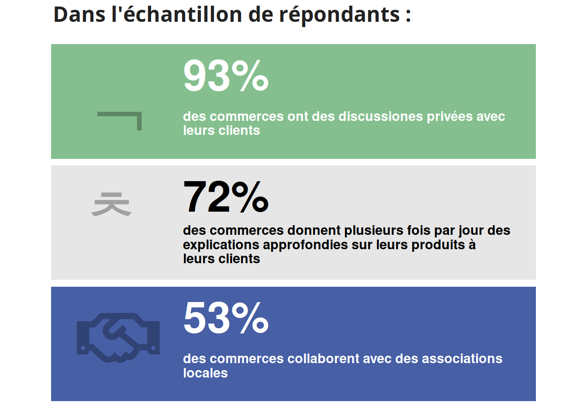
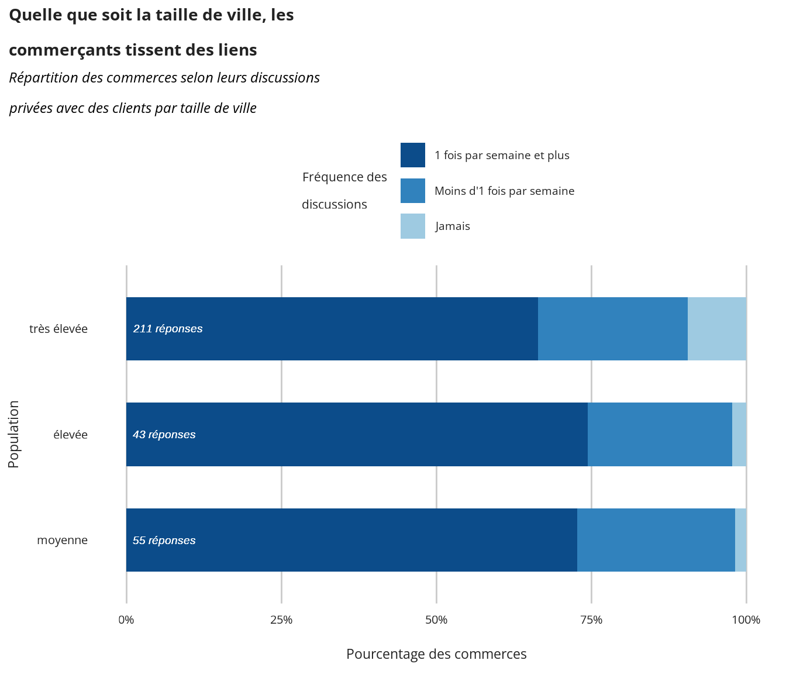

```{r}
library(tidyverse)
library(here)
library(hrbrthemes)
library(patchwork)
#postr::render("poster/poster.html", width = 1300, height = 1000)
```

## Header row {data-height=13}

### {data-width=1000}


<table style="width:100%">
<tr>
  <td rowspan="5">
  </img>
  </td>
  <td><p style="margin-top: 10px; font-size: 1.8em; color: #B4B1B1;">
  &nbsp; **Animateurs de lien social :** Créer des connexions au sein du quartier
  </td></p>
</tr>
</table> 

### {data-width=400}

<FONT COLOR="#9B9FA2">
[`r fontawesome::fa("globe", fill = "#9B9FA2")`](https://projet-excom.fr/) Site du projet &nbsp;&nbsp;
[`r fontawesome::fa("file", fill = "#9B9FA2")`](https://nextcloud.datactivist.coop/s/Q2W7tz7TyLTmw4p) Rapport de phase 1 &nbsp;&nbsp;
[`r fontawesome::fa("file", fill = "#9B9FA2")`](https://datactivist.coop/excom/rapport/Rapport.html) Rapport de phase 2 &nbsp;&nbsp;
</FONT>

<FONT COLOR="#9B9FA2">*Réalisé par Datactivist - 03/2025*</FONT>

## Body row {data-height=67}

###  {data-width=800}

<center>
<p style="aligne: center; font-size: 1.4em; color: white; background-color: #304B95;">**Introduction**</p>
</center>

#### Le projet

Le projet de recherche-action EXCOM a été lancé avec pour objectif de nommer et quantifier les effets des commerces sur la vie d’un territoire, peu visibles dans leur globalité. 

#### Les partenaires

Il est porté depuis 2023 par six partenaires : Paris Commerce, Métropole Rouen Normandie, Fondation Urbanis, Urbanis Aménagement, Altavia Foundation et Datactivist.
    
#### Les phases

- **Phase 1, Mise en visibilité** : menée d’août 2023 à avril 2024, elle consistait à définir les effets à travers une enquête de terrain qui a permis d’identifier 18 externalités, regroupées en 6 catégories.
- **Phase 2, Mise en données** : menée de janvier 2024 à février 2025, elle visait à quantifier ces 18 externalités, au travers d’une enquête nationale par questionnaire ayant reçu 324 réponses.
- **Phase 3, Mise en équivalence** : menée en parrallèle de la phase 2, elle visait à transformer ces externalités en valeur monétaire ou objectifs de politique publique à l’échelle d’un territoire.

### {data-width=800}

<center>
<p style="aligne: center; font-size: 1.4em; color: white; background-color: #304B95;">**Résultats d'analyse**</p>
</center>


{height=280}
{height=280}


## Footer row {data-height=28} 

### **Données et méthodologie** {data-width=40}

#### Les données

- enquête par questionnaire diffusée d’avril à novembre 2024
- 40 questions portant sur 6 catégories d'externalités
- 324 réponses reçues de partout en France

#### La méthodologie

- les réponses ont été nettoyées, enrichies puis analysées

### **Conclusions** {data-width=40}

#### Les commerces au cœur des interactions quotidiennes

- Dans un contexte où de nombreuses personnes sont isolées, notamment des personnes âgées, les commerces constituent des lieux privilégiés où se tissent et se renforcent les relations interpersonnelles.
- La contribution des commerces à l’entretien du lien social s’observe sur tous les territoires de l’enquête. 

### **Équivalence monétaire** {data-width=40}

#### Lien social 

Les **bénéfices théoriques** générés par un commerçant sur une année sont de **6.228€**.

*Pour plus de détails sur la méthodologie et le calcul de cette estimation, veuillez consulter le simulateur d'équivalences monétaires :* 

<p style="font-size: 1em; color: #9B9FA2;">
[`r fontawesome::fa("gear", fill = "#9B9FA2")`](https://projet-excom.fr/) Simulateur
</p>


