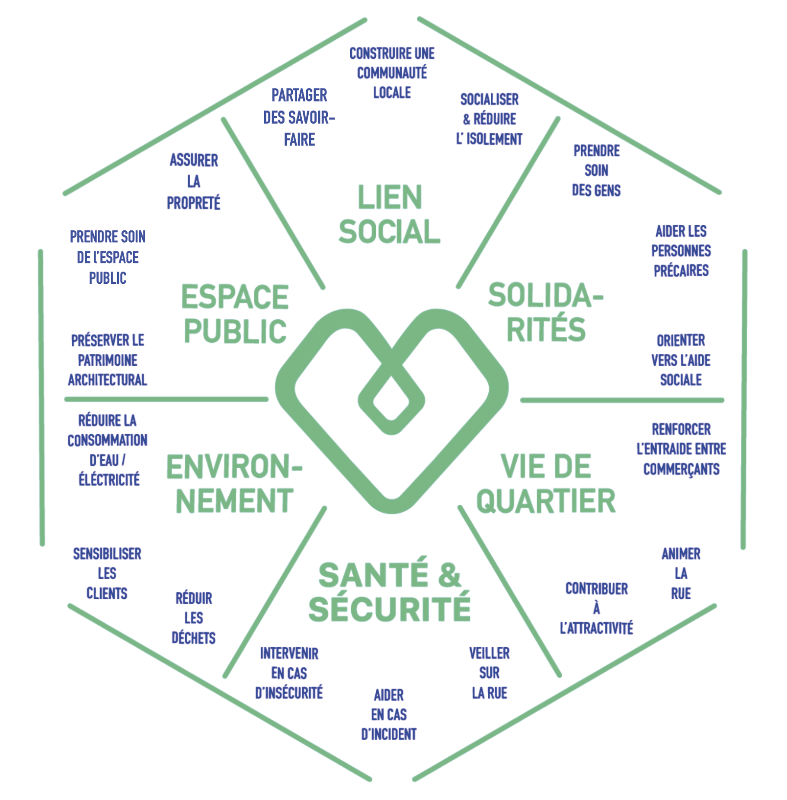

<br>


# Simulateur d'équivalences monétaires {.tabset}

Le simulateur d'équivalences monétaires s'inscrit dans le cadre du [**projet de recherche-action EXCOM**](https://projet-excom.fr/). Celui-ci a été lancé avec pour objectif de nommer et quantifier les effets des commerces sur la vie d'un territoire, peu visibles dans leur globalité. Il est porté depuis 2023 par six partenaires : Paris Commerce, Métropole Rouen Normandie, Fondation Urbanis, Urbanis Aménagement, Altavia Foundation et Datactivist.

La **première phase du projet**, menée d'août 2023 à avril 2024, consistait à définir ces effets à travers une enquête de terrain approfondie auprès de plus de 200 commerçants, micro-commerçants et artisans. Celle-ci a permis d'identifier et caractériser 18 externalités, regroupées en 6 catégories : lien social, environnement, espace public, santé et sécurité, solidarité, et vie de quartier.

<center>
 <p style="color: darkgrey;">*Roue des externalités identifiées en phase 1*</p>
</center>

<p align="center">
 
</p>


La **deuxième phase du projet** quant à elle, menée de janvier 2024 à février 2025, visait à mesurer et mettre en valeur ces 18 externalités, au travers d'une enquête nationale par questionnaire, ayant recueilli 324 réponses entre avril et novembre 2024. Celle-ci a permis de quantifier le temps passé et les actions menées par les commerçants dans chacune des 6 catégories identifiées en phase 1. Elle a également été le terrain pour développer une méthodologie de mise en équivalence, permettant de transformer ces externalités en valeur monétaire ou en objectifs de politique publique à l'échelle d'un territoire.

<br>

**L'ensemble de la méthodologie et des résultats du projet sont consultables en ligne :**

- le [**rapport de phase 1**](https://nextcloud.datactivist.coop/s/Q2W7tz7TyLTmw4p) présente une revue bibliographique sur l'importance du commerce de proximité dans la dynamique urbaine, la méthodologie et la genèse du projet, et cartographie 18 externalités classées en 6 catégories ;
- le [**rapport de phase 2**](https://datactivist.coop/excom/rapport/Rapport.html) présente les résultats de l'analyse des données du questionnaire, pour quantifier chacune des 18 externalités à travers des graphiques, chiffres-clés, tableaux et des calculs de mise en équivalence monétaire.

<br>

<p style="font-size: 1.7em; color: #304B95;">`r fontawesome::fa("magnifying-glass", fill = "#304B95")` **Remarques méthodologiques**</p>

<br>

**Une estimation quantitative simplifie forcément la réalité**. Toute tentative de produire une estimation monétaire pour une dynamique sociale (ici, les apports non marchands des commerces) est imparfaite et prête à débat. Notre objectif n’est pas de proposer des chiffres fermes, indiscutables, mais de mettre en valeur un travail dépassant le strict cadre de la relation marchande.

Dans l’optique d’une estimation monétaire mesurée, **nous calculons le temps passé sur la base du coût employeur d’un salaire minimum**.

**En pratique, si un service d’utilité sociale n’est pas rendu par le commerçant, il est parfois fait par des bénévoles**, généralement dans un cadre associatif.

Enfin, sauf exception des dons de produits ou d’argent (cf. catégorie Solidarités), les commerçants interagissent avec des personnes qui consomment un minimum. **Le temps passé à tisser du lien, ou à entretenir la rue, dépasse les attendus minimaux du travail commercial mais ne constitue pas en soi du travail gratuit/bénévole**. Nous n’avons par ailleurs pas la matière empirique pour mesurer les externalités négatives du commerce (ex : dégradation du lien social en cas de commerçant particulièrement antipathique)

<br>

<p style="font-size: 1.7em; color: #304B95;">`r fontawesome::fa("book-open", fill = "#304B95")` **Notice technique**</p>

<br>

L'outil suivant vise à **estimer les bénéfices théoriques générés par les commerçants sur une année** pour 5 catégories d'externalité.

Certains services rendus par les commerçants ne relèvent pas des compétences d’une collectivité, sont répartis entre plusieurs acteurs, ne remplacent pas l'intervention des services publics. **Les estimations proposées ne rendent donc pas compte de réelles économies réalisées par une collectivité territoriale, mais correspondent à une valeur monétaire théorique.**

Le bénéfice est présenté à l'échelle d'un commerce sur l'année dans un premier temps, puis à l'échelle d'un territoire entier dans un second temps. Le calcul se concentre sur les commerces particulièrement investis sur une thématique, qualifiés de 'super commerçant·es' dans les formules (pour la catégorie *Lien social* par exemple, on considère que 20% des commerçants agissent positivement sur les liens sociaux dans leur quartier).

**Tous les paramètres sont modulables**, permettant d'adapter le calcul aux caractéristiques du territoire souhaité ; le bénéfice se mettant automatiquement à jour lors de modifications des paramètres. Le nombre de commerces à l'échelle souhaitée correspond par défaut au nombre de commerces en activité commerciale de la ville de Rouen, ayant servi d'exemple pour la construction de la méthodologie (voir [rapport de phase 2](https://datactivist.coop/excom/rapport/Rapport.html)).

<br>

<p style="font-size: 1.7em; color: #304B95;">`r fontawesome::fa("gear", fill = "#304B95")` **Simulateur**</p>

<br>

## <FONT COLOR="#B4B1B1">Lien social</FONT>

<br>

*Le temps passé correspond au temps que prennent les commerçants pour échanger avec leurs clients sur des sujets privés.*

```{r, echo=FALSE}
library(shiny)

fluidPage(
  fluidRow(
    # Colonne gauche (Paramètres)
    column(
      width = 6,  # 50% de largeur
      h3("Paramètres"),
      br(),
      numericInput(
        inputId = 'temps_discu',
        label = "Temps passé par semaine (en heures)",
        value = 2.5,
        step = 0.1
      ),
      numericInput(
        inputId = 'nb_semaines',
        label = "Nombre de semaines travaillées (par an)",
        value = 47,
        step = 1
      ),
      numericInput(
        inputId = 'taux_horaire',
        label = "Taux horaire d'un salaire chargé (en €)",
        value = 53,
        step = 1
      ),
      numericInput(
        inputId = 'nb_commerces',
        label = "Nombre total de commerces à l'échelle souhaitée (ex : la ville)",
        value = 1000,
        step = 100
      ),
      numericInput(
        inputId = 'super_co',
        label = 'Taux de "super commerçant·es"',
        value = 0.2,
        step = 0.1
      )
    ),
    
    # Colonne droite (Calculs)
    column(
      width = 6,  # 50% de largeur
      h3("Calcul"),
      br(),
      div(
        style = "border: 0px; padding: 20px; border-radius: 15px; background-color: #e8e8e8;",
        HTML("🔎 <b>Bénéfice d'un commerce</b><br><i>Temps passé par semaine (en heures)</i> * <i>Nombre de semaines travaillées (par an)</i> * <i>Taux horaire d'un salaire chargé (en €)</i>")
      ),
      div(style = "border-left: 4px solid #ccc; padding-left: 10px; margin-top: 10px;",
          textOutput("benefice_commerce")),
      br(),
      br(),
      br(),
      div(
        style = "border: 0px; padding: 20px; border-radius: 15px; background-color: #e8e8e8;",
        HTML("🔎 <b>Bénéfice à l'échelle d'une rue/d'un quartier</b><br><i>Bénéfice d'un commerce</i> * <i>Nombre total de commerces à l'échelle souhaitée</i> * <i>Taux de 'super commerçant·es'</i>")
      ),
      div(style = "border-left: 4px solid #ccc; padding-left: 10px; margin-top: 10px;",
          textOutput("benefice_quartier"))
    )
  )
)
```

```{r, echo=FALSE}
# Serveur Shiny pour calculer les bénéfices
output$benefice_commerce <- renderText({
  result <- input$temps_discu * input$nb_semaines * input$taux_horaire
  paste(
    input$temps_discu, "*", input$nb_semaines, "*", input$taux_horaire,
    "=", format(as.integer(result), nsmall = 1, big.mark = " "), "€"
  )
})

output$benefice_quartier <- renderText({
  result_commerce <- input$temps_discu * input$nb_semaines * input$taux_horaire
  result_quartier <- result_commerce * input$nb_commerces * input$super_co
  paste(
    as.integer(result_commerce), "*", input$nb_commerces, "*", input$super_co,
    "=", format(as.integer(result_quartier), nsmall = 1, big.mark = " "), "€"
  )
})
```

&nbsp;
<hr />
<p style="text-align: center; font-family: Open Sans;">Réalisé par <a href="https://datactivist.coop/fr/">Datactivist</a></p>
<p style="text-align: center; font-family: Open Sans;"><span style="color: #0000FF;"><em>hello@datactivist.coop</em></span></p>

<!-- Add icon library -->
<link rel="stylesheet" href="https://cdnjs.cloudflare.com/ajax/libs/font-awesome/4.7.0/css/font-awesome.min.css">

<!-- Add font awesome icons -->
<p style="text-align: center;">
    <a href="https://twitter.com/datactivi_st?lang=fr" class="fa fa-twitter"></a>
    <a href="https://www.linkedin.com/company/datactivist/" class="fa fa-linkedin"></a>
    <a href="https://github.com/datactivist" class="fa fa-github"></a>
</p>

&nbsp;

## <FONT COLOR="#004654">Solidarités</FONT>

<br>

*Le temps passé correspond au temps que prennent les commerçants pour venir en aide aux personnes dans le besoin.*

```{r, echo=FALSE}
fluidPage(
  fluidRow(
    # Colonne gauche (Paramètres)
    column(
      width = 6,  # 50% de largeur
      h3("Paramètres"),
      br(),
      numericInput(
        inputId = 'temps_discu2',
        label = "Temps passé par semaine (en heures)",
        value = 0.5,
        step = 0.1
      ),
      numericInput(
        inputId = 'nb_semaines2',
        label = "Nombre de semaines travaillées (par an)",
        value = 47,
        step = 1
      ),
      numericInput(
        inputId = 'taux_horaire2',
        label = "Taux horaire d'un salaire chargé (en €)",
        value = 53,
        step = 1
      ),
      numericInput(
        inputId = 'dons',
        label = "Nombre de dons (par semaine)",
        value = 2,
        step = 1
      ),
      numericInput(
        inputId = 'cout_don',
        label = "Coût du don",
        value = 0.5,
        step = 0.1
      ),
      numericInput(
        inputId = 'nb_commerces2',
        label = "Nombre total de commerces à l'échelle souhaitée (ex : la ville)",
        value = 1000,
        step = 100
      ),
      numericInput(
        inputId = 'super_co2',
        label = 'Taux de "super commerçant·es"',
        value = 0.2,
        step = 0.1
      )
    ),
    
    # Colonne droite (Calculs)
    column(
      width = 6,  # 50% de largeur
      h3("Calcul"),
      br(),
      div(
        style = "border: 0px; padding: 20px; border-radius: 15px; background-color: #e8e8e8;",
        HTML("🔎 <b>Bénéfice d'un commerce</b><br><i>Temps passé par semaine (en heures)</i> * <i>Nombre de semaines travaillées (par an)</i> * <i>Taux horaire d'un salaire chargé (en €)</i> + <i>Nombre de dons (par semaine)</i> * <i>Nombre de semaines travaillées (par an)</i> * <i>Coût du don</i>")
      ),
      div(style = "border-left: 4px solid #ccc; padding-left: 10px; margin-top: 10px;",
          textOutput("benefice_commerce2")),
      br(),
      br(),
      br(),
      div(
        style = "border: 0px; padding: 20px; border-radius: 15px; background-color: #e8e8e8;",
        HTML("🔎 <b>Bénéfice à l'échelle d'une rue/d'un quartier</b><br><i>Bénéfice d'un commerce</i> * <i>Nombre total de commerces à l'échelle souhaitée</i> * <i>Taux de 'super commerçant·es'</i>")
      ),
      div(style = "border-left: 4px solid #ccc; padding-left: 10px; margin-top: 10px;",
          textOutput("benefice_quartier2"))
    )
  )
)
```

```{r, echo=FALSE}
# Serveur Shiny pour calculer les bénéfices
output$benefice_commerce2 <- renderText({
  result2 <- (input$temps_discu2 * input$nb_semaines2 * input$taux_horaire2) + (input$dons * input$cout_don * input$nb_semaines2)
  paste(
    input$temps_discu2, "*", input$nb_semaines2, "*", input$taux_horaire2, "+",
    input$dons, "*", input$cout_don, "*", input$nb_semaines2,
    "=", format(as.integer(result2), nsmall = 1, big.mark = " "), "€"
  )
})

output$benefice_quartier2 <- renderText({
  result_commerce2 <- (input$temps_discu2 * input$nb_semaines2 * input$taux_horaire2) + (input$dons * input$cout_don * input$nb_semaines2)
  result_quartier2 <- result_commerce2 * input$nb_commerces2 * input$super_co2
  paste(
    as.integer(result_commerce2), "*", input$nb_commerces2, "*", input$super_co2,
    "=", format(as.integer(result_quartier2), nsmall = 1, big.mark = " "), "€"
  )
})
```

&nbsp;
<hr />
<p style="text-align: center; font-family: Open Sans;">Réalisé par <a href="https://datactivist.coop/fr/">Datactivist</a></p>
<p style="text-align: center; font-family: Open Sans;"><span style="color: #0000FF;"><em>hello@datactivist.coop</em></span></p>

<!-- Add icon library -->
<link rel="stylesheet" href="https://cdnjs.cloudflare.com/ajax/libs/font-awesome/4.7.0/css/font-awesome.min.css">

<!-- Add font awesome icons -->
<p style="text-align: center;">
    <a href="https://twitter.com/datactivi_st?lang=fr" class="fa fa-twitter"></a>
    <a href="https://www.linkedin.com/company/datactivist/" class="fa fa-linkedin"></a>
    <a href="https://github.com/datactivist" class="fa fa-github"></a>
</p>

&nbsp;

## <FONT COLOR="#0097B2">Vie de quartier</FONT>

<br>

*Le temps passé correspond au temps que prennent les commerçants pour organiser un (des) évènement(s) de quartier.*

```{r, echo=FALSE}
fluidPage(
  fluidRow(
    # Colonne gauche (Paramètres)
    column(
      width = 6,  # 50% de largeur
      h3("Paramètres"),
      br(),
      numericInput(
        inputId = 'temps_discu3',
        label = "Temps passé par semaine (en heures)",
        value = 0.5,
        step = 0.1
      ),
      numericInput(
        inputId = 'nb_semaines3',
        label = "Nombre de semaines travaillées (par an)",
        value = 47,
        step = 1
      ),
      numericInput(
        inputId = 'taux_horaire3',
        label = "Taux horaire d'un salaire chargé (en €)",
        value = 53,
        step = 1
      ),
      numericInput(
        inputId = 'dons3',
        label = "Montant des dons (par an)",
        value = 200,
        step = 10
      ),
      numericInput(
        inputId = 'nb_commerces3',
        label = "Nombre total de commerces à l'échelle souhaitée (ex : la ville)",
        value = 1000,
        step = 100
      ),
      numericInput(
        inputId = 'super_co3',
        label = 'Taux de "super commerçant·es"',
        value = 0.2,
        step = 0.1
      )
    ),
    
    # Colonne droite (Calculs)
    column(
      width = 6,  # 50% de largeur
      h3("Calcul"),
      br(),
      div(
        style = "border: 0px; padding: 20px; border-radius: 15px; background-color: #e8e8e8;",
        HTML("🔎 <b>Bénéfice d'un commerce</b><br><i>Temps passé par semaine (en heures)</i> * <i>Nombre de semaines travaillées (par an)</i> * <i>Taux horaire d'un salaire chargé (en €)</i> + <i>Montant des dons (par an)</i>")
      ),
      div(style = "border-left: 4px solid #ccc; padding-left: 10px; margin-top: 10px;",
          textOutput("benefice_commerce3")),
      br(),
      br(),
      br(),
      div(
        style = "border: 0px; padding: 20px; border-radius: 15px; background-color: #e8e8e8;",
        HTML("🔎 <b>Bénéfice à l'échelle d'une rue/d'un quartier</b><br><i>Bénéfice d'un commerce</i> * <i>Nombre total de commerces à l'échelle souhaitée</i> * <i>Taux de 'super commerçant·es'</i>")
      ),
      div(style = "border-left: 4px solid #ccc; padding-left: 10px; margin-top: 10px;",
          textOutput("benefice_quartier3"))
    )
  )
)
```

```{r, echo=FALSE}
# Serveur Shiny pour calculer les bénéfices
output$benefice_commerce3 <- renderText({
  result3 <- input$temps_discu3 * input$nb_semaines3 * input$taux_horaire3 + input$dons3
  paste(
    input$temps_discu3, "*", input$nb_semaines3, "*", input$taux_horaire3, "+", input$dons3,
    "=", format(as.integer(result3), nsmall = 1, big.mark = " "), "€"
  )
})

output$benefice_quartier3 <- renderText({
  result_commerce3 <- input$temps_discu3 * input$nb_semaines3 * input$taux_horaire3 + input$dons3
  result_quartier3 <- result_commerce3 * input$nb_commerces3 * input$super_co3
  paste(
    as.integer(result_commerce3), "*", input$nb_commerces3, "*", input$super_co3,
    "=", format(as.integer(result_quartier3), nsmall = 1, big.mark = " "), "€"
  )
})
```

&nbsp;
<hr />
<p style="text-align: center; font-family: Open Sans;">Réalisé par <a href="https://datactivist.coop/fr/">Datactivist</a></p>
<p style="text-align: center; font-family: Open Sans;"><span style="color: #0000FF;"><em>hello@datactivist.coop</em></span></p>

<!-- Add icon library -->
<link rel="stylesheet" href="https://cdnjs.cloudflare.com/ajax/libs/font-awesome/4.7.0/css/font-awesome.min.css">

<!-- Add font awesome icons -->
<p style="text-align: center;">
    <a href="https://twitter.com/datactivi_st?lang=fr" class="fa fa-twitter"></a>
    <a href="https://www.linkedin.com/company/datactivist/" class="fa fa-linkedin"></a>
    <a href="https://github.com/datactivist" class="fa fa-github"></a>
</p>

&nbsp;

## <FONT COLOR="#00A589">Santé et sécurité</FONT>

<br>

*Le temps passé correspond au temps que prennent les commerçants pour intervenir en cas d'incidents dans le domaine public.*

```{r, echo=FALSE}
fluidPage(
  fluidRow(
    # Colonne gauche (Paramètres)
    column(
      width = 6,  # 50% de largeur
      h3("Paramètres"),
      br(),
      numericInput(
        inputId = 'temps_discu4',
        label = "Temps passé par semaine (en heures)",
        value = 0.83,
        step = 0.1
      ),
      numericInput(
        inputId = 'nb_semaines4',
        label = "Nombre de semaines travaillées (par an)",
        value = 47,
        step = 1
      ),
      numericInput(
        inputId = 'taux_horaire4',
        label = "Taux horaire d'un salaire chargé (en €)",
        value = 53,
        step = 1
      ),
      numericInput(
        inputId = 'nb_commerces4',
        label = "Nombre total de commerces à l'échelle souhaitée (ex : la ville)",
        value = 1000,
        step = 100
      ),
      numericInput(
        inputId = 'super_co4',
        label = 'Taux de "super commerçant·es"',
        value = 0.2,
        step = 0.1
      )
    ),
    
    # Colonne droite (Calculs)
    column(
      width = 6,  # 50% de largeur
      h3("Calcul"),
      br(),
      div(
        style = "border: 0px; padding: 20px; border-radius: 15px; background-color: #e8e8e8;",
        HTML("🔎 <b>Bénéfice d'un commerce</b><br><i>Temps passé par semaine (en heures)</i> * <i>Nombre de semaines travaillées (par an)</i> * <i>Taux horaire d'un salaire chargé (en €)</i>")
      ),
      div(style = "border-left: 4px solid #ccc; padding-left: 10px; margin-top: 10px;",
          textOutput("benefice_commerce4")),
      br(),
      br(),
      br(),
      div(
        style = "border: 0px; padding: 20px; border-radius: 15px; background-color: #e8e8e8;",
        HTML("🔎 <b>Bénéfice à l'échelle d'une rue/d'un quartier</b><br><i>Bénéfice d'un commerce</i> * <i>Nombre total de commerces à l'échelle souhaitée</i> * <i>Taux de 'super commerçant·es'</i>")
      ),
      div(style = "border-left: 4px solid #ccc; padding-left: 10px; margin-top: 10px;",
          textOutput("benefice_quartier4"))
    )
  )
)
```

```{r, echo=FALSE}
# Serveur Shiny pour calculer les bénéfices
output$benefice_commerce4 <- renderText({
  result4 <- input$temps_discu4 * input$nb_semaines4 * input$taux_horaire4 
  paste(
    input$temps_discu4, "*", input$nb_semaines4, "*", input$taux_horaire4,
    "=", format(as.integer(result4), nsmall = 1, big.mark = " "), "€"
  )
})

output$benefice_quartier4 <- renderText({
  result_commerce4 <- input$temps_discu4 * input$nb_semaines4 * input$taux_horaire4
  result_quartier4 <- result_commerce4 * input$nb_commerces4 * input$super_co4
  paste(
    as.integer(result_commerce4), "*", input$nb_commerces4, "*", input$super_co4,
    "=", format(as.integer(result_quartier4), nsmall = 1, big.mark = " "), "€"
  )
})
```

&nbsp;
<hr />
<p style="text-align: center; font-family: Open Sans;">Réalisé par <a href="https://datactivist.coop/fr/">Datactivist</a></p>
<p style="text-align: center; font-family: Open Sans;"><span style="color: #0000FF;"><em>hello@datactivist.coop</em></span></p>

<!-- Add icon library -->
<link rel="stylesheet" href="https://cdnjs.cloudflare.com/ajax/libs/font-awesome/4.7.0/css/font-awesome.min.css">

<!-- Add font awesome icons -->
<p style="text-align: center;">
    <a href="https://twitter.com/datactivi_st?lang=fr" class="fa fa-twitter"></a>
    <a href="https://www.linkedin.com/company/datactivist/" class="fa fa-linkedin"></a>
    <a href="https://github.com/datactivist" class="fa fa-github"></a>
</p>

&nbsp;

## <FONT COLOR="#FF5757">Espace public</FONT>

<br>

*Le temps passé correspond au temps que prennent les commerçants pour nettoyer les abords de leur magasin et entretenir leur devanture.*

```{r, echo=FALSE}
fluidPage(
  fluidRow(
    # Colonne gauche (Paramètres)
    column(
      width = 6,  # 50% de largeur
      h3("Paramètres"),
      br(),
      numericInput(
        inputId = 'temps_discu6',
        label = "Temps passé par semaine (en heures)",
        value = 1.25,
        step = 0.1
      ),
      numericInput(
        inputId = 'nb_semaines6',
        label = "Nombre de semaines travaillées (par an)",
        value = 47,
        step = 1
      ),
      numericInput(
        inputId = 'taux_horaire6',
        label = "Taux horaire d'un salaire chargé (en €)",
        value = 53,
        step = 1
      ),
      numericInput(
        inputId = 'nb_commerces6',
        label = "Nombre total de commerces à l'échelle souhaitée (ex : la ville)",
        value = 1000,
        step = 100
      ),
      numericInput(
        inputId = 'super_co6',
        label = 'Taux de "super commerçant·es"',
        value = 0.15,
        step = 0.1
      )
    ),
    
    # Colonne droite (Calculs)
    column(
      width = 6,  # 50% de largeur
      h3("Calcul"),
      br(),
      div(
        style = "border: 0px; padding: 20px; border-radius: 15px; background-color: #e8e8e8;",
        HTML("🔎 <b>Bénéfice d'un commerce</b><br><i>Temps passé par semaine (en heures)</i> * <i>Nombre de semaines travaillées (par an)</i> * <i>Taux horaire d'un salaire chargé (en €)</i>")
      ),
      div(style = "border-left: 4px solid #ccc; padding-left: 10px; margin-top: 10px;",
          textOutput("benefice_commerce6")),
      br(),
      br(),
      br(),
      div(
        style = "border: 0px; padding: 20px; border-radius: 15px; background-color: #e8e8e8;",
        HTML("🔎 <b>Bénéfice à l'échelle d'une rue/d'un quartier</b><br><i>Bénéfice d'un commerce</i> * <i>Nombre total de commerces à l'échelle souhaitée</i> * <i>Taux de 'super commerçant·es'</i>")
      ),
      div(style = "border-left: 4px solid #ccc; padding-left: 10px; margin-top: 10px;",
          textOutput("benefice_quartier6"))
    )
  )
)
```

```{r, echo=FALSE}
# Serveur Shiny pour calculer les bénéfices
output$benefice_commerce6 <- renderText({
  result6 <- input$temps_discu6 * input$nb_semaines6 * input$taux_horaire6 
  paste(
    input$temps_discu6, "*", input$nb_semaines6, "*", input$taux_horaire6,
    "=", format(as.integer(result6), nsmall = 1, big.mark = " "), "€"
  )
})

output$benefice_quartier6 <- renderText({
  result_commerce6 <- input$temps_discu6 * input$nb_semaines6 * input$taux_horaire6
  result_quartier6 <- result_commerce6 * input$nb_commerces6 * input$super_co6
  paste(
    as.integer(result_commerce6), "*", input$nb_commerces6, "*", input$super_co6,
    "=", format(as.integer(result_quartier6), nsmall = 1, big.mark = " "), "€"
  )
})
```

&nbsp;
<hr />
<p style="text-align: center; font-family: Open Sans;">Réalisé par <a href="https://datactivist.coop/fr/">Datactivist</a></p>
<p style="text-align: center; font-family: Open Sans;"><span style="color: #0000FF;"><em>hello@datactivist.coop</em></span></p>

<!-- Add icon library -->
<link rel="stylesheet" href="https://cdnjs.cloudflare.com/ajax/libs/font-awesome/4.7.0/css/font-awesome.min.css">

<!-- Add font awesome icons -->
<p style="text-align: center;">
    <a href="https://twitter.com/datactivi_st?lang=fr" class="fa fa-twitter"></a>
    <a href="https://www.linkedin.com/company/datactivist/" class="fa fa-linkedin"></a>
    <a href="https://github.com/datactivist" class="fa fa-github"></a>
</p>

&nbsp;
